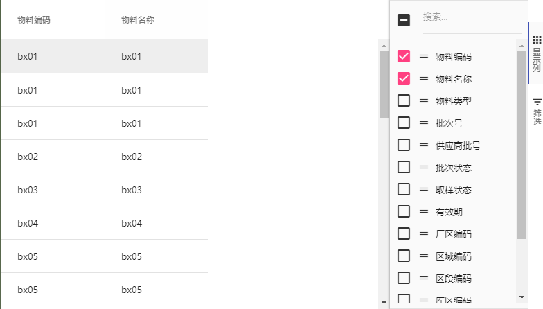

### ag-grid 接口 API

> 说明：本文列举了一些 项目中常用的 API 方法

#### 常用配置

1. 表格所有的属性/事件都配置在 girdOptions 中， 可参考[full-page-ag-grid.js](./component/full-page-ag-grid.js)

常用属性/事件配置：

- columnDefs 列定义
- onGridReady 初始化事件
- onSelectionChanged 表格选中事件
- onFilterChanged 表格过滤事件
- pagination 分页参数
- sideBar 工具栏配置
- localeTextFunc 本地国际化
- rowModelType 数据渲染模式（'clientSide', 'infinite', 'viewport', 'serverSide'）
- defaultColDef 列默认属性
- columnTypes 列类型

........

2. 数据源配置  
   _ 服务端：**gridApi.setServerSideDatasource**(为 ag-grid 配置获取远程数据的数据源)  
   _ 客户端：**gridApi.setRowData**(为 ag-grid 设置表格静态数据)

#### 获取当前呈现在表格中的列

1. getAllDisplayedColumns

- getAllDisplayedColumns() - 用于显示哪些列可以呈现到显示中。由于虚拟化，可能有一些列尚未呈现给 DOM，如果您只想要呈现给 DOM 的列然后使用
- getAllDisplayedVirtualColumns()- 两个函数都显示顺序，因为它们将显示在网页上
  - Column 从这些函数返回的对象包含每个列的排序和过滤器属性。

```js
gridOptions.columnApi.getAllDisplayedColumns();
```

如下图所示：ag-grid 只勾选 前 2 列，则 getAllDisplayedColumns 方法 返回的就是当前显示的 2 列数据  


使用案例：

```js
let grid = this.$refs.myGrid,
  gridOptions = grid.gridOptions;
let displayColumns = gridOptions.columnApi.getAllDisplayedColumns();
```

详细说明可查看[ag-grid 官网](https://www.ag-grid.com/javascript-grid-column-api/)

2. 其它可能有用的功能

- 可从`gridOptions.columnApi`：
  - getColumnState() - 返回细节少于上述函数的对象 - 只有：aggFunc，colId，hide，pinned，pivotIndex，rowGroupIndex 和 width
  - setColumnState(columnState)- 这允许您将列设置为隐藏，可见或固定，columnState 应该是从哪里返回 getColumnState()
- 可从`gridOptions.api`
  - getSortModel() - 获取当前的排序模型
  - setSortModel(model)- 设置网格的排序模型，model 格式应与返回的格式相同 getSortModel()
  - getFilterModel() - 获取当前的过滤器模型
  - setFilterModel(model)- 设置网格的过滤器模型，model 应该与返回的格式相同 getFilterModel()

使用案例：

```js
let grid = this.$refs.myGrid,
  gridApi = grid.gridApi;
let filterModel = gridApi.getFilterModel();
let sortModel = gridApi.getSortModel();
```

3. 处理显示列数据  
   在 header 头列定义中使用`valueFormatter` 处理列数据

如下图所示，将数量保留到第六位小数点  


代码处理如下：

```js
// data 定义如下：
const columnDef = [
  {
    headerName: 数量,
    field: "count",
    filter: "agNumberColumnFilter",
    valueFormatter: countFormat,
  },
  {
    headerName: 单位,
    field: "unit",
    sortable: false,
    filter: false,
  },
];
// 列数据处理方法如下：
function countFormat({ data, value }) {
  return value && value.toFixed(6);
}
```

4. 刷新 ag-grid 中某一行的数据  
   接口： **refreshCells**  
   使用场景: 选中 ag-grid 中一行， 修改这一行的数据后 能够在表格中 看见修改后的效果

```js
let params = {
  force: true,
};
let ir = this.interfaceGridApi.getSelectedRows();
ir.length && (ir[0].eqpInterface = EqpInterfaceType.OPC.code);

// 刷新接口表格数据
this.interfaceGridApi.refreshCells(params);
```
