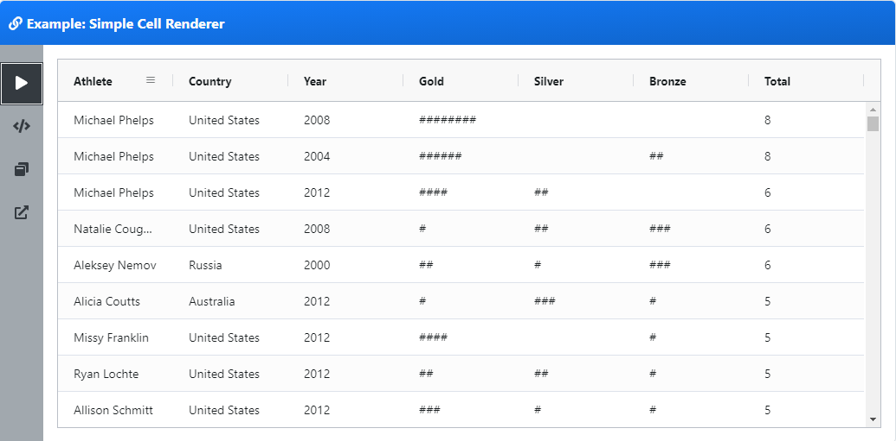

## Cell Render

### 用途

grid 的主要作用是用来做单元格呈现。默认情况下，表格使用简单的文本来展示单元格内容。如果想要在 grid 中展示复杂的 html，则需要用到 cell renders

### 组件提供接口

组件提供接口如下：

```ts
interface ICellRendererComp {
  // Optional - Params for rendering. The same params that are passed to the cellRenderer function.
  init?(params: ICellRendererParams): void;

  // Mandatory - Return the DOM element of the component, this is what the grid puts into the cell
  getGui(): HTMLElement;

  // Optional - Gets called once by grid after rendering is finished - if your renderer needs to do any cleanup,
  // do it here
  destroy?(): void;

  // Mandatory - Get the cell to refresh. Return true if the refresh succeeded, otherwise return false.
  // If you return false, the grid will remove the component from the DOM and create
  // a new component in its place with the new values.
  refresh(params: ICellRendererParams): boolean;
}
```

详细描述，请查看[官网](https://www.ag-grid.com/javascript-grid-cell-rendering-components/)

### 简单单元格渲染实例

如下是一个简单的表格渲染案例：

```js
var columnDefs = [
  { field: "athlete" },
  { field: "country" },
  { field: "year", width: 100 },
  { field: "gold", width: 100, cellRenderer: "medalCellRenderer" },
  { field: "silver", width: 100, cellRenderer: "medalCellRenderer" },
  { field: "bronze", width: 100, cellRenderer: "medalCellRenderer" },
  { field: "total", width: 100 },
];

var gridOptions = {
  columnDefs: columnDefs,
  components: {
    medalCellRenderer: MedalCellRenderer,
  },
  defaultColDef: {
    editable: true,
    sortable: true,
    flex: 1,
    minWidth: 100,
    filter: true,
    resizable: true,
  },
};

// cell renderer class
function MedalCellRenderer() {}

// init method gets the details of the cell to be renderer
MedalCellRenderer.prototype.init = function (params) {
  this.eGui = document.createElement("span");
  var text = "";
  // one star for each medal
  for (var i = 0; i < params.value; i++) {
    text += "#";
  }
  this.eGui.innerHTML = text;
};

MedalCellRenderer.prototype.getGui = function () {
  return this.eGui;
};

// setup the grid after the page has finished loading
document.addEventListener("DOMContentLoaded", function () {
  var gridDiv = document.querySelector("#myGrid");
  new agGrid.Grid(gridDiv, gridOptions);

  agGrid
    .simpleHttpRequest({
      url: "https://www.ag-grid.com/example-assets/olympic-winners.json",
    })
    .then(function (data) {
      gridOptions.api.setRowData(data);
    });
});
```



### vue 中案例

vue 中自定义单元格与普通 ag-grid 中使用不同，下面为 vue 项目表格中展示 checkbox 为例的讲解：

#### 1、增加 cell 单元格自定义文件

[checkboxRenderer.js](./cellRender/vue-example/checkboxRenderer.js)文件内容如下：

```js
import Vue from "vue";

export default Vue.extend({
  template: `
        <v-checkbox v-model="checked" readonly></v-checkbox>
    `,
  data: function () {
    return {
      checked: false,
    };
  },
  beforeMount() {},
  mounted() {
    this.checked = this.params.value;
  },
  methods: {},
});
```

#### 2、自定义 cell 的使用

核心代码展示如下：

```js
<template>
<ag-grid
    :columnDefs="columnDefs"
    :frameworkComponents="frameworkComponents"
    :rowData="rowDatas"
></ag-grid>

</template>
import CheckboxRenderer from './checkboxRenderer'

export default {
    data() {
        return {
            rowDatas:[], // 表格数据
            frameworkComponents: {
                checkboxRenderer: CheckboxRenderer
            },
            columnDefs: [// 列头定义
                {
                    headerName: '计数管理',
                    colId: 'countManager',
                    cellRenderer: 'checkboxRenderer', // ****在grid中使用自定义单元格呈现****
                    field: 'countManager'
                }
            ]
        }
    }
    // 省略其它代码.......
}
```

#### 3、效果展示


