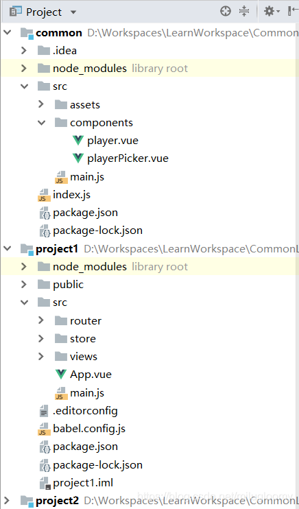
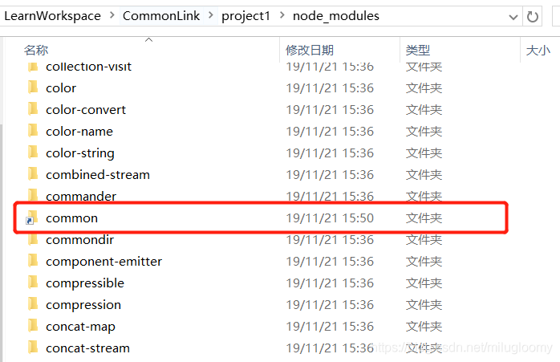
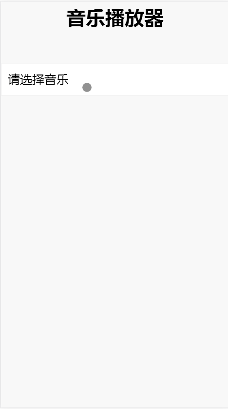
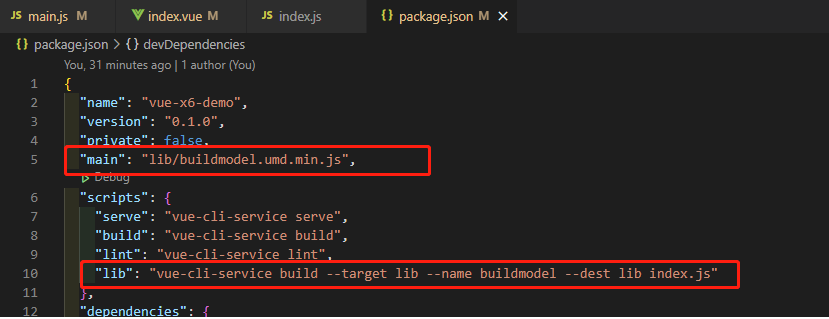
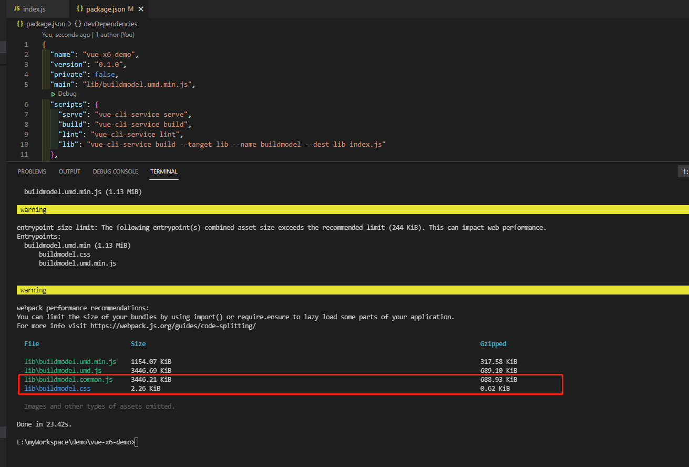
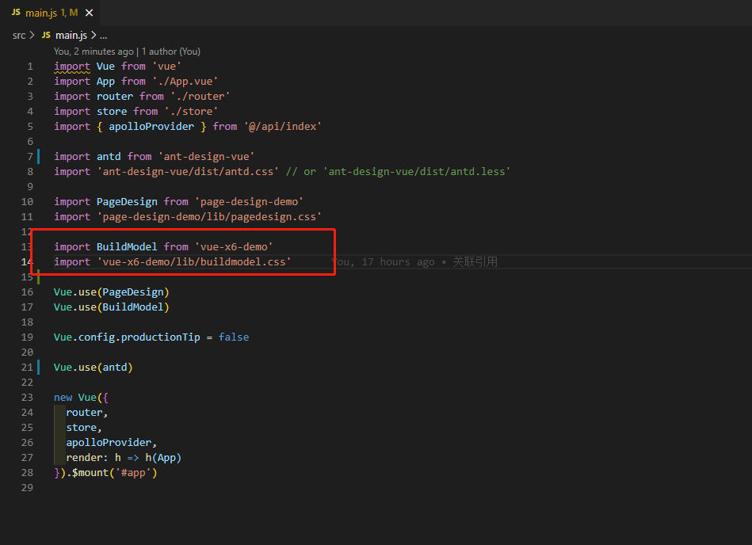
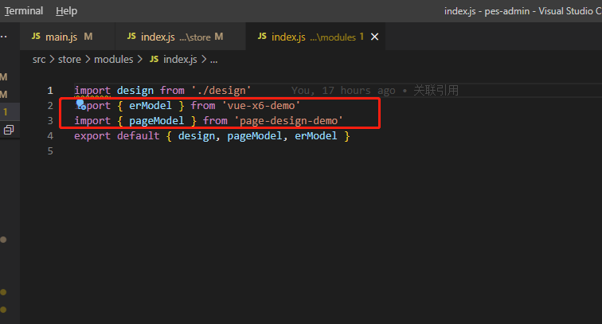
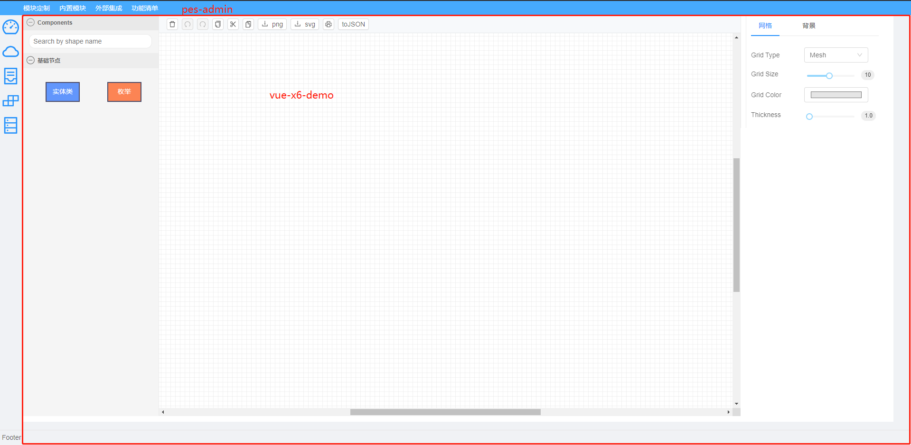

### 背景：

如我现在有两个DEMO项目[page-design-demo](https://github.com/bxRita/demo/tree/master/page-design-demo)（可视化页面构建器 项目A）和[vue-x6-demo](https://github.com/bxRita/demo/tree/master/vue-x6-demo)（可视化后台ER模型设计器 项目B），另有一个管理项目[pes-admin](https://github.com/bxRita/demo/tree/master/pes-admin)（构建页面平台管理 项目C），项目 A、项目B 我想作为公共插件，提供给项目C 使用

Vue很好的提供了单个项目公共组件的解决方案，包括组件复用、传参、监听、通讯、插槽等功能。但多个vue项目怎么使用公共组件呢。

这篇文章就来介绍前端多个vue项目公共组件的三种方法，npm发布引用、npm link、npm本地file引用，其中本文主要推荐本地file引用方式，若嫌篇幅太长可直接翻到文章最后查看npm本地file引用方式。

### 准备工作

本例使用vue cli来创建项目。首先创建三个项目，project1、project2、common，其中common是公共组件，project1和project2引用了common包

#### 创建项目

```
#创建命令如下
vue create project1
vue create project2
vue create common
```

#### common包入口：

修改package.json，增加一行

```
"main": "index.js"
```

这表明index.js就是common包的入口文件，然后创建index.js文件。

#### 依赖第三方包

因为要使用picker，这里引用的是WeVue，正好也演示一下common包依赖第三方组件的实现。

**要注意的是：**

1. 在index.js中需初始化第三方引用包这里引用WeVue，初始化代码如下

```js
import WeVue from 'we-vue'
import 'we-vue/lib/style.css'
import Vue from 'vue'
Vue.use(WeVue)
```

2. 若是以本文推荐的npm本地file引入common包，common包引入了第三方组件，则project1和project2中必须也引入第三方包，并在main.js中初始化。

创建组件

然后在common包中创建一个组件，这里创建一个playerPicker做示例（假设该组件路径为src/components/playerPicker.vue），功能是音乐播放器，供project1和project2引用。

#### index.js

index.js中需包含上面说的第三方组件初始化和公共组件的导出，本示例完整内容如下

```js
import WeVue from 'we-vue'
import 'we-vue/lib/style.css'
import Vue from 'vue'
import playerPicker from './src/components/playerPicker'
Vue.use(WeVue)
export {
  playerPicker
}
```
最后结构图如下：


project2和project1一样，这里就只演示project1引用common的实现。

### 方案一：npm发布引用

我们可以采取专人维护common包的方式，common的组件编写完成后，将其发布到npm。

发布流程如下：

1. 在注http://www.npmjs.com册一个账号
2. 进入common的控制台，输入命令npm login，按照提示输入刚注册的账号密码
3. 输入命令 npm publish 即可

当然common这个名字肯定被注册了，这里只做示例，真正使用时需使用一个未在npm中注册的包名。需要注意的是，若报错你没有权限发布该项目，那应该就是你的这个项目名被别人用过了，在package.json中修改下项目名再发布吧。

开发project1和project2的程序猿通过npm install命令将common以node_module的方式引入

```js
npm install common --save
```

另外，每次改动代码再次发布时，需要修改package.json文件中的版本号，不然发布不成功。

这样开发project1和project2的程序猿只需关注自己项目的业务功能，公共的common有更新时，执行命令npm install common就可以了。

不过这个方案的问题，频繁改动common包时，project1和project2需要频繁更新common包的引入。


### 方案二：npm link

首先进入common包，在控制台输入

```
npm link
```
这会创建一个软连接，并保存到目录C:\Users\Administrator\AppData\Roaming\npm\node_modules下面。

然后进入project1和project2，在控制台输入

```
npm link common
```
这就将这个公共的项目通过软连接的方式引入到项目里面来了。下图可以看到在node_modules中common包和其他的包文件夹样式是不一样的，common文件夹只是一个软链接。



**这时修改common项目下面的任意代码都会实时生效**，不用打包，不用更新引入包，也不用重启。

需要注意的是，当项目包依赖更新后，也就是执行了 npm install xxx 之后，需要重新link common项目。而且使用npm link后本地package.json里没有记录，无法直观的查看本地包的引用。

### 方案三：npm本地file引用

分别进入project1和project2，在控制台输入命令：

```
npm install ../common/
```

> 其中…/common/是common的相对路径，这里也可以输入绝对路径。

这样就将common这个工程以node_module的方式引入到project1和project2项目中了。可以正常使用common在index.js中导出的组件了。

命令执行完后，package.json里会多一条记录

```json
"dependencies": {
    "common": "file:../common",
    "core-js": "^3.3.2",
    "vue": "^2.6.10",
    "vue-router": "^3.1.3",
    "vuex": "^3.0.1",
    "we-vue": "^2.3.3"
}
```
**也可以在package.json里加上"ak-commonjs": “file:…/common” 这一行再执行npm install命令。**

**同样这时修改common项目下面的任意代码都会实时生效**，不用打包，不用更新引入包，也不用重启。而且在package.json中有引入记录。

### 引入公共组件

公共组件创建好了，需要引入，引入代码和引入其他组件的方式一样，代码如下：

```html
<template>
  <div class="hello">
    <h1 style="text-align: center;">{{ msg }}</h1>
    <player-picker :audios="audios"></player-picker>
  </div>
</template>
<script>
import { playerPicker } from 'common'
export default {
  name: 'HelloWorld',
  components: { playerPicker },
  data () {
    return {
      msg: '音乐播放器',
      audios: [{
        audioSrc: 'https://m801.music.126.net/20191121202654/e1b93f2bbd9a741dbb6afb2fba7fab8d/jdyyaac/010b/5359/565d/6a7ed7d40cd34dea3ddda7779a460973.m4a',
        duration: 326,
        title: '天涯'
      }, {
        audioSrc: 'http://audio04.dmhmusic.com/71_53_T10041182782_128_4_1_0_sdk-cpm/cn/0208/M00/31/B1/ChR461plD6yARfTFAEEIKD_hxsU439.mp3?xcode=8a44d93c492e630856e62a602d6c4faf12cc3f2',
        duration: 266,
        title: '伤心太平洋'
      }, {
        audioSrc: 'http://audio04.dmhmusic.com/71_53_T10041184599_128_4_1_0_sdk-cpm/cn/0208/M00/31/B5/ChR47FplIpCAEaVVAEZqHtp44Ks826.mp3?xcode=e8a16a5aa7bb2e5b56e57822bb09de2b96fca9a',
        duration: 288,
        title: '难念的经'
      }]
    }
  }
}
</script>
```
最后实现结果



该文原文来源：https://blog.csdn.net/milugloomy/article/details/103187370

### 背景描述demo项目说明

上例是网上找的demo案例，让我们对组件复用 有了初步的了解，但是 在我项目实际使用的时候会有其它问题，因此在上面的基础上做了改动

- demo公共项目中使用的组件可能需要编译后才可使用

- demo公共项目中的vuex在使用时丢失（一般不推荐 在插件中使用vuex）

[本人背景描述代码的git地址请点击此查看](https://github.com/bxRita/demo)

接下来以我项目中实际的使用来说明：

#### 问题一：demo公共项目中使用的组件可能需要编译后才可使用

以公共项目vue-x6-demo为例进行说明：

修改package.json

```json
{
    ...,
     "main": "lib/buildmodel.umd.min.js",
     "scripts": {
        "serve": "vue-cli-service serve",
        "build": "vue-cli-service build",
        "lint": "vue-cli-service lint",
        "lib": "vue-cli-service build --target lib --name buildmodel --dest lib index.js"
     }
}
```
关于lib命令的描述可以看[官网](https://cli.vuejs.org/zh/guide/build-targets.html#%E5%BA%94%E7%94%A8)

你可以通过下面的命令将一个单独的入口构建为一个库：

```
vue-cli-service build --target lib --name myLibName [entry]
```

> 对index.js 文件进行打包，打包后的压缩文件作为main文件入口




修改后的index.js文件如下

```js

import BuildModel from './src/views/design/index.vue' // 需要导出提供给 其它项目用的组件

import erModel from './src/store/modules/design' // vuex在作为插件提供给其它项目使用时丢失问题  故此出 作为插件的一部分 导出 在引用该插件的项目导入该模块定义

BuildModel.install = Vue => Vue.component(BuildModel.name, BuildModel) //注册组件

export { erModel }

export default BuildModel

```

vue-x6-demo执行**npm lib**后：



打包后的 lib\buildmodel.umd.min.js 作为该项目插件的入口文件导出

在pes-admin项目中npm install安装后，在main.js 中引入



> 需要将插件项目中的css文件也引入，否则会出现样式丢失

#### 问题二：demo公共项目中的vuex在使用时丢失

问题一 中index.js已经导出了项目中使用的store（erModel模块），此时要将该模块 引入到 引用该插件的项目（本轮中的pes-admin项目）

使用如下：



此时插件项目中用的vuex就可以正常使用了

> 另外有一点需要注意，插件项目（vue-x6-demo）中的模块名与平台项目（pes-admin）中store的模块命令空间 名称必须一致，否则也无法使用

如vue-x6-demo项目中vuex的action命名空间为erModel，那在pes-admin中引入插件的store模块时，使用的命名空间名称也是erModel


公共模块使用：

```vue
<template>
  <build-model></build-model>
</template>

<script>
export default {
  name: 'BuildModel',
  inheritAttrs: false,
  components: {},
  data() {
    return {
    }
  },
  created() {},
  mounted() {},
  methods: {}
}
</script>

```

在pes-admin中运行效果如下：


