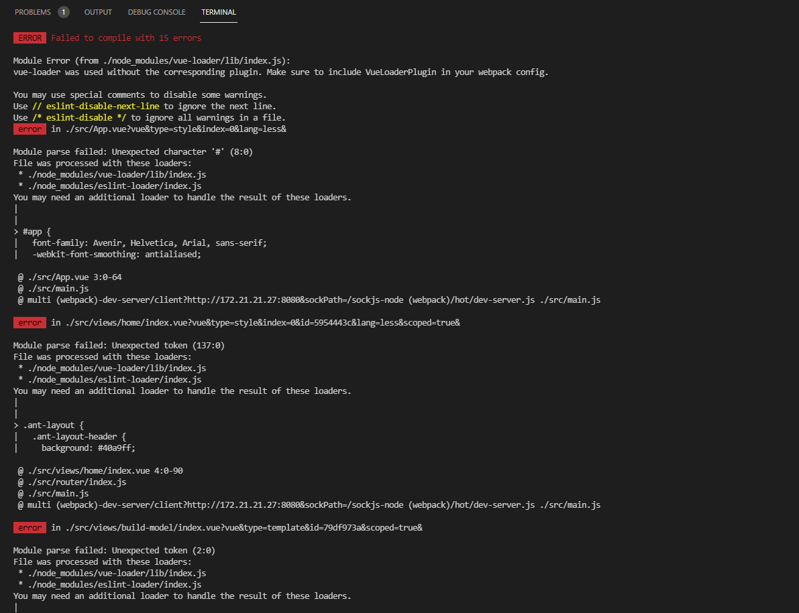
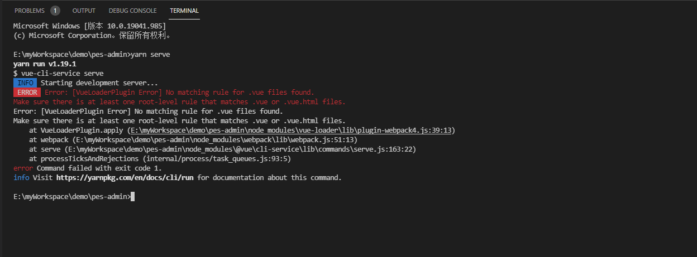

在Vue2.6.11项目中，引入到工程中的所有js、css文件，编译时都会被打包进vendor.js，浏览器在加载该文件之后才能开始显示首屏。若是引入的库众多，那么vendor.js文件体积将会相当的大，影响首开的体验。

解决方法是，将引用的外部js、css文件剥离开来，不编译到vendor.js中，而是用资源的形式引用，这样浏览器可以使用多个线程异步将vendor.js、外部的js等加载下来，达到加速首开的目的。

外部的库文件，可以使用CDN资源，或者别的服务器资源等。

下面，以引入vue、vuex、vue-router为例，说明处理流程。

### 一、资源引入

在index.html中，添加CDN资源，例如bootstrap上的资源：

```html
<!DOCTYPE html>
<html lang="">
  <head>
    <meta charset="utf-8" />
    <meta http-equiv="X-UA-Compatible" content="IE=edge" />
    <meta name="viewport" content="width=device-width,initial-scale=1.0" />
    <link rel="icon" href="<%= BASE_URL %>favicon.ico" />
    <link rel="stylesheet" href="<%= BASE_URL %>css/antd.min.css" />
    <title><%= htmlWebpackPlugin.options.title %></title>
  </head>
  <body>
    <noscript>
      <strong
        >We're sorry but <%= htmlWebpackPlugin.options.title %> doesn't work
        properly without JavaScript enabled. Please enable it to
        continue.</strong
      >
    </noscript>
    <div id="app"></div>
    <script src="https://cdn.bootcdn.net/ajax/libs/vue/2.6.12/vue.min.js"></script>
    <script src="https://cdn.bootcdn.net/ajax/libs/vuex/3.5.1/vuex.min.js"></script>
    <script src="https://cdn.bootcdn.net/ajax/libs/vue-router/3.2.0/vue-router.min.js"></script>
    <script src="<%= BASE_URL %>lib/antd.min.js"></script>
    <!-- built files will be auto injected -->
  </body>
</html>

```

### 二、添加配置

在vue.config.js(vue-cli项目中配置)或bulid/webpack.base.conf.js文件中，增加externals，将引用的外部模块导入，如下：
```js
module.exports = {
  configureWebpack: {
    externals: {
      vue: 'Vue',
      'vue-router': 'VueRouter',
      vuex: 'Vuex',
      'ant-design-vue': 'antd'
    }
  },
  chainWebpack: config => {}
}
```

### 三、去掉package.json 中包的引入

package.json 文件中 不需要在增加 vue/vue-router/vuex/antd 相关依赖

### 问题

#### 问题1：

```
vue-loader was used without the corresponding plugin. Make sure to include VueLoaderPlugin in your webpack config.
```

详细报错信息如下：



**解决方案**

Vue Loader v15 现在需要配合一个 webpack 插件才能正确使用：

```js
// webpack.config.js
const VueLoaderPlugin = require('vue-loader/lib/plugin')

module.exports = {
  // ...
  plugins: [
    new VueLoaderPlugin()
  ]
}
```

#### 问题2：

```
Error: [VueLoaderPlugin Error] No matching rule for .vue files found.     
```

详细报错信息如下：



**解决方案**

在webpack.conf.js中增加配置
```js
{
    test: /\.vue$/,
    use: ['vue-loader']
}
```

或vue.config.js中

```js
module.exports = {
    chainWebpack: config => {
        config.module
        .rule('vue')
        .test(/\.(vue)$/)
        .use('vue-loader')
        .loader('vue-loader')
        .tap(options => {
            return options
        })
    }
}
```

最终在vue.config.js 中完整配置：

```js
const path = require('path')
const resolve = dir => {
  return path.join(__dirname, dir)
}
const VueLoaderPlugin = require('vue-loader/lib/plugin')

module.exports = {
  configureWebpack: {
    externals: {
      vue: 'Vue',
      'vue-router': 'VueRouter',
      vuex: 'Vuex',
      'ant-design-vue': 'antd'
    },
    plugins: [new VueLoaderPlugin()]
  },
  chainWebpack: config => {
    config.resolve.alias.set('@', resolve('src'))
    // GraphQL Loader
    config.module
      .rule('graphql')
      .test(/\.(gql|graphql)$/)
      .use('graphql-tag/loader')
      .loader('graphql-tag/loader')
      .end()

    config.module
      .rule('vue')
      .test(/\.(vue)$/)
      .use('vue-loader')
      .loader('vue-loader')
      .tap(options => {
        return options
      })
  },
  runtimeCompiler: true,
  outputDir: 'dist',
  devServer: {
    port: 8088,
    proxy: {
      '/api': {
        target: 'http://12.26.16.31:8000',
        https: true,
        secure: false,
        changeOrigin: true
      }
    }
  }
}

```