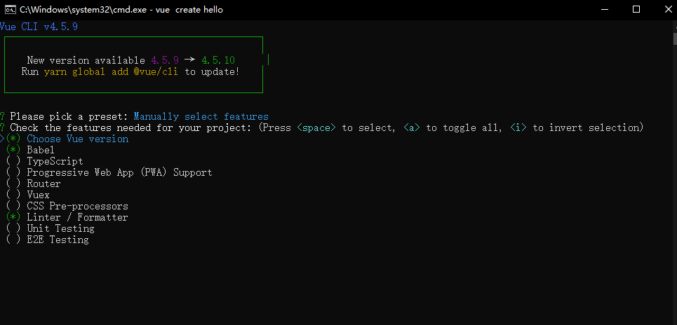
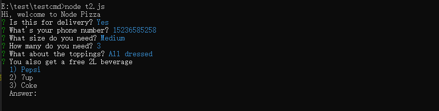
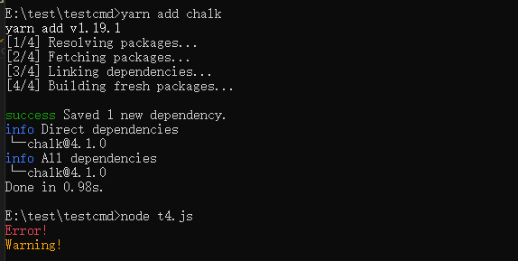

## 常见 npm 包

学习 vue-cli 源码之前 先了解一下项目中用到的 npm 包，有助于快速理解

- commander node.js 命令行使操作变得更简单
- Inquirer 一组通用的交互式命令行用户界面
- execa 一个更好的子进程
- handlebars 一个 javascript 语以模版库。
- metalsmith 一个非常简单的，可插拔的静态站点生成器
- chalk 终端字符串样式
- download-git-repo 从 Node 下载并提取 git 存储库（GitHub、GitLab、Bitbucket）
- consolidate 用 node.js 于合并模板库的模板引擎

### commander

commander 是一款重量轻，表现力强大的命令行框架，提供了用户命令行输入和参数解析的强大功能

```js
const program = require("commander");

program
  .version("0.1.0")
  .command("rmdir <dir> [otherDirs...]")
  .action(function (dir, otherDirs) {
    console.log("rmdir %s", dir);
    if (otherDirs) {
      otherDirs.forEach(function (oDir) {
        console.log("rmdir %s", oDir);
      });
    }
  });

program.parse(process.argv);
```

这段代码为 commander.js 官方的一个示例，它展示了 commander.js 可变参数的特性，可以在 action 的回调中获取对应的参数，当然也可以通过 process.argv 获取，[commander.js 中文文档](https://github.com/tj/commander.js/blob/master/Readme_zh-CN.md)

### Inquirer

Inquirer 为交互式命令行工具，比如执行 vue create 命令会有以下的命令行交互：


Inquirer 的基本使用如下：

```js
var inquirer = require("inquirer");
inquirer
  .prompt([
    /* Pass your questions in here */
  ])
  .then((answers) => {
    // Use user feedback for... whatever!!
  })
  .catch((error) => {
    if (error.isTtyError) {
      // Prompt couldn't be rendered in the current environment
    } else {
      // Something else went wrong
    }
  });
```

inquirer.prompt 接受一个 questions 数组， 一个 question 对象包含 type，name， message， default 等等字段，然后通过回调获取命令行交互的值，[详细文档](https://github.com/SBoudrias/Inquirer.js)

inquirer 案例：[inquirer.js](./example/inquirer.js)

运行结果：



### execa

execa 是可以调用 shell 和本地外部程序的 javascript 封装。会启动子进程执行，支持多操作系统，包括 windows，如果父进程退出，则生成的全部子进程都被杀死。它是在 Node.js 内置的 child_process.exec 基础上进行了提升，比如更好地支持 windows 平台，以及提供 Promise 的接口等等。可以看一个很简单的例子：

```js
const execa = require("execa");

(async () => {
  const { stdout } = await execa("echo", ["unicorns"]);
  console.log(stdout);
  //=> 'unicorns'
})();
```

上面例子就是执行 echo unicorns 命令输出 unicorns。关于 execa 更多的用法可查看 [详细文档](https://github.com/sindresorhus/execa#API)

### handlebars

handlebars 是一个 javascript 语义模版库，而且与 Mustache 模板 是兼容的，通过一个 demo 来感受下：

```js
var source =
  "<p>Hello, my name is {{name}}. I am from {{hometown}}. I have " +
  "{{kids.length}} kids:</p>" +
  "<ul>{{#kids}}<li>{{name}} is {{age}}</li>{{/kids}}</ul>";
var template = Handlebars.compile(source);

var data = {
  name: "Alan",
  hometown: "Somewhere, TX",
  kids: [
    { name: "Jimmy", age: "12" },
    { name: "Sally", age: "4" },
  ],
};
var result = template(data);

// Would render:
// <p>Hello, my name is Alan. I am from Somewhere, TX. I have 2 kids:</p>
// <ul>
//   <li>Jimmy is 12</li>
//   <li>Sally is 4</li>
// </ul>
```

这是官方的一个 demo, 就是通过 Handlebars 的 compile 方法将模板编译成 html 。在 vue-cli 的 init 命令中，利用 Handlebars.registerHelper 方法注册了一些 helper，这样就可以在模板中方便的使用这些 helper，[详细文档](https://handlebarsjs.com/)。

### metalsmith

[metalsmith](https://metalsmith.io/) 一个静态网站生成器，可以用在批量处理模板的场景，和 hexo 类似。它最大的特点就是所有的逻辑都是由插件处理，你只需要将这些插件用 metalsmith 连接起来使用即可，比如官方的一个 demo：

```js
var Metalsmith = require("metalsmith");
var markdown = require("metalsmith-markdown");
var layouts = require("metalsmith-layouts");
var permalinks = require("metalsmith-permalinks");

Metalsmith(__dirname)
  .metadata({
    title: "My Static Site & Blog",
    description: "It's about saying »Hello« to the World.",
    generator: "Metalsmith",
    url: "http://www.metalsmith.io/",
  })
  .source("./src")
  .destination("./build")
  .clean(false)
  .use(markdown())
  .use(permalinks())
  .use(
    layouts({
      engine: "handlebars",
    })
  )
  .build(function (err, files) {
    if (err) {
      throw err;
    }
  });
```


这段代码就是通过使用 metalsmith-markdown 和 metalsmith-layouts 插件 将 markdown 文件以 handlebars 的模板形式来生成 html 文件

### chalk

[chalk](https://github.com/chalk/chalk) 是用于修改控制台字符串的样式，包括字体样式（加粗），颜色以及背景颜色等。


Chalk 提供了一个易于使用的可组合 API，您只需在其中链接和嵌套所需的样式, 使用比较简单：

```js
const chalk = require("chalk");

const error = chalk.bold.red;
const warning = chalk.keyword("orange");

console.log(error("Error!"));
console.log(warning("Warning!"));
```

运行效果图：



### download-git-repo

[download-git-repo](https://gitlab.com/flippidippi/download-git-repo) 是用于 从 GitHub, GitLab, Bitbucket 下载一个 git 仓库，API 如下：

```js
download(repository, destination, options, callback);
```

- repository：仓库地址。
- destination：存放下载 git 仓库的路径。
- options：选项，clone。是以 http download 的形式还是 git clone 的形式下载。其中 git clone 的形式支持下载 private 仓库。
- callback：下载完成地回调。

### consolidate

[consolidate](https://github.com/tj/consolidate.js) 是一个模版引擎整合库，它的作用是把一些著名的模板引擎适配成 Express 兼容的接口。在 vue-cli 的 init 命令中利用 consolidate.handlebars.render 是实现模版的渲染。在 /example/metalsmith 目录里有个 demo，就是通过 metalsmith 以及 consolidate.handlebars.render 方法将一个 package.json 以 handlebars 的模板引擎来渲染，在项目里运行
