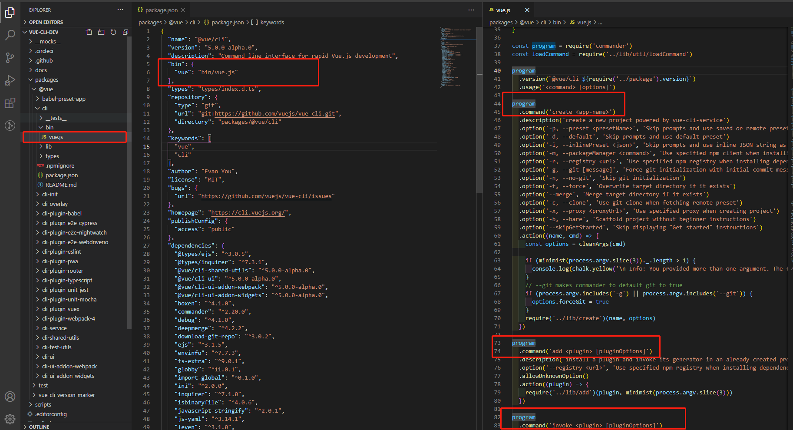
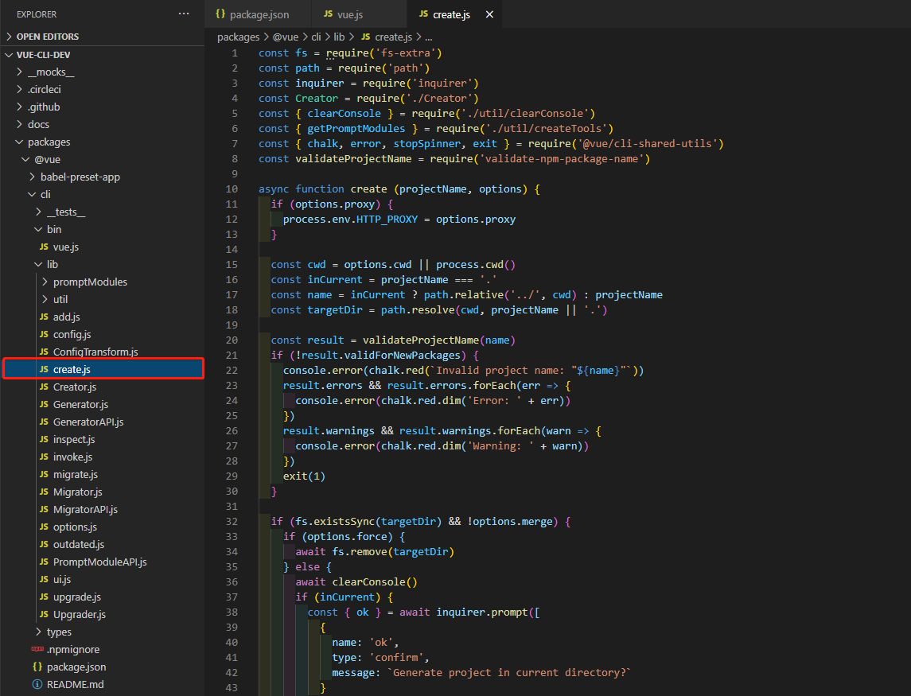
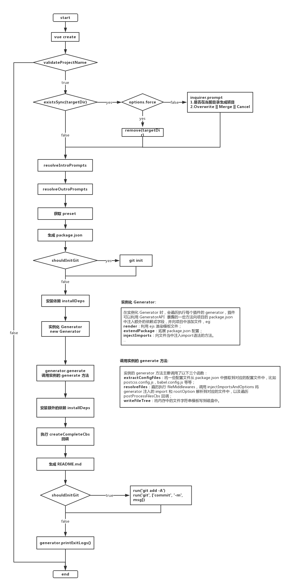
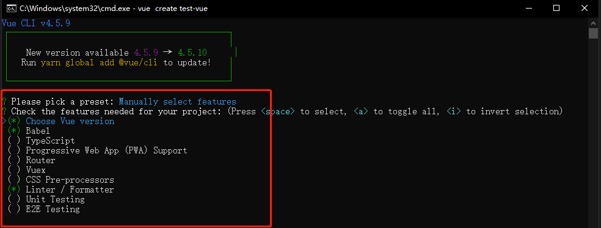
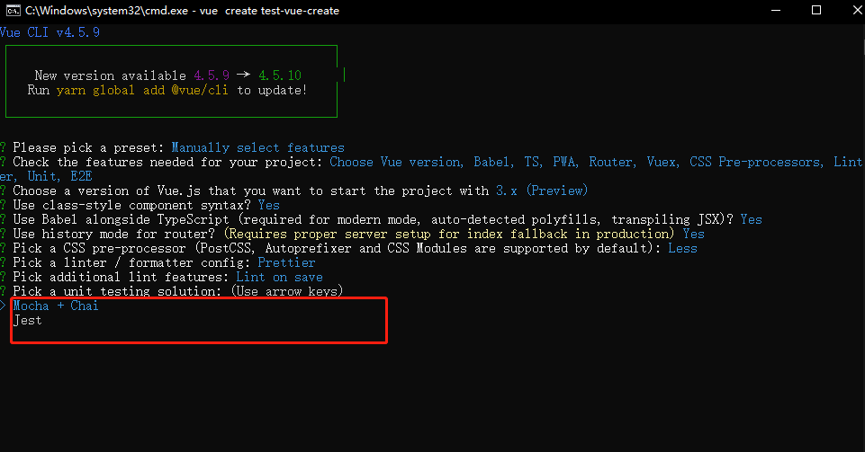
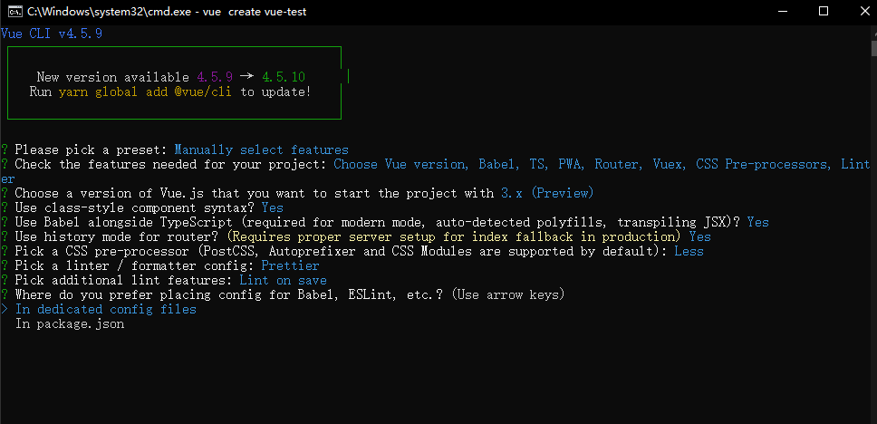

了解源码之前可以先看下源码中用的 npm 包，有助于更好的理解 [vue-cli 常用 npm](./vue-cli中常用npm介绍.md)

要知道 vue create 都做了些什么，就得先找到 vue create 在哪定义的，那就先从 vue 命令的定义源文件开始看吧，先找到 cli 包中 package.json，找到 bin 中定义的命令：  


可以看到 vue 定义的相关命令，其中就包含了 **create** ：

```
create <app-name>

add  <plugin> [pluginOptions]

invoke <plugin> [pluginOptions]

inspect [paths...]

serve

build

ui

init <template> <app-name>

config [value]

outdated

upgrade [plugin-name]

migrate [plugin-name]
```

create 命令定义如下：

```js
program
  .command("create <app-name>")
  .description("create a new project powered by vue-cli-service")
  .option(
    "-p, --preset <presetName>",
    "Skip prompts and use saved or remote preset"
  )
  .option("-d, --default", "Skip prompts and use default preset")
  .option(
    "-i, --inlinePreset <json>",
    "Skip prompts and use inline JSON string as preset"
  )
  .option(
    "-m, --packageManager <command>",
    "Use specified npm client when installing dependencies"
  )
  .option(
    "-r, --registry <url>",
    "Use specified npm registry when installing dependencies (only for npm)"
  )
  .option(
    "-g, --git [message]",
    "Force git initialization with initial commit message"
  )
  .option("-n, --no-git", "Skip git initialization")
  .option("-f, --force", "Overwrite target directory if it exists")
  .option("--merge", "Merge target directory if it exists")
  .option("-c, --clone", "Use git clone when fetching remote preset")
  .option("-x, --proxy <proxyUrl>", "Use specified proxy when creating project")
  .option("-b, --bare", "Scaffold project without beginner instructions")
  .option("--skipGetStarted", 'Skip displaying "Get started" instructions')
  .action((name, cmd) => {
    const options = cleanArgs(cmd);

    if (minimist(process.argv.slice(3))._.length > 1) {
      console.log(
        chalk.yellow(
          "\n Info: You provided more than one argument. The first one will be used as the app's name, the rest are ignored."
        )
      );
    }
    // --git makes commander to default git to true
    if (process.argv.includes("-g") || process.argv.includes("--git")) {
      options.forceGit = true;
    }
    require("../lib/create")(name, options);
  });
```

这里创建了一个 command(‘create <app-name>’),假如是全局装置了@vue-cli3.0,那就能够运用

```
vue create appName options
```

options 为参数设置项（即 Option 中定义的短命令），进入 action 后就可以提取用户输入的参数，接下来就进入到 create 实际执行的文件**require('../lib/create')(name, options)**



先通过一张流程图大致聊了解下 vue create 的过程:  


从这个图可以直观地感受到 vue create 整个过程还是比较复杂的

首先看下 create.js 文件

```js
async function create(projectName, options) {
  // 代理运用 -x 或--proxy参数设置
  if (options.proxy) {
    process.env.HTTP_PROXY = options.proxy;
  }

  const cwd = options.cwd || process.cwd(); // 当前目录
  const inCurrent = projectName === "."; // 是否在当前目录
  const name = inCurrent ? path.relative("../", cwd) : projectName; // 项目名称
  const targetDir = path.resolve(cwd, projectName || "."); // 生成项目的目录

  // validateProjectName 利用 npm 包 validate-npm-package-name 判断项目名称是否符合 npm 包名规范，并输出相应的 errors 或者 warnings。
  const result = validateProjectName(name);
  if (!result.validForNewPackages) {
    console.error(chalk.red(`Invalid project name: "${name}"`));
    result.errors &&
      result.errors.forEach((err) => {
        console.error(chalk.red.dim("Error: " + err));
      });
    result.warnings &&
      result.warnings.forEach((warn) => {
        console.error(chalk.red.dim("Warning: " + warn));
      });
    exit(1);
  }
  // 在验证包名之后，会判断项目目录是否与当前已有目录重复。
  if (fs.existsSync(targetDir) && !options.merge) {
    if (options.force) {
      await fs.remove(targetDir);
    } else {
      await clearConsole();
      if (inCurrent) {
        const { ok } = await inquirer.prompt([
          {
            name: "ok",
            type: "confirm",
            message: `Generate project in current directory?`,
          },
        ]);
        if (!ok) {
          return;
        }
      } else {
        const { action } = await inquirer.prompt([
          {
            name: "action",
            type: "list",
            message: `Target directory ${chalk.cyan(
              targetDir
            )} already exists. Pick an action:`,
            choices: [
              { name: "Overwrite", value: "overwrite" },
              { name: "Merge", value: "merge" },
              { name: "Cancel", value: false },
            ],
          },
        ]);
        if (!action) {
          return;
        } else if (action === "overwrite") {
          console.log(`\nRemoving ${chalk.cyan(targetDir)}...`);
          await fs.remove(targetDir);
        }
      }
    }
  }

  const creator = new Creator(name, targetDir, getPromptModules());
  await creator.create(options);
}
```

getPromptModules()为内置插件对话对象

```js
exports.getPromptModules = () => {
  return [
    "vueVersion",
    "babel",
    "typescript",
    "pwa",
    "router",
    "vuex",
    "cssPreprocessors",
    "linter",
    "unit",
    "e2e",
  ].map((file) => require(`../promptModules/${file}`));
};
```

实际使用如下图所示：  


promptModules 目录中定义了这些选项的详细配置，以 vueVersion 为例：

```js
module.exports = (cli) => {
  cli.injectFeature({
    name: "Choose Vue version",
    value: "vueVersion",
    description:
      "Choose a version of Vue.js that you want to start the project with",
    checked: true,
  });

  cli.injectPrompt({
    name: "vueVersion",
    when: (answers) => answers.features.includes("vueVersion"),
    message:
      "Choose a version of Vue.js that you want to start the project with",
    type: "list",
    choices: [
      {
        name: "2.x",
        value: "2",
      },
      {
        name: "3.x (Preview)",
        value: "3",
      },
    ],
    default: "2",
  });

  cli.onPromptComplete((answers, options) => {
    if (answers.vueVersion) {
      options.vueVersion = answers.vueVersion;
    }
  });
};
```

**cli.injectFeature** 是注入 featurePrompt，即初始化项目时选择 babel，typescript，pwa 等等，如下图：  


**cli.injectPrompt** 是根据选择的 featurePrompt 然后注入对应的 prompt，当选择了 unit，接下来会有以下的 prompt，选择 Mocha + Chai 还是 Jest：  


**cli.onPromptComplete** 就是一个回调，会根据选择来添加对应的插件， 当选择了 mocha ，那么就会添加 @vue/cli-plugin-unit-mocha 插件

以上大部份都是定义文件，效验，文件效验，比较简单易懂，接下来就是建立 Creator 组织器了.

在开始 Creator 之前，先来了解一下预设选项

一个 Vue CLI preset 是一个包含创建新项目所需预定义选项和插件的 JSON 对象，让用户无需在命令提示中选择它们

```json
{
  "useConfigFiles": true,
  "cssPreprocessor": "sass",
  "plugins": {
    "@vue/cli-plugin-babel": {},
    "@vue/cli-plugin-eslint": {
      "config": "airbnb",
      "lintOn": ["save", "commit"]
    },
    "@vue/cli-plugin-router": {},
    "@vue/cli-plugin-vuex": {}
  }
}
```

更多介绍可以[查看官网](https://cli.vuejs.org/zh/guide/plugins-and-presets.html#%E6%8F%92%E4%BB%B6)

**new Creator**

```js
  constructor (name, context, promptModules) {
    super()

    this.name = name
    this.context = process.env.VUE_CLI_CONTEXT = context
    const { presetPrompt, featurePrompt } = this.resolveIntroPrompts() // 获取了 presetPrompt list，在初始化项目的时候提供选择

    this.presetPrompt = presetPrompt // presetPrompt list
    this.featurePrompt = featurePrompt // babal, pwa, e2e etc.
    this.outroPrompts = this.resolveOutroPrompts() //  存放项目配置的文件（package.json || congfig.js） 以及是否将 presetPrompts 存放起来
    this.injectedPrompts = [] // 对应 feature 的 Prompts
    this.promptCompleteCbs = [] // injectedPrompts 的回调
    this.afterInvokeCbs = []
    this.afterAnyInvokeCbs = []

    this.run = this.run.bind(this)

    const promptAPI = new PromptModuleAPI(this)
    /**
     * 1. 将 babel, e2e, pwa 等 push 到 featurePrompt.choices 中，在选择项目需要配置哪些时显示出来 （checkbox）；
     * 2. 将 babel, e2e, pwa 等 push 到 injectedPrompts 中，当设置了 feature 会对应通过 Prompts 来进一步选择哪种模式，比如当选择了 E2E Testing ，然后会再次让你
     *    选择哪种 E2E Testing，即， Cypress (Chrome only) ||  Nightwatch (Selenium-based)；
     * 3. 将每中 feature 的 onPromptComplete push 到 promptCompleteCbs，在后面会根据选择的配置来安装对应的 plugin。
     */
    promptModules.forEach(m => m(promptAPI))
  }
```

这段代码主要看下 PromptModuleAPI，源码如下：

```js
module.exports = class PromptModuleAPI {
  constructor(creator) {
    this.creator = creator;
  }

  injectFeature(feature) {
    this.creator.featurePrompt.choices.push(feature);
  }

  injectPrompt(prompt) {
    this.creator.injectedPrompts.push(prompt);
  }

  injectOptionForPrompt(name, option) {
    this.creator.injectedPrompts
      .find((f) => {
        return f.name === name;
      })
      .choices.push(option);
  }

  onPromptComplete(cb) {
    this.creator.promptCompleteCbs.push(cb);
  }
};
```

PromptModuleAPI 实例会调用它的实例方法，然后将 injectFeature， injectPrompt， injectOptionForPrompt， onPromptComplete 保存到 Creator 实例对应的变量中。

最后遍历 getPromptModules 获取的 promptModules，传入实例 promptAPI，初始化 Creator 实例中 featurePrompt, injectedPrompts, promptCompleteCbs 变量。

在创建一个 Creator 实例后，然后调用了 create 方法

```
await creator.create(options)
```

create 开始是获取 preset ，源码如下：

```js
const isTestOrDebug = process.env.VUE_CLI_TEST || process.env.VUE_CLI_DEBUG;
const { run, name, context, afterInvokeCbs, afterAnyInvokeCbs } = this;

if (!preset) {
  // 根据用户参数 执行
  if (cliOptions.preset) {
    // vue create foo --preset bar
    preset = await this.resolvePreset(cliOptions.preset, cliOptions.clone);
  } else if (cliOptions.default) {
    // vue create foo --default
    preset = defaults.presets.default;
  } else if (cliOptions.inlinePreset) {
    // vue create foo --inlinePreset {...}
    try {
      preset = JSON.parse(cliOptions.inlinePreset);
    } catch (e) {
      error(`CLI inline preset is not valid JSON: ${cliOptions.inlinePreset}`);
      exit(1);
    }
  } else {
    preset = await this.promptAndResolvePreset();
  }
}

// clone before mutating
preset = cloneDeep(preset);
// inject core service
preset.plugins["@vue/cli-service"] = Object.assign(
  {
    projectName: name,
  },
  preset
);

if (cliOptions.bare) {
  preset.plugins["@vue/cli-service"].bare = true;
}
```

先判断 vue create 命令是否带有 -p 选项，如果有的话会调用 resolvePreset 去解析 preset。resolvePreset 函数会先获取 ～/.vuerc 中保存的 preset， 然后进行遍历，如果里面包含了 -p 中的 <presetName>，则返回～/.vuerc 中的 preset。如果没有则判断是否是采用内联的 JSON 字符串预设选项，如果是就会解析 .json 文件，并返回 preset，还有一种情况就是从远程获取 preset（利用 download-git-repo 下载远程的 preset.json）并返回。

resolvePreset 源码如下:

```js
  async resolvePreset (name, clone) {
    let preset
    const savedPresets = this.getPresets()

    if (name in savedPresets) {
      preset = savedPresets[name]
    } else if (name.endsWith('.json') || /^\./.test(name) || path.isAbsolute(name)) {
      preset = await loadLocalPreset(path.resolve(name))
    } else if (name.includes('/')) {
      log(`Fetching remote preset ${chalk.cyan(name)}...`)
      this.emit('creation', { event: 'fetch-remote-preset' })
      try {
        preset = await loadRemotePreset(name, clone)
      } catch (e) {
        error(`Failed fetching remote preset ${chalk.cyan(name)}:`)
        throw e
      }
    }

    if (!preset) {
      error(`preset "${name}" not found.`)
      const presets = Object.keys(savedPresets)
      if (presets.length) {
        log()
        log(`available presets:\n${presets.join(`\n`)}`)
      } else {
        log(`you don't seem to have any saved preset.`)
        log(`run vue-cli in manual mode to create a preset.`)
      }
      exit(1)
    }
    return preset
  }
```

上面的情况是当 vue create 命令带有 -p 选项的时候才会执行，如果没有就会调用 promptAndResolvePreset 函数利用 inquirer.prompt 以命令后交互的形式来获取 preset，下面看下 promptAndResolvePreset 函数的源码：

```js
 async promptAndResolvePreset (answers = null) {
    // prompt
    if (!answers) {
      await clearConsole(true)
      answers = await inquirer.prompt(this.resolveFinalPrompts())
    }
    debug('vue-cli:answers')(answers)

    if (answers.packageManager) {
      saveOptions({
        packageManager: answers.packageManager
      })
    }

    let preset
    if (answers.preset && answers.preset !== '__manual__') {// 如果是选择使用本地保存的 preset (~/.vuerc)
      preset = await this.resolvePreset(answers.preset)
    } else {
      // manual
      preset = {
        useConfigFiles: answers.useConfigFiles === 'files',
        plugins: {}
      }
      answers.features = answers.features || []
      // run cb registered by prompt modules to finalize the preset
      this.promptCompleteCbs.forEach(cb => cb(answers, preset))
    }

    // validate
    validatePreset(preset)

    // save preset
    if (answers.save && answers.saveName && savePreset(answers.saveName, preset)) {
      log()
      log(`🎉  Preset ${chalk.yellow(answers.saveName)} saved in ${chalk.yellow(rcPath)}`)
    }

    debug('vue-cli:preset')(preset)
    return preset
  }
```

在调用 inquirer.prompt 之前利用 this.resolveFinalPrompts() 获取了最后的 prompts，到这里有些同学可能就有点晕了，到底有多少个 prompt，别急，下面将 简单介绍下，查看 this.resolveFinalPrompts() 源码：

```js
  resolveFinalPrompts () {
    // patch generator-injected prompts to only show in manual mode
    // 将所有的 Prompt 合并，包含 preset，feature，injected，outro，只有当选择了手动模式的时候才会显示 injectedPrompts
    this.injectedPrompts.forEach(prompt => {
      this.injectedPrompts.forEach(prompt => {
        const originalWhen = prompt.when || (() => true)
        prompt.when = answers => {
          return isManualMode(answers) && originalWhen(answers)
        }
      })

      const prompts = [
        this.presetPrompt,
        this.featurePrompt,
        ...this.injectedPrompts,
        ...this.outroPrompts
      ]
      debug('vue-cli:prompts')(prompts)
      return prompts
    }
  }
```

比较容易的就可以看出作用就是将 presetPrompt， featurePrompt， injectedPrompts， outroPrompts 合并成一个数组进行返回，这几个 Prompt 的含义如下：

- presetPrompt： 预设选项 prompt，当上次以 Manually 模式进行了预设选项，并且保存到了 ~/.vuerc 中，那么在初始化项目时就会列出已经保存的 preset，并提供选择。
- featurePrompt：项目的一些 feature，就是选择 babel，typescript，pwa，router，vuex，cssPreprocessors，linter，unit，e2e。
- injectedPrompts：当选择了 feature 后，就会为对应的 feature 注入 prompts，比如你选择了 unit，那么就会让你选择模式： Mocha + Chai 还是 Jest
- outroPrompts： 其他的 prompt，包含：
  - 将 Babel, PostCSS, ESLint 等等的配置文件存放在 package.json 中还是存放在 config 文件中；
  - 是否需要将这次设置的 preset 保存到本地，如果需要则会进一步让你输入名称进行保存；
  - 安装依赖是选择 npm 还是 yarn。

inquirer.prompt 执行完成后会返回 answers，如果选择了本地保存的 preset 或者 default，则调用 resolvePreset 进行解析 preset，否则遍历 promptCompleteCbs 执行 injectFeature 和 injectPrompt 的回调，将对应的插件赋值到 options.plugins 中，以 unit 为例：

```js
cli.onPromptComplete((answers, options) => {
  if (answers.unit === "mocha") {
    options.plugins["@vue/cli-plugin-unit-mocha"] = {};
  } else if (answers.unit === "jest") {
    options.plugins["@vue/cli-plugin-unit-jest"] = {};
  }
});
```

如果 feature 选择了 unit，并且 unit 模式选择的是 Mocha + Chai，则添加 @vue/cli-plugin-unit-mocha 插件，如果选择的是 Jest 则添加 @vue/cli-plugin-unit-jest 插件。

在获取到 preset 之后，还会向 preset 的插件里面注入核心插件 @vue/cli-service， 它是调用 vue-cli-service <command> [...args] 时创建的类。 负责管理内部的 webpack 配置、暴露服务和构建项目的命令等。

到这里获取预设选项（preset）大致分析完了，在下节将会分析依赖的安装。

```js
// get latest CLI plugin version
const { latestMinor } = await getVersions();
// generate package.json with plugin dependencies
const pkg = {
  name,
  version: "0.1.0",
  private: true,
  devDependencies: {},
  ...resolvePkg(context),
};
const deps = Object.keys(preset.plugins);
deps.forEach((dep) => {
  if (preset.plugins[dep]._isPreset) {
    return;
  }

  let { version } = preset.plugins[dep];

  if (!version) {
    if (
      isOfficialPlugin(dep) ||
      dep === "@vue/cli-service" ||
      dep === "@vue/babel-preset-env"
    ) {
      version = isTestOrDebug ? `latest` : `~${latestMinor}`;
    } else {
      version = "latest";
    }
  }

  pkg.devDependencies[dep] = version;
});

// write package.json
await writeFileTree(context, {
  "package.json": JSON.stringify(pkg, null, 2),
});
```

这段代码主要有两个作用：获取最新 CLI （包含插件）的版本 和 生成 package.json，接下来一个一个地看

getVersions 的代码不多，看下比较核心的代码：

```js
let sessionCached;

module.exports = async function getVersions() {
  if (sessionCached) {
    return sessionCached;
  }

  let latest;
  const local = require(`../../package.json`).version;
  if (process.env.VUE_CLI_TEST || process.env.VUE_CLI_DEBUG) {
    return (sessionCached = {
      current: local,
      latest: local,
      latestMinor: local,
    });
  }

  // should also check for prerelease versions if the current one is a prerelease 如果当前版本是预发布版本，还应该检查预发布版本
  const includePrerelease = !!semver.prerelease(local);

  const { latestVersion = local, lastChecked = 0 } = loadOptions();
  const cached = latestVersion;
  const daysPassed = (Date.now() - lastChecked) / (60 * 60 * 1000 * 24);

  let error;
  if (daysPassed > 1) {
    // if we haven't check for a new version in a day, wait for the check
    // before proceeding
    try {
      latest = await getAndCacheLatestVersion(cached, includePrerelease);
    } catch (e) {
      latest = cached;
      error = e;
    }
  } else {
    // Otherwise, do a check in the background. If the result was updated,
    // it will be used for the next 24 hours.
    // don't throw to interrupt the user if the background check failed
    getAndCacheLatestVersion(cached, includePrerelease).catch(() => {});
    latest = cached;
  }

  // if the installed version is updated but the cache doesn't update
  if (semver.gt(local, latest) && !semver.prerelease(local)) {
    latest = local;
  }

  let latestMinor = `${semver.major(latest)}.${semver.minor(latest)}.0`;
  if (
    // if the latest version contains breaking changes
    /major/.test(semver.diff(local, latest)) ||
    // or if using `next` branch of cli
    (semver.gte(local, latest) && semver.prerelease(local))
  ) {
    // fallback to the local cli version number
    latestMinor = local;
  }

  return (sessionCached = {
    current: local,
    latest,
    latestMinor,
    error,
  });
};

// fetch the latest version and save it on disk
// so that it is available immediately next time
async function getAndCacheLatestVersion(cached, includePrerelease) {
  let version = await pm.getRemoteVersion("vue-cli-version-marker", "latest");

  if (includePrerelease) {
    const next = await pm.getRemoteVersion("vue-cli-version-marker", "next");
    version = semver.gt(next, version) ? next : version;
  }

  if (semver.valid(version) && version !== cached) {
    saveOptions({ latestVersion: version, lastChecked: Date.now() });
    return version;
  }
  return cached;
}
```

这段代码按顺序读下应该就知道其中的作用了，简单说下就注意两个变量：

- local：本地 CLI 以及插件的版本
- latest：远程 CLI 以及插件的版本

local 和 latest 包含了 CLI 以及相关插件的版本，它们可以用于判断 @vue/cli 是否需要更新以及初始化项目中相关插件的版本。还有点需要注意的是，获取 CLI 的版本并不是直接获取， 而是通过 vue-cli-version-marker npm 包获取的 CLI 版本，为什么会这样做，主要原因有两点：

- vue-cli 从 3.0（@vue/cli） 开始就放在了 @vue 下面，即是一个 scoped package, 而 scoped package 又不支持通过 npm registry 来获取 latest 版本信息。比如 vue-cli-version-marker/latest 可以正常访问，而 @vue/cli/latest 则不可以。
- 获取 scoped packages 的数据比获取 unscoped package 通常要慢 300ms。

正是由于上述两个原因，因此通过 unscoped package vue-cli-version-marker 来获取 CLI 版本，vue-cli-version-marker 的内容比较简单，就是一个 package.json，通过获取里面 devDependencies 的版本信息，从而获取 @vue/cli 以及一些插件的版本号。获取了插件版本之后遍历 preset 中所有 plugin 为其初始化版本号，并调用 writeFileTree 生成 package.json 。

在生成 package.json 之后，我们再继续看下面的代码：

```js
// intilaize git repository before installing deps 在安装deps之前初始化git存储库
// so that vue-cli-service can setup git hooks. 以便vue cli服务可以设置git钩子函数
const shouldInitGit = this.shouldInitGit(cliOptions);
if (shouldInitGit) {
  log(`🗃  Initializing git repository...`);
  this.emit("creation", { event: "git-init" });
  await run("git init");
}

// install plugins
log(`⚙\u{fe0f}  Installing CLI plugins. This might take a while...`);
log();
this.emit("creation", { event: "plugins-install" });

if (isTestOrDebug && !process.env.VUE_CLI_TEST_DO_INSTALL_PLUGIN) {
  // in development, avoid installation process
  await require("./util/setupDevProject")(context);
} else {
  await pm.install();
}
```

这段代码会先调用 shouldInitGit 来判断是否需要 git 初始化，判断的情形有以下几种：

- 没有安装 git (!hasGit())：false；
- vue create 含有 --git 或者 -g 选项：true；
- vue create 含有 --no-git 或者 -n 选项：false；
- 生成项目的目录是否已经含有 git （!hasProjectGit(this.context)）：如果有，则返回 false，否则返回 true。

在判断完是否需要 git 初始化项目后，接下来就会调用 install 安装依赖，源码如下：

```js
  async runCommand (command, args) {
    await this.setRegistryEnvs()
    return await executeCommand(
      this.bin,
      [
        ...PACKAGE_MANAGER_CONFIG[this.bin][command],
        ...(args || [])
      ],
      this.context
    )
  }

  async install () {
    const args = []

    if (this.needsPeerDepsFix) {
      args.push('--legacy-peer-deps')
    }

    if (process.env.VUE_CLI_TEST) {
      args.push('--silent', '--no-progress')
    }

    return await this.runCommand('install', args)
  }
```

源码很简洁，里面又先调用了 setRegistryEnvs 函数，它的作用就是安装依赖是指定安装源，如果 vue create 还有 -r 选项则采用设置的安装源，否则调用 shouldUseTaobao 函数来判断是否需要使用淘宝 NPM 镜像源。实现原理就是发送两个 Promise 使用默认安装源和淘宝镜像源去请求同一个 npm 包，然后利用 Promise.race 看在哪种源下返回结果更快就将此 设置为安装源，另外如果 ~/.vuerc 中设置了 useTaobaoRegistry，则使用设置的安装源。设置了安装源之后则调用 executeCommand 函数利用 execa 执行 npm 或者 yarn 安装命令。

到这里安装依赖就大致介绍完了，在下面一节将介绍 vue create 核心部分 Generator。

```js
// run generator
log(`🚀  Invoking generators...`);
this.emit("creation", { event: "invoking-generators" });
const plugins = await this.resolvePlugins(preset.plugins, pkg);
const generator = new Generator(context, {
  pkg,
  plugins,
  afterInvokeCbs,
  afterAnyInvokeCbs,
});
await generator.generate({
  extractConfigFiles: preset.useConfigFiles,
});
```

在安装完依赖以后，就会调用 resolvePlugins，作用就是加载每个插件的 generator ，并且如果插件需要进行命令行交互的话会执行 inquirer.prompt 获取 option。 在此之后会实例化一个 Generator

[Generator](./example/Generator.js) 实例化的代码:

```js
class Generator {
  constructor(
    context,
    {
      pkg = {},
      plugins = [],
      afterInvokeCbs = [],
      afterAnyInvokeCbs = [],
      files = {},
      invoking = false,
    } = {}
  ) {
    this.context = context;
    this.plugins = plugins;
    this.originalPkg = pkg;
    this.pkg = Object.assign({}, pkg);
    this.pm = new PackageManager({ context });
    this.imports = {};
    this.rootOptions = {};
    this.afterInvokeCbs = afterInvokeCbs;
    this.afterAnyInvokeCbs = afterAnyInvokeCbs;
    this.configTransforms = {}; // 插件通过 GeneratorAPI 暴露的 addConfigTransform 方法添加如何提取配置文件
    this.defaultConfigTransforms = defaultConfigTransforms; // 默认的配置文件
    this.reservedConfigTransforms = reservedConfigTransforms; // 保留的配置文件 vue.config.js
    this.invoking = invoking;
    // for conflict resolution
    this.depSources = {};
    // virtual file tree
    this.files = Object.keys(files).length
      ? // when execute `vue add/invoke`, only created/modified files are written to disk
        watchFiles(files, (this.filesModifyRecord = new Set()))
      : // all files need to be written to disk
        files;
    this.fileMiddlewares = [];
    this.postProcessFilesCbs = [];
    // exit messages
    this.exitLogs = [];

    // load all the other plugins
    this.allPluginIds = Object.keys(this.pkg.dependencies || {})
      .concat(Object.keys(this.pkg.devDependencies || {}))
      .filter(isPlugin);

    const cliService = plugins.find((p) => p.id === "@vue/cli-service");
    const rootOptions = cliService ? cliService.options : inferRootOptions(pkg);

    this.rootOptions = rootOptions;
  }

  // ....
}
```

creator 里面使用了 generator.generate 方法，接下来就来看下 generate 里面是如何实现的，源码如下：

```js
  async generate ({
    extractConfigFiles = false,
    checkExisting = false
  } = {}) {
    await this.initPlugins()

    // save the file system before applying plugin for comparison
    const initialFiles = Object.assign({}, this.files)
    // extract configs from package.json into dedicated files.
    this.extractConfigFiles(extractConfigFiles, checkExisting)
    // wait for file resolve
    await this.resolveFiles()
    // set package.json
    this.sortPkg()
    this.files['package.json'] = JSON.stringify(this.pkg, null, 2) + '\n'
    // write/update file tree to disk
    await writeFileTree(this.context, this.files, initialFiles, this.filesModifyRecord)
  }
```

首先是**initPlugins**

```js
  async initPlugins () {
    const { rootOptions, invoking } = this
    const pluginIds = this.plugins.map(p => p.id)

    // avoid modifying the passed afterInvokes, because we want to ignore them from other plugins
    const passedAfterInvokeCbs = this.afterInvokeCbs
    this.afterInvokeCbs = []
    // apply hooks from all plugins to collect 'afterAnyHooks'
    for (const id of this.allPluginIds) {
      const api = new GeneratorAPI(id, this, {}, rootOptions)
      const pluginGenerator = loadModule(`${id}/generator`, this.context)

      if (pluginGenerator && pluginGenerator.hooks) { // eslint 插件中有hooks方法
        await pluginGenerator.hooks(api, {}, rootOptions, pluginIds)
      }
    }

    // We are doing save/load to make the hook order deterministic
    // save "any" hooks
    const afterAnyInvokeCbsFromPlugins = this.afterAnyInvokeCbs

    // reset hooks
    this.afterInvokeCbs = passedAfterInvokeCbs
    this.afterAnyInvokeCbs = []
    this.postProcessFilesCbs = []

    // apply generators from plugins
    for (const plugin of this.plugins) {
      const { id, apply, options } = plugin
      const api = new GeneratorAPI(id, this, options, rootOptions)
      await apply(api, options, rootOptions, invoking) // ***********generatorApi插件方法调用，如Eslint会调用 @vue\cli-plugin-eslint\generator\index.js 执行该组件

      if (apply.hooks) {
        // while we execute the entire `hooks` function,
        // only the `afterInvoke` hook is respected
        // because `afterAnyHooks` is already determined by the `allPluginIds` loop above
        await apply.hooks(api, options, rootOptions, pluginIds)
      }
    }
    // restore "any" hooks
    this.afterAnyInvokeCbs = afterAnyInvokeCbsFromPlugins
  }
```

initPlugins 初始化加载所有插件

initPlugins 中有个很重要的对象[GeneratorAPI](./example/GeneratorAPI.js)，接下来看一下

**GeneratorAPI 是一个比较重要的部分了，前面说过 vue-cli 3.0 是基于一套插件架构的，那么如果插件需要自定义项目模板、修改模板中的一些文件或者添加一些依赖 的话怎么处理呢。方法是 @vue/cli 插件所提供的 generator 向外暴露一个函数，接收的第一个参数 api，然后通过该 api 提供的方法去完成应用的拓展工作，这里所说 的 api 就是 GeneratorAPI，下面看一下 GeneratorAPI 提供了哪些方法**。

- hasPlugin：判断项目中是否有某个插件
- extendPackage：拓展 package.json 配置
- render：利用 ejs 渲染模板文件
- onCreateComplete：内存中保存的文件字符串全部被写入文件后的回调函数
- exitLog：当 generator 退出的时候输出的信息
- genJSConfig：将 json 文件生成为 js 配置文件
- injectImports：向文件当中注入 import 语法的方法
- injectRootOptions：向 Vue 根实例中添加选项

...

下面就以 @vue/cli-service 为例，来简单熟悉下 GeneratorAPI 的使用案例。首先看一下 @vue/cli-service/generator/index.js

```js
module.exports = (api, options) => {
  api.render("./template", {
    doesCompile: api.hasPlugin("babel") || api.hasPlugin("typescript"),
  });

  if (options.vueVersion === "3") {
    api.extendPackage({
      dependencies: {
        vue: "^3.0.4",
      },
      devDependencies: {
        "@vue/compiler-sfc": "^3.0.4",
      },
    });
  } else {
    api.extendPackage({
      dependencies: {
        vue: "^2.6.11",
      },
      devDependencies: {
        "vue-template-compiler": "^2.6.11",
      },
    });
  }

  api.extendPackage({
    scripts: {
      serve: "vue-cli-service serve",
      build: "vue-cli-service build",
    },
    browserslist: ["> 1%", "last 2 versions", "not dead"],
  });

  if (options.cssPreprocessor) {
    const deps = {
      sass: {
        sass: "^1.30.0",
        "sass-loader": "^8.0.2",
      },
      "dart-sass": {
        sass: "^1.30.0",
        "sass-loader": "^8.0.2",
      },
      less: {
        less: "^3.0.4",
        "less-loader": "^5.0.0",
      },
      stylus: {
        stylus: "^0.54.8",
        "stylus-loader": "^4.3.1",
      },
    };

    api.extendPackage({
      devDependencies: deps[options.cssPreprocessor],
    });
  }

  // for v3 compatibility
  if (options.router && !api.hasPlugin("router")) {
    require("./router")(api, options, options);
  }

  // for v3 compatibility
  if (options.vuex && !api.hasPlugin("vuex")) {
    require("./vuex")(api, options, options);
  }

  // additional tooling configurations
  if (options.configs) {
    api.extendPackage(options.configs);
  }
};
```

看一下 @vue/cli-service generator 代码，然后结合 GeneratorAPI 所暴露的方法，自己再感悟下，大概就可以明白插件利用 GeneratorAPI 暴露的方法 做了一些什么事情，也可以初步感受到 vue-cli 3.0 的插件机制，将所有功能都交给插件去完成。对于 vue-cli 3.0 内置的插件，比如：@vue/cli-plugin-eslint 、@vue/cli-plugin-pwa 等等，以及其他第三方插件，他们的 generator 作用都是一样都可以向项目的 package.json 中注入额外的依赖或字段，并向项目中添加文件。

点击查看[GeneratorAPI.js 源码](./example/GeneratorAPI.js)

在 Generator.generate 方法的 initPlugins 完成后，此时就差不多进入到了生成项目文件的阶段了。大致可以分为三部分，**extractConfigFiles**（提取配置文件）， **resolveFiles**（模板渲染）和 **writeFileTree**（在磁盘上生成文件）。

**extractConfigFiles**  
提取配置文件指的是将一些插件（比如 eslint，babel）的配置从 package.json 的字段中提取到专属的配置文件中。下面以 eslint 为例进行分析： 在初始化项目的时候，如果选择了 eslint 插件，在调用 @vue/cli-plugin-eslint 的 generator 的时候，就会向 package.json 注入 eslintConfig 字段(源文件路径@vue\cli-plugin-eslint\generator\index.js)：

```js
module.exports = (api, { config, lintOn = [] }, rootOptions, invoking) => {
  const eslintConfig = require("../eslintOptions").config(
    api,
    config,
    rootOptions
  ); // eslintOption 源文件查看[点击](./example/eslintOptions.js)
  const devDependencies = require("../eslintDeps").getDeps(
    api,
    config,
    rootOptions
  ); // devDependencies  源文件查看[点击](./example/eslintDeps.js)

  const pkg = {
    scripts: {
      lint: "vue-cli-service lint",
    },
    eslintConfig,
    devDependencies,
  };

  const editorConfigTemplatePath = path.resolve(
    __dirname,
    `./template/${config}/_editorconfig`
  );
  if (fs.existsSync(editorConfigTemplatePath)) {
    if (fs.existsSync(api.resolve(".editorconfig"))) {
      // Append to existing .editorconfig
      api.render((files) => {
        const editorconfig = fs.readFileSync(editorConfigTemplatePath, "utf-8");
        files[".editorconfig"] += `\n${editorconfig}`;
      });
    } else {
      api.render(`./template/${config}`);
    }
  }

  if (typeof lintOn === "string") {
    lintOn = lintOn.split(",");
  }

  if (!lintOn.includes("save")) {
    pkg.vue = {
      lintOnSave: false, // eslint-loader configured in runtime plugin
    };
  }

  if (lintOn.includes("commit")) {
    Object.assign(pkg.devDependencies, {
      "lint-staged": "^10.5.3",
    });
    pkg.gitHooks = {
      "pre-commit": "lint-staged",
    };
    const extensions = require("../eslintOptions")
      .extensions(api)
      .map((ext) => ext.replace(/^\./, "")); // remove the leading `.`
    pkg["lint-staged"] = {
      [`*.{${extensions.join(",")}}`]: "vue-cli-service lint",
    };
  }

  api.extendPackage(pkg);

  // invoking only
  if (invoking) {
    if (api.hasPlugin("unit-mocha")) {
      // eslint-disable-next-line node/no-extraneous-require
      require("@vue/cli-plugin-unit-mocha/generator").applyESLint(api);
    } else if (api.hasPlugin("unit-jest")) {
      // eslint-disable-next-line node/no-extraneous-require
      require("@vue/cli-plugin-unit-jest/generator").applyESLint(api);
    }
  }

  // lint & fix after create to ensure files adhere to chosen config
  // for older versions that do not support the `hooks` feature
  try {
    api.assertCliVersion("^4.0.0-beta.0");
  } catch (e) {
    if (config && config !== "base") {
      api.onCreateComplete(() => {
        require("../lint")({ silent: true }, api);
      });
    }
  }
};
```

这是 @vue/cli-plugin-eslint/generator/index.js 中的一部分代码，从代码中可以看出，利用 GeneratorAPI 的 extendPackage 方法向 package.josn 里面注入了 scripts，eslintConfig 以及 devDependencies 字段，另外根据 lintOn 的值在 packag.json 中增加 eslint 校验规则以及相关命令。此时 项目 package.json 中 eslintConfig 字段内容如下：

```json
{
  "eslintConfig": {
    "root": true,
    "env": {
      "node": true
    },
    "extends": ["plugin:vue/essential", "@vue/airbnb"],
    "rules": {},
    "parserOptions": {
      "parser": "babel-eslint"
    }
  }
}
```

如果 preset 的 useConfigFiles 为 true ，或者以 Manually 模式初始化 preset 的时候选择 In dedicated config files 存放配置文件:



那么 extractConfigFiles 方法就会将 package.json 中 eslintConfig 字段内容提取到 .eslintrc.js 文件中，内存中 .eslintrc.js 内容如下：

```js
module.exports = {
  root: true,
  env: {
    node: true,
  },
  extends: ["plugin:vue/essential", "@vue/airbnb"],
  rules: {
    "no-console": process.env.NODE_ENV === "production" ? "error" : "off",
    "no-debugger": process.env.NODE_ENV === "production" ? "error" : "off",
  },
  parserOptions: {
    parser: "babel-eslint",
  },
};
```

在配置文件提取完了以后接下来就是执行 resolveFiles 函数了

**resolveFiles**  
resolveFiles 主要分为以下三个部分执行：

- fileMiddlewares
- injectImportsAndOptions
- postProcessFilesCbs

fileMiddlewares 里面包含了 ejs render 函数，所有插件调用 api.render 时候只是把对应的渲染函数 push 到了 fileMiddlewares 中，等所有的 插件执行完以后才会遍历执行 fileMiddlewares 里面的所有函数，即在内存中生成模板文件字符串。

injectImportsAndOptions 就是将 generator 注入的 import 和 rootOption 解析到对应的文件中，比如选择了 vuex, 会在 src/main.js 中添加 import store from './store'，以及在 vue 根实例中添加 router 选项。

postProcessFilesCbs 是在所有普通文件在内存中渲染成字符串完成之后要执行的遍历回调。例如将 @vue/cli-service/generator/index.js 中的 render 是放在了 fileMiddlewares 里面，而将 @vue/cli-service/generator/router/index.js 中将替换 src/App.vue 文件的方法放在了 postProcessFiles 里面，原因是对 src/App.vue 文件的一些替换一定是发生在 render 函数之后，如果在之前，修改后的 src/App.vue 在之后 render 函数执行时又会被覆盖，这样显然不合理。

**writeFileTree**

在提取了配置文件和模板渲染之后调用了 sortPkg 对 package.json 的字段进行了排序并将 package.json 转化为 json 字符串添加到项目的 files 中。 此时整个项目的文件已经在内存中生成好了（在源码中就是对应的 this.files），接下来就调用 writeFileTree 方法将内存中的字符串模板文件生成在磁盘中。到这里 vue create 核心部分 generator 基本上就分析完了，在下一节就分析 vue create 命令剩下的部分。
