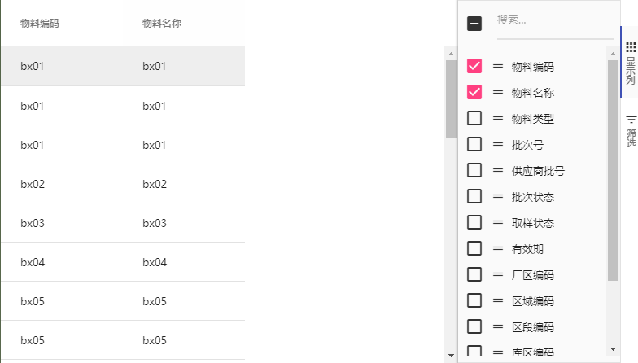
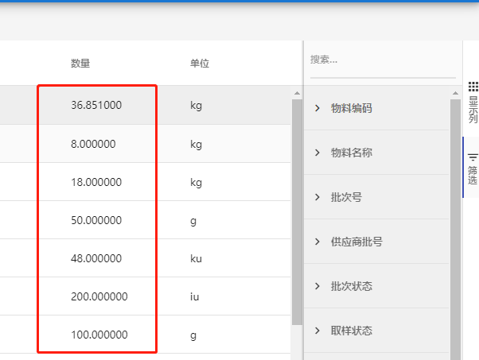

### ag-grid 接口API

> 说明：本文列举了一些 项目中常用的API方法

#### 获取当前呈现在表格中的列

1. getAllDisplayedColumns

- getAllDisplayedColumns() - 用于显示哪些列可以呈现到显示中。由于虚拟化，可能有一些列尚未呈现给DOM，如果您只想要呈现给DOM的列然后使用
- getAllDisplayedVirtualColumns()- 两个函数都显示顺序，因为它们将显示在网页上
    - Column从这些函数返回的对象包含每个列的排序和过滤器属性。


```js
gridOptions.columnApi.getAllDisplayedColumns()
```
如下图所示：ag-grid只勾选 前2列，则getAllDisplayedColumns方法 返回的就是当前显示的2列数据        


使用案例：
```js
let grid = this.$refs.myGrid, gridOptions = grid.gridOptions
let displayColumns = gridOptions.columnApi.getAllDisplayedColumns()
```

详细说明可查看[ag-grid官网](https://www.ag-grid.com/javascript-grid-column-api/)

2. 其它可能有用的功能     
* 可从`gridOptions.columnApi`：
    - getColumnState() - 返回细节少于上述函数的对象 - 只有：aggFunc，colId，hide，pinned，pivotIndex，rowGroupIndex和width
    - setColumnState(columnState)- 这允许您将列设置为隐藏，可见或固定，columnState应该是从哪里返回getColumnState()
* 可从`gridOptions.api`    
    - getSortModel() - 获取当前的排序模型
    - setSortModel(model)- 设置网格的排序模型，model格式应与返回的格式相同getSortModel()
    - getFilterModel() - 获取当前的过滤器模型
    - setFilterModel(model)- 设置网格的过滤器模型，model应该与返回的格式相同getFilterModel()

使用案例：
```js
let grid = this.$refs.myGrid, gridApi = grid.gridApi
let filterModel = gridApi.getFilterModel()
let sortModel = gridApi.getSortModel()
```

3. 处理显示列数据  
在header头列定义中使用`valueFormatter` 处理列数据     

如下图所示，将数量保留到第六位小数点          


代码处理如下：    
```js
// data 定义如下：
const columnDef = [
    {
        headerName: 数量,
        field: 'count',
        filter: 'agNumberColumnFilter',
        valueFormatter: countFormat
    },
    {
        headerName: 单位,
        field: 'unit',
        sortable: false,
        filter: false
    }
]
// 列数据处理方法如下：
function countFormat({data, value}) {
    return value && value.toFixed(6)
}
```

持续更新中......