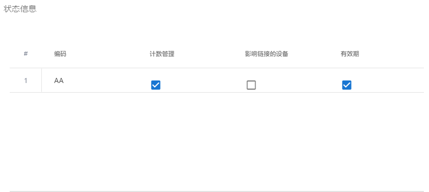

## Cell Render

### 用途
grid的主要作用是用来做单元格呈现。默认情况下，表格使用简单的文本来展示单元格内容。如果想要在grid中展示复杂的html，则需要用到cell renders

### 组件提供接口
组件提供接口如下：
```ts
interface ICellRenderComp {
    init?(params: ICellRenderParans): void; // 可选

    getGui(): HTMLElement; // 返回组件呈现的组件DOM原生，这就是grid显示的内容

    destory?(): void;//可选 

    refresh(params: IcellRendererParams): boolean; // 单元格刷新
}
```
详细描述，请查看[官网](https://www.ag-grid.com/javascript-grid-cell-rendering-components/)

### 案例
下面以vue项目表格中展示checkbox为例进行讲解：

#### 1、增加cell单元格自定义文件
[checkboxRenderer.js](./component/checkboxRenderer.js)文件内容如下：
```js
import Vue from 'vue'

export default Vue.extend({
  template: `
        <v-checkbox v-model="checked" readonly></v-checkbox>
    `,
  data: function() {
    return {
      checked: false
    }
  },
  beforeMount() {},
  mounted() {
    this.checked = this.params.value
  },
  methods: {}
})
```

#### 2、自定义cell的使用
核心代码展示如下：   

```js
<template>
<ag-grid
    :columnDefs="columnDefs"
    :frameworkComponents="frameworkComponents"
    :rowData="rowDatas"
></ag-grid>

</template>
import CheckboxRenderer from './checkboxRenderer'

export default {
    data() {
        return {
            rowDatas:[], // 表格数据
            frameworkComponents: {
                checkboxRenderer: CheckboxRenderer
            },
            columnDefs: [// 列头定义
                {
                    headerName: '计数管理',
                    colId: 'countManager',
                    cellRenderer: 'checkboxRenderer', // ****在grid中使用自定义单元格呈现****
                    field: 'countManager'
                }
            ]
        }
    }
    // 省略其它代码.......
}
```

#### 3、效果展示


