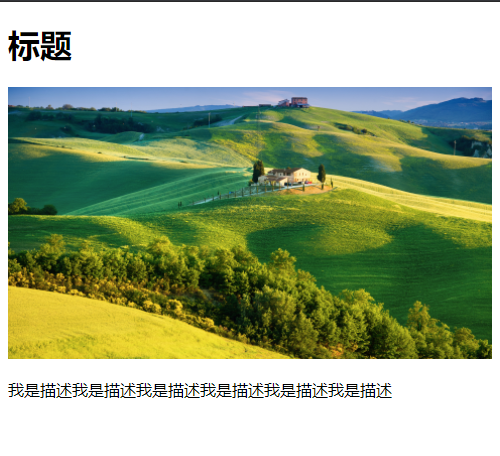

## 构建响应式网站

响应式设计的方法植根于以下三点：

- 灵活的图像和媒体。图像和媒体资源的尺寸是用百分数定义的，从而可以根据环境进行缩放。

- 灵活的、基于网格的布局，也就是流式布局。对于响应式网站， 所有的 width 属性都用百分数设定，因此所有的布局成分都是相对的。其他水平属性通常也会使用相对单位（em、百分数和 rem 等）

- 媒体查询。使用这项技术，可以根据媒体特征（如浏览器可视页面区域的宽度）对设计进行调整。

**可伸缩图像**

1. 对任何想做成可伸缩图像的图像，在 HTML 的 img 标签中省略 width 和 height 属性
2. 在样式表中，为每个想做成可伸缩图的图像应用 max-width: 100%

如下例：

```html
<!DOCTYPE html>
<html lang="en">
  <head>
    <title>test</title>
    <style>
      .post-photo {
        max-width: 100%;
      }
    </style>
  </head>
  <body>
    <div>
      <h1>标题</h1>
      
      <p>我是描述我是描述我是描述我是描述我是描述我是描述</p>
    </div>
  </body>
</html>
```

运行效果如下：  


> 图像会缩放以适应容器！图像缩放的可用空间是由其父元素建立的内容区域。如果父元素有水平方向上的内边距，可用空间就会相应减小

> 一定要使用 max-width: 100% 而不是 width: 100%。它们都能让图像在容器内缩放，不过，width: 100% 会让图像尽可能地填充容器，如果容器的宽度比图像宽，图像就会放大到超过其本来尺寸，有可能会显得较为难看

> 还 可以使用 video, embed, object{ max-width: 100%; } 让 HTML5 视频及其他媒体变成可伸缩的（同样也不要在 HTML 中为它们指定 width 和 height）

**创建弹性布局网格**

1. 案例

首先来看一个案例：为.page div 设置的死板的 width:960px; 被替换为 max-width: 960px;。这让该元素可以进行缩放，但不会超过 960 像素。我用先前提供的公式来确定 main 和.sidebar 的百分数宽度

```
要指定的宽度（以像素为单位）/容器宽度（以像素为单位） = 值
```

结合使用可伸缩图像和弹性布局，便可以让整个页面变得可以缩放

如[下例](./example/test.html)：

```html
<!DOCTYPE html>
<html lang="en">
  <head>
    <title>test</title>
    <style>
      .page {
        max-width: 960px;
        margin: 0 auto;
      }
      .main {
        float: left;
        /* 要求宽度/包含块宽度使用600px/960px */
        width: 62.5%;
      }
      .sidebar {
        float: right;
        width: 31.25%; /* 300px/960px */
      }
      .post-photo {
        max-width: 100%;
      }
    </style>
  </head>
  <body>
    <div class="page">
      <div class="main">
        
      </div>
      <div class="sidebar">
        
      </div>
    </div>
  </body>
</html>
```

运行效果图：


无论页面的视觉区域有多宽，两栏始终保持各自所占的比例。如果可视区域宽度超过 960 像素，页面就停止变宽，如最上面的图所示.

2. 如何创建弹性布局

- 对于需要某个宽度实现预期布局的元素，设置 width: percentage;， 其中 percentage 表示你希望元素在水平方向上占据容器空间的比例（如上例中.main,.sidebar）。通常说来，不必设置 width: 100%;因为默认设置为 display:block; 的元素（如 p 以及其他很多元素）或手动设置为 display: block; 的元素在默认情况下会占据整个可用空间。

- 作为可选的一步，对包含整个页面内容的元素设置 max-width: value;，其中 value 表示你希望页面最多可增长到的最大宽度（参见案例）。通常，value 以像素为单位，不过也可以使用百分数、em 值或其他单位的值。

> 如果父元素有水平方向上的内边距，它为子元素建立的容器就会变小

> 还可以对元素设置基于百分数的 margin 和 padding 值。在示例页面中，我对这些属性使用的是 em 值，这是一种常见的做法。内边距和外边距的 em 值是相对于元素的 font-size 的，而基于百分数的值则是相对于包含元素的容器的

> 对于设置了 body { font-size: 100%;} 的页面，对 font-size、margin、padding 和 max-width 使用 em 值还有一个好处——如果用户更改了浏览器默认字体大小，那么页面也会跟着变大或变小。例如，在 Firefox 中，可以在 Preferences 中的 Content 标签页中更改默认字体大小。

> 将 box-sizing 属性设置为 borderbox，就可以很方便地对拥有水平方向内边距（使用 em 或其他的单位）的元素定义宽度，而不必进行复杂的数学计算来找出百分数的值。这对响应式页面来说很方便

```
设置相对的max-width:

包含整个页面的.page div设置了以像素为单位的max-width（960），参见上图。这个值能否使用灵活的相对单位呢？其实，设置.page {max-width: 60em; } 就可以了。下面是具体的解释：

em 宽度是基于元素字体大小的。例如，如果其字体大小等价于14 像素，则width:10em; 会将宽度设置为140 像素。

.page div 没有指定font-size，因此它从父元素（body 元素）继承。我们知道，body 的默认字体大小通常等于16 像素。因此，如果希望将.page 的最大宽度设为960像素，960/16=60em。

设置.page { max-width: 60em; } 与使用960px 是相似的，但它们有一个显著的不同：前者会根据浏览器默认字体大小进行缩放。

```

**理解和实现媒体查询**

特定媒体类型定位 css 的三种方式：

- 使用 link 元素的 media 属性，位于 head
  ```html
  <head>
    <link rel="stylesheet" href="your-styles.css" media="screen" />
  </head>
  ```
- 样式表中使用 @media 规则
  ```css
  /* 屏幕和打印共用的样式 */
  ...
    /* 只用于打印的样式 */
    @media print {
    header[role="banner"] nav,
    .ad {
      display: none;
    }
  }
  ```
- 使用@import 规则

媒体查询增强了媒体类型方法，允许根据特定的设备特性定位样式。要调整网站的呈现样式，让其适应不同的屏幕尺寸，采用媒体查询特别方便。下面列出了可以包含在媒体查询里的媒体特性。
‰ width（宽度）  
‰ height（高度）  
‰ device-width（设备宽度）  
‰ device-height（设备高度）  
‰ orientation（方向）  
‰ aspect-ratio（高宽比）  
‰ device-aspect-ratio（设备高宽比）  
‰ color（颜色）  
‰ color-index（颜色数）  
‰ monochrome（单色）  
‰ resolution（分辨率）  
‰ scan（扫描）  
‰ grid（栅格）  
还有一些非标准的媒体特性，如  
‰ -webkit-device-pixel-ratio（WebKit① 设备像素比）  
‰ -moz-device-pixel-ratio（Mozilla ② 设备像素比）

除了 orientation、scan 和 grid 以外，上述属性均可添加 min- 和 max- 前缀。min-前缀定位的是“大于等于”对应值的目标，而 max- 前缀定位的则是“小于等于”对应值的目标。

1. 媒体查询语法和示例

- 指向外部样式表的链接：<link rel="stylesheet" media="logic type and (feature: value)" href="your-stylesheet.css" />

- 位于样式表中的媒体查询：
  ```css
  @media logic type and (feature: value) {
    /**目标css样式规则*/
  }
  ```

如下例：

```html
<head>
  <meta charset="utf-8" />
  <title>Media query in link</title>
  <meta name="viewport" content="width=device-width, initial-scale=1.0" />
  <link rel="stylesheet" href="base.css" media="all" />
  <!--
    The logic is only.
    The type is screen.
    The feature: value is min-width: 480px.
    -->
  <link
    rel="stylesheet"
    media="only screen and (min-width: 480px)"
    href="styles-480.css"
  />
</head>
```

示例可以翻译为“仅当媒体类型为 screen 且视觉区域最小宽度为 480 像素时，加载并使用 styles-480.css 中的样式规则”

> base.css 中的样式用于所有的输出设备。styles-480.css 中的样式则仅用于支持媒体查询且视觉区域宽度不低于 480 像素的浏览器

```css
/* 常规样式写在这里。
    每个设备都能获取它们，
    除非被媒体查询中的样式规则覆盖 */
body {
  font: 200%/1.3 sans-serif;
}
p {
  color: green;
}
/*
  The logic is only.
  The type is screen.
  The feature: value is min-width: 480px.
  */
@media only screen and (min-width: 480px) {
  p {
    color: red;
    font-weight: bold;
  }
}
```

示例可以翻译为“仅当媒体类型为 screen 且视觉区域最小宽度为 480 像素时，加载并使用 指定样式规则”

媒体查询语法：

- logic （逻辑）部分是可选的，其值可以是 only 或 not。only 关键字可以确保旧的浏览器不读取余下的媒体查询，同时一并忽略链接的样式表。not 关键字可以对媒体查询的结果求反，让其反面为真。例如，使用 media="not screen" 会在媒体类型为 screen 以外的任何类型时加载样式表。

- type （ 类型） 部分是媒体类型， 如 screen、print 等。

- feature : value 对是可选的，但一旦包含它们，它们必须用括号包围且前面要有**and** 这个字。feature 是预定义的媒体特性， 如 min-width、maxwidth 或者 resolution。对 color、color-index 和 monochrome 特性来说，value 是可选的。

**小结**

通过媒体查询，可以根据设备的媒体属性应用不同的样式。尽管媒体查询包含了很多功能，但其中 min-width 和 max-width 是创建响应式网页时用的最多的。

```html
<head>
  <link
    rel="stylesheet"
    media="only screen and (min-width: 480px) and (max-width: 767px)"
    href="styles.css"
  />
  <link
    rel="stylesheet"
    media="only screen and (orientation: landscape)"
    href="styles.css"
  />
  <link
    rel="stylesheet"
    media="only print and (color)"
    href="color-pages.css"
  />
  <link
    rel="stylesheet"
    media="only print and (monochrome)"
    href="monochrome- pages.css"
  />
  <link
    rel="stylesheet"
    media="only screen and (color), projection and (color)"
    href="styles.css"
  />
</head>
```

### 组合使用

案例代码查看[test2.html](./example/test2.html)

参考：HTML5 与 CSS3 基础教程 -> P251

**构建响应式 web 页面**

1. 创建内容和 HTML
2. 在 HTML 页面的 head 元素中，输入<meta name ="viewport" content="width=device-width" /> 或 <meta name="viewport" content="width-device-width, initial-scale=1" />
3. 创建适用于所有设备的基准样式。确保页面中的图像可伸缩

```css
/* 基准样式----------------------------------- */
body {
  font: 100%/1.2 Georgia, "Times New Roman", serif;
  margin: 0; // .......
}
* {
  /* 盒模型包含内边距和边框 */
  -webkit-box-sizing: border-box;
  -moz-box-sizing: border-box;
  box-sizing: border-box;
}
.page {
  margin: 0 auto;
  max-width: 60em; /* 960px */
}
h1 {
  font-family: "Lato", sans-serif;
  font-size: 2.25em; /* 36px/16px */
  font-weight: 300;
}
.about h2,
.mod h2 {
  font-size: 0.875em; /* 15px/16px */
}
.logo,
.social-sites,
.nav-main li {
  text-align: center;
}
/* 创建可伸缩图像 */
.post-photo,
.post-photo-full,
.about img,
.map {
  max-width: 100%;
}
```

4. 识别出适合你的内容的断点。创建相关的媒体查询，让布局适应从小屏幕到大屏幕的不同可视区域宽度

```css
/* 基准样式----------------------------------- */
/**.................*/
/* 20em (大于等于320px)----------------------------------- */
@media only screen and (min-width: 20em) {
  .nav-main li {
    border-left: 1px solid #c8c8c8;
    display: inline-block;
    text-align: left;
  }
  .nav-main li:first-child {
    border-left: none;
  }
  .nav-main a {
    display: inline-block;
    font-size: 1em;
    padding: 0.5em 0.9em 0.5em 1.15em;
  }
}
```

5. 如果需要为第 4 步中页面的一些内容指定宽度，使用百分数
6. 选择你希望的旧版 IE 显示页面的方式
   对于 IE8（及更早的版本），有三种解决方法：
   - 什么都不做。让网站显示基本的版本
   - 为它们创建一个单独的样式表，让他们显示网站最宽的版本。一种做法是复制一份常规的样式表，将其命名为 old-ie.css 之类的文件名。将媒体查询语句去掉，但保留其中的样式规则。在 HTML 中添加条件注释，从而让不同的浏览器都能找到正确的样式表
   - 如果希望页面有响应式效果就在页面引入 [respond.min.js](./example/js/respond.min.js)。
7. 开始测试
