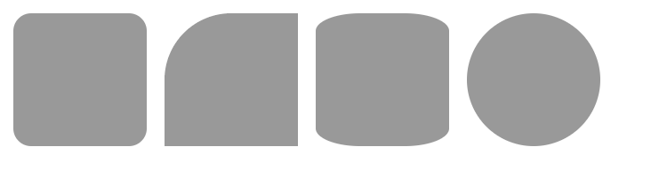
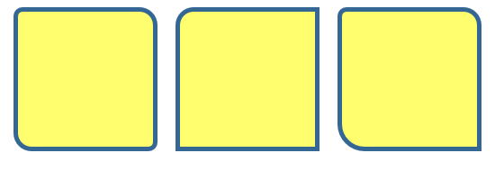
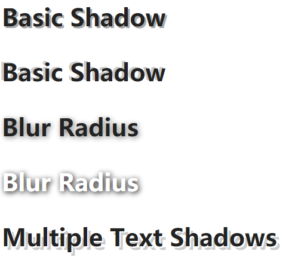
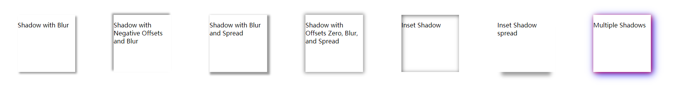
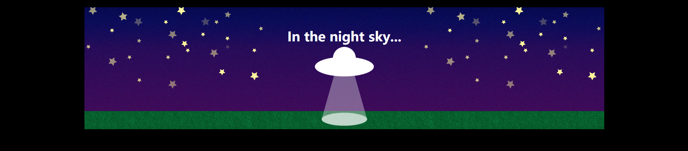
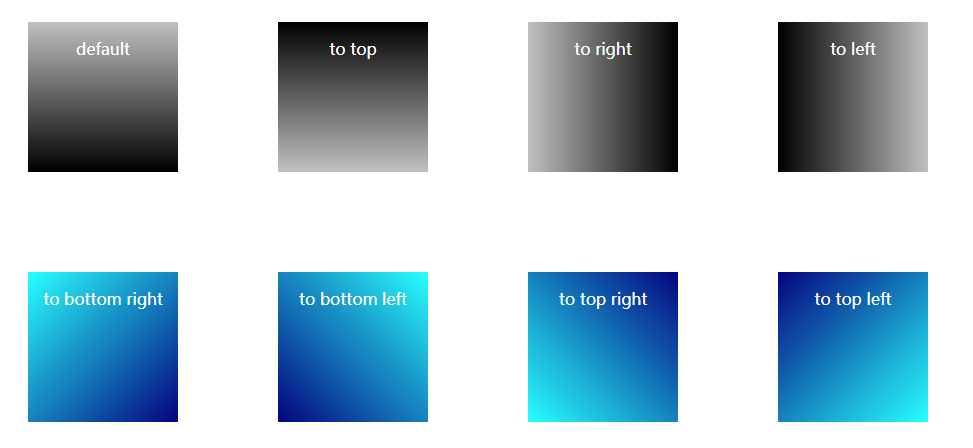
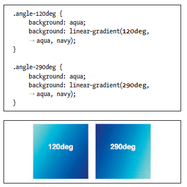
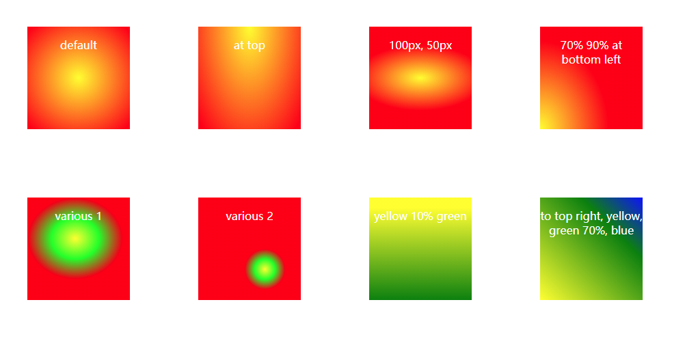
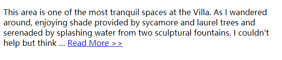

## 使用 css3 进行增强

**为不支持某些属性的浏览器使用 polyfill(又称垫片，shim)**

polyfill 通常使用 javascript 实现，它可以为较弱的浏览器提供一定程度的对 HTML5 和 CSS3 的 API 和属性的支持

### 为元素创建圆角

案例 1：

```html
<!DOCTYPE html>
<html lang="en">
  <head>
    <style>
      div {
        background: #999;
        float: left;
        height: 150px;
        margin: 10px;
        width: 150px;
      }
      .all-corners {
        -webkit-border-radius: 20px;
        border-radius: 20px;
      }
      .one-corner {
        -webkit-border-top-left-radius: 75px;
        border-top-left-radius: 75px;
      }
      .elliptical-corners {
        -webkit-border-radius: 50px / 20px;
        border-radius: 50px / 20px;
      }
      .circle {
        -webkit-border-radius: 50%;
        border-radius: 50%;
      }
    </style>
  </head>
  <body>
    <div class="all-corners"></div>
    <div class="one-corner"></div>
    <div class="elliptical-corners"></div>
    <div class="circle"></div>
  </body>
</html>
```

运行效果：  


```
创建椭圆形圆角

1. 这一步可选， 输入-webkit-borderradius:x /y ，其中x 是圆角在水平方向上的半径大小，y 是圆角在垂直方向上的半径大小，均表示为长度（带单位）

2. 输入border-radius: x /y ，其中x 和y 跟第(1) 步中的值相等


使用border-radius 创建圆形
1. 输入-webkit-border-radius: r ， 这里的r 是元素的半径大小（带长度单位）。要创建圆形，可以使用短形式的语法，r 的值应该等于元素高度或宽度的一半

2.输入border-radius: r ，这里的r 是元素的半径大小（带长度单位），跟第(1) 步中的r 相等

```

案例 2：

```html
<!DOCTYPE html>
<html lang="en">
  <head>
    <style>
      div {
        background: #ff6;
        border: 5px solid #326795;
        float: left;
        height: 150px;
        margin: 10px;
        width: 150px;
      }
      .example-1 {
        /* 将左上方和右下方圆角半径设为10px，右上方和左下方圆角半径设为20px */
        border-radius: 10px 20px;
      }
      .example-2 {
        /* 将左上方圆角半径设为20px，其他圆角半径设为0 */
        border-radius: 20px 0 0;
      }
      .example-3 {
        /* 将左上方圆角半径设为10px，右上方圆角半径设为20px，右下方圆角半径设为0，左下方圆角半径设为30px */
        border-radius: 10px 20px 0 30px;
      }
    </style>
  </head>
  <body>
    <div class="example-1"></div>
    <div class="example-2"></div>
    <div class="example-3"></div>
  </body>
</html>
```

运行效果：


> border-radius 属性值从 左上角->右上角->右下角->左下角 定义

### 为文本添加阴影

案例：

```html
<!DOCTYPE html>
<html lang="en">
  <head>
    <style>
      p {
        color: #222; /* 接近黑色 */
        font-size: 2.5em;
        font-weight: bold;
      }
      .basic {
        text-shadow: 3px 3px #aaa;
      }
      .basic-negative {
        /* 负偏移值 */
        text-shadow: -4px -2px #ccc;
      }
      .blur {
        text-shadow: 2px 2px 10px grey;
      }
      .blur-inversed {
        color: white;
        text-shadow: 2px 2px 10px #000;
      }
      .multiple {
        text-shadow: 2px 2px white, 6px 6px rgba(50, 50, 50, 0.25);
      }
    </style>
  </head>
  <body>
    <p class="basic">Basic Shadow</p>
    <p class="basic-negative">Basic Shadow</p>
    <p class="blur">Blur Radius</p>
    <p class="blur-inversed">Blur Radius</p>
    <p class="multiple">Multiple Text Shadows</p>
  </body>
</html>
```

运行效果：  


**为元素添加阴影**

1. 输入 text-shadow:
2. 分别输入表示 x-offset（水平偏移量）、y-offset（垂直偏移量）、blur-radius（模糊半径）和 color 的值（前三个值带长度单位，四个值之间不用逗号分隔），例如-2px 3px 7px #999（关于允许输入的值，参见提示）。

**为元素文本添加多重阴影**

1. 输入 text-shadow:
2. 分别输入 x-offset、y-offset、blur-radius 和 color 的值（前三个带长度单位，四个值之间不用逗号分隔）。blur-radius 的值是可选的
3. 输入，（逗号）
4. 对四种属性使用不同的值重复第(2) 步。

```
text-shadow 属性接受四个值：带长度单位的x-offset、带长度单位的y-offset、可选的带长度单位的blur-radius以及color值。如果不指定blur-radius， 将假定其值为0


x-offset 和y-offset 值可以是正整数，也可以是负整数，也就是说，1px 和-1px都是有效的。blur-radius 值必须是正整数。这三个值都可以为0。
```

### 为其它元素添加阴影

使用 text-shadow 属性可以为元素的文本添加阴影，使用 box-shadow 属性则可以为元素本身添加阴影。

它们的基础属性集是相同的，不过 box-shadow 还允许使用两个可选的属性——inset 关键字属性和 spread 属性（用于扩张或收缩阴影

box-shadow 属性与 text-shadow 属性的另一个区别是，如果你希望兼容旧版 Android、Mobile Safari 和 Safari 浏览器， 那么 boxshadow 需要加上-webkit- 厂商前缀。

box-shadow 属性接受六个值：带长度单位的 x-offset 和 y-offset、可选的带长度单位的 blur-radius、可选的 inset 关键字、可选的带长度单位的 spread 值及 color 值。如果不指定 blur-radius 和 spread 的值，则设为 0。

案例：

```html
<!DOCTYPE html>
<html lang="en">
  <head>
    <style>
      div {
        background: rgb(255, 255, 255);
        margin: 50px;
        width: 150px;
        height: 150px;
        float: left;
      }
      .shadow {
        -webkit-box-shadow: 4px 4px 5px #999;
        box-shadow: 4px 4px 5px #999;
      }
      .shadow-negative {
        -webkit-box-shadow: -4px -4px 5px #999;
        box-shadow: -4px -4px 5px #999;
      }
      .shadow-spread {
        -webkit-box-shadow: 4px 4px 5px 3px #999;
        box-shadow: 4px 4px 5px 3px #999;
      }
      .shadow-offsets-0 {
        -webkit-box-shadow: 0 0 9px 3px #999;
        box-shadow: 0 0 9px 3px #999;
      }
      .inset-shadow {
        -webkit-box-shadow: 2px 2px 10px #666 inset;
        box-shadow: 2px 2px 10px #666 inset;
      }
      .inset-shadow-spread {
        box-shadow: 0 20px 10px -11px #999;
      }
      .multiple {
        -webkit-box-shadow: 2px 2px 10px rgba(255, 0, 0, 0.75), 5px 5px 20px
            blue;
        box-shadow: 2px 2px 10px rgba(255, 0, 0, 0.75), 5px 5px 20px blue;
      }
    </style>
  </head>
  <body>
    <div class="shadow">
      <p>Shadow with Blur</p>
    </div>
    <div class="shadow-negative">
      <p>Shadow with Negative Offsets and Blur</p>
    </div>
    <div class="shadow-spread">
      <p>Shadow with Blur and Spread</p>
    </div>
    <div class="shadow-offsets-0">
      <p>Shadow with Offsets Zero, Blur, and Spread</p>
    </div>
    <div class="inset-shadow">
      <p>Inset Shadow</p>
    </div>
    <div class="inset-shadow-spread">
      <p>Inset Shadow spread</p>
    </div>
    <div class="multiple">
      <p>Multiple Shadows</p>
    </div>
  </body>
</html>
```

运行效果：  


> Inset Shadow spread 中负的 spread 值会让阴影在元素内进行收缩。为 0 的 x-offset 值意味着阴影不会向左或向右偏离该元素

### 应用多重背景

案例：

```html
<!DOCTYPE html>
<html lang="en">
  <head>
    <style>
      body {
        background: #000;
        color: #fff;
      }

      h1 {
        font-family: sans-serif;
        font-size: 2.25em;
        line-height: 1.1;
        text-align: center;
      }

      /* NOTE: The background-image URLs are different below than 
        in the example shown in the book, because I've placed the images 
        in a sub-folder (called "img"), as is typical when organizing a site. 
        Also, I thought it would be helpful for you to see how to construct 
        your background-image URLs under these circumstances. Note that 
        the URLs are relative to where the style sheet lives, NOT the HTML page 
        that is displaying the image. */

      .night-sky {
        background-color: navy; /* 备用背景颜色 */
        background-image: url(../imgs/ufo.png), url(../imgs/stars.png),
          url(../imgs/stars.png), url(../imgs/sky.png);
        background-position: 50% 102%, 100% -150px, 0 -150px, 50% 100%;
        background-repeat: no-repeat, no-repeat, no-repeat, repeat-x;
        height: 300px;
        margin: 25px auto 0; /* slightly different than book */
        padding-top: 36px;
        width: 75%;
      }
    </style>
  </head>
  <body>
    <div class="night-sky">
      <h1>In the night sky...</h1>
    </div>
  </body>
</html>
```

运行效果：  


支持多重背景的浏览器显示示例的样子。其中，图像是分层次相互重叠在一起的，用逗号分隔的列表中的第一个图像位于顶部

```
background-position: p ，这里的p 是成对的x-offset 和y-offset（可以是正的，也可以是负的；带长度单位或者关键字，如center top）的集合，用逗号分隔。

background-repeat: r ，这里的r 是repeat-x、repeat-y 或no-repeat 值，用逗号分隔
```

另一种写法：

```css
.night-sky {
  /* 备用颜色和图像 */
  background: navy url(ufo.png) no-repeat center bottom;
  background: url(ufo.png) no-repeat 50% 102%, url(stars.png) no-repeat
      100% -150px, url(stars.png) no-repeat 0 -150px, url(sky.png) repeat-x 50%
      100%;
}
```

这与上例中的代码几乎是相同的，只是使用了简记法，而且为 IE8 及其他旧浏览器同时提供了背景颜色和背景图像。

### 使用渐变背景

1. 线性渐变

案例：

```html
<!DOCTYPE html>
<html lang="en">
  <head>
    <style>
      div {
        width: 150px;
        height: 150px;
        margin: 50px;
        float: left;
        color: #fff;
        text-align: center;
      }
      .vertical-down {
        /* 默认 */
        background: silver; /* 备用 */
        background: linear-gradient(silver, black);
      }
      .vertical-up {
        background: silver;
        background: linear-gradient(to top, silver, black);
      }
      .horizontal-rt {
        background: silver;
        background: linear-gradient(to right, silver, black);
      }
      .horizontal-lt {
        background: silver;
        background: linear-gradient(to left, silver, black);
      }

      .diagonal-bot-rt {
        background: aqua;
        background: linear-gradient(to bottom right, aqua, navy);
      }
      .diagonal-bot-lt {
        background: aqua;
        background: linear-gradient(to bottom left, aqua, navy);
      }
      .diagonal-top-rt {
        background: aqua;
        background: linear-gradient(to top right, aqua, navy);
      }
      .diagonal-top-lt {
        background: aqua;
        background: linear-gradient(to top left, aqua, navy);
      }
    </style>
  </head>
  <body>
    <div class="vertical-down">
      <p>default</p>
    </div>
    <div class="vertical-up"><p>to top</p></div>
    <div class="horizontal-rt">
      <p>to right</p>
    </div>
    <div class="horizontal-lt">
      <p>to left</p>
    </div>

    <div class="diagonal-bot-rt">
      <p>to bottom right</p>
    </div>
    <div class="diagonal-bot-lt"><p>to bottom left</p></div>
    <div class="diagonal-top-rt">
      <p>to top right</p>
    </div>
    <div class="diagonal-top-lt">
      <p>to top left</p>
    </div>
  </body>
</html>
```

运行效果：



```
默认情况下，线性渐变是从上往下渐变的，因此在属性值中不需要指定to bottom。

如果要使用相反的方向，则使用to top。渐变会依照指定的方向从银灰色渐变为黑色。

to right 和 to left 指定水平渐变为由左向右渐变还是由右向左渐变

to bottom left/right，to top left/right 指定渐变方向角度的方式。使用关键字指定渐变方向需要旋转的角度。渐变会从跟指定角相对的角（对角线另一端的角）开始

```



```
使用关键字to top/bottom 只能创建沿对角线方向的渐变。第二种方式是指定渐变角度的度数，如90deg（90 度）。数值代表的是圆周上的点的位置：0代表最顶端的点，90代表最左边的点，180 代表最底端的点，270 代表最右边的点。你列出的值决定的是渐变结束的点的位置。因此，0deg等价于to top，90deg 等价于to right，以此类推。
```

2. 径向渐变

案例：

```html
<!DOCTYPE html>
<html lang="en">
  <head>
    <style>
      div {
        width: 150px;
        height: 150px;
        margin: 50px;
        float: left;
        color: #fff;
        text-align: center;
      }
      .radial-center {
        /* 默认 */
        background: red;
        background: radial-gradient(yellow, red);
      }
      .radial-top {
        background: red;
        background: radial-gradient(at top, yellow, red);
      }

      .radial-size-1 {
        background: red;
        background: radial-gradient(100px 50px, yellow, red);
      }
      .radial-size-2 {
        background: red;
        background: radial-gradient(70% 90% at bottom left, yellow, red);
      }

      .radial-various-1 {
        background: red;
        background: radial-gradient(
          closest-side at 70px 60px,
          yellow,
          lime,
          red
        );
      }
      .radial-various-2 {
        background: red;
        background: radial-gradient(30px 30px at 65% 70%, yellow, lime, red);
      }

      .color-stops-1 {
        background: green;
        background: linear-gradient(yellow 10%, green);
      }
      .color-stops-2 {
        background: green;
        background: linear-gradient(to top right, yellow, green 70%, blue);
      }
    </style>
  </head>
  <body>
    <div class="radial-center">
      <p>default</p>
    </div>
    <div class="radial-top"><p>at top</p></div>
    <div class="radial-size-1">
      <p>100px, 50px</p>
    </div>
    <div class="radial-size-2">
      <p>70% 90% at bottom left</p>
    </div>

    <div class="radial-various-1">
      <p>various 1</p>
    </div>
    <div class="radial-various-2"><p>various 2</p></div>
    <div class="color-stops-1">
      <p>yellow 10% green</p>
    </div>
    <div class="color-stops-2">
      <p>to top right, yellow, green 70%, blue</p>
    </div>
  </body>
</html>
```

运行效果：



最简单的例子是默认的样式规则，它使用的参数与线性渐变是一样的。在这个例子中，渐变的原点是元素的中心。可以使用 at top 这样的关键字指定中心的位置。跟往常一样，可以在径向渐变声明之前为较旧的浏览器提供一个背景的定义

### 生成内容的效果

使用:before 和:after 伪元素，结合 content 属性使用，从而创建所谓得生成内容（generated content）。生成内容指的是通过 CSS 创建得内容，而不是由 HTML 生成得。

案例：给 a 链接 增加 >> 标签

```html
<!DOCTYPE html>
<html lang="en">
  <head>
    <style>
      .more:after {
        content: "  >>";
      }
    </style>
  </head>
  <body>
    <p>
      This area is one of the most tranquil spaces at the Villa. As I wandered
      around, enjoying shade provided by sycamore and laurel trees and serenaded
      by splashing water from two sculptural fountains, I couldn't help but
      think &hellip; <a href="victoria.html" class="more"> Read More</a>
    </p>
  </body>
</html>
```

运行效果：

