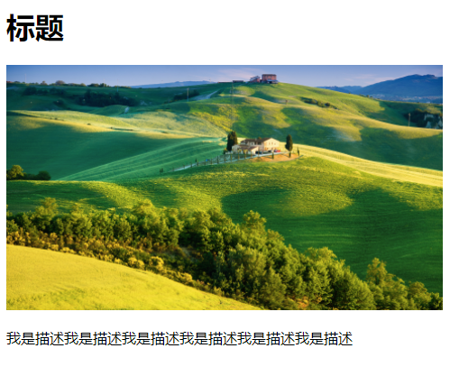
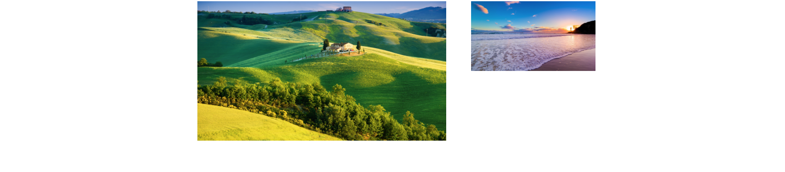

### css 哪些属性会被继承

- 文本
  - color（颜色，a 元素除外）
  - direction（方向）
  - font（字体）
  - font-family（字体系列）
  - font-size（字体大小）
  - font-style（用于设置斜体）
  - font-variant（用于设置小型大写字母）
  - font-weight（用于设置粗体）
  - letter-spacing（字母间距）
  - line-height（行高）
  - text-align（用于设置对齐方式）
  - text-indent（用于设置首行缩进）
  - text-transform（用于修改大小写）
  - visibility（可见性）
  - white-space（用于指定如何处理空格）
  - word-spacing（字间距）
- 列表
  - list-style(列表属性)
  - list-style-image（用于为列表指定定制的标记）
  - list-style-position（用于确定列表标记的位置）
  - list-style-type（用于设置列表的标记）
- 表格
  - border-collapse（用于控制表格相邻单元格的边框是否合并为单一边框）
  - border-spacing（用于指定表格边框之间的空隙大小）
  - caption-side（用于设置表格标题的位置）
  - empty-cells（用于设置是否显示表格中的空单元格）
- 页面设置
  - orphans（用于设置当元素内部发生分页时在页面底部需要保留的最少行数）
  - page-break-inside（用于设置元素内部的分页方式）
  - widows（用于设置当元素内部发生分页时在页面顶部需要保留的最少行数）
- 其它
  - cursor（鼠标指针）
  - quotes（用于指定引号样式）

### 当规则发生冲突时

有时候多条规则会定义元素的同一属性，这时该怎么办？CSS 用层叠的原则来考虑**特殊性（specificity）**、**顺序（order）**和**重要性（importance）**，从而判断相互冲突的规则中哪个规则应该起作用。

1. 特殊性

特殊性规则指定选择器的具体程度。选择器越特殊，规则就越强。遇到冲突时，优先应用特殊性强的规则

2. 顺序

晚出现的优先级高，以下几条解释了顺序如何 决定样式规则的优先级

- 嵌入样式表（位于 style 元素内）与任何链接的外部样式表之间的关系取决于它们在 HTML 中的相对位置。在两者发生冲突时，如果 link 元素在 HTML 代码中出现的早，style 元素就会覆盖链接的样式表；如果 link 出现的晚，其中的样式及包含的任何导入样式就会覆盖 style 元素的规则
- 内联样式（直接应用于元素）在挖补央视和嵌入样式表之后。由于顺序最靠后，其优先级是最高的。一旦应用到任何地方，都会覆盖与之冲突的其它样式。
- 关于相互冲突的样式的顺序对于优先级的影响，有一种例外情况，就是标记!important 的样式总是具有最高的优先级，无论它出现在最前、最后、还是中间。不过尽量避免这种用法。

3. 重要性

如果还不够，可以声明一条特殊的规则覆盖整个系统中的规则，这条规则的重要程度比其它所有规则高。也可以在某条声明的末尾加上**!important**，比如 p{color: orange !important;}（除非特殊情况 ，否则不推荐这种用法。）

4. 小结

你编写的样式会覆盖浏览器的默认样式。当两个或两个以上的样式发生冲突时，会应用特殊性高的样式声明，不管它位于样式表中的哪个位置。如果两个或两个以上的规则拥有相同的特殊性，则使用后出现的规则，除非其中某条规则标记了 !important。

如果某元素没有指定某条规则，则使用继承的值（如果有的话）

### 伪元素、伪类及 CSS3 语法

在 CSS3 中，:first-line 的语法为::first-line，:first-letter 的语法为::firstletter。注意，它们用两个冒号代替了单个冒号。这样修改的目的是将伪元素（有四个，包括::first-line、::first-letter、::before 和::after） 与伪类（ 如:first-child、:link、:hover 等）区分开。

**伪元素（pseudo-element）**是 HTML 中并不存在的元素。例如，定义第一个字母或第一行文字时，并未在 HTML 中作相应的标记。它们是另一个元素（如：p 元素）的部分内容。

相反，**伪类（pseudo-class）**则应用于一组 HTML 元素，而你无需在 HTML 代码中用类标记它们。例如，使用:first-child 可以选择某元素的第一个子元素，你就不用写成 class="first-child"。

未来，::first-line 和::first-letter 这样的双冒号语法是推荐的方式，现代浏览器也支持它们。原始的单冒号语法则被废弃了，但浏览器出于向后兼容的目的，仍然支持它们。不过，IE9 之前的 Internet Explorer 版本均不支持双冒号。因此，你可以选择继续使用单冒号语法，除非你为 IE8 及以下版本设置了单独的 CSS（参见http://reference.sitepoint.com/css/conditionalcomments）。

### 按状态选择链接元素

链接的状态无法从代码中指定，而是由访问者控制的。伪类让你可以获取链接的状态，以改变链接在该状态下的显示效果。

- a:link 设置从未被激活或指向，当前也没有被激活或指向的链接的外观
- a:visited 设置访问者已激活过的链接的外观
- a:focus ，前提是链接通过键盘选择并已准备好激活的
- a:hover，设置光标指向链接时链接的外观
- a:active 设置激活过的链接外观

> 也可以对其它元素使用:active 和:hover 伪类。例如，设置 P:hover{color: red;}以后，鼠标停留在任何段落都会显示红色。

> 由于链接可能同事处于多种状态（如同时处于激活和鼠标停留状态），且晚出现的规则会覆盖前面出现的规则，所以一定要按照下面的属性定义规则：link、visited、focus、hover、avtive（缩写为 LVFHA）

## 使用 CSS 布局

网站设计布局主要有两大类：固定宽度和响应式（流式 fluid 或 liquid 页面，它使用百分数定义宽度，允许页面随显示环境的改变进行放大或缩小）

### 盒模型

盒模型，这里的盒子由内容区域、内容区域周围的空间（内边距，padding）、内边距的外边缘（边框，border）和边框外面将元素与相邻元素隔开的不可见区域（外边距，margin）构成：  


关于 CSS 的 width 属性对元素所显示宽度的影响，有两种处理方式。（不包含任何将其与邻近元素隔开的外边距。）

- 默认的处理方式实际上有些有悖于常理。浏览器中元素的宽度与其 width 属性值并不一致（除非它没有内边距和边框）。CSS 中的宽度指示的是内边距里内容区域的宽度，如上图表示的那样。而元素在浏览器中的显示宽度则是内容宽度、左右内边距和左右边框的总和。显示高度与之类似，只不过计算的是上下内边距和边框值。

- 对大多数代码编写人员来说，另一种方式则更为直观。使用这种方式的话，元素的显示宽度就等于 width 属性的值。内容宽度、内边距和边框都包含在里面（如下图所示）。height 属性与之类似。要使用这种模式，仅需对元素设置 box-sizing: border-box;。


如下例：

```html
<!DOCTYPE html>
<html lang="en">
  <head>
    <title>test</title>
    <style>
      .defaultModel,
      .boxModel {
        width: 300px;
        border: 10px solid #09a149;
        padding: 15px;
        height: 170px;
      }
      .defaultModel {
        background: brown;
      }
      .boxModel {
        box-sizing: border-box;
        background: chartreuse;
      }
    </style>
  </head>
  <body>
    <div class="defaultModel">222</div>
    <br />
    <div class="boxModel">333</div>
  </body>
</html>
```

运行结果：  


两个 div 的 border,padding,width,height 值都相同，第一个 div 是默认盒子模型，第二个是设置了 box-sizing: border-box;的盒模型。第一个要更高更宽，这是由于上下内边距和边框尺寸增加了显示高度。

可以使用* 通配符对所有元素应用 border-box 的规则。当然，也可以单独对元素应用该规则（用你需要的选择器替换* 即可）。带有-webkit- 和-moz- 这些奇怪前缀的属性可以让这些规则在旧的 Android 和 iOS 设备上起作用，同时在 Firefox 上也能正常工作。

```css
* {
  -webkit-box-sizing: border-box;
  -moz-box-sizing: border-box;
  box-sizing: border-box;
}
```

### 元素的显示类型和可见性

1. 显示类型

每个元素在默认情况下要么显示在单独的行（如 h1-h6、p 等）这种称为块级元素，要么显示在行内（如 em、strong、cite 等）这种称为行内元素。 造成这种情况的本质是它们的 display 属性，即块级元素被设置为 display: block；对于 li 元素被设置为 diaplay:list-item，而行内元素被设置为 display:inline;

当然使用 css 可以改变元素的默认显示类型，常见属性值如：

- none 此元素不会被显示

- block 此元素显示为块级元素，此元素前后会带有换行符

- inline 默认。此元素会被显示为内联元素，此元素前后没有换行符

- inline-block 行内块元素

  - 不能为行内元素设置宽高，除非为它们设置 display:inline-block 或 display:block 属性

- list-item 此元素会作为列表显示

- inherit 规定应该从父元素继承 display 属性的值

更多属性，可在[w3c 官网](https://www.w3school.com.cn/css/pr_class_display.asp)查看

2. 可见性

visibility 属性的主要目的是控制元素是否可见。与 diaplay 不同的是，使用 visibility 隐藏元素时，元素及其内容应该出现的位置会留下一片空白区域，隐藏元素的空白区域仍然会在文档流中占据位置。

### 元素浮动

浮动的元素不会影响其父元素的高度

```html
<!DOCTYPE html>
<html lang="en">
  <head>
    <title>test</title>
    <style>
      .left,
      .right {
        width: 300px;
        height: 170px;
      }
      .left {
        float: left;
        background: brown;
      }
      .right {
        float: right;
        background: chartreuse;
      }
    </style>
  </head>
  <body>
    <div class="container">
      <div class="left">222</div>
      <div class="right">333</div>
    </div>
    <footer>footer</footer>
  </body>
</html>
```

运行效果：


故 footer 元素显示在靠近页面顶端的位置，两列内容的父元素高度为 0

解决办法是让容器自身具有清除浮动的能力。最可靠的方法是在样式表中引入.clearfix 的规则，然后为浮动元素的父元素添加 clearfix 类

```css
.clearfix:before,
.clearfix:after {
  content: " ";
  display: table;
}
.clearfix:after {
  clear: both;
}
.clearfix {
  *zoom: 1;
}
```

如上例为 container 添加 clearfix 类后会清除浮动的 left 和 right，从而让容器的高度等于两列中较高的那个，效果图如下：


> footer 增加 clear:both 也可解决浮动问题，但是无法影响容器的高度（容器高度仍然为 0）

> 使用 overflow 创建自清除浮动元素通常，可以对浮动元素的父元素使用 overflow 属性以替代 clearfix 方法（参见图 11.12.8 和图 11.12.9）。例如，在示例页面中可以使用以下代码：

    ```css
    .container {
      overflow: hidden;
    }
    ```
    在某些情况下，overflow: hidden; 会将内容截断，对此要多加注意。有时使用overflow: auto; 也有效，但这样做可能会出现一个滚动条，这显然是我们不希望看到的。有的代码编写人员仅在overflow 能解决float 问题的情况下才使用overflow方法，在其他情况下则使用clearfix 方法。有的代码编写人员则始终使用clearfix 方法。顺便说一下， 可以将clearfix 或overflow 应用到浮动元素的任何一个非父元素的祖先元素。这样做不会让父元素变高，但祖先元素的高度会包含浮动元素。

### 相对定位

每个元素在页面的文档流中都有一个自然位置。相对于这个原始位置对元素进行移动就称为相对定位。周围的元素完全不受此影响。

```html
<!DOCTYPE html>
<html lang="en">
  <head>
    <title>test</title>
    <style></style>
  </head>
  <body>
    <div>
      <h1>Relative Position</h1>
      <p>
        When you position an element relatively, you
        <span class="example"> position it</span> relative to its normal
        location
      </p>
    </div>
  </body>
</html>
```

展示效果：  


如上是一个普通的段落没什么特别的，此时给 p 中 span 加个相对定位

```css
.example {
  position: relative;
  top: 35px;
  left: 100px;
}
```

展示效果：  


偏移自然流中元素的步骤：

1. 输入 position: relative;
2. 输入 top、right、bottom、或 left。

在输入:d，这里的 d 是希望元素从它的自然位置偏移的距离，可以表示为绝对值、相对值或百分数。可正可负。

> 其他元素不会收到偏移的影响，仍然按照这个元素原来的盒子进行排序。设置了相对定位的内容可能与其他内容重叠，这取决于 top、right、bottom 和 left 的值

> 使用相对定位、绝对定位或固定定位时，对于相互重叠的元素，可以用 z-index 属性指定它们的叠放次序。

### 绝对定位

通过对元素进行绝对定位，即指定它们**相对于 body 或最近的已定位祖先元素**的精确位置，可以让元素脱离正常的文档流。

这与相对定位不同，绝对定位的元素不会在原先的位置留下空白。这与元素浮动也不同。对于绝对定位的元素，其它元素不会环绕在它的周围。事实上，其它内容不知道它的存在，它也不知道其它内容的存在。

```html
<!DOCTYPE html>
<html lang="en">
  <head>
    <title>test</title>
    <style>
      .page {
        width: 960px;
        margin: 0 auto;
      }
      .masthead .social-sites {
        position: absolute;
        top: 41px;
        right: 0;
      }
    </style>
  </head>
  <body>
    <div class="page">
      <!-- ==== START MASTHEAD ==== -->
      <header class="masthead" role="banner">
        <p class="logo">
          <a href="/"></a>
        </p>

        <ul class="social-sites">
          <li><a href="http://www.facebook.com">f</a></li>
          <li><a href="http://www.twitter.com">t</a></li>
          <li><a href="http://www.flickr.com">n</a></li>
        </ul>
      </header>
    </div>
  </body>
</html>
```

通过对列表进行绝对定位，我们让它脱离文档流。仅用这段代码还不能实现目的，因为没有另外进行指定的情况下设置 position:absolate 的元素是相对 body 进行定位的，结果如下：


对于包含列表的父元素设置 position: relative，从而让这些图标可以相对父元素（而不是 body）进行绝对定位。这样就可以让图标显示在我们希望他显示的位置

```html
<!DOCTYPE html>
<html lang="en">
  <head>
    <title>test</title>
    <style>
      .page {
        width: 960px;
        margin: 0 auto;
      }
      .masthead {
        position: relative;
      }
      .masthead .social-sites {
        position: absolute;
        top: 41px;
        right: 0;
      }
    </style>
  </head>
  <body>
    <div class="page">
      <!-- ==== START MASTHEAD ==== -->
      <header class="masthead" role="banner">
        <p class="logo">
          <a href="/"></a>
        </p>

        <ul class="social-sites">
          <li><a href="http://www.facebook.com">f</a></li>
          <li><a href="http://www.twitter.com">t</a></li>
          <li><a href="http://www.flickr.com">n</a></li>
        </ul>
      </header>
    </div>
  </body>
</html>
```

效果图:  


### 在栈中定位元素

当你开始使用相对定位、绝对定位和固定定位以后，很可能发现元素相互重叠的情况，这时可以选择哪些元素应该出现在顶层

```html
<!DOCTYPE html>
<html lang="en">
  <head>
    <title>test</title>
    <style>
      div {
        border: 1px solid #666;
        height: 125px;
        position: absolute;
        width: 200px;
      }
      .box1 {
        background: pink;
        left: 110px;
        top: 50px;
        z-index: 120;
      }
      .box2 {
        background: yellow;
        left: 0;
        top: 130px;
        z-index: 530;
      }
      .box3 {
        background: #ccc;
        position: static;
        /* 静态的，没有任何效果 */
        z-index: 1000;
      }
      .box4 {
        background: orange;
        left: 285px;
        top: 65px;
        z-index: 3;
      }
    </style>
  </head>
  <body>
    <div>
      <div class="box1"><p>Box 1</p></div>
      <div class="box2"><p>Box 2</p></div>
      <div class="box3"><p>Box 3</p></div>
      <div class="box4"><p>Box 4</p></div>
    </div>
  </body>
</html>
```

运行效果:  


对于定位元素，z-index 最高的数显示在最上面，不管该元素在 HTML 中出现的次序。第一条规则为所有四个 div 设置了 position:absolute;而定义.box3 时又覆盖了这一规则，让.box3 回到默认的 static。因此， 尽管它的 z-index 值最高，但这没有任何效果，它总是位于最底层(因为它处于常规文档流)

> z-index 属性仅对定位过的元素（即设为绝对定位、相对定位或固定定位的元素）有效。上例中仅包含绝对定位的元素，但实际上可以对绝对定位、相对定位和固定定位的元素混合使用 z-index，z-index 会将它们作为整体进行安排，而不是分别安排。

## 构建响应式网站

响应式设计的方法植根于以下三点：

- 灵活的图像和媒体。图像和媒体资源的尺寸是用百分数定义的，从而可以根据环境进行缩放。

- 灵活的、基于网格的布局，也就是流式布局。对于响应式网站， 所有的 width 属性都用百分数设定，因此所有的布局成分都是相对的。其他水平属性通常也会使用相对单位（em、百分数和 rem 等）

- 媒体查询。使用这项技术，可以根据媒体特征（如浏览器可视页面区域的宽度）对设计进行调整。

**可伸缩图像**

1. 对任何想做成可伸缩图像的图像，在 HTML 的 img 标签中省略 width 和 height 属性
2. 在样式表中，为每个想做成可伸缩图的图像应用 max-width: 100%

如下例：

```html
<!DOCTYPE html>
<html lang="en">
  <head>
    <title>test</title>
    <style>
      .post-photo {
        max-width: 100%;
      }
    </style>
  </head>
  <body>
    <div>
      <h1>标题</h1>
      
      <p>我是描述我是描述我是描述我是描述我是描述我是描述</p>
    </div>
  </body>
</html>
```

运行效果如下：  


> 图像会缩放以适应容器！图像缩放的可用空间是由其父元素建立的内容区域。如果父元素有水平方向上的内边距，可用空间就会相应减小

> 一定要使用 max-width: 100% 而不是 width: 100%。它们都能让图像在容器内缩放，不过，width: 100% 会让图像尽可能地填充容器，如果容器的宽度比图像宽，图像就会放大到超过其本来尺寸，有可能会显得较为难看

> 还 可以使用 video, embed, object{ max-width: 100%; } 让 HTML5 视频及其他媒体变成可伸缩的（同样也不要在 HTML 中为它们指定 width 和 height）

**创建弹性布局网格**

1. 案例

首先来看一个案例：为.page div 设置的死板的 width:960px; 被替换为 max-width: 960px;。这让该元素可以进行缩放，但不会超过 960 像素。我用先前提供的公式来确定 main 和.sidebar 的百分数宽度

```
要指定的宽度（以像素为单位）/容器宽度（以像素为单位） = 值
```

结合使用可伸缩图像和弹性布局，便可以让整个页面变得可以缩放

如[下例](./example/test.html)：

```html
<!DOCTYPE html>
<html lang="en">
  <head>
    <title>test</title>
    <style>
      .page {
        max-width: 960px;
        margin: 0 auto;
      }
      .main {
        float: left;
        /* 要求宽度/包含块宽度使用600px/960px */
        width: 62.5%;
      }
      .sidebar {
        float: right;
        width: 31.25%; /* 300px/960px */
      }
      .post-photo {
        max-width: 100%;
      }
    </style>
  </head>
  <body>
    <div class="page">
      <div class="main">
        
      </div>
      <div class="sidebar">
        
      </div>
    </div>
  </body>
</html>
```

运行效果图：



无论页面的视觉区域有多宽，两栏始终保持各自所占的比例。如果可视区域宽度超过 960 像素，页面就停止变宽，如最上面的图所示.

2. 如何创建弹性布局

- 对于需要某个宽度实现预期布局的元素，设置 width: percentage;， 其中 percentage 表示你希望元素在水平方向上占据容器空间的比例（如上例中.main,.sidebar）。通常说来，不必设置 width: 100%;因为默认设置为 display:block; 的元素（如 p 以及其他很多元素）或手动设置为 display: block; 的元素在默认情况下会占据整个可用空间。

- 作为可选的一步，对包含整个页面内容的元素设置 max-width: value;，其中 value 表示你希望页面最多可增长到的最大宽度（参见案例）。通常，value 以像素为单位，不过也可以使用百分数、em 值或其他单位的值。

> 如果父元素有水平方向上的内边距，它为子元素建立的容器就会变小

> 还可以对元素设置基于百分数的 margin 和 padding 值。在示例页面中，我对这些属性使用的是 em 值，这是一种常见的做法。内边距和外边距的 em 值是相对于元素的 font-size 的，而基于百分数的值则是相对于包含元素的容器的

> 对于设置了 body { font-size: 100%;} 的页面，对 font-size、margin、padding 和 max-width 使用 em 值还有一个好处——如果用户更改了浏览器默认字体大小，那么页面也会跟着变大或变小。例如，在 Firefox 中，可以在 Preferences 中的 Content 标签页中更改默认字体大小。

> 将 box-sizing 属性设置为 borderbox，就可以很方便地对拥有水平方向内边距（使用 em 或其他的单位）的元素定义宽度，而不必进行复杂的数学计算来找出百分数的值。这对响应式页面来说很方便

```
设置相对的max-width:

包含整个页面的.page div设置了以像素为单位的max-width（960），参见上图。这个值能否使用灵活的相对单位呢？其实，设置.page {max-width: 60em; } 就可以了。下面是具体的解释：

em 宽度是基于元素字体大小的。例如，如果其字体大小等价于14 像素，则width:10em; 会将宽度设置为140 像素。

.page div 没有指定font-size，因此它从父元素（body 元素）继承。我们知道，body 的默认字体大小通常等于16 像素。因此，如果希望将.page 的最大宽度设为960像素，960/16=60em。

设置.page { max-width: 60em; } 与使用960px 是相似的，但它们有一个显著的不同：前者会根据浏览器默认字体大小进行缩放。

```

**理解和实现媒体查询**

特定媒体类型定位 css 的三种方式：

- 使用 link 元素的 media 属性，位于 head
  ```html
  <head>
    <link rel="stylesheet" href="your-styles.css" media="screen" />
  </head>
  ```
- 样式表中使用 @media 规则
  ```css
  /* 屏幕和打印共用的样式 */
  ...
    /* 只用于打印的样式 */
    @media print {
    header[role="banner"] nav,
    .ad {
      display: none;
    }
  }
  ```
- 使用@import 规则

媒体查询增强了媒体类型方法，允许根据特定的设备特性定位样式。要调整网站的呈现样式，让其适应不同的屏幕尺寸，采用媒体查询特别方便。下面列出了可以包含在媒体查询里的媒体特性。
‰ width（宽度）  
‰ height（高度）  
‰ device-width（设备宽度）  
‰ device-height（设备高度）  
‰ orientation（方向）  
‰ aspect-ratio（高宽比）  
‰ device-aspect-ratio（设备高宽比）  
‰ color（颜色）  
‰ color-index（颜色数）  
‰ monochrome（单色）  
‰ resolution（分辨率）  
‰ scan（扫描）  
‰ grid（栅格）  
还有一些非标准的媒体特性，如  
‰ -webkit-device-pixel-ratio（WebKit① 设备像素比）  
‰ -moz-device-pixel-ratio（Mozilla ② 设备像素比）

除了 orientation、scan 和 grid 以外，上述属性均可添加 min- 和 max- 前缀。min-前缀定位的是“大于等于”对应值的目标，而 max- 前缀定位的则是“小于等于”对应值的目标。

1. 媒体查询语法和示例

- 指向外部样式表的链接：<link rel="stylesheet" media="logic type and (feature: value)" href="your-stylesheet.css" />

- 位于样式表中的媒体查询：
  ```css
  @media logic type and (feature: value) {
    /**目标css样式规则*/
  }
  ```

如下例：

```html
<head>
  <meta charset="utf-8" />
  <title>Media query in link</title>
  <meta name="viewport" content="width=device-width, initial-scale=1.0" />
  <link rel="stylesheet" href="base.css" media="all" />
  <!--
    The logic is only.
    The type is screen.
    The feature: value is min-width: 480px.
    -->
  <link
    rel="stylesheet"
    media="only screen and (min-width: 480px)"
    href="styles-480.css"
  />
</head>
```

示例可以翻译为“仅当媒体类型为 screen 且视觉区域最小宽度为 480 像素时，加载并使用 styles-480.css 中的样式规则”

> base.css 中的样式用于所有的输出设备。styles-480.css 中的样式则仅用于支持媒体查询且视觉区域宽度不低于 480 像素的浏览器

```css
/* 常规样式写在这里。
    每个设备都能获取它们，
    除非被媒体查询中的样式规则覆盖 */
body {
  font: 200%/1.3 sans-serif;
}
p {
  color: green;
}
/*
  The logic is only.
  The type is screen.
  The feature: value is min-width: 480px.
  */
@media only screen and (min-width: 480px) {
  p {
    color: red;
    font-weight: bold;
  }
}
```

示例可以翻译为“仅当媒体类型为 screen 且视觉区域最小宽度为 480 像素时，加载并使用 指定样式规则”

媒体查询语法：

- logic （逻辑）部分是可选的，其值可以是 only 或 not。only 关键字可以确保旧的浏览器不读取余下的媒体查询，同时一并忽略链接的样式表。not 关键字可以对媒体查询的结果求反，让其反面为真。例如，使用 media="not screen" 会在媒体类型为 screen 以外的任何类型时加载样式表。

- type （ 类型） 部分是媒体类型， 如 screen、print 等。

- feature : value 对是可选的，但一旦包含它们，它们必须用括号包围且前面要有**and** 这个字。feature 是预定义的媒体特性， 如 min-width、maxwidth 或者 resolution。对 color、color-index 和 monochrome 特性来说，value 是可选的。

**小结**

通过媒体查询，可以根据设备的媒体属性应用不同的样式。尽管媒体查询包含了很多功能，但其中 min-width 和 max-width 是创建响应式网页时用的最多的。

```html
<head>
  <link
    rel="stylesheet"
    media="only screen and (min-width: 480px) and (max-width: 767px)"
    href="styles.css"
  />
  <link
    rel="stylesheet"
    media="only screen and (orientation: landscape)"
    href="styles.css"
  />
  <link
    rel="stylesheet"
    media="only print and (color)"
    href="color-pages.css"
  />
  <link
    rel="stylesheet"
    media="only print and (monochrome)"
    href="monochrome- pages.css"
  />
  <link
    rel="stylesheet"
    media="only screen and (color), projection and (color)"
    href="styles.css"
  />
</head>
```

### 组合使用

案例代码查看[test2.html](./example/test2.html)

参考：HTML5 与 CSS3 基础教程 -> P251
