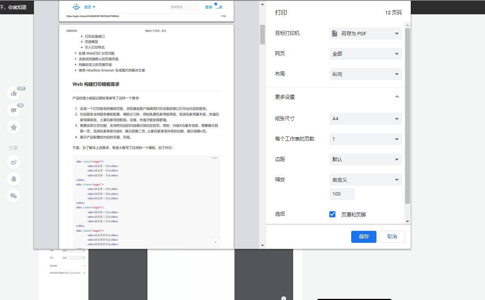
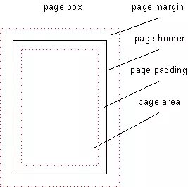
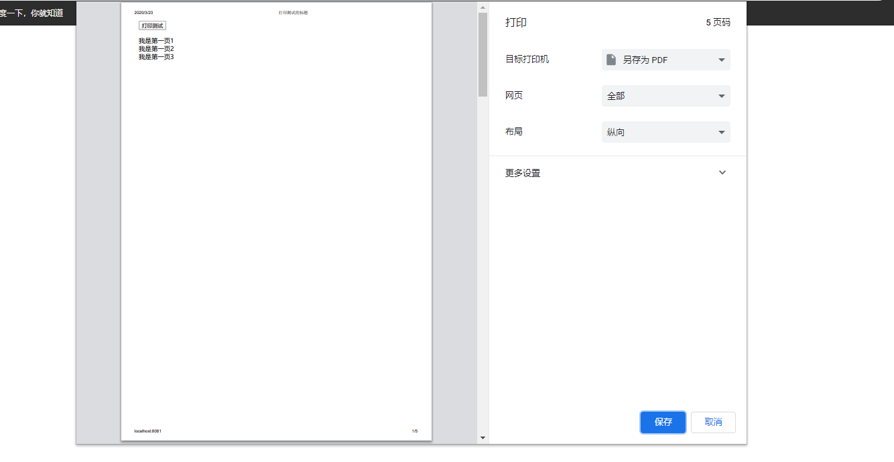
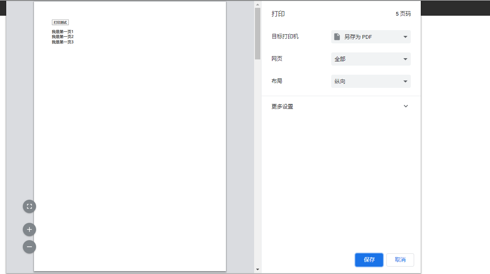

### 基本概念    
浏览器打印是一个很成熟的应用，最简单的打印直接调用window.print()或者是调用document.execCommand('print')。此时，浏览器会弹出打印预览的窗口，通过页面生成了pdf用于打印预览。如图所示，展示了谷歌首页的打印预览：     


### 页面模型    

和 CSS 盒子模型一样，页面盒子模型由外边距 (margin)、边框 (border)、内边距 (padding) 和 内容区域 (content area) 构成：   


有以下两点可以注意：   
- 打印页面时，只打印出页面的内容区域
- 页面默认有页眉页脚信息，展现到页面外边距范围

默认情况下，页面是从左到右、从上到下展示，如果需要更改打印设备的方向，可以通过设置根元素的 direction 和 writing-mode 属性来改变页面方向。

> 那么如何区别横向和纵向的呢？

1. 纸张页面盒子是一个包含长边和短边的矩形。我们通过长边的方向来确定页面的朝向，如果长边是垂直的，我们就说页面是纵向的，反之就是横向。
2. 纵向打印是文档打印以纸的窄边作顶部。 横向打印是文档打印以纸的宽边作顶部。


### @page

设置页面大小（A3, A4, A5）、边距（margin）、方向（auto、landscape、portrait）等。

```css
/**去除页眉*/
@page{
	margin-top: 0;
}

/**去除页脚*/
@page{
	margin-bottom: 0;
}

/**去除页眉 页脚*/
@page{
	margin: 0;
}


@page{
	/**auto(浏览器控制)、landscape（横向）、portrait(竖向)**/
	size: A4 portrait;
	margin: 1cm 3cm;
}
/***需要双面打印的时候，通常会用到，对左页和右页设置不同的样式通过分别设置左页和右页不同的左右页面距，为装订边留出更多的空间*/
@page: left{
	margin-left: 2.5cm;
	margin-right: 2.7cm;
}

@page: right{
	margin-left: 2.7cm;
	margin-right: 2.5cm;
}
```

### 引入打印样式   

可以通过三种方式引入打印样式：   
1. 使用 @media print：   
```css
@media print {
	body {
        background-color:#FFFFFF;
        margin: 0mm;  /* this affects the margin on the content before sending to printer */
    }
    // ...
}
```
2. 内联样式使用media属性：
```html
<style type="text/css" media="print">
</style>
```
3. 在 CSS 中使用 @import：
```css
@import url("print.css") print;
```
4. HTML 中使用的link标签添加media属性：
```html
<link rel="stylesheet" media="print" href="print.css">
```

### 处理 Web打印 分页问题
其实 CSS 早就支持了打印设备里的分页问题了，可以通过设置break-after: page; 或 page-break-after: always;实现在打印设备的分页：   
```css
.page1 {
	break-after: page;
	page-break-after: always;
}
// ...
```

page-break-before( after ) 用于设置元素前( 后 )的分页行为,可取值:

   * auto默认值。如果必要则在元素前插入分页符。
   * always在元素前插入分页符。
   * avoid避免在元素前插入分页符。
   * left在元素之前足够的分页符，一直到一张空白的左页为止。
   * right在元素之前足够的分页符，一直到一张空白的右页为止。
   * inherit规定应该从父元素继承 page-break-before 属性的设置。


```css
thead, tfoot {
    display: table-row-group;
}
thead, tfoot, tr, th, td {
    page-break-inside: avoid;
}

```

page-break-inside设置元素内部的分页行为。取值如下:

   * auto默认。如果必要则在元素内部插入分页符。
   * avoid避免在元素内部插入分页符。
   * inherit规定应该从父元素继承 page-break-inside 属性的设置。
 
orphans设置当元素内部发生分页时必须在页面底部保留的最少行数。

widows设置当元素内部发生分页时必须在页面顶部保留的最少行数。


```
### 去除浏览器默认的页眉页底
实现分页的效果后，发现页面打印会在页底出现当前页面的 url ：    


页面默认有页眉页脚信息，展现到页面外边距范围，通过去除 页面模型 的外边距，使得内容不会延伸到页面的边缘，再通过设置 body 元素的 margin 来保证 A4 纸打印出来的页面带有外边距：   
```css
@media print {
	@page {
		margin: 0;
	}
	body {
		margin: 2cm;
	}
}

```
现在打印出来的页面不再具有默认的页底     


### 构建自定义的页眉页底    
通过将对应的页眉、页底元素的 position 设置为 fixed 可以固定对应节点到页面的任意一部分，它们也将在每个打印页面上重复。    
```css
.header {
	position: fixed;
	top: 0;
}
.footer {
	position: fixed;
	bottom: 0;
}
```

[demo案例](./demo)