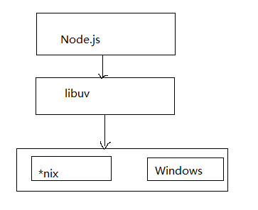
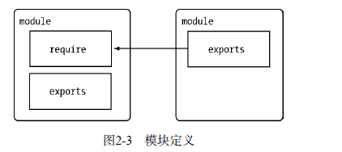
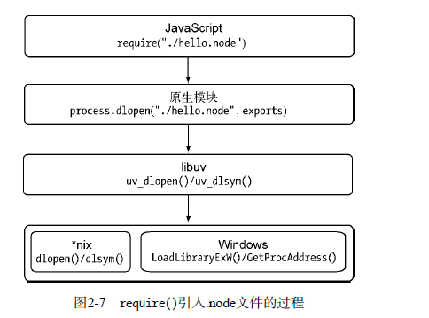
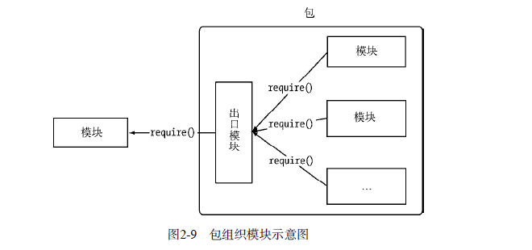

### 1.4 Node 的特点
#### 1.4.1 异步I/O
#### 1.4.2 事件与回调函数
#### 1.4.3 单线程
Node保持了JavaScript在浏览器中单线程的特点。而且在Node中， JavaScript与其余线程是无法共享任何状态的。单线程的最大好处是不用像多线程那样处处在意状态的同步问题，这里没有死锁的存在，也没有线程上下文交换所带来的性能上的开销

同样单线程也有它自身的弱点，这些弱点是学习Node的过程中必须要面对的
	- 无法利用多核CPU
	- 错误会引起整个应用退出，应用的强壮性值得思考
	- 大量计算占用CPU导致无法继续调用异步I/O

像浏览器中JavaScript与UI公用一个线程一样，JavaScript长时间执行会导致UI的渲染和响应被中断。在Node中，长时间的CPU占用也会导致后续的异步I/O发不出调用，已完成的异步I/O的回调函数也会得不到及时执行。

Node采用了与Web worker相同的思路来解决单线程中大计算量的问题：child_process。
子进程的出现，意味着Node可以从容的应对单线程 在健壮性和无法利用多核CPU方面的问题。通过将计算分发到各个子进程，可以将大量计算分解掉， 然后再通过进程之间的事件消息来传递结果，这可以很好的保持应用模型的简单和低依赖。

#### 1.4.4 跨平台
起初，Node只可以在Linux平台上运行。如果想在Windows平台上学习和使用Node， 则必须通过Cygwin或者MinGW。随着Node的发展，微软注意到它的存在，并投入了一个团队帮助Node实现Windows平台的兼容。在V0.6.0版本发布时，Node已经能够直接在Windows平台上运行。下图是Node基于libuv实现跨平台的架构示意图:



兼容Windows和*nix平台主要得益于Node在架构层面的改动，它在操作系统与Node上层模块系统之间构建了一层平台层架构，即libuv。目前，libuv已经成为许多系统实现跨平台的基础组件

### 1.5 Node 的应用场景
在进行技术选型之前，需要了解一项新技术适合什么样的场景，毕竟合适的技术用在合适的场景可以起到意想不到的效果。关于Node，探讨的较多的主要有I/O密集型和CPU密集型。

#### 1.5.1 I/O密集型
在Node推广的过程中，无数次有人问起Node 的应用场景是什么。如果将所有的脚本语言拿到一起来评判，那么从单线程的角度来说，Node处理I/O的能力是值得竖起拇指称赞的。Node面向网络且擅长并行I/O，能够有效地组织起更多的硬件资源，从而提供更好的服务。

I/O密集的优势主要在于Node利用事件循环的处理能力， 而不是启动每一个线程为每一个请求服务，资源占用极少。

#### 1.5.2 是否不擅长CPU密集型业务
换一个角度，在CPU密集的应用场景，Node是否能胜任了？实际上，V8的执行效率是十分高的。单以执行效率做评判，V8的执行效率是毋庸置疑的

关于CPU密集型应用， Node的异步I/O已经解决了在单线程上CPU与I/O之间的阻塞无法重叠利用的问题，I/O阻塞造成的性能浪费元比CPU的影响小。对于长时间运行的计算，如果它的耗时超过普通阻塞I/O的耗时，那么应用场景 就需要重新评估

## 2、 模块机制
### 2.1 CommonJS规范
#### 2.1.2 CommonJs的模块规范
CommonJS对模块的定义十分简单，主要分为模块引用、模块定义和模块标识三个部分。
** 1、 模块引用 **
```js
var math = require('math');
```
在commonjs规范中，存在require()方法，这个方法接受模块标识，以此引入一个模块的API到当前上下文中。
** 2、模块定义**
在模块中， 上下文提供require()方法来引入外部模块。对应引入的功能，上下文提供了exports对象用于导出当前模块的方法或者变量，并且它是唯一导出的出口。在模块中， 还存在一个module对象，它代表模块自身，而exports是module的属性。在Node中，一个文件就是一个模块，将方法挂载在exports对象上作为属性即可定义导出的方式：
```js
// math.js
exports.add = function(){
	var sum = 0, i = 0, args = arguments, l = args.length;
	while(i < l) {
		sum += args[i++];
	}
	return sum;
};
```
在另一个文件中， 我们通过require()方法引入模块后， 就能调用定义的属性或方法：
```js
// program.js
var math = require('math');
exports.increment = function(val) {
	return math.add(val, 1)
}
```
** 3、 模块标识**
模块标识其实就是传递给require()方法的参数， 它必须是符合小驼峰命名的字符串，或者以.、..开头的相对路径，或者绝对路径。它可以没有文件名后缀.js。

模块的定义十分简单，接口也十分简洁。它的意义在于将类聚的方法和变量等限定在私有的作用域中，同时支持引入和导出功能以顺畅的连接上下游依赖。如下图， 每个模块具有独立的空间，它们互不干扰，在引用时 也显得干净利落。


### 2.2 Node的模块实现
Node 在实现中并非完全按照规范实现，而是对模块规范进行了一定的取舍，同时也增加了少许自身需要的特性。尽管规范中exports、require和module听起来十分简单，但是Node在实现它们的过程中究竟经历了什么，这个过程需要知晓；
在Node 中引入模块，需要经历如下3个步骤。
1. 路径分析
2. 文件定位
3. 编译执行

在Node中， 模块分为两类：一类时Node提供的模块，称为核心模块；另一类时用户编写的模块，称为文件模块。
- 核心模块部分在Node源代码的编译过程中，编译进了二进制执行文件。在Node进程启动时，部分核心模块就被直接加载进内存中，所以这部分核心模块引入时，文件定位和编译执行这2个步骤可以省略掉，并且在路径分析中优先判断，所以它的加载速度是最快的。

- 文件模块则是运行时动态加载，需要完整的路径分析、文件定位、编译执行过程，速度比核心模块慢

接下来，展开详细的模块加载过程

#### 2.2.1 优先从缓存加载
**展开介绍路径分析和文件定位之前，我们需要知晓的一点是，与前端浏览器会缓存静态脚本文件以提高性能一样，Node对引入过的模块都会进行缓存，以减少二次引入时的开销。不同的地方在于，浏览器仅仅缓存文件，而Node缓存的时编译和执行之后的对象。**

不论是核心模块还是文件模块，require()方法对相同模块的二次加载都一律采用缓存优先的方式，这是第一优先级的。不同之处在于核心模块的缓存检查先于文件模块的缓存检查。

#### 2.2.2 路径分析和文件定位
因为标识符有几种形式，对于不同的标识符，模块的查找和定位有不同程度上的差异。
**1.模块标识符分析**
require()方法接受一个标识符作为参数。在Node实现中，正是基于这样一个标识符进行模块查找的。标识符在Node中主要分为以下几类。
- 核心模块，如http、fs、path等。
- .或..开始的相对路径文件模块
- 以/开始的绝对路径文件模块。
- 非路径形式的文件模块，如自定义connect模块

**1.1 核心模块**
核心模块的优先级仅次于缓存加载，它在Node的源代码编译过程中已经编译为二进制代码，其加载过程最快。

如果试图加载一个与核心模块标识符相同的自定义模块，那是不会成功的。如果自己编写了一个http用户模块， 想要加载成功，必须选择一个不同的标识符或者换用路径的方式

**1.2 路径形式的文件模块**
以. 、.. 和/ 开始的标识符，这里都被当做文件模块来处理。在分析路径模块时，require()方法 会将路径转换为真实路径，并以真实路径作为索引，将编译执行后的结果存放到缓存中，以使二次加载时更快。

由于文件模块给Node指明了确切的文件位置，所以在查找过程中可以节约大量时间，其加载速度慢于核心模块。

**1.3 自定义模块**
自定义模块指的是非核心模块，也不是路径形式的标识符。它是一种特殊的文件模块，可能是一个文件或者包的形式。这类模块的查找是最费时的，也是所有方式中最慢的一种。

模块路径是Node在定位文件模块的具体文件时制定的查找策略，具体表现为一个路径组成的数组。关于路径组成的数组。关于这个路径的生成规则，可以手动尝试一下。
1. 创建module_path.js 文件，其内容为console.log(module.paths);
2. 将其放到任意一个目录中然后执行node module_path.js

在Linux下，你可能得到的是这样一个数组输出：
```
['/home/jackson/research/node_modules','/home/jackson/node_modules','/home/node_modules','/node_modules']
```

而在Windows下，也许是这样
```
['c:\\nodejs\\node_modules','c:\\node_modules']
```

可以看出，模块路径的生成规则如下：
- 当前文件目录下的node_modules目录
- 父目录下的node_modules目录
- 父目录的父目录下的node_modules目录
- 沿路径向上逐级递归，直到根目录下的node_modules目录

它的生成方式与Javascript的原型链或作用域链的查找方式十分类似。在加载的过程中，Node会逐个尝试模块路径中的路径，直到找到目标文件为止。可以看出，当前文件的路径越深，模块查找耗时会越多，这是自定义模块的加载速度最慢的原因。

##### 2.文件定位
从缓存加载的优化策略使得二次引入时不需要路径分析、文件定位和编译执行的过程，大大提高了再次加载模块时的效率。  
但在文件的定位过程中，还有一些细节需要注意，这主要包括文件扩展名的分析、目录和包的处理

**文件扩展名分析**
require()在分析标识符的过程中，会出现标识符中不包含文件扩展名的情况。CommonJs模块规范也允许在标识符中不包含文件扩展名，Node会按.js、.json、.node的次序补足扩展名，依次尝试。

在尝试的过程中，需要调用fs模块同步阻塞式地判断文件是否存在。因为Node是单线程的，所以这里是一个会引起性能问题的地方。
> 小诀窍：如果是node和json文件，在传递给require()的标识符中带上扩展名，会加快速度。另一个诀窍是：同步配合缓存，可以大幅度缓解Node单线程中阻塞式调用的缺陷

**目录分析和包**
在分析标识符的过程中， require()通过分析文件扩展名之后，可能没有找到对应文件，但却得到一个目录， 这在引入自定义模块和逐个模块路径进行查找时经常会出现，此时Node会将目录当做一个包来处理  
在这个过程中，Node对CommonJs包规范进行了一定程度的支持。首先，Node在当前目录下查找package.js（commonJs包规范定义的包描述文件）。通过JSON.parse()解析出包描述对象，从中取出man属性指定的文件名进行定位。如果文件名缺失扩展名，将会进入扩展名分析的步骤。  
而如果main属性指定的文件名错误，或者压根没有package.json文件，Node会将index当做默认文件名，然后依次查找index.js、index.json、index.node   
如果在目录分析的过程中没有定位成功任何文件，则自定义模块进入下一个模块路径进行查找。如果模块路径数组都便利完毕，依然没有查找到目标文件， 则会抛出查找失败的异常。  


#### 2.2.3 模块编译
在Node中， 每个文件模块都是一个对象，它的定义如下：
```js
function Module(id, parent) {
	this.id = id;
	this.exports = {};
	this.parent = parent;
	if(parent && parent.children) {
		parent.children.push(this)
	}
	thisi.filename = null;
	this.loaded = false;
	this.children = []
}
```
编译和执行是引入文件模块的最后一个阶段。定位到具体的文件后，Node会新建一个模块对象，然后根据路径载入并编译。对于不同的文件扩展名，其载入方法也有所不同，具体如下：
- **js文件**.通过fs模块同步读取文件后编译执行
- **node文件**.这是用C/C++编写的扩展文件，通过dlopen()方法加载最后编译生成的文件
- **json文件**.通过fs模块同步读取文件后，用JSON.parse()解析返回结果。
- **其余扩展名文件**. 它们都被当做.js文件载入

每一个编译成功的模块都会将其文件路径作为索引缓存在Module._cache对象上，以提高二次引入的性能。

根据不同的文件扩展名，Node会调用不同的读取方式，如.json文件的调用如下：
```js
// Native extension for .json
Module._extensions['.json'] = function(module, filename) {
	var content = NativeModule.require('fs').readFileSync(filename, 'utf8');
	try{
		module.exports = JSON.parse(stripBOM(content));
	}catch(err){
		err.message = filename + ': '+ err.message;
		throw err
	}
}

```

其中， Module._extensions会被赋值给require()的extensions属性，所以通过在代码中访问require.extensions可以知道系统中已有的扩展加载方式。编写如下代码测试一下：
```js
console.log(require.extensions);
```
得到的执行结果如下：
```js
{'.js':[FUnction], '.json': [FUnction], '.node': [Function]}
```
在确定文件的扩展名之后， Node将调用的具体编译方式来将文件执行后返回给调用者。   

**1.Javascript模块编译**
回到CommonJs模块规范，我们知道每个模块文件中存在着require、exports、module这3个变量，但是他们在模块文件中并没有定义，那么从何而来呢？甚至在Node的API文档中，我们知道每个模块中还有__filename、__dirname这2个变量的存在，它们又是从何而来的呢？如果我们把直接定义模块的过程放在浏览器端，会存在污染全局变量的情况。  
事实上，在编译的过程中，Node对获取的JavaScript文件内容进行了头尾包装。在头部添加了(function(exports, require, module, __filename, __dirname){\n，在尾部添加了\n});一个正常的Javascript文件会被包装成如下的样子。  
```js
(function(exports, require, module, __filename, __dirname) {
	var math = require('math');
	exports.area = function(radius) {
		return Math.PI * radius * radius;
	};
});
```

这样每个模块文件之间都进行了 作用域隔离。包装之后的代码会通过vm原生模块的runInThisContext()方法执行（类似evaluate，只是具有明确上下文，不污染全局），返回一个具体的function对象。最后， 将当前模块对象的exports属性、require()方法、module（模块对象自身），以及在文件定位中得到的完整文件路径和文件目录作为参数传递给这个function() 执行。

**2. C/C++模块编译**
Node调用process.dlopen()方法进行加载和执行。在Node的架构下，dlopen()方法在Windows和*nix平台下分别有不同的实现，通过libuv兼容层进行了封装。  
实际上，.node的模块文件并不需要编译，因为它是编写C/C++模块之后编译生成的，所以这里只有加载和执行的过程。在执行的过程中，模块的exports对象与.node对象产生联系，然后返回给调用者

**3. JSON文件的编译**
.json文件的编译时3中编译方式中最简单的， Node利用fs模块同步读取JSON文件的内容之后， 调用JSON.parse()方法得到对象，然后将它赋给模块对象的exports,以供外部调用。  
JSON文件在用作项目的配置文件时比较有用。如果你定义了一个JSON文件作为配置，那就不必调用fs模块去异步读取和解析，直接调用require()引入即可，此外，你还可以享受到模块缓存的便利，并且二次引入时也没有性能影响。  


### 2.3 核心模块
Node的核心模块在编译成可执行文件的过程中被编译进了二进制文件。核心模块其实分为C/C++编写的和JavaScript编写的两部分，其中C/C++文件存放在Node项目的src目录下， JavaScript文件存放在lib目录下。

#### 2.3.1 JavaScript核心模块的编译过程
**1. 转存C/C++代码**
Node采用了V8附带的js2c.py工具，将所有内置的JavaScript代码（src/node.js和lib/*.js）转换成C++里的数组，生成node_natives.h头文件  
在这个过程中，JavaScript代码以字符串的形式存储在node命名空间中，是不可直接执行的。在启动Node进程时，JavaScript代码直接加载进内存中。在加载的过程中， JavaScript核心模块经历标识符分析后直接定位到内存中，比普通的文件模块从磁盘中一处一处查找快很多  

**2. 编译JavaScript核心模块**
lib目录下的所有模块文件也没有定义require、module、exports这些变量。在引入JavaScript核心模块的过程中，也经历了头尾包装的过程，然后才执行和导出了exports对象。与文件模块有区别的地方在于：获取源代码的方式（核心模块是从内存中加载的）以及缓存执行结果的位置   
JavsScript核心模块的定义如下面的代码所示，源文件通过process.bind('natives')取出，编译成功的模块缓存到NativeModule._source对象上，文件模块则缓存到Module._cache对象上：
```js
function NativeModule(id) {
	this.filename = id + '.js';
	this.id = id;
	this.exports = {};
	this.loaded = false;
}
NativeModule._source = process.bind('natives');
NativeModule._cache = {};
```

#### 2.3.2 C/C++核心模块的编译过程
在核心模块中，有些模块全部由C/C++编写，有些模块则由C/C++完成核心部分，其它部分则由JavaScript实现包装或向外导出，以满足性能需求。后面这种C++模块主内完成核心，JavaScript主外实现封装的模式是Node能够提高性能的常见方式。通常，脚本语言的开发速度优于静态语言，但是其性能则弱于静态语言。而Node的这种复核模式可以在开发速度和性能之间找到平衡点。

#### 2.3.3 核心模块的引入流程


#### 2.3.4 编写核心模块
核心模块中的JavaScript部分几乎与文件模块的开发相同，遵循CommonJs模块规范，上下文除了拥有require、module、exports外，还可以调用Node中的一些全局变量  
下面我们以C/C++模块为例演示如何编写内建模块。为了便于理解，我们先编写一个极其简单的JavaScript版本的原型，这个方法返回一个Hello World!字符串：
```js
exports.sayHello = function(){
	return 'Hello world!';
}
```
编写内建模块通常分为两步完成：编写头文件和编写C/C++文件。
1、将以下代码保存为node_hello.h，存放到Node的src目录下：
```c
#ifndef NODE_HELLO_H_
#define NODE_HELLO_H_
#include <v8.h>

namespace node {
	// 预定义方法
	v8::Handle<v8::Value> sayHello(const v8:: Arguments&args);
}
#endif
```

2、编写node_hello.cc，并存储到src目录下：
```c
#include <node.h>
#include <node_hello.h>
#include <v8.h>

namespace node{
	using namespace v8;
	Handle<Value> sayHello(const Arguments& args) {
		HandleScope scope;
		return scope.Close(String:: New("Hello world!"));
	}

	// 给传入的目标对象添加sayHello方法
	void Init_Hello(Handle<Object> target) {
		target->set(String::NewSymbol("sayHello"), FUnctionTemplate::New(SayHello)->GetFunction());
	}
}
// 调用NODEMODULE()将注册方式定义到内存中
NODE_MUDULE(node_hello, node::Init_Hello)
```
#### 2.4.4 C/C++扩展模块的加载
得到hello.node结果文件后，如何调用扩展模块 其实在前面已经提及。require()方法通过解析标识符、路径分析、文件定位，然后加载执行即可。下面的代码引入前面编译得到的.node文件，并调用执行其中的方法：
```js
var hellp= require('./build/Release/hello.node');
console.log(hello.sayHello());
```
以上代码存为hello.js，调用node hello.js命令即可得到如下输出结果：  
Hello World!  
对于以.node为扩展名的文件，Node将会调用process.dlopen()方法去加载文件：  
```js
Module._extensions['.node'] = process.dlopen;
```
对于调用者而言，require()是轻松愉快的。对于扩展模块的编写者来说，process.dlopen()中隐含的过程值得了解一番   
如下图，require()在引入.node 文件的过程中，实际上经历了4个层面上的调用。   
加载.node文件实际上经历了两个步骤，第一个步骤是调用uv_dlopen()方法去打开动态链接库，第二个步骤是调用uv_dlsym()方法找到动态链接库中通过NODE_MODULE宏定义的方法地址。这两个过程都是通过libuv库进行封装的：zai*nix平台下实际是调用dlfcn.h头文件中定义的dlopen()和dlsym()两个方法；在Windows平台则是通过LoadLibraryExw()和GetProcAddress()这两个方法实现的， 他们分别加载.so和.dll文件（实际为.node文件）  


### 2.5 模块调用栈
### 2.6 包与NPM
Node组织了自身的核心模块，也使得第三方文件模块可以有序地编写和使用。但是第三方模块中，模块与模块之间仍然是散列在各地的，相互之间不能直接引用。而在模块之外，包和NPM则是将模块联系起来的一种机制。   
JavaScript不似Java或是其它语言那样，具有模块和包结构。Node对模块规范的实现，一定程度上解决了变量依赖、依赖关系等代码组织性问题。包的出现，则是在模块的基础上进一步组织JavaScript代码。  


CommonJs的包规范的定义其实也十分简单，它由包结构和包描述文件两部分组成，前者用于组织保重的各种文件，后者则用于描述包的相关信息，以供外部读取分析。  
#### 2.6.1 包结构
包实际上是一个存档文件，即一个目录直接打包为.zip或tar.gz格式的文件，安装后解压还原为目录。完全符合CommonJs规范的包目录应该包含如下文件。  
- package.json：包描述文件
- bin：用于存放可执行二进制文件的目录
- lib：用于存放JavaScript代码的目录
- doc：用于存放文档目录
- test：用于存放单元测试用例的代码

可以看到，CommonJs包规范从文档、测试等方面都做过考虑。当一个包完成向外公布时，用户看到单元测试和文档的时候，会给他们一种踏实可靠的感觉。  

#### 2.6.2 包描述文件与NPM
包描述文件用于表达非代码相关的信息，它是一个JSON格式的文件--package.json，位于包的根目录下，是包的重要组成部分。而NPM的所有行为都与包描述的字段息息相关。     
CommonJs为package.json文件定义了如下一些必须的字段。  
- name。包名。规范定义它需要由小写的字母和数字组成，可以包含.、_和-，但是不允许出现空格。包名必须是唯一的，以免对外公布时产生重名冲突的误解。除此之外，NPM还建议不要再包名中附带node或js来重复标识它是JavaScript或是Node模块
- deccription。包简介
- version。版本号。一个语义化的版本号，常常用于一些版本控制的场合。
- keywords。关键词数组，NPM中主要用来做分类搜索。一个好的关键词数组有利于用户快速找到你编写的包。
- maintainers。包维护者列表。每个维护者由name、email、和web这3个属性组成。 NPM通过该属性进行权限认证
- contributors 。贡献者列表。
- bugs一个可以反馈bug的网页地址或邮件地址
- licenses 当前包所使用的许可证列表
- repositories 托管源代码的位置列表，表明可以通过哪些方式和地址访问包的源代码。
- dependencies 使用当前包所需要依赖的包列表。这个属性十分重要，NPM会通过这个属性帮助自动加载依赖的包。
除了必选字段外，规范还定义了一部分可选字段
- os操作系统支持列表。这些操作系统的取值包括aix、freebsd、linux、macod、solaris、vxworks、windows。如果设置了列表为空，则不对操作系统做任何假设。
- cpu。CPU架构的支持列表，有效的结构名称有arm、mips、ppc、sparc、x86和x86_64。
- engine。支持的JavaScript引擎列表，有效的引擎取值包括ejs、flusspferd、gpsee、jsc、spidermonkey、narwhal、node和v8
- builtin。标志当前包是否是内建的底层系统的标准组件
- directories 包目录说明
- implements 实现规范的列表
- scripts 脚本说明对象。它主要被包管理器用来安装、编译、测试和卸载包。

在包描述文件的规范中，NPM实际需要的字段主要有name、version、description、keywords、respositories、author、bin、main、scripts、engines、dependencies、devDependencies。   
与包规范的区别在于多了author、bin、main和devDependencies这4个字段
- author。包作者
- bin 一些包作者希望包可以作为命令行工具使用。配置好bin字段后，通过npm install package_name -g 命令可以将脚本添加到执行路径中，之后可以在命令行中直接执行。前面的node-gyp即是这样安装的，通过-g 命令安装的模块包称为全局模式。
- main。模块引入方法require() 在引入包时，会优先检查这个字段。并将其作为保重其余模块的入库。如果不存在这个字段，require() 方法会查找包目录下的index.js、index.node、index.json文件作为默认入口。
- devDependencies。 一些模块只在开发时需要依赖。配置这个属性，可以提示包的后续开发者安装依赖包。

如下是项目的package.json文件  
```json
{
  "name": "express",
  "description": "Sinatra inspired web development framework",
  "version": "3.3.4",
  "author": "TJ Holowaychuk <tj@vision-media.ca>",
  "contributors": [
    {
      "name": "TJ Holowaychuk",
      "email": "tj@vision-media.ca"
    },
    {
      "name": "Aaron Heckmann",
      "email": "aaron.heckmann+github@gmail.com"
    },
    {
      "name": "Ciaran Jessup",
      "email": "ciaranj@gmail.com"
    },
    {
      "name": "Guillermo Rauch",
      "email": "rauchg@gmail.com"
    }
  ],
  "dependencies": {
    "connect": "2.8.4",
    "commander": "1.2.0",
    "range-parser": "0.0.4",
    "mkdirp": "0.3.5",
    "cookie": "0.1.0",
    "buffer-crc32": "0.2.1",
    "fresh": "0.1.0",
    "methods": "0.0.1",
    "send": "0.1.3",
    "cookie-signature": "1.0.1",
    "debug": "*"
  },
  "devDependencies": {
    "ejs": "*",
    "mocha": "*",
    "jade": "0.30.0",
    "hjs": "*",
    "stylus": "*",
    "should": "*",
    "connect-redis": "*",
    "marked": "*",
    "supertest": "0.6.0"
  },
  "keywords": [
    "express",
    "framework",
    "sinatra",
    "web",
    "rest",
    "restful",
    "router",
    "app",
    "api"
  ],
  "repository": "git://github.com/visionmedia/express",
  "main": "index",
  "bin": {
    "express": "./bin/express"
  },
  "scripts": {
    "prepublish": "npm prune",
    "test": "make test"
  },
  "engines": {
    "node": "*"
  }
}
```
#### 2.6.3 NPM常用功能
借助NPM，可以帮助用户快速安装和管理依赖包。  
**1. 查看帮助**
在安装Node之后，执行npm -v命令可以查看当前NPM的版本
```
$ npm -v
6.12.0
```
在不熟悉NPM的命令之前，可以直接执行NPM查看到帮助引导说明
```
npm

Usage: npm <command>

where <command> is one of:
    access, adduser, audit, bin, bugs, c, cache, ci, cit,
    clean-install, clean-install-test, completion, config,
    create, ddp, dedupe, deprecate, dist-tag, docs, doctor,
    edit, explore, get, help, help-search, hook, i, init,
    install, install-ci-test, install-test, it, link, list, ln,
    login, logout, ls, org, outdated, owner, pack, ping, prefix,
    profile, prune, publish, rb, rebuild, repo, restart, root,
    run, run-script, s, se, search, set, shrinkwrap, star,
    stars, start, stop, t, team, test, token, tst, un,
    uninstall, unpublish, unstar, up, update, v, version, view,
    whoami

npm <command> -h  quick help on <command>
npm -l            display full usage info
npm help <term>   search for help on <term>
npm help npm      involved overview

Specify configs in the ini-formatted file:
    C:\Users\jsckontian\.npmrc
or on the command line via: npm <command> --key value
Config info can be viewed via: npm help config

npm@6.12.0 C:\Program Files\nodejs\node_modules\npm

```
可以看到，帮助中列出了所有的命令，其中npm help<command> 可以查看具体的命令说明

**2. 安装依赖包**
安装依赖是NPM最常见的用法，它的执行语句是npm install express。执行该命令后， NPM会在当前目录下创建node_modules目录，然后再node_modules目录下创建express目录，接着将包解压到这个目录下。  
安装好依赖包后， 直接再代码调用require('express'); 即可引入该包，require()方法在做路径分析的时候会通过模块路径查找到express所在的位置。模块引入和包的安装这2个步骤是相辅相成的   

* 全局模式安装
    如果包中含有命令行工具，那么需要执行npm install express -g 命令进行全局模式安装。需要注意的是，全局模式并不是将一个模块包安装为一个全局包的意思，它并不意味着可以从任何地方通过require()来引用到它。

	实际上，-g是将一个包安装为全局可用的可执行命令。它根据包描述文件中的bin字段配置，将实际脚本连接到与Node可执行文件相同的路径下：
	```
    "bin":{
		"express":"./bin/express"
	},
	```
	事实上，通过全局模式安装的所有模块包都被安装进了一个统一的目录下，这个目录可用通过如下方式推算出来：
	```js
	path.resolve(process.execPath, '..','..', 'lib','node_modules')
	```
	如果Node可执行文件的位置是/usr/local/bin/node，那么模块目录就是/usr/local/lib/node_modules。最后通过软连接的方式将bin字段配置的可执行文件链接到Node的可执行目录下。

* 从本地安装
    对于一些没有发布到NPM上的包，或是因为网络原因导致无法直接安装的包，可通过将包下载到本地，然后以本地安装。本地安装只需为NPM指明package.json文件所在的位置即可：它可以是一个包含package.json的存档文件，也可以是一个URL地址，也可以是一个目录下有package.json文件的目录位置。具体参数如下：
	```
	npm install <tarball file>
	npm install <tarball url>
	npm install <folder>
	```
* 从非官方源安装
    如果不能通过官方源安装，可用通过镜像源安装。在执行命令时，添加，--registry=http://registry.url即可，实例如下
	```
	npm install underscore --registry=http://registry.url
	```
	**如果使用过程中几乎都采用镜像源安装，可以执行以下命令指定默认源：**
	```
	npm config set registry http://registry.url
	```

**3.NPM钩子命令**
另一个需要说明的是C/C++模块实际上是编译后才能使用的。package.json中scripts字段的提出就是让包在安装或者卸载的过程中提供钩子机制，实例如下：
```json
"scripts":{
	"preinstall":"preinstall.js",
	"install":"install.js",
	"uninstall":"uninstall.js",
	"test":"test.js"
}
```
在以上字段中执行npm install <package>时，preinstall指向的脚本将会被加载执行，然后install执行的脚本会被执行。在执行npm uninstall <package>时，uninstall 指向的脚本也许会做一些清理工作等。  
当在一个具体的包目录下执行npm test时，将会运行test指向的脚本。一个优秀的包应当包含测试用例，并在package.json文件中配置好运行测试的命令，方便用户运行测试用例，以便检验包是否稳定可靠。

**4. 发布包**
为了将NPM的流程串联起来，这里将演示如何编写一个包，将其发布到NPM仓库中，并通过BOM安装回本地。
+ 编写模块
    模块的内容我们尽量保持简单， 这里还是以sayHello作为例子，相关代码如下：
	```js
	exports.sayHello = function(){
		return 'Hello, world.'
	};
	```
	将这段代码保存为hello.js即可
+ 初始化包描述文件
    package.json文件的内容尽管相对较多，但是实际发布一个包时并不需要一行一行编写。NPM 提供的npm init 命令会帮助你生成package.json文件，具体如下所示：
	```
	PS D:\test> npm init
	This utility will walk you through creating a package.json file.
	It only covers the most common items, and tries to guess sensible defaults.

	See `npm help json` for definitive documentation on these fields
	and exactly what they do.

	Use `npm install <pkg>` afterwards to install a package and
	save it as a dependency in the package.json file.

	Press ^C at any time to quit.
	package name: (test) hello_test_jackson
	version: (1.0.0) 1.0.0
	description: A hello world package
	entry point: (index.js) ./hello.js
	test command:
	git repository:
	keywords: hello world
	author: Jackson
	license: (ISC) MIT
	About to write to D:\test\package.json:

	{
	"name": "hello_test_jackson",
	"version": "1.0.0",
	"description": "A hello world package",
	"main": "./hello.js",
	"scripts": {
		"test": "echo \"Error: no test specified\" && exit 1"
	},
	"keywords": [
		"hello",
		"world"
	],
	"author": "Jackson",
	"license": "MIT"
	}


	Is this OK? (yes) y
	PS D:\test>   
	```
	NPM 通过提问式的交互逐个填入选项，最后生成预览的包描述文件。如果你满意，输入yes，此时会在目录下得到package.json文件。

+ 注册包仓库账号
    为了维护包，NPM必须要使用仓库账号才允许将包发布到仓库中。注册账号的命令时npm adduser。这也是一个提问式的交互过程，按顺序进行即可：
	```
	$ npm adduser
	Username: (jacksontian)
	Email: (shyvo1987@gmail.com)
	```

+ 上传包
    上传包的命令时npm publish <folder> 。在刚刚创建的package.json文件所在的目录下，执行npm publish . 开始上传包，相关代码如下：
	```
	$ npm publish .
	npm http PUT http://registry.npmjs.org/hello_test_jackson
	npm http 201 http://registry.npmjs.org/hello_test_jackson
	npm http GET http://registry.npmjs.org/hello_test_jackson
	npm http 200 http://registry.npmjs.org/hello_test_jackson
	npm http PUT http://registry.npmjs.org/hello_test_jackson/0.0.1/-tag/latest
	npm http 201 http://registry.npmjs.org/hello_test_jackson/0.0.1/-tag/latest
	npm http GET http://registry.npmjs.org/hello_test_jackson
	npm http 200 http://registry.npmjs.org/hello_test_jackson
	npm http PUT
	http://registry.npmjs.org/hello_test_jackson/-/hello_test_jackson-0.0.1.tgz/-rev/2-2d64e0946b86687
	8bb252f182070c1d5
	npm http 201
	http://registry.npmjs.org/hello_test_jackson/-/hello_test_jackson-0.0.1.tgz/-rev/2-2d64e0946b86687
	8bb252f182070c1d5
	+ hello_test_jackson@0.0.1

	```
	在这个过程中， NPM会将目录打包为一个存档文件， 然后上传到官方源仓库中。

+ 安装包
    为了体验和测试自己上传的包，可以换一个目录执行npm install hello_test_jackson安装它

+ 管理包权限
    通常，一个包只有一个人拥有权限进行发布。如果需要多人进行发布，可以使用npm owner 命令帮助你管理包的所有者：
	```
	$ npm owner ls eventproxy
	npm http GET https://registry.npmjs.org/eventproxy
	npm http 200 https://registry.npmjs.org/eventproxy
	jacksontian <shyvo1987@gmail.com>
	```
	使用这个命令，也可以添加包的拥有者，删除一个包的拥有者：
	```
	npm owner ls <package name>
	npm owner add <user> <package name>
	npm owner rm <user> <package name>
	```

**5. 分析包**
在使用NPM 的过程中， 或许你不能确认当前目录下能否通过require()顺利引入想要的包，这时可以执行 npm ls 分析包。  这个命令可以为你分析出当前路径下能够通过模块路径找到的所有包， 并生成依赖树。

#### 2.6.4 局域NPM

#### 2.6.5 NPM潜在问题
确认一个模块质量是否优秀，考察点大致相同。  
+ 具备良好的测试
+ 具备良好的文档（README、API）
+ 具备良好的测试覆盖率
+ 具备良好的编码规范。
+ 更多条件

### 2.7 前后端共用模块
#### 2.7.1 模块的侧重点
前后端JavaScript分别搁置在HTTP的两端，他们扮演的角色并不同。浏览器端的JavaScript需要经历从同一个服务器端分发到多个客户端执行，而服务器端的JavaScript则是相同的代码需要多次执行。前者的瓶颈在于宽带，后者的瓶颈在于CPU和内存等资源。前者需要通过网络加载代码，后者从磁盘中加载，两者的加载速度不在一个数量级上。   

AMD 全称是Asynchronous Module Definition，即是异步模块定义   
#### 2.7.2 AMD规范
AMD 规范是CommonJs模块规范的一个延申，它的模块定义如下：   
define(id?, dependencied?, factory);   
它的模块id和依赖是可选的，与Node模块相似的地方在于factory的内容就是实际代码的内容。下面的代码定义了一个简单的模块：
```js
define(function(){
	var exports = {};
	exports.sayHello = function(){
		alert("Hello from module: " + module.id);
	};
	return exports;
});

```
不同之处在于AMD模块需要用define来明确定义一个模块，而在Node实现中是隐式包装的，它们的目的是进行作用域隔离，仅在需要的时候引入，避免掉过去那种通过全局变量或者全局命名空间的方式，以免变量污染和不小心被修改。另一个区别则是内容需要通过返回的方式实现导出。

#### 2.7.3 CMD规范
CMD规范由国内的玉伯提出，与AMD规范的主要区别在于定义模块和依赖引入的部分。AMD需要在申明模块的时候指定所有的依赖，通过形参依赖到模块内容中：
```js
define(['dep1','dep2'], function(dep1, dep2) {
	return function(){};
})
```
与AMD模块规范相比，CMD模块更接近于Node对CommonJs规范的定义：   
define(factory);

在依赖部分，CMD支持动态引入
```js
define(function(require, exports, module) {
	// The module code goes here
})
```
require、exports和module通过形参传递给模块，在需要依赖模块时，随时调用require()引入即可。  
 
#### 2.7.4 兼容多种模块规范
为了让同一个模块可以运行在前后端，在写作过程中需要考虑兼容前端也实现了模块规范的环境。为了保持前后端的一致性，类库开发者需要将类库代码包装在一个闭包内。以下代码演示如何将Hello()方法定义到不同的运行环境中，它能够兼容Node、AMD、CMD以及常见的浏览器环境中：
```js
;(function (name, definition) {
	// 检测上下文环境是否为AMD或CMD
	var hasDefine = typeof define === 'function',
	// 检查上下文环境是否为Node
	hasExports = typeof module !== 'undefined' && module.exports;
if (hasDefine) {
	// AMD环境或CMD环境
	define(definition);
} else if (hasExports) {
	// 定义为普通Node模块
	module.exports = definition();
} else {
	// 将模块的执行结果在window变量中，在浏览器中this指向window对象
	this[name] = definition();
}
})('hello', function () {
	var hello = function () {};
	return hello;
});
```


