读书笔记知识点记录：

### 1.4 Node 的特点
#### 1.4.1 异步I/O
#### 1.4.2 事件与回调函数
#### 1.4.3 单线程
Node保持了JavaScript在浏览器中单线程的特点。而且在Node中， JavaScript与其余线程是无法共享任何状态的。单线程的最大好处是不用像多线程那样处处在意状态的同步问题，这里没有死锁的存在，也没有线程上下文交换所带来的性能上的开销

同样单线程也有它自身的弱点，这些弱点是学习Node的过程中必须要面对的
	- 无法利用多核CPU
	- 错误会引起整个应用退出，应用的强壮性值得思考
	- 大量计算占用CPU导致无法继续调用异步I/O

像浏览器中JavaScript与UI公用一个线程一样，JavaScript长时间执行会导致UI的渲染和响应被中断。在Node中，长时间的CPU占用也会导致后续的异步I/O发不出调用，已完成的异步I/O的回调函数也会得不到及时执行。

Node采用了与Web worker相同的思路来解决单线程中大计算量的问题：child_process。
子进程的出现，意味着Node可以从容的应对单线程 在健壮性和无法利用多核CPU方面的问题。通过将计算分发到各个子进程，可以将大量计算分解掉， 然后再通过进程之间的事件消息来传递结果，这可以很好的保持应用模型的简单和低依赖。

#### 1.4.4 跨平台
起初，Node只可以在Linux平台上运行。如果想在Windows平台上学习和使用Node， 则必须通过Cygwin或者MinGW。随着Node的发展，微软注意到它的存在，并投入了一个团队帮助Node实现Windows平台的兼容。在V0.6.0版本发布时，Node已经能够直接在Windows平台上运行。下图是Node基于libuv实现跨平台的架构示意图:


兼容Windows和*nix平台主要得益于Node在架构层面的改动，它在操作系统与Node上层模块系统之间构建了一层平台层架构，即libuv。目前，libuv已经成为许多系统实现跨平台的基础组件

### 1.5 Node 的应用场景
在进行技术选型之前，需要了解一项新技术适合什么样的场景，毕竟合适的技术用在合适的场景可以起到意想不到的效果。关于Node，探讨的较多的主要有I/O密集型和CPU密集型。

#### 1.5.1 I/O密集型
在Node推广的过程中，无数次有人问起Node 的应用场景是什么。如果将所有的脚本语言拿到一起来评判，那么从单线程的角度来说，Node处理I/O的能力是值得竖起拇指称赞的。Node面向网络且擅长并行I/O，能够有效地组织起更多的硬件资源，从而提供更好的服务。

I/O密集的优势主要在于Node利用事件循环的处理能力， 而不是启动每一个线程为每一个请求服务，资源占用极少。

#### 1.5.2 是否不擅长CPU密集型业务
换一个角度，在CPU密集的应用场景，Node是否能胜任了？实际上，V8的执行效率是十分高的。单以执行效率做评判，V8的执行效率是毋庸置疑的

关于CPU密集型应用， Node的异步I/O已经解决了在单线程上CPU与I/O之间的阻塞无法重叠利用的问题，I/O阻塞造成的性能浪费元比CPU的影响小。对于长时间运行的计算，如果它的耗时超过普通阻塞I/O的耗时，那么应用场景 就需要重新评估

## 2、 模块机制
### 2.1 CommonJS规范
#### 2.1.2 CommonJs的模块规范
CommonJS对模块的定义十分简单，主要分为模块引用、模块定义和模块标识三个部分。
** 1、 模块引用 **
```js
var math = require('math');
```
在commonjs规范中，存在require()方法，这个方法接受模块标识，以此引入一个模块的API到当前上下文中。
** 2、模块定义**
在模块中， 上下文提供require()方法来引入外部模块。对应引入的功能，上下文提供了exports对象用于导出当前模块的方法或者变量，并且它是唯一导出的出口。在模块中， 还存在一个module对象，它代表模块自身，而exports是module的属性。在Node中，一个文件就是一个模块，将方法挂载在exports对象上作为属性即可定义导出的方式：
```js
// math.js
exports.add = function(){
	var sum = 0, i = 0, args = arguments, l = args.length;
	while(i < l) {
		sum += args[i++];
	}
	return sum;
};
```
在另一个文件中， 我们通过require()方法引入模块后， 就能调用定义的属性或方法：
```js
// program.js
var math = require('math');
exports.increment = function(val) {
	return math.add(val, 1)
}
```
** 3、 模块标识**
模块标识其实就是传递给require()方法的参数， 它必须是符合小驼峰命名的字符串，或者以.、..开头的相对路径，或者绝对路径。它可以没有文件名后缀.js。

模块的定义十分简单，接口也十分简洁。它的意义在于将类聚的方法和变量等限定在私有的作用域中，同时支持引入和导出功能以顺畅的连接上下游依赖。如下图， 每个模块具有独立的空间，它们互不干扰，在引用时 也显得干净利落。


### 2.2 Node的模块实现
Node 在实现中并非完全按照规范实现，而是对模块规范进行了一定的取舍，同时也增加了少许自身需要的特性。尽管规范中exports、require和module听起来十分简单，但是Node在实现它们的过程中究竟经历了什么，这个过程需要知晓；
在Node 中引入模块，需要经历如下3个步骤。
1. 路径分析
2. 文件定位
3. 编译执行

在Node中， 模块分为两类：一类时Node提供的模块，称为核心模块；另一类时用户编写的模块，称为文件模块。
- 核心模块部分在Node源代码的编译过程中，编译进了二进制执行文件。在Node进程启动时，部分核心模块就被直接加载进内存中，所以这部分核心模块引入时，文件定位和编译执行这2个步骤可以省略掉，并且在路径分析中优先判断，所以它的加载速度是最快的。

- 文件模块则是运行时动态加载，需要完整的路径分析、文件定位、编译执行过程，速度比核心模块慢

接下来，展开详细的模块加载过程

#### 2.2.1 优先从缓存加载
**展开介绍路径分析和文件定位之前，我们需要知晓的一点是，与前端浏览器会缓存静态脚本文件以提高性能一样，Node对引入过的模块都会进行缓存，以减少二次引入时的开销。不同的地方在于，浏览器仅仅缓存文件，而Node缓存的时编译和执行之后的对象。**

不论是核心模块还是文件模块，require()方法对相同模块的二次加载都一律采用缓存优先的方式，这是第一优先级的。不同之处在于核心模块的缓存检查先于文件模块的缓存检查。

#### 2.2.2 路径分析和文件定位
因为标识符有几种形式，对于不同的标识符，模块的查找和定位有不同程度上的差异。
**1.模块标识符分析**
require()方法接受一个标识符作为参数。在Node实现中，正是基于这样一个标识符进行模块查找的。标识符在Node中主要分为以下几类。
- 核心模块，如http、fs、path等。
- .或..开始的相对路径文件模块
- 以/开始的绝对路径文件模块。
- 非路径形式的文件模块，如自定义connect模块

**1.1 核心模块**
核心模块的优先级仅次于缓存加载，它在Node的源代码编译过程中已经编译为二进制代码，其加载过程最快。

如果试图加载一个与核心模块标识符相同的自定义模块，那是不会成功的。如果自己编写了一个http用户模块， 想要加载成功，必须选择一个不同的标识符或者换用路径的方式

**1.2 路径形式的文件模块**
以. 、.. 和/ 开始的标识符，这里都被当做文件模块来处理。在分析路径模块时，require()方法 会将路径转换为真实路径，并以真实路径作为索引，将编译执行后的结果存放到缓存中，以使二次加载时更快。

由于文件模块给Node指明了确切的文件位置，所以在查找过程中可以节约大量时间，其加载速度慢于核心模块。

**1.3 自定义模块**
自定义模块指的是非核心模块，也不是路径形式的标识符。它是一种特殊的文件模块，可能是一个文件或者包的形式。这类模块的查找是最费时的，也是所有方式中最慢的一种。

模块路径是Node在定位文件模块的具体文件时制定的查找策略，具体表现为一个路径组成的数组。关于路径组成的数组。关于这个路径的生成规则，可以手动尝试一下。
1. 创建module_path.js 文件，其内容为console.log(module.paths);
2. 将其放到任意一个目录中然后执行node module_path.js

在Linux下，你可能得到的是这样一个数组输出：
```
['/home/jackson/research/node_modules','/home/jackson/node_modules','/home/node_modules','/node_modules']
```

而在Windows下，也许是这样
```
['c:\\nodejs\\node_modules','c:\\node_modules']
```

可以看出，模块路径的生成规则如下：
- 当前文件目录下的node_modules目录
- 父目录下的node_modules目录
- 父目录的父目录下的node_modules目录
- 沿路径向上逐级递归，直到根目录下的node_modules目录

它的生成方式与Javascript的原型链或作用域链的查找方式十分类似。在加载的过程中，Node会逐个尝试模块路径中的路径，直到找到目标文件为止。可以看出，当前文件的路径越深，模块查找耗时会越多，这是自定义模块的加载速度最慢的原因。

##### 2.文件定位
从缓存加载的优化策略使得二次引入时不需要路径分析、文件定位和编译执行的过程，大大提高了再次加载模块时的效率。  
但在文件的定位过程中，还有一些细节需要注意，这主要包括文件扩展名的分析、目录和包的处理

**文件扩展名分析**
require()在分析标识符的过程中，会出现标识符中不包含文件扩展名的情况。CommonJs模块规范也允许在标识符中不包含文件扩展名，Node会按.js、.json、.node的次序补足扩展名，依次尝试。

在尝试的过程中，需要调用fs模块同步阻塞式地判断文件是否存在。因为Node是单线程的，所以这里是一个会引起性能问题的地方。
> 小诀窍：如果是node和json文件，在传递给require()的标识符中带上扩展名，会加快速度。另一个诀窍是：同步配合缓存，可以大幅度缓解Node单线程中阻塞式调用的缺陷

**目录分析和包**
在分析标识符的过程中， require()通过分析文件扩展名之后，可能没有找到对应文件，但却得到一个目录， 这在引入自定义模块和逐个模块路径进行查找时经常会出现，此时Node会将目录当做一个包来处理  
在这个过程中，Node对CommonJs包规范进行了一定程度的支持。首先，Node在当前目录下查找package.js（commonJs包规范定义的包描述文件）。通过JSON.parse()解析出包描述对象，从中取出man属性指定的文件名进行定位。如果文件名缺失扩展名，将会进入扩展名分析的步骤。  
而如果main属性指定的文件名错误，或者压根没有package.json文件，Node会将index当做默认文件名，然后依次查找index.js、index.json、index.node   
如果在目录分析的过程中没有定位成功任何文件，则自定义模块进入下一个模块路径进行查找。如果模块路径数组都便利完毕，依然没有查找到目标文件， 则会抛出查找失败的异常。  


#### 2.2.3 模块编译
在Node中， 每个文件模块都是一个对象，它的定义如下：
```js
function Module(id, parent) {
	this.id = id;
	this.exports = {};
	this.parent = parent;
	if(parent && parent.children) {
		parent.children.push(this)
	}
	thisi.filename = null;
	this.loaded = false;
	this.children = []
}
```
编译和执行是引入文件模块的最后一个阶段。定位到具体的文件后，Node会新建一个模块对象，然后根据路径载入并编译。对于不同的文件扩展名，其载入方法也有所不同，具体如下：
- **js文件**.通过fs模块同步读取文件后编译执行
- **node文件**.这是用C/C++编写的扩展文件，通过dlopen()方法加载最后编译生成的文件
- **json文件**.通过fs模块同步读取文件后，用JSON.parse()解析返回结果。
- **其余扩展名文件**. 它们都被当做.js文件载入

每一个编译成功的模块都会将其文件路径作为索引缓存在Module._cache对象上，以提高二次引入的性能。

根据不同的文件扩展名，Node会调用不同的读取方式，如.json文件的调用如下：
```js
// Native extension for .json
Module._extensions['.json'] = function(module, filename) {
	var content = NativeModule.require('fs').readFileSync(filename, 'utf8');
	try{
		module.exports = JSON.parse(stripBOM(content));
	}catch(err){
		err.message = filename + ': '+ err.message;
		throw err
	}
}

```

其中， Module._extensions会被赋值给require()的extensions属性，所以通过在代码中访问require.extensions可以知道系统中已有的扩展加载方式。编写如下代码测试一下：
```js
console.log(require.extensions);
```
得到的执行结果如下：
```js
{'.js':[FUnction], '.json': [FUnction], '.node': [Function]}
```
在确定文件的扩展名之后， Node将调用的具体编译方式来将文件执行后返回给调用者。   

**1.Javascript模块编译**
回到CommonJs模块规范，我们知道每个模块文件中存在着require、exports、module这3个变量，但是他们在模块文件中并没有定义，那么从何而来呢？甚至在Node的API文档中，我们知道每个模块中还有__filename、__dirname这2个变量的存在，它们又是从何而来的呢？如果我们把直接定义模块的过程放在浏览器端，会存在污染全局变量的情况。  
事实上，在编译的过程中，Node对获取的JavaScript文件内容进行了头尾包装。在头部添加了(function(exports, require, module, __filename, __dirname){\n，在尾部添加了\n});一个正常的Javascript文件会被包装成如下的样子。  
```js
(function(exports, require, module, __filename, __dirname) {
	var math = require('math');
	exports.area = function(radius) {
		return Math.PI * radius * radius;
	};
});
```

这样每个模块文件之间都进行了 作用域隔离。包装之后的代码会通过vm原生模块的runInThisContext()方法执行（类似evaluate，只是具有明确上下文，不污染全局），返回一个具体的function对象。最后， 将当前模块对象的exports属性、require()方法、module（模块对象自身），以及在文件定位中得到的完整文件路径和文件目录作为参数传递给这个function() 执行。

**2. C/C++模块编译**
Node调用process.dlopen()方法进行加载和执行。在Node的架构下，dlopen()方法在Windows和*nix平台下分别有不同的实现，通过libuv兼容层进行了封装。  
实际上，.node的模块文件并不需要编译，因为它是编写C/C++模块之后编译生成的，所以这里只有加载和执行的过程。在执行的过程中，模块的exports对象与.node对象产生联系，然后返回给调用者

**3. JSON文件的编译**
.json文件的编译时3中编译方式中最简单的， Node利用fs模块同步读取JSON文件的内容之后， 调用JSON.parse()方法得到对象，然后将它赋给模块对象的exports,以供外部调用。  
JSON文件在用作项目的配置文件时比较有用。如果你定义了一个JSON文件作为配置，那就不必调用fs模块去异步读取和解析，直接调用require()引入即可，此外，你还可以享受到模块缓存的便利，并且二次引入时也没有性能影响。  


### 2.3 核心模块
Node的核心模块在编译成可执行文件的过程中被编译进了二进制文件。核心模块其实分为C/C++编写的和JavaScript编写的两部分，其中C/C++文件存放在Node项目的src目录下， JavaScript文件存放在lib目录下。

#### 2.3.1 JavaScript核心模块的编译过程
**1. 转存C/C++代码**
Node采用了V8附带的js2c.py工具，将所有内置的JavaScript代码（src/node.js和lib/*.js）转换成C++里的数组，生成node_natives.h头文件  
在这个过程中，JavaScript代码以字符串的形式存储在node命名空间中，是不可直接执行的。在启动Node进程时，JavaScript代码直接加载进内存中。在加载的过程中， JavaScript核心模块经历标识符分析后直接定位到内存中，比普通的文件模块从磁盘中一处一处查找快很多  

**2. 编译JavaScript核心模块**
lib目录下的所有模块文件也没有定义require、module、exports这些变量。在引入JavaScript核心模块的过程中，也经历了头尾包装的过程，然后才执行和导出了exports对象。与文件模块有区别的地方在于：获取源代码的方式（核心模块是从内存中加载的）以及缓存执行结果的位置   
JavsScript核心模块的定义如下面的代码所示，源文件通过process.bind('natives')取出，编译成功的模块缓存到NativeModule._source对象上，文件模块则缓存到Module._cache对象上：
```js
function NativeModule(id) {
	this.filename = id + '.js';
	this.id = id;
	this.exports = {};
	this.loaded = false;
}
NativeModule._source = process.bind('natives');
NativeModule._cache = {};
```

#### 2.3.2 C/C++核心模块的编译过程
在核心模块中，有些模块全部由C/C++编写，有些模块则由C/C++完成核心部分，其它部分则由JavaScript实现包装或向外导出，以满足性能需求。后面这种C++模块主内完成核心，JavaScript主外实现封装的模式是Node能够提高性能的常见方式。通常，脚本语言的开发速度优于静态语言，但是其性能则弱于静态语言。而Node的这种复核模式可以在开发速度和性能之间找到平衡点。

#### 2.3.3 核心模块的引入流程


#### 2.3.4 编写核心模块
核心模块中的JavaScript部分几乎与文件模块的开发相同，遵循CommonJs模块规范，上下文除了拥有require、module、exports外，还可以调用Node中的一些全局变量  
下面我们以C/C++模块为例演示如何编写内建模块。为了便于理解，我们先编写一个极其简单的JavaScript版本的原型，这个方法返回一个Hello World!字符串：
```js
exports.sayHello = function(){
	return 'Hello world!';
}
```
编写内建模块通常分为两步完成：编写头文件和编写C/C++文件。
1、将以下代码保存为node_hello.h，存放到Node的src目录下：
```c
#ifndef NODE_HELLO_H_
#define NODE_HELLO_H_
#include <v8.h>

namespace node {
	// 预定义方法
	v8::Handle<v8::Value> sayHello(const v8:: Arguments&args);
}
#endif
```

2、编写node_hello.cc，并存储到src目录下：
```c
#include <node.h>
#include <node_hello.h>
#include <v8.h>

namespace node{
	using namespace v8;
	Handle<Value> sayHello(const Arguments& args) {
		HandleScope scope;
		return scope.Close(String:: New("Hello world!"));
	}

	// 给传入的目标对象添加sayHello方法
	void Init_Hello(Handle<Object> target) {
		target->set(String::NewSymbol("sayHello"), FUnctionTemplate::New(SayHello)->GetFunction());
	}
}
// 调用NODEMODULE()将注册方式定义到内存中
NODE_MUDULE(node_hello, node::Init_Hello)
```
#### 2.4.4 C/C++扩展模块的加载
得到hello.node结果文件后，如何调用扩展模块 其实在前面已经提及。require()方法通过解析标识符、路径分析、文件定位，然后加载执行即可。下面的代码引入前面编译得到的.node文件，并调用执行其中的方法：
```js
var hellp= require('./build/Release/hello.node');
console.log(hello.sayHello());
```
以上代码存为hello.js，调用node hello.js命令即可得到如下输出结果：  
Hello World!  
对于以.node为扩展名的文件，Node将会调用process.dlopen()方法去加载文件：  
```js
Module._extensions['.node'] = process.dlopen;
```
对于调用者而言，require()是轻松愉快的。对于扩展模块的编写者来说，process.dlopen()中隐含的过程值得了解一番   
如下图，require()在引入.node 文件的过程中，实际上经历了4个层面上的调用。   
加载.node文件实际上经历了两个步骤，第一个步骤是调用uv_dlopen()方法去打开动态链接库，第二个步骤是调用uv_dlsym()方法找到动态链接库中通过NODE_MODULE宏定义的方法地址。这两个过程都是通过libuv库进行封装的：zai*nix平台下实际是调用dlfcn.h头文件中定义的dlopen()和dlsym()两个方法；在Windows平台则是通过LoadLibraryExw()和GetProcAddress()这两个方法实现的， 他们分别加载.so和.dll文件（实际为.node文件）  


### 2.5 模块调用栈
### 2.6 包与NPM
Node组织了自身的核心模块，也使得第三方文件模块可以有序地编写和使用。但是第三方模块中，模块与模块之间仍然是散列在各地的，相互之间不能直接引用。而在模块之外，包和NPM则是将模块联系起来的一种机制。   
JavaScript不似Java或是其它语言那样，具有模块和包结构。Node对模块规范的实现，一定程度上解决了变量依赖、依赖关系等代码组织性问题。包的出现，则是在模块的基础上进一步组织JavaScript代码。  


CommonJs的包规范的定义其实也十分简单，它由包结构和包描述文件两部分组成，前者用于组织保重的各种文件，后者则用于描述包的相关信息，以供外部读取分析。  
#### 2.6.1 包结构
包实际上是一个存档文件，即一个目录直接打包为.zip或tar.gz格式的文件，安装后解压还原为目录。完全符合CommonJs规范的包目录应该包含如下文件。  
- package.json：包描述文件
- bin：用于存放可执行二进制文件的目录
- lib：用于存放JavaScript代码的目录
- doc：用于存放文档目录
- test：用于存放单元测试用例的代码

可以看到，CommonJs包规范从文档、测试等方面都做过考虑。当一个包完成向外公布时，用户看到单元测试和文档的时候，会给他们一种踏实可靠的感觉。  

#### 2.6.2 包描述文件与NPM
包描述文件用于表达非代码相关的信息，它是一个JSON格式的文件--package.json，位于包的根目录下，是包的重要组成部分。而NPM的所有行为都与包描述的字段息息相关。     
CommonJs为package.json文件定义了如下一些必须的字段。  
- name。包名。规范定义它需要由小写的字母和数字组成，可以包含.、_和-，但是不允许出现空格。包名必须是唯一的，以免对外公布时产生重名冲突的误解。除此之外，NPM还建议不要再包名中附带node或js来重复标识它是JavaScript或是Node模块
- deccription。包简介
- version。版本号。一个语义化的版本号，常常用于一些版本控制的场合。
- keywords。关键词数组，NPM中主要用来做分类搜索。一个好的关键词数组有利于用户快速找到你编写的包。
- maintainers。包维护者列表。每个维护者由name、email、和web这3个属性组成。 NPM通过该属性进行权限认证
- contributors 。贡献者列表。
- bugs一个可以反馈bug的网页地址或邮件地址
- licenses 当前包所使用的许可证列表
- repositories 托管源代码的位置列表，表明可以通过哪些方式和地址访问包的源代码。
- dependencies 使用当前包所需要依赖的包列表。这个属性十分重要，NPM会通过这个属性帮助自动加载依赖的包。
除了必选字段外，规范还定义了一部分可选字段
- os操作系统支持列表。这些操作系统的取值包括aix、freebsd、linux、macod、solaris、vxworks、windows。如果设置了列表为空，则不对操作系统做任何假设。
- cpu。CPU架构的支持列表，有效的结构名称有arm、mips、ppc、sparc、x86和x86_64。
- engine。支持的JavaScript引擎列表，有效的引擎取值包括ejs、flusspferd、gpsee、jsc、spidermonkey、narwhal、node和v8
- builtin。标志当前包是否是内建的底层系统的标准组件
- directories 包目录说明
- implements 实现规范的列表
- scripts 脚本说明对象。它主要被包管理器用来安装、编译、测试和卸载包。

在包描述文件的规范中，NPM实际需要的字段主要有name、version、description、keywords、respositories、author、bin、main、scripts、engines、dependencies、devDependencies。   
与包规范的区别在于多了author、bin、main和devDependencies这4个字段
- author。包作者
- bin 一些包作者希望包可以作为命令行工具使用。配置好bin字段后，通过npm install package_name -g 命令可以将脚本添加到执行路径中，之后可以在命令行中直接执行。前面的node-gyp即是这样安装的，通过-g 命令安装的模块包称为全局模式。
- main。模块引入方法require() 在引入包时，会优先检查这个字段。并将其作为保重其余模块的入库。如果不存在这个字段，require() 方法会查找包目录下的index.js、index.node、index.json文件作为默认入口。
- devDependencies。 一些模块只在开发时需要依赖。配置这个属性，可以提示包的后续开发者安装依赖包。

如下是项目的package.json文件  
```json
{
  "name": "express",
  "description": "Sinatra inspired web development framework",
  "version": "3.3.4",
  "author": "TJ Holowaychuk <tj@vision-media.ca>",
  "contributors": [
    {
      "name": "TJ Holowaychuk",
      "email": "tj@vision-media.ca"
    },
    {
      "name": "Aaron Heckmann",
      "email": "aaron.heckmann+github@gmail.com"
    },
    {
      "name": "Ciaran Jessup",
      "email": "ciaranj@gmail.com"
    },
    {
      "name": "Guillermo Rauch",
      "email": "rauchg@gmail.com"
    }
  ],
  "dependencies": {
    "connect": "2.8.4",
    "commander": "1.2.0",
    "range-parser": "0.0.4",
    "mkdirp": "0.3.5",
    "cookie": "0.1.0",
    "buffer-crc32": "0.2.1",
    "fresh": "0.1.0",
    "methods": "0.0.1",
    "send": "0.1.3",
    "cookie-signature": "1.0.1",
    "debug": "*"
  },
  "devDependencies": {
    "ejs": "*",
    "mocha": "*",
    "jade": "0.30.0",
    "hjs": "*",
    "stylus": "*",
    "should": "*",
    "connect-redis": "*",
    "marked": "*",
    "supertest": "0.6.0"
  },
  "keywords": [
    "express",
    "framework",
    "sinatra",
    "web",
    "rest",
    "restful",
    "router",
    "app",
    "api"
  ],
  "repository": "git://github.com/visionmedia/express",
  "main": "index",
  "bin": {
    "express": "./bin/express"
  },
  "scripts": {
    "prepublish": "npm prune",
    "test": "make test"
  },
  "engines": {
    "node": "*"
  }
}
```
#### 2.6.3 NPM常用功能
借助NPM，可以帮助用户快速安装和管理依赖包。  
**1. 查看帮助**
在安装Node之后，执行npm -v命令可以查看当前NPM的版本
```
$ npm -v
6.12.0
```
在不熟悉NPM的命令之前，可以直接执行NPM查看到帮助引导说明
```
npm

Usage: npm <command>

where <command> is one of:
    access, adduser, audit, bin, bugs, c, cache, ci, cit,
    clean-install, clean-install-test, completion, config,
    create, ddp, dedupe, deprecate, dist-tag, docs, doctor,
    edit, explore, get, help, help-search, hook, i, init,
    install, install-ci-test, install-test, it, link, list, ln,
    login, logout, ls, org, outdated, owner, pack, ping, prefix,
    profile, prune, publish, rb, rebuild, repo, restart, root,
    run, run-script, s, se, search, set, shrinkwrap, star,
    stars, start, stop, t, team, test, token, tst, un,
    uninstall, unpublish, unstar, up, update, v, version, view,
    whoami

npm <command> -h  quick help on <command>
npm -l            display full usage info
npm help <term>   search for help on <term>
npm help npm      involved overview

Specify configs in the ini-formatted file:
    C:\Users\jsckontian\.npmrc
or on the command line via: npm <command> --key value
Config info can be viewed via: npm help config

npm@6.12.0 C:\Program Files\nodejs\node_modules\npm

```
可以看到，帮助中列出了所有的命令，其中npm help<command> 可以查看具体的命令说明

**2. 安装依赖包**
安装依赖是NPM最常见的用法，它的执行语句是npm install express。执行该命令后， NPM会在当前目录下创建node_modules目录，然后再node_modules目录下创建express目录，接着将包解压到这个目录下。  
安装好依赖包后， 直接再代码调用require('express'); 即可引入该包，require()方法在做路径分析的时候会通过模块路径查找到express所在的位置。模块引入和包的安装这2个步骤是相辅相成的   

* 全局模式安装
    如果包中含有命令行工具，那么需要执行npm install express -g 命令进行全局模式安装。需要注意的是，全局模式并不是将一个模块包安装为一个全局包的意思，它并不意味着可以从任何地方通过require()来引用到它。

	实际上，-g是将一个包安装为全局可用的可执行命令。它根据包描述文件中的bin字段配置，将实际脚本连接到与Node可执行文件相同的路径下：
	```
    "bin":{
		"express":"./bin/express"
	},
	```
	事实上，通过全局模式安装的所有模块包都被安装进了一个统一的目录下，这个目录可用通过如下方式推算出来：
	```js
	path.resolve(process.execPath, '..','..', 'lib','node_modules')
	```
	如果Node可执行文件的位置是/usr/local/bin/node，那么模块目录就是/usr/local/lib/node_modules。最后通过软连接的方式将bin字段配置的可执行文件链接到Node的可执行目录下。

* 从本地安装
    对于一些没有发布到NPM上的包，或是因为网络原因导致无法直接安装的包，可通过将包下载到本地，然后以本地安装。本地安装只需为NPM指明package.json文件所在的位置即可：它可以是一个包含package.json的存档文件，也可以是一个URL地址，也可以是一个目录下有package.json文件的目录位置。具体参数如下：
	```
	npm install <tarball file>
	npm install <tarball url>
	npm install <folder>
	```
* 从非官方源安装
    如果不能通过官方源安装，可用通过镜像源安装。在执行命令时，添加，--registry=http://registry.url即可，实例如下
	```
	npm install underscore --registry=http://registry.url
	```
	**如果使用过程中几乎都采用镜像源安装，可以执行以下命令指定默认源：**
	```
	npm config set registry http://registry.url
	```

**3.NPM钩子命令**
另一个需要说明的是C/C++模块实际上是编译后才能使用的。package.json中scripts字段的提出就是让包在安装或者卸载的过程中提供钩子机制，实例如下：
```json
"scripts":{
	"preinstall":"preinstall.js",
	"install":"install.js",
	"uninstall":"uninstall.js",
	"test":"test.js"
}
```
在以上字段中执行npm install <package>时，preinstall指向的脚本将会被加载执行，然后install执行的脚本会被执行。在执行npm uninstall <package>时，uninstall 指向的脚本也许会做一些清理工作等。  
当在一个具体的包目录下执行npm test时，将会运行test指向的脚本。一个优秀的包应当包含测试用例，并在package.json文件中配置好运行测试的命令，方便用户运行测试用例，以便检验包是否稳定可靠。

**4. 发布包**
为了将NPM的流程串联起来，这里将演示如何编写一个包，将其发布到NPM仓库中，并通过BOM安装回本地。
+ 编写模块
    模块的内容我们尽量保持简单， 这里还是以sayHello作为例子，相关代码如下：
	```js
	exports.sayHello = function(){
		return 'Hello, world.'
	};
	```
	将这段代码保存为hello.js即可
+ 初始化包描述文件
    package.json文件的内容尽管相对较多，但是实际发布一个包时并不需要一行一行编写。NPM 提供的npm init 命令会帮助你生成package.json文件，具体如下所示：
	```
	PS D:\test> npm init
	This utility will walk you through creating a package.json file.
	It only covers the most common items, and tries to guess sensible defaults.

	See `npm help json` for definitive documentation on these fields
	and exactly what they do.

	Use `npm install <pkg>` afterwards to install a package and
	save it as a dependency in the package.json file.

	Press ^C at any time to quit.
	package name: (test) hello_test_jackson
	version: (1.0.0) 1.0.0
	description: A hello world package
	entry point: (index.js) ./hello.js
	test command:
	git repository:
	keywords: hello world
	author: Jackson
	license: (ISC) MIT
	About to write to D:\test\package.json:

	{
	"name": "hello_test_jackson",
	"version": "1.0.0",
	"description": "A hello world package",
	"main": "./hello.js",
	"scripts": {
		"test": "echo \"Error: no test specified\" && exit 1"
	},
	"keywords": [
		"hello",
		"world"
	],
	"author": "Jackson",
	"license": "MIT"
	}


	Is this OK? (yes) y
	PS D:\test>   
	```
	NPM 通过提问式的交互逐个填入选项，最后生成预览的包描述文件。如果你满意，输入yes，此时会在目录下得到package.json文件。

+ 注册包仓库账号
    为了维护包，NPM必须要使用仓库账号才允许将包发布到仓库中。注册账号的命令时npm adduser。这也是一个提问式的交互过程，按顺序进行即可：
	```
	$ npm adduser
	Username: (jacksontian)
	Email: (shyvo1987@gmail.com)
	```

+ 上传包
    上传包的命令时npm publish <folder> 。在刚刚创建的package.json文件所在的目录下，执行npm publish . 开始上传包，相关代码如下：
	```
	$ npm publish .
	npm http PUT http://registry.npmjs.org/hello_test_jackson
	npm http 201 http://registry.npmjs.org/hello_test_jackson
	npm http GET http://registry.npmjs.org/hello_test_jackson
	npm http 200 http://registry.npmjs.org/hello_test_jackson
	npm http PUT http://registry.npmjs.org/hello_test_jackson/0.0.1/-tag/latest
	npm http 201 http://registry.npmjs.org/hello_test_jackson/0.0.1/-tag/latest
	npm http GET http://registry.npmjs.org/hello_test_jackson
	npm http 200 http://registry.npmjs.org/hello_test_jackson
	npm http PUT
	http://registry.npmjs.org/hello_test_jackson/-/hello_test_jackson-0.0.1.tgz/-rev/2-2d64e0946b86687
	8bb252f182070c1d5
	npm http 201
	http://registry.npmjs.org/hello_test_jackson/-/hello_test_jackson-0.0.1.tgz/-rev/2-2d64e0946b86687
	8bb252f182070c1d5
	+ hello_test_jackson@0.0.1

	```
	在这个过程中， NPM会将目录打包为一个存档文件， 然后上传到官方源仓库中。

+ 安装包
    为了体验和测试自己上传的包，可以换一个目录执行npm install hello_test_jackson安装它

+ 管理包权限
    通常，一个包只有一个人拥有权限进行发布。如果需要多人进行发布，可以使用npm owner 命令帮助你管理包的所有者：
	```
	$ npm owner ls eventproxy
	npm http GET https://registry.npmjs.org/eventproxy
	npm http 200 https://registry.npmjs.org/eventproxy
	jacksontian <shyvo1987@gmail.com>
	```
	使用这个命令，也可以添加包的拥有者，删除一个包的拥有者：
	```
	npm owner ls <package name>
	npm owner add <user> <package name>
	npm owner rm <user> <package name>
	```

**5. 分析包**
在使用NPM 的过程中， 或许你不能确认当前目录下能否通过require()顺利引入想要的包，这时可以执行 npm ls 分析包。  这个命令可以为你分析出当前路径下能够通过模块路径找到的所有包， 并生成依赖树。

#### 2.6.4 局域NPM

#### 2.6.5 NPM潜在问题
确认一个模块质量是否优秀，考察点大致相同。  
+ 具备良好的测试
+ 具备良好的文档（README、API）
+ 具备良好的测试覆盖率
+ 具备良好的编码规范。
+ 更多条件

### 2.7 前后端共用模块
#### 2.7.1 模块的侧重点
前后端JavaScript分别搁置在HTTP的两端，他们扮演的角色并不同。浏览器端的JavaScript需要经历从同一个服务器端分发到多个客户端执行，而服务器端的JavaScript则是相同的代码需要多次执行。前者的瓶颈在于宽带，后者的瓶颈在于CPU和内存等资源。前者需要通过网络加载代码，后者从磁盘中加载，两者的加载速度不在一个数量级上。   

AMD 全称是Asynchronous Module Definition，即是异步模块定义   
#### 2.7.2 AMD规范
AMD 规范是CommonJs模块规范的一个延申，它的模块定义如下：   
define(id?, dependencied?, factory);   
它的模块id和依赖是可选的，与Node模块相似的地方在于factory的内容就是实际代码的内容。下面的代码定义了一个简单的模块：
```js
define(function(){
	var exports = {};
	exports.sayHello = function(){
		alert("Hello from module: " + module.id);
	};
	return exports;
});

```
不同之处在于AMD模块需要用define来明确定义一个模块，而在Node实现中是隐式包装的，它们的目的是进行作用域隔离，仅在需要的时候引入，避免掉过去那种通过全局变量或者全局命名空间的方式，以免变量污染和不小心被修改。另一个区别则是内容需要通过返回的方式实现导出。

#### 2.7.3 CMD规范
CMD规范由国内的玉伯提出，与AMD规范的主要区别在于定义模块和依赖引入的部分。AMD需要在申明模块的时候指定所有的依赖，通过形参依赖到模块内容中：
```js
define(['dep1','dep2'], function(dep1, dep2) {
	return function(){};
})
```
与AMD模块规范相比，CMD模块更接近于Node对CommonJs规范的定义：   
define(factory);

在依赖部分，CMD支持动态引入
```js
define(function(require, exports, module) {
	// The module code goes here
})
```
require、exports和module通过形参传递给模块，在需要依赖模块时，随时调用require()引入即可。  
 
#### 2.7.4 兼容多种模块规范
为了让同一个模块可以运行在前后端，在写作过程中需要考虑兼容前端也实现了模块规范的环境。为了保持前后端的一致性，类库开发者需要将类库代码包装在一个闭包内。以下代码演示如何将Hello()方法定义到不同的运行环境中，它能够兼容Node、AMD、CMD以及常见的浏览器环境中：
```js
;(function (name, definition) {
	// 检测上下文环境是否为AMD或CMD
	var hasDefine = typeof define === 'function',
	// 检查上下文环境是否为Node
	hasExports = typeof module !== 'undefined' && module.exports;
if (hasDefine) {
	// AMD环境或CMD环境
	define(definition);
} else if (hasExports) {
	// 定义为普通Node模块
	module.exports = definition();
} else {
	// 将模块的执行结果在window变量中，在浏览器中this指向window对象
	this[name] = definition();
}
})('hello', function () {
	var hello = function () {};
	return hello;
});
```
## 3. 异步IO
### 3.1 为什么要异步I/O
### 3.1.2 资源分配
假设业务场景中有一组互不相关的任务需要完成，现在的主流方法有以下两种
- 单线程串行依次执行
- 多线程并行完成

如果创建多线程的开销小于并行执行，那么多线程的方式时首选的。多线程的代价在于创建线程和执行期线程上下文切换的开销较大。另外，在复杂的业务中， 多线程编程经常面临锁、状态同步等问题，这是多线程被诟病的主要原因。但是多线程在多核CPU上能够有效提升CPU的利用率，这个优势时毋庸置疑的。   
单线程同步编程模型会因阻塞I/O导致硬件资源得不到更优的使用。多线程编程模型也因为编程中的死锁、状态同步等问题让开发人员头疼。   
Node在两者之间给出了它的方案：利用单线程，远离多线程死锁、状态同步等问题；利用异步I/O,让单线程远离阻塞，以更好的使用CPU。   
异步I/O可以算作时Node 的特色，因为它时首个大规模将异步I/O应用在应用层上的平台，它力求在单线程上将资源分配的更高效。    
异步I/O调用示意图：
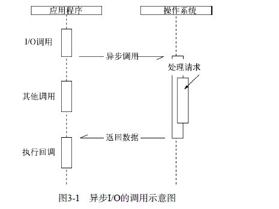

### 3.2 异步I/O实现现状
#### 3.2.1 异步I/O与非阻塞I/O
操作系统内核对于I/O只有两种方式：阻塞与非阻塞。在调用阻塞I/O时，应用程序需要等待I/O完成才返回结果。  
 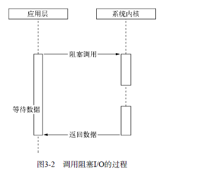
阻塞I/O的一个特点是调用之后一定要等到系统内核层面完成所有操作后， 调用才结束。以读取磁盘上的一段文件为例，系统内核在完成磁盘寻道、读取数据、复制数据到内存中之后， 这个调用才结束。   
阻塞I/O造成CPU等待I/O，浪费等待时间，CPU的处理能力不能得到充分利用。为了提高性能，内核提供了非阻塞I/O。非阻塞I/O跟阻塞I/O的差别为调用之后会立即返回 
 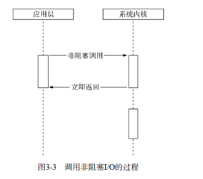
操作系统对计算机进行了抽象，将所有输入输出设备抽象为文件。内核在进行文件I/O操作时，通过文件描述符进行管理，而文件描述符类似与系统内核之间的凭证。应用程序如果需要进行I/O调用， 需要先打开文件描述符， 然后再分解文件描述符去实现文件的数据读写。此处非阻塞I/O与阻塞I/O的区别在于阻塞I/O完成整个获取数据的过程，而非阻塞I/O则不带数据直接返回，要获取数据，还需要通过文件描述符再次读取。    
非阻塞I/O返回之后，CPU的时间片可以用来处理其它事务，此时的性能提升是明显的。    
但非阻塞I/O也存在一些问题。由于完整的I/O并没有完成，立即返回的并不是业务层期望的数据，而仅仅是当前调用的状态。为了获取完整的数据，应用程序需要重复调用I/O操作来确认是否完成。这种重复调用判断操作是否完成的技术叫**轮询**     
任意技术都并非完美的。阻塞I/O造成CPU等待浪费，非阻塞带来的麻烦却是需要轮询去确认是否完全完成数据获取，它会让CPU处理状态判断，是对CPU资源的浪费。这里我们且看轮询技术是如何演进的，以减少I/O状态判断的CPU损耗。   
现在的轮询技术主要有以下这些。  
+ read.它是最原始、性能最低的一种，通过重复调用来检查I/O的状态来完成数据的读取。在得到最终数据前，CPU一直耗用在等待上。
    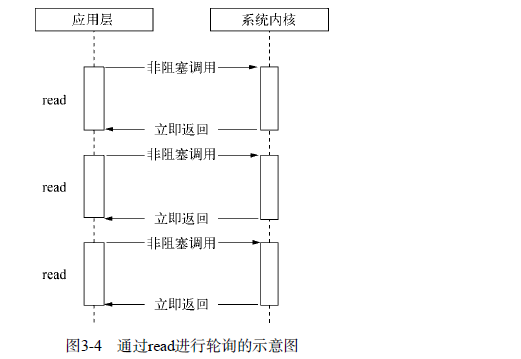
+ select. 它是在read的基础上改进的一种方案，通过对文件描述符上的事件状态来进行判断。
    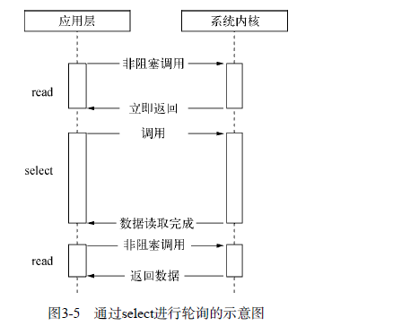
	select轮询具有一个较弱的限制，那就是由于它采用一个1024长度的数组来存储状态，所以它最多可以同时检查1024个文件描述符  
+ poll。该方案较select有所改进，采用链表的方式避免数组长度的限制，其它它能避免不需要的检查。但是当文件描述符较多的时候，它的性能还是十分低下。
    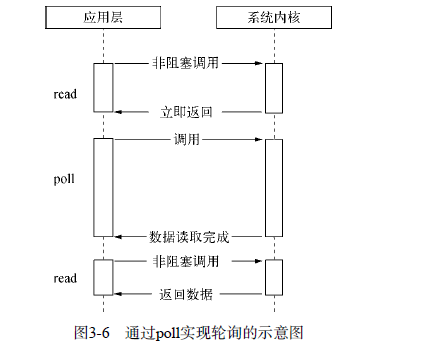

+ epoll。该方案是Linux下效率最高的I/O事件通知机制， 在进入轮询的时候，如果没有检查到I/O事件，将会进行休眠，直到事件发生将它唤醒。它是真实利用了事件通知、执行回调的方式，而不是遍历查询，所以不会浪费CPU，执行效率较高。
    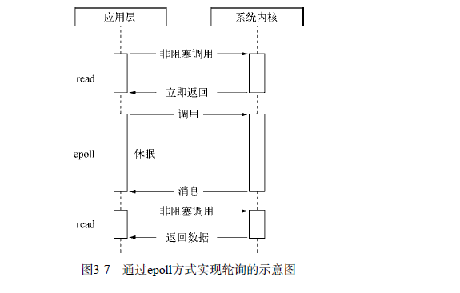
+ kqueue 。该方案的实现方式与epoll类似，不过它仅存在FreeBSD系统下。

#### 3.2.2 理想的非阻塞异步I/O
我们期望的完美的异步I/O应该是应用程序发起的非阻塞调用，无需通过遍历或者事件唤醒等方式轮询，可以直接处理下一个任务，只需在I/O完成后通过信号或回调将数据传递给应用程序即可。    
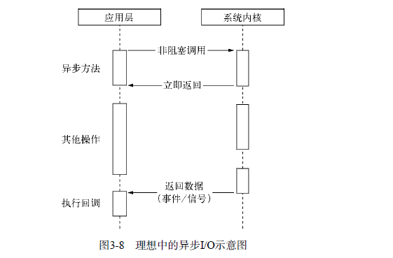
幸运的是，在Linux下存在这样一种方式，它原生提供的一种异步I/O方式（AIO）就是通过信号或回调传递数据的。    
但不幸的是，只有Linux下有，而且它还有缺陷——AIO仅支持内核I/O中的0——DIRECT方式读取，导致无法利用系统缓存。    

#### 3.2.3 现实的异步I/O
IOCP的异步I/O模型与Node的异步调用模型十分近似。在Windows平台下采用了IOCP实现异步I/O。   
由于Windows平台与*nix平台的差异，Node提供了libuv作为抽象封装层，使得所有平台兼容性的判断都是由这一层来完成，并保证了上层的Node与下层的自定义线程池及IOCP之间各自独立。Node在编译期间会判断平台条件，选择性编译unix目录或是win目录下的源文件到目标程序中。   
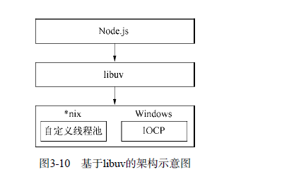


### 3.3 Node的异步I/O
#### 3.3.1 事件循环
在进程启动时， Node便会创建一个类似于while(true)的循环，每执行一次循环体的过程我们称为Tick。每个Tick的过程就是查看是否由事件待处理，如果有，就取出事件极其相关的回调函数。如果存在关联的回调函数，就执行它们。然后进入下个循环，如果不再有事件处理，就退出进程。


#### 3.3.2 观察者
在每个Tick的过程中，如何判断是否有事件需要处理呢？这里必须要引入的概念是观察者。   
浏览器采用了类似的机制。事件可能来自用户的点击或加载某些文件时产生，而这些产生事件都有对应的观察者。 在Node中，事件主要来源于网络请求、文件I/O等，这些事件对应的观察者有文件I/O观察者、网络I/O观察者等。    
事件循环时一个典型的生产者/消费者模型。异步I/O、网络请求等则是事件的生产者，源源不断为Node提供不同类型的事件，这些事件被传递到对应的观察者那里，事件循环则从观察者那里取出事件并处理。    
在Windows下，这个循环基于IOCP创建，而在*nix下则基于多线程创建。    

#### 3.3.3 请求对象
在这一节中， 我们将通过解释Windows下异步I/O（利用IOCP实现）的简单例子来探寻从JavaScript代码到系统内核之间都发生了什么。   
对于一般的（非异步）回调函数，函数由我们自行调用，如下所示：
```js
var forEach = function(list, callback) {
	for(var i = 0; i < list.length; i++>) {
		callback(list[i], i, list);
	}
};
```
对于Node中的异步I/O调用而已，回调函数却不由开发者来调用。那么从我们发出调用后，到回调函数被执行， 中间发生了什么呢？事实上，从JavaScript发起调用到内核执行完I/O操作的过渡过程中，存在一种中间产物，它叫做**请求对象**     
下面以fs.open()方法来作为例子，探索Node与底层之间时如何执行异步I/O调用以及回调函数究竟是如何被调用执行的：    
```js
fs.open = function(path, flags, mode, callback) {
	// ...
	binding.open(pathModule._makeLong(path), stringToFlags(flags), mode, callback);
};
```
fs.open()的作用是根据指定路径和参数去打开一个文件，从而得到一个文件描述符，这是后续所有I/O操作的初始操作。从前面的代码中可以看到，JavaScript层面的代码通过调用C++核心模块进行下层的操作。
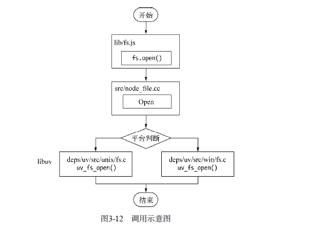
从JavaScript调用Node的核心模块， 核心模块调用C++内建模块，内建模块通过libuv进行系统调用，这是Node里经典的调用方式。这里libuv作为封装层，有两个平台的实现，实质上是调用了uv_fs_open()方法。在uv_FS_OPEN的调用过程中，我们创建了一个FSReqWrap请求对象。从JavaScript层传入的参数和当前方法被封装在这个请求对象中，其中我们最为关注的回调函数 则被设置在这个对象的oncomplete_sym属性上：   
```
req_wrap->object_->Set(oncomplete_sym, callback);
```
对象包装完毕后， 在Windows下，则调用QueueUserWorkItem()方法将这个FsReqWrap对象推入线程池中等待执行， 该方法的代码如下：
```js
QueueUserWorkItem(&uv_fs_thread_proc, req, WT_EXECUTEDEFAULT)
```
QueueUserWorkItem()方法接收3个参数：第一个参数将要执行的方法的引用，这里引用的uv_fs_thread_proc，第二个参数是uv_fs_thread_proc()方法运行时所需要的参数；第三个参数时执行的标志。当线程池中有可用线程时， 我们会调用uv_fs_thread_proc()方法。uv_fs_thread_proc()方法会根据传入参数的类型调用相应底层函数。以uv_fs_open()为例，实际上调用fs__open()方法。     
至此，JavaScript调用立即返回，由JavaScript层面发起的异步调用的第一阶段就此结束。JavaScript线程可以继续执行当前任务的后续操作。当前I/O操作在线程池中等待执行。不管它是否阻塞I/O，都不会影响到JavaScript线程的后续执行，如此就达到异步的目的。    
请求对象时异步I/O过程中的重要中间产物， 所有的状态都保存在这个对象中， 包括送入线程池等待执行以及I/O操作完毕后的回调处理。    
#### 3.3.4 执行回调
组装好请求对象、送入I/O线程池等待执行，实际上完成了异步I/O的第一部分，回调通知时第二部分。   
线程池中的I/O操作调用完毕之后，会将获取的结果存储在req->result属性上，然后调用PostQueuedCompletionStatus()通知IOCP，告知当前对象操作已完成：
```js
PostQueuedCompletionStatus((loop)->iocp, o, o, &((req)->overlapped))
```
PostQueuedCompletionStatus()方法的作用是像IOCP提交执行状态，并将线程归还线程池。通过PostQueuedCompletionStatus()方法提交的状态，可以通过GetQueuedCompletionStatus()提取。    
在这个过程中， 我们其实还动用了事件循环的I/O观察者。在每次Tick的执行中，它会调用IOCP相关的GetQueuedCompletionStatus()方法检查线程池中是否有执行完的请求，如果存在，会将请求对象加入到I/O观察者的队列中，然后将其当做事件处理。    
I/O观察者回调函数的行为就是取出请求对象的result属性作为参数，取出oncomplete_sym属性作为方法， 然后调用执行，以此达到调用JavaScript中传入的回调函数的目的。    
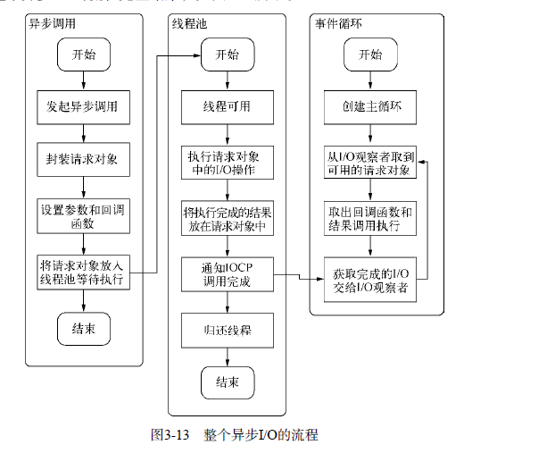
事件循环、观察者、请求对象、I/O线程池这四者共同构成了Node异步I/O模型的基本要素。    
Windows下主要通过IOCP来像系统内核发送I/O调用和从内核获取已完成的I/O操作，配以事件循环，以此完成异步I/O的过程。在Linux下通过epoll实现这个过程，FreeBSD下通过kqueue实现。    
#### 3.3.5 小结
从前面实现异步I/O的过程描述中， 我们可以提取出异步I/O的几个关键词： 单线程、事件循环、观察者和I/O线程池。这里单线程和I/O线程池看起来有些悖论的样子。由于我们知道JavaScript是单线程的，所以按常识很容易理解为它不能充分利用多核CPU。事实上，在Node中，除了JavaScript是单线程外，Node自身其实是多线程的，只是I/O线程使用的CPU较少。另一个需要重视的观点则是，除了用户代码无法并行执行外，所有的I/O（磁盘I/O和网络I/O等）则是可以并行起来的。   


### 3.4 非I/O的异步API
setTimeout()、setInterval()、setImmediate()和process.nextTick()。

#### 3.4.1 定时器
setTimeout()和setInterval()与浏览器中的API是一致的， 分别用于单次和多次定时执行任务。它们的实现原理与异步I/O比较类似，只是不需要I/O线程池的参与。调用setTimeout()或者setInterval()创建的定时器会被插入到定时器观察者内部的一个红黑树中。每次Tick执行时，会从该红黑树中迭代取出定时器对象，检查是否超过定时时间，如果超过，就形成一个事件，它的回调函数将立即执行。  
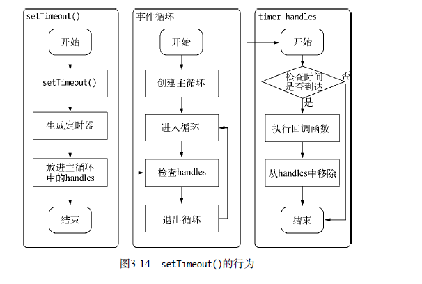

#### 3.4.2 process.nextTick()
在未了解process.nextTick()之前，很多人也许为了立即异步执行一个任务，会这样调用setTimeout()来达到所需的效果：
```js
setTimeout(function(){
	// todo
}, 0)

```
由于事件循环自身的特点，定时器的精确度不够。而事实上，采用定时器需要动用红黑树，创建定时器对象和迭代等操作，而setTimeout(fn, 0)的方式较为浪费性能。实际上，process.nextTick()方法的操作相对较为轻量，具体代码如下：
```js
process.nextTick = function(callback) {
	// on the way out, don't bother
	if(process._exiting) return;

	if(tickDepth >= process.maxTickDepth) maxTickWarn();

	var tock = {callback: callback};
	if(process.domain) tock.domain = process.domain;
	nextTickQueue.push(tock);
	if(nextTickQueue.length) {
		process._needTickCallback();
	}
};
```
每次调用process.nextTick()方法，只会将回调函数放入队列中， 在下一轮Tick时取出执行。定时器中采用红黑树的操作时间复杂度为O(lg(n))，nextTick()的时间复杂度为O(1)。相较之下，process.nextTick()更高效。  

#### 3.4.3 setImmediate()
setImmediate()方法与process.nextTick()方法十分类似，都是将回调函数延迟执行。在Nodev0.9.1之前，setImmediate()还没实现，那时候实现类似的功能主要通过process.nextTick()来完成，该方法的代码如下所示：
```js
process.nextTick(function(){
	console.log('延迟执行');
})
```
上述代码的输出结果是：
```
正常执行
延迟执行
```
而用setImmediate()实现时，相关代码如下：
```
setImmediate(function () {
console.log('􁃽􀗿执行');
});
console.log('正常执行');
```
其执行结果完全一样：
```
正常执行
延迟执行
```
但是两者之间其实是有细微差别的。将它们放在一起时，又会是怎样的优先级。实例代码如下：
```js
process.nextTick(function(){
	console.log('nextTick 延迟执行');
});
setImmediate(function(){
	console.log('setImmediate 延迟执行');
});
console.log('正常执行');
```
其执行结果如下：
```
正常执行
nextTick 延迟执行
setImmediate 延迟执行
```
从结果这里可以看到，process.nextTick()中的回调函数执行的优先级要高于setImmediate()。这里的原因在于事件循环对观察者的检查是有先后顺序的，process.nextTick()属于idle观察者，setImmediate()属于check观察者。在每一个轮循环检查中，idle观察者先于check观察者。    
在具体实现上，process.nextTick()的回调函数保存在一个数组中，setImmediate()的结果则是保存在链表中。在行为上，process.nextTick()在每轮循环中会将数组中的回调函数全部执行完，而setImmediate()在每轮循环中执行链表中的一个回调函数。    
### 3.5 事件驱动与高性能服务器

## 4、异步编程
### 4.1 函数式编程
#### 4.1.1 高阶函数

### 4.3 异步编程解决方案
目前，异步编程的主要解决方案有如下3种。
+ 事件发布/订阅模式
+ Promise/Deferred模式
+ 流程控制库

#### 4.3.1 事件发布/订阅模式
事件监听器模式是一种广泛用于异步编程的模式，是回调函数的事件化，又称发布/订阅模式。  
Node自身提供的events模块是发布/订阅模式的一个简单实现，Node中部分模块都继承自它，这个模块比前端浏览器中的大量DOM事件简单，不存在事件冒泡，也不存在preventDefault()、stopPropagation()和stopImmediatePropagation()等控制事件传递的方法。它具有addListener/on()、once()、removeListener()、removeAllListeners()和emit()等基本的事件监听模式的方法实现。事件发布/订阅模式的操作极其简单，示例代码如下：
```js
// 订阅
emitter.on("event1", function(message){
	console.log(message);
})
// 发布
emmitter.emit("event1", "I am message!");
```
值得一提的是，Node对事件发布/订阅的机制做了一些额外的处理，这大多是基于健壮性而考虑的。下面为两个具体的细节点。
- 如果对一个事件添加了超过10个监听器，将会得到一条警告。这一处设计与Node自身单线程运行有关，设计者认为监听器太多可能导致内存泄漏，所以存在这样一条警告。调用emmitter.setMaxListeners(0);可将这个限制去掉。另一方面，由于事件发布会引起一系列监听器执行，如果事件相关的监听器过多，可能存在过多占用CPU的情景。
- 为了处理异常，EventEmmiter对象对error事件进行了特殊对待。如果运行期间的错误触发了error事件，EventEmmitter会检查是否有对error事件添加过监听器。如果添加了，这个错误将会交由监听器处理，否则这个错误将会作为异常抛出。如果外部没有捕获这个异常，将会引起线程退出。一个健壮的EventEmmitter实例应该对error事件做处理。

...后续细看

#### 4.3.3 流程控制库
**1. 尾触发与next**
除了事件和Promise外，还有一类方法是需要手工调用 才能持续执行后续调用的， 我们将此类方法叫做尾触发，常见的关键词是next。事实上，尾触发目前应用最多的地方是Connect的中间件。   

...后续细看

### 4.4 异步并发控制
#### 4.4.1 bagpipe的解决方案
思路如下：
- 通过一个队列来控制并发量
- 如果当前活跃（指调用发起但未执行回调）的异步调用量小于限定值，从队列中取出执行
- 如果活跃调用达到限定值，调用暂时存放在队列中
- 每个异步调用结束时，从队列中取出新的异步调用执行。

#### 4.4.2 async的解决方案

## 5、内存控制
### 5.1 V8 的垃圾回收机制与内存限制
Node极大地拓宽了JavaScript的应用场景，当主流应用场景从客户端延伸到服务器端之后， 我们就能发现， 对于性能敏感的服务器端程序，内存管理的好坏、垃圾回收状况是否优良，都会对服务构成影响。而在Node中，这一切都与Node的JavaScript执行引擎V8息息相关。   

Node 在启动时可以传递--max-old-space-size或--max-new-space-size来调整内存限制的大小，实例如下：
```
node --max-old-space-size=1700 test.js //单位为MB
// 或者
node --max-new-space-size=1024 test.js // 单位为KB
```
上述参数在V8 初始化时生效，一旦生效 就不能在动态改变。 如果遇到Node无法分配足够内存给JavaScript对象的情况，可以用这个办法来放宽V8默认的内存限制，避免在执行过程中稍微多用了一些内存就轻易崩溃。


#### 5.1.4 V8的垃圾回收机制
在展开介绍V8的垃圾回收机制前，有必要简略介绍下V8用到的各种垃圾回收算法。
**1. V8主要的垃圾回收算法**
- V8的内存分代
	在V8中， 主要将内存分为新生代和老生代两代。新生代中的对象为存活时间较短的对象，老生代中的对象为存活时间较长或常驻内存的对象。    
	V8 堆的整体大小就是新生代所用内存空间加上老生代的内存空间。前面我们提及的--max-old-space-size命令行参数可以用于设置老生代内存空间的最大值，--max-new-space-size命令行参数则用于设置新生代内存空间的大小。比较遗憾的是，这两个最大值需要在启动时就指定。这意味着V8使用的内存没有办法根据使用情况自动扩充，当内存分配过程中超过极限值时，就会引起进程出错。   
	前面提到过，在默认设置下，如果一直分配内存，在64位系统和32位系统下会分别只能使用约1.4GB和约0.7GB的大小。这个限制可以从V8的源码中找到。   
	
- Scavenge 算法
	在分代的基础上，新生代的对象主要通过Scavenge算法进行垃圾回收。在Scavenge的具体实现中，主要采用了Cheney算法    
	Cheney算法是一种采用复制的方式实现的垃圾回收算法。他将堆内存一分为二，每一部分空间称为semispace。在这两个semispace空间中，只有一个处于使用中，另一个处于闲置状态。处于使用状态的semispace空间称为Form空间，处于闲置状态的空间称为To空间。当我们分配对象时，先是在From空间中进行分配。当开始进行垃圾回收时，会检查From空间中的存活对象，这些存活对象将被复制到To空间中，而非存活对象占用的空间将会被释放。完成复制后，From空间和To空间的角色发生对换。简而言之，在垃圾回收的过程中，就是通过将存活对象在两个semispace空间之间进行复制。    
	Scavenge的缺点是只能使用堆内存中的一半，这是由划分空间和复制机制所决定的。但Scavenge由于只复制存活的对象，并且对于生命周期短的场景存活对象只占少部分，所以它在时间效率上有优异的表现。    
	由于Scavenge是典型的牺牲空间换取时间的算法，所以无法大规模的应用到所有的垃圾回收中。但可以发现，Scavenge非常适合应用在新生代中，因为新生代中对象的生命周期较短，恰恰适合这个算法。   
- Mark-Sweep & Mark-Compact
	V8 在老生代中主要采用了Mark-Sweep 和 Mark-Compact相结合的方式进行垃圾回收      
	Mark-Sweep 是标记清除的意思，它分为标记和清除两个阶段。
	Mark-Compact 是标记整理的意思

- Incremental Marking
	为了降低全堆垃圾回收带来的停顿时间，V8先从标记阶段入手，将原本要一口气停顿完成的动作改为增量标记（Incremental Marking），也就是拆分为许多小“步进”，每做完一“步进”就让JavaScript应用逻辑执行一小会，垃圾回收与应用逻辑交替执行直到标记阶段完成。

### 5.2 高效使用内存
#### 5.2.1 作用域
**3. 变量的主动释放**
如果变量是全局变量（不通过var声明或定义在global变量上），由于全局作用域需要直到进程退出才能释放，此时将导致引用的对象常驻内存（常驻在老生代中）。如果需要释放常驻内存的对象，可通过delete操作来删除引用关系。或者将变量重新赋值，让旧的对象脱离引用关系。在接下来的老生代内存清除和整理的过程中，会被回收释放。
```js
globel.foo = "I am global object";
console.log(global.foo); // I am global object
delete global.foo;
// 或者重新赋值
global.foo = undefined;
console.log(global.foo); // undefined

```
同样，如果在非全局作用域中， 想主动释放变量引用的对象，也可以通过这样的方式。虽然delete操作和重新赋值具有相同的效果，但是在V8中通过delete删除对象的属性有可能干扰V8的优化，所以通过赋值方式解除引用更好。   

### 5.3 内存指标
一般而言，应用中存在一些全局性的对象是正常的，而且在正常的使用中，变量都会自动释放回收。但是也会存在一些我们认为会回收但是却没有被回收的对象，这会导致内存占用无限增长。一旦增长达到V8的内存限制，将会得到内存溢出错误，进而导致进程退出。   

Node的内存构成主要由通过V8进行分配的部分和Node自行分配的部分。受V8的垃圾回收限制的主要是V8的堆内存。   

### 5.4 内存泄漏
在V8的垃圾回收机制下，在通常的代码编写中，很少会出现内存泄漏的情况。但是内存泄漏通常产生于无意间，较难排查，尽管内存泄漏的情况不尽相同，但其实质只有一个，那就是应当回收的对象出现意外而没有被回收，变成了常驻在老生代中的对象。   
通常，造成内存泄漏的原因有如下几个。
- 缓存
- 队列消费不及时
- 作用域未释放

**2.缓存的解决方案**
如何使用大量缓存，目前比较好的解决方案是采用进程外的缓存，进程自身不存储状态。外部的缓存软件有着良好的缓存过期淘汰策略以及自有的内存管理，不影响Node进程的性能。它的好处多多，在Node中主要可解决以下两个问题。
+ 将缓存转移到外部，减少常驻内存的对象的数量，让垃圾回收更高效。
+ 进程之间可共享缓存

目前，市面上较好的缓存有Redis和Memcached。Node模块的生态系统十分完善，这两个产品的客户端都有    


### 5.5 内存泄漏排查
现在已经有许多工具用于定位Node应用的内存泄漏，下面是一些常见的工具。
- v8-profile.
- node-heapdump. 这是Node核心贡献者之一Ben Noordhuis编写的模块，它允许对V8堆内存抓取快照，用于事后分析。
- dtrace
- node-memwatch

## 6. 理解Buffer
文件和网络I/O对于前端开发者而言都是不曾有的应用场景，因为前端只需要做一些简单的字符串操作或DOM操作基本就能满足业务需求，在ECMAScript规范中，也没有对这些方面做任何的定义，只有CommonJS中有部分二进制的定义。由于应用场景不同，在Node中，应用需要处理网络协议、操作数据库、处理图片、接收上传文件等，在网络流和文件的操作中，还要处理大量二进制数据，JavaScript自有的字符串远远不能满足这些需求，于是Buffer对象应运而生。   

## 7. 网络编程
Node提供了net、dgram、http、https这4个模块，分别用于处理TCP、UDP、HTTP、HTTPS，适用与服务器端和客户端。    

### 7.1 构建TCP服务
####  7.1.1 TCP
TCP 全名为传输控制协议，在OSI模型（由七层组成，分别为物理层、数据链路层、网络层、传输层、会话层、表示层、应用层）中属于传输层协议。许多应用层协议基于TCP构建，典型的是HTTP、SMTP、IMAP等协议。七层协议示意图如下图：  
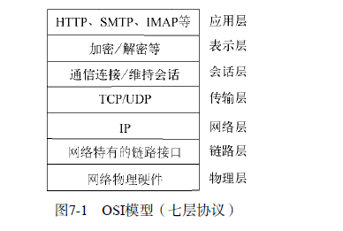

####  7.1.2 创建TCP服务器端
在基本了解TCP的工作原理之后，我们可以开始创建一个TCP服务端来接收网络请求：
```js
var net = require('net');
var server = net.createServer(functioin(socket){
	// 新的连接
	socket.on('data', function(data){
		socket.write("你好")
	})
	socket.on('end', function(data){
		console.log("连接断开")
	})

	socket.write("hello ")

});

server.listen(8124, function(){
	console.log("server bound")
})
```
####  7.1.3 TCP 服务的事件
**1. 服务器事件**
对于通过net.createServer()创建的服务器而言，它是一个EventEmmitter实例，它的自定义事件有如下几种。
- listening
- connection 每个客户端套接字连接到服务端时触发
- close 当服务器关闭时触发
- error 当服务器发生异常时，将会触发该事件

**2. 连接事件**
- data 当一端调用write()发送数据时， 另一端会触发data事件，事件传递的数据即是write()发送的数据
- end 当连接中的任意一端发送了FIN数据时，将会触发该事件
- connect 该事件用于客户端，当套接字与服务端连接成功时会触发。
- drain 当任意一端调用write()发送数据时，当前这端会触发该事件。
- error 当异常发生时，触发该事件
- close 当异常发生时，触发该事件
- timeout 当一定时间后连接不再活跃时，该事件将会触发，通知用户当前该连接已经被闲置了。


### 7.2 构建UDP服务


### 7.3 构建HTTP服务
TCP与UDP都属于网络传输层协议，如果要构造高效的网络应用，就应该从传输层进行着手。  
在Node中构建HTTP服务极其容易，Node官网上的经典例子就展示了如何用寥寥几行代码实现一个HTTP服务器，代码如下：   
```js
var http = require('http');
http.createServer(function(req, res){
	res.writeHead(200, {"Content-Type":"text/plain"});
	res.end("Hello World\n");
}).listen(1337, "127.0.0.1");
console.log("Server running at http://127.0.0.1:1337/");

```

#### 7.3.1 HTTP
http模块将连接所用的套接字的读写抽象为ServerRequest和ServerResponse对象，它们分别对应请求和响应操作。在请求产生的过程中，http模块拿到连接中传来的数据，调用二进制模块http_parser进行解析，在解析完请求报文的报头后，触发request事件，调用用户的业务逻辑。   
无论服务器端在处理业务逻辑时是否发生异常，务必在结束时调用res.end()结束请求，否则客户端将一直处于等待状态。  当然也可以通过延迟res.end()的方式实现客户端与服务端的长连接，但结束时务必关闭连接。  
**3.HTTP服务的事件**
- connection事件： 在开始HTTP请求和响应前，客户端与服务端需要建立底层的TCP连接，这个连接可能因为开启了keep-alive，可以在多次请求响应之间使用；当这个连接建立时，服务器触发一次connection事件。
- request事件：建立TCP连接，http模块底层将在数据流中抽象出HTTP请求和HTTP响应，当请求数据发送到服务器端，在解析出HTTP请求头后，将会触发该事件；在res.end()后，TCP连接可能将用于下一次请求响应。  
- close事件： 与TCP服务器的行为一致，调用server.close()方法停止接受新的连接，当已有的连接都断开时，触发该事件；可以给server.closr()传递一个回调函数来快速注册该事件。  
- checkContinue事件：某次客户端在发送较大的数据时，并不会将数据直接发送，而是先发送一个头部带Expect:100-continue的请求到服务器，服务器将会触发checkContinue事件；如果没有为服务器监听这个事件，服务器将会自动响应客户端100 Continue的状态码，表示接受数据上传；如果不接受数据的较多时，响应客户端400 Bad Request拒绝客户端继续发送数据即可。需要注意的是，当该事件发生时不会触发request事件，两个事件之间互斥。当客户端收到100 COntinue后重新发起请求时，才会触发request事件。 
- connect事件： 当客户端发起CONNECT 请求时触发，而发起CONNECT请求通常在HTTP代理时出现，如果不监听该事件，发起该请求的连接将会关闭。   
- upgrade事件： 当哭护短要求升级连接的协议时，需要和服务器端协商，客户端会在请求头中带上Upgrade字段，服务器会在接收到这样的请求时触发该事件。如果不监听该事件，发起该请求的连接将会关闭。  
- clientError事件： 连接的客户端触发error事件时，这个错误会传递到服务器端，此时发生该事件。   

#### 7.3.3 HTTP 客户端
http模块提供了一个底层API：http.request(options, connect)，用于构造HTTP客户端。  

**2.HTTP代理**
如同服务器端的实现一般，http提供的ClientRequest对象也是基于TCP层实现的，在keepalive的情况下，一个底层会话连接可以多次用于请求。为了重用TCP连接，http模块包含一个默认的客户端代理对象http.globalAgent。它对每个服务器创建的连接进行管理，默认情况下，通过ClientRequest对象对同一个服务器端发起的HTTP请求最多可以创建5个连接。它的实质是一个连接池

调用HTTP客户端同时对一个服务器发起10次HTTP请求时，其实质只有5个请求处于并发状态，后续的请求需要等待某个完成服务后才真正发出。这与浏览器对同一个域名下有下载连接数的限制是相同的行为。   
如果你在服务器端通过ClientRequest调用网络中的其它HTTP服务，记得关注代理对象对网络请求的限制。一旦请求量过大，连接限制将会限制服务性能。如需改变，可以在options中传递agent选项。默认情况下，请求会采用全局的代理对象，默认连接数限制为5.    
我们既可以自行构造代理对象，代码如下：
```js
var agent = new http.Agent({
	maxSockets: 10
});
var options = {
	hostname: '127.0.0.1',
	port: 1334,
	path: '/',
	method: 'GET',
	agent: agent
};

```
也可以设置agent选项为false值，以脱离连接池的管理，使得请求不受并发的限制。   
Agent对象的sockets和requests属性分别表示当前连接池中使用的连接数和处于等待状态的请求数，在业务中监视这两个值有助于发现业务状态的繁忙程度。  

**3.HTTP客户端事件**
与服务端对应的，HTTP客户端也有相应的事件。
- response： 与服务端的request事件对应的客户端在请求发出后得到服务器响应时，会触发该事件。
- socket： 当底层连接池中建立的连接分配给当前请求对象时，触发该事件。
- connect：当客户端想服务器端发送CONNECT请求时，如果服务器端响应了200状态码，客户端将会触发该事件。
- upgrade：客户端向服务器端发起Upgrade请求时，如果服务器响应了101 switching protocols状态，客户端将会触发该事件
- continue: 客户端向服务器端发起Expect:100-continue头信息，以试图发送较大数据量，如果服务器端响应100 Continue状态，客户端将触发该事件。  

### 7.4 构建websocket服务
提到Node，不能错过的时WebSocket协议。它与Node之间的配合堪称完美，其理由有2条：
- WebSocket客户端基于事件的编程模型与Node中自定义事件相差无几
- WebSocket 实现了客户端与服务器端之间的长连接，而Node事件驱动的方式十分擅长与大量客户端保持高并发连接。

除此之外，WebSocket与传统HTTP有如下好处。   
- 客户端与服务器端只建立一个TCP连接，可以使用更少的连接
- WebSocket服务器端可以推送数据到客户端，这远比HTTP请求响应模式更灵活、更高效。
- 有更轻量级的协议头，减少数据传输量

Websocket在客户端的应用实例：
```js
var scoket = new WebSocket('ws://127.0.0.1:12010/updates');
socket.onopen = function(){
	setInterval(function(){
		if(socket.bufferedAmount == 0) socket.send(getUpdateData());
	}, 50);
};
socket.onmessage = function(event){ // 接收服务器端传来的数据。
	// TODO: event.data
};
```

Websocket协议主要分为两个部分：握手和数据传输    
### 7.5 网络服务与安全
SSL作为一种安全协议，它在传输层提供了对网络连接加密的功能。对于应用层而言，它是透明的，数据在传递到应用层之前就已经完成了加密和解密的过程。最初的SSL应用在Web上，被服务器和浏览器同时支持，随后IETF将其标准化，称为TLS（Transport Layer Security, 安全传输层协议）。    
Node 在网络安全上提供了3个模块，分别为crypto、tls、https。其中crypto主要用于加密解密，SHA1、MD5等加密算法都在其中有体现。真正用于网络的是另外两个模块，tls模块提供了与net模块类似的功能，区别在于它建立在TLS/SSL加密的TCP连接上。对于https而言，它完全与http模块接口一种，区别也仅在于它建立于安全的连接之上。

#### 7.5.1 TLS/SSL
**1. 密钥**
TLS/SSL是一个公钥/私钥的结构，它是一个非对称的结构，每个服务器端和客户端都有自己的公私钥。公钥用来加密要传输的数据，私钥用来解密接收到的数据。公钥和私钥是配对的，通过公钥加密的数据，只有通过私钥才能解密，所以在建立安全传输之前，客户端和服务端之间需要互换公钥。客户端发送数据时需要通过服务端的公钥进行加密，服务端发送数据时则需要客户端的公钥进行加密，如此才能完成加密解密的过程   
Node在底层采用的是openssl实现TLS/SSL的，为此要生成公钥和私钥可通过openssl完成。我们分别为服务端和客户端生成私钥，
```
openssl genrsa -out server.key 1024
openssl genrsa -out client.key 1024
```
上述命令生成了两个1024位长的RSA私钥文件，我们可以通过它继续生成公钥
```
openssl rsa -in server.key -pubout -out server.pem
openssl rsa -in client.key -pubout -out client.pem
```

TSL/SSL引入了数字证书来进行认证。与直接用公钥不同，数字证书中包含了服务器的名称和主机名、服务器的公钥、签名颁发机构的名称、来自签名办法机构的签名。在连接建立前，会通过证书中的签名确认收到的公钥是来自目标服务器的，从而产生信任关系。   
**2. 数字证书**
为了确保我们的数据安全，现在我们引入了一个第三方：CA（Certifucate Authority数字证书认证中心）。CA的作用是为站点颁发证书，且证书中具有CA通过自己的公钥和私钥实现的签名。   
通过CA机构颁发的证书通常是一个繁琐的过程，需要付出一定的精力和费用。对于中小型企业而言，多半是采用自签名证书来构建安全网络的。所谓自签名证书，就是自己扮演CA机构，给自己的服务器端颁发签名证书。以下为生成私钥、生成CSR文件、通过私钥自签名生成证书的过程：
```
openssl genrsa -out ca.key 1024
openssl req -new -key ca.key -out ca.csr
openssl x509 -req -in ca.csr -signkey ca.key -out ca.crt
```

### 7.6 总结
Node基于事件驱动和非阻塞设计，在分布式环境中尤其能发挥出它的特长，基于事件驱动可以实现与大量的客户端进行连接，非阻塞设计则让它可以更好地提升网络的响应吞吐。Node提供了相对底层的网络调用，以及基于事件的编程接口，使得开发者在这些模块上十分轻松地构建网络应用。   

## 8、构建Web应用
**1. 初识Cookie**
Cookie的处理分为如下几步。
- 服务器向客户端发送Cookie
- 浏览器将Cookie保存
- 之后每次浏览器都会将Cookie发向服务器端

Cookie发送到服务端参数：
- path表示这个Cookie影响到的路径，当前访问的路径不满足该匹配时，浏览器则不发送这个Cookie
- Expires和Max-Age是用来告知浏览器这个Cookie何时过期的，如果不设置该选项，在关闭浏览器时会丢掉这个Cookie。如果设置了过期时间，浏览器将会把Cookie内容写入到磁盘中并保存，下次打开浏览器依旧有效。Expires的值是一个UTC格式的时间字符串，告知浏览器此Cookie何时将过期，Max-Age则告知浏览器此Cookie多久后过期。前者一般而言不存在问题，但是如果服务器端的时间和客户端的时间不能匹配，这种事件设置就会存在偏差。为此，Max-Age告知浏览器这条Cookie多久之后过期，而不是一个具体的时间点。
- HttpOnly告知浏览器不允许通过脚本document.cookie去更改这个Cookie值，事实上，设置HttpOnly之后，这个值在document.cookie中不可见。但是在HTTP请求的过程中，依然会发送这个Cookie到服务器端。
- Secure。当Secure值为true时，在HTTP中是无效的，在HTTPS中才有效，表示创建的Cookie只能在HTTPS连接中被浏览器传递到服务器端进行会话验证，如果是HTTP连接则不会传递该信息

**2. Cookie的性能影响**
由于Cookie的实现机制，一旦服务器向客户端发送了设置Cookie的意图，除非Cookie过期，否则客户端每次请求都会发送这些Cookie到服务器端，一旦设置的Cookie过多，将会导致报头较大。大多数的Cookie并不需要每次都用上，因为这会造成宽带的部分浪费。
- 减小Cookie大小
	更为严重的情况是，如果在域名的根节点设置Cookie,几乎所有子路径下的请求都会带上这些Cookie，这些Cookie在某些情况下是有用的，但是在有些情况下是完全无用的。其中以静态文件最为典型，静态文件的业务定位几乎不关心状态，Cookie对它而言几乎是无用的，但是一旦有Cookie设置到相同域下，它的请求中就会带上Cookie。好在Cookie在设计时限定了它的域，只有域名相同时才会发送。所以YSlow中另外一条规则用来避免Cookie带来的性能影响。  
- 为静态组件使用不同的域名
	简言之，就是为不需要Cookie的组件换个域名可以实现减少无效Cookie的传输。所以很多网站的静态文件会有特别的域名，使得业务相关的Cookie不再影响静态资源。当然换用额外的域名带来的好处不只这点，还可以突破浏览器下载线程数量的限制，因为域名不同，可以将下载线程翻倍。但是换用额外域名还有一定的缺点，那就是将域名转换为IP需要进行DNS查询，多一个域名就多一次查询。YSlow中有这样一条规则：
- 减少DNS查询
	看起来减少DNS查询和使用不同域名是冲突的两条规则，但是好在现今浏览器都会进行DNS缓存，以消弱这个副作用的影响。

Cookie除了可以通过后端添加协议头的字段设置外，在前端浏览器中也可以通过JavaScript进行修改，浏览器将Cookie通过document.cookie暴露给了JavaScript。前端在修改Cookie之后，后续的网络请求中就会携带修改后的值。    

#### 8.1.5 Session
通过Cookie，浏览器和服务端可以实现状态的记录。但是Cookie并非完美的，前文提及的体积过大就是一个显著的问题，最为严重的问题是Cookie可以在前端后端进行修改，因此数据就极容易被篡改和伪造。如果服务器端有部分逻辑是根据Cookie的isVip字段就行判断，那么一个普通用户通过修改Cookie就可以轻松享受VIP服务了。综上所述，Cookie对于敏感数据的保护是无效的。   
为了解决Cookie敏感数据的问题，Session应运而生。Session的数据只保留在服务器端，客户端无法修改，这样数据的安全性得到一定的保障，数据也无须再协议中每次都被传递。    
虽然再服务器端存储数据十分方便，但是如何将每个客户和服务器中的数据一一对应起来，这里有常见的两种实现方式。  
* 第一种：基于Cookie来实现用户和数据的映射（常用）
* 第二种：通过查询字符串来实现浏览器和服务器端数据的对应 （不推荐）

**1. Session与内存**
为了解决性能问题和Session数据无法跨进程共享的问题，常用的方案是将Session集中化，将原本可能分散在多个进程里的数据，统一转移到集中的数据存储中。目前常用的工具是Redis、Memcached等，通过这些高效的缓存，Node进程无须在内部维护数据对象，垃圾回收问题和内存限制问题都可以迎刃而解，并且这些高速缓存设计的缓存过期策略更合理更高效，比在Node中自行设计缓存策略更好。    

**2. Session与安全**
- XSS漏洞
	XSS漏洞全称是跨站脚本攻击（Cross Site Scripting，通常简称XSS），通常都由网站开发者决定哪些脚本可以执行在浏览器端，不过XSS漏洞会让别的脚本执行。它的主要形成原因多数是用户的输入没有被转义，而被直接执行。     

#### 8.2.4 数据上传与安全
**1.内存限制**
在解析表单、JSON、XML部分，我们采取的策略是先保护用户提交的所有数据，然后再解析处理，最后才传递给业务逻辑。这种策略存在潜在的问题是，它仅仅适合数量小的提交请求，一旦数据量过大，将发生内存被占光的情况。攻击者通过客户端能够十分容易地模拟伪造大量数据，如果攻击者每次提交1MB的内容，那么只要并发请求数量一大，内存就会很快被吃光。   
要解决这个问题主要有两个方案。
- 限制上传内容的大小，一旦超过限制，停止接收数据，并响应400状态码
- 通过流式解析，将数据流导向到磁盘中，Node只保留文件路径等小数据。

**2. CSRF**
CSRF的全称是Cross-Site Request Forgery，中文意思为跨站请求伪造。前文提及了服务端与客户端通过Cookie来标识和认证用户，通常而言，用户通过浏览器访问服务器端的Session ID是无法被第三方知道的，但是CSRF的攻击者并不需要知道Session ID 就能让用户中招。   

### 8.4 中间件


