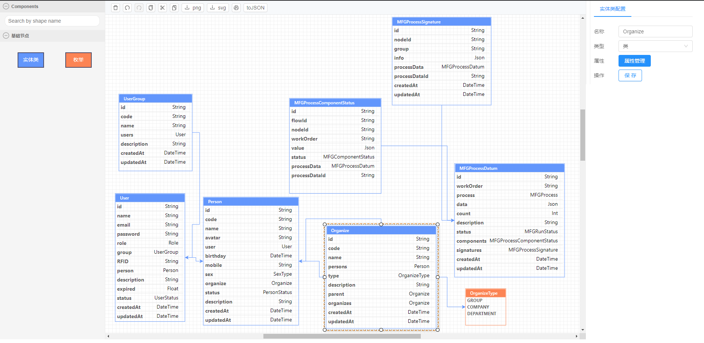
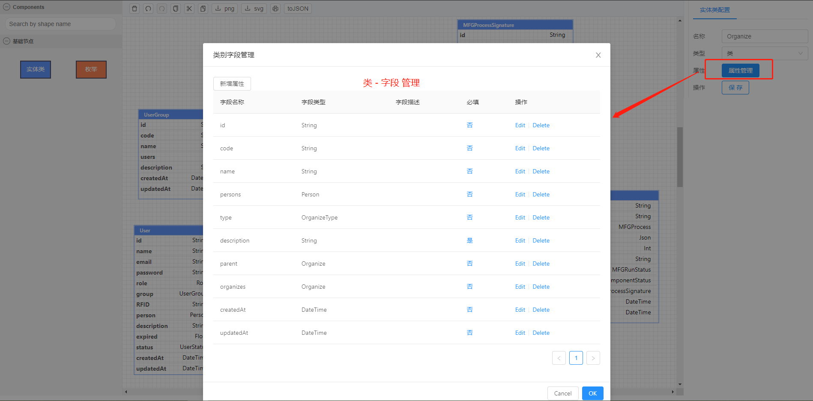
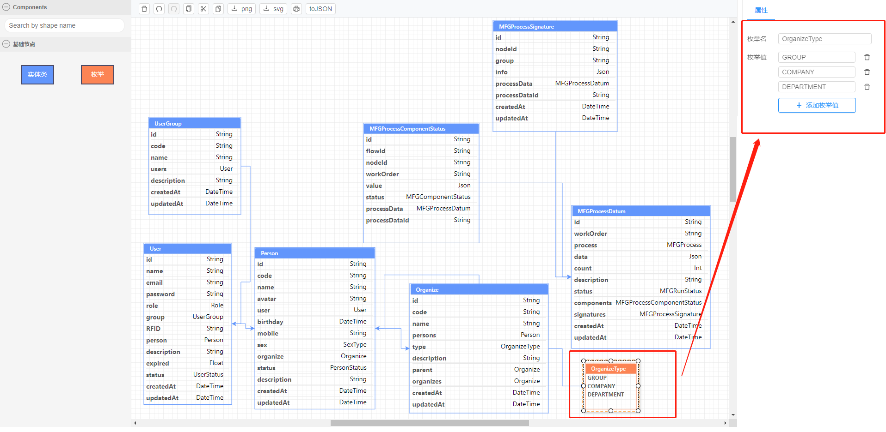
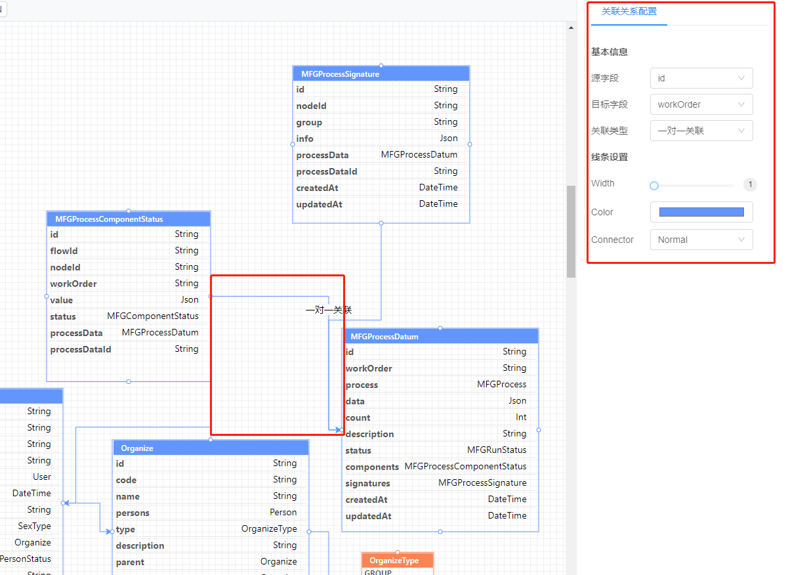

### 项目介绍

本项目是基于 [antv-x6](https://antv-x6.gitee.io/zh/docs/tutorial/about) 实现的一个可拖拽的 ER 模型设计 DEMO（数据根据graphql 定义进行设计，仅供学习参考）

- 左侧为控件区

- 中间为面板设计区

- 右侧为设计区组件属性配置

- demo 中服务使用的graphql，客户端使用的[vue-apollo](https://vue-apollo.netlify.com/)

### 特性

- 可视化设计界面

- 可视化属性配置

- 属性修改后，提供实时预览，生成画布json数据

- 支持x6 常用的事件（删除，撤销、重做、复制、粘贴、下载、打印）

demo源码地址 [vue-x6-demo](https://github.com/bxRita/vue-x6-demo) ，下载下来后 安装即可运行查看效果

最终效果展示如下：



选择一个类，点击右侧属性管理 -> 类别属性管理界面（对类别中的字段进行维护）：


枚举属性管理界面：


关联关系管理界面：



#### 技术点：

1.  拖拽用到[x6-dnd](https://antv-x6.gitee.io/zh/docs/tutorial/basic/dnd)

    - Stencil 

    注意： Stencil 拖拽到画布中时，默认是Stencil左侧面板组件通过getDropNode方法可修改最终放到画布上的Node

2. 画布区节点展示

    - 使用的是vue组件渲染，[官网地址](https://antv-x6.gitee.io/zh/docs/tutorial/advanced/react#%E6%B8%B2%E6%9F%93-vue-%E8%8A%82%E7%82%B9)

    注意：需要安装相应的依赖

    ```
    # yarn
    yarn add @antv/x6-vue-shape

    # 在 vue2 下还需要安装 @vue/composition-api
    yarn add @vue/composition-api --dev

    在渲染 vue 组件的过程中用到了运行时编译，所以需要在 vue.config.js 中启用 runtimeCompiler: true 配置。同样当 component 为 Vue 组件或函数时，将不能通过 graph.toJSON() 方法导出画布数据。我们同样提供了 Graph.registerVueComponent(...) 来解决这个问题。
    ```
3. 右侧属性面板用的是[ant-design-vue](https://www.antdv.com/docs/vue/getting-started-cn/)组件库的组件渲染

4. 属性修改更新到面板使用的是全局的vuex作为双向绑定


借鉴项目：

- [x6 官网](https://antv-x6.gitee.io/zh/docs/tutorial/about)

- x6 官网ER展示[DEMO](https://github.com/antvis/X6/tree/master/examples/x6-app-er)

- csdn博客上的一个[流程项目](https://blog.csdn.net/weixin_44213308/article/details/111872455)