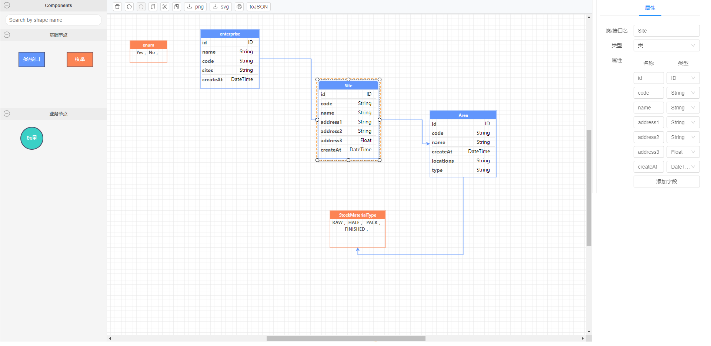

# vue-x6-demo

## Project setup

```
yarn install
```

### Compiles and hot-reloads for development

```
yarn serve
```

### Compiles and minifies for production

```
yarn build
```

### Lints and fixes files

```
yarn lint
```

### Customize configuration

See [Configuration Reference](https://cli.vuejs.org/config/).

### 项目介绍

本项目是基于 [antv-x6](https://antv-x6.gitee.io/zh/docs/tutorial/about) 实现的一个可拖拽的 ER 设计 DEMO

- 左侧为控件区

- 中间为面板设计区

- 右侧为设计区组件属性配置

最终效果展示：

