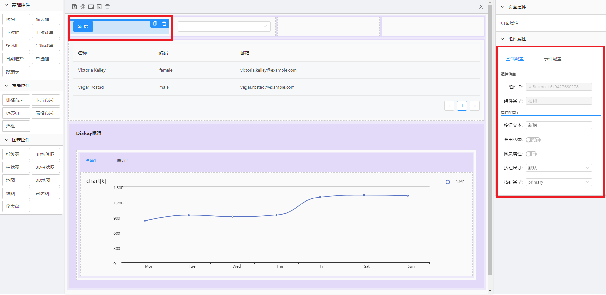
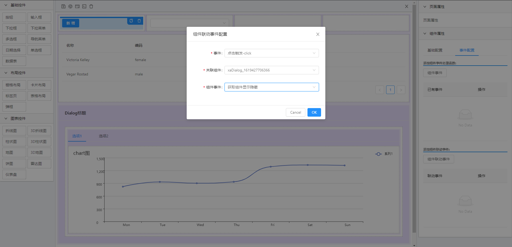
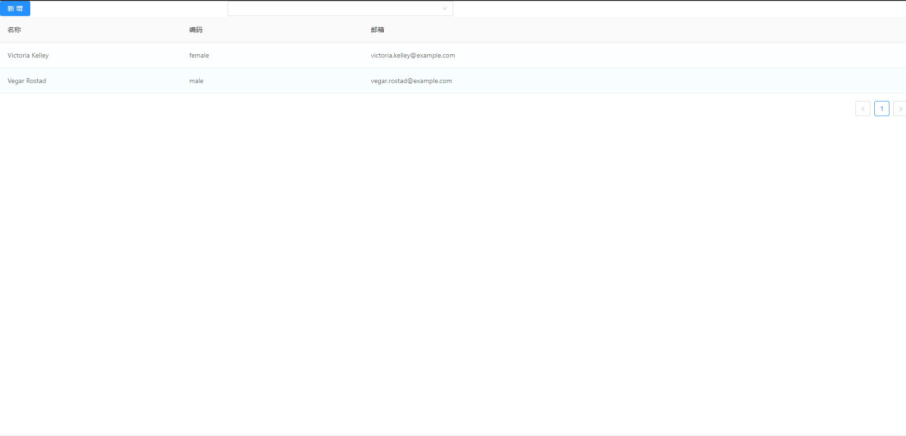
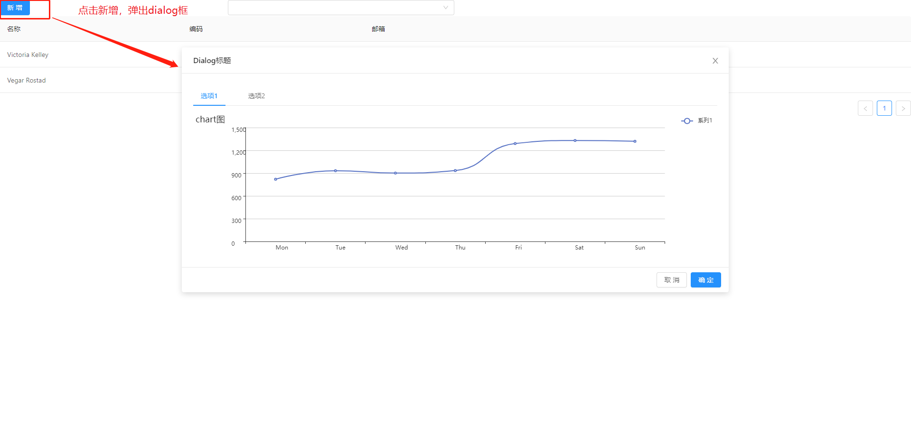
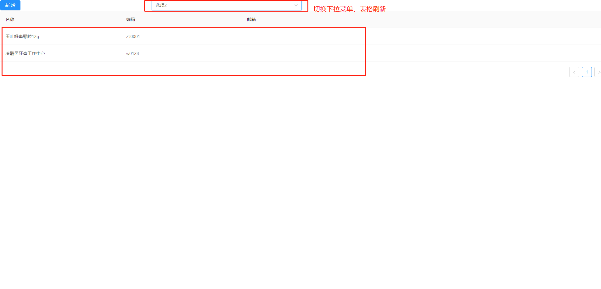

### 项目介绍

该项目是一个用来快速生成页面的前端设计器

- 左侧为控件区
    - 基础控件：按钮，输入框，下拉框，下拉菜单，多选框，导航菜单，日期选择，单选框，数据表
    - 布局控件：栅格布局，卡片布局，弹框，页签tabs，表格
    - 图表控件：echarts图表（折线图、3D折线图、柱状图、3D柱状图、地图、3D地图、饼图、雷达图、仪表盘）

- 中间为面板设计区
    - 顶部工具栏
    - 中间设计面板
- 右侧为设计区组件属性配置
    - 通用页面属性
    - 组件属性

### 特性

- 可视化设计界面

- 可视化属性配置

- 属性修改后，提供实时预览，生成json数据

demo源码地址 [page-design-demo](./page-design-demo) ，下载下来后 安装即可运行查看效果

如：设计一个带表格的搜索界面，1、点击新增弹出Dialog对话框，2、点击下拉框 刷新表格数据：   

最终效果展示： 

1. 配置组件基础属性

2. 配置组件关联事件

3. 预览效果

#### 相关技术

1. 框架使用的vue-cli3 ,vue 版本2.6，组件库使用的是ant-design

2. 左侧组件列表是对ant-design中组件进行一层包装处理
    - 组件属性配置 参考
    - 组件的可配置属性和事件，都在项目中配置