## 1.1 大型网站软件系统的特点：

- 高并发，大流量
- 高可用
- 海量数据
- 用户分布广泛，网络情况复杂
- 安全环境恶劣
- 需求快速变更，发布频繁
- 渐进式发展

## 1.2 大型网站架构眼花发展历程

- 1.2.1 初始阶段的网站架构  
  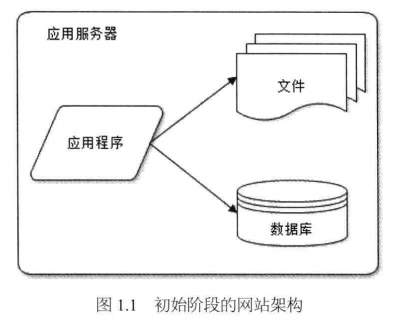
- 1.2.2 应用服务和数据服务分离  
  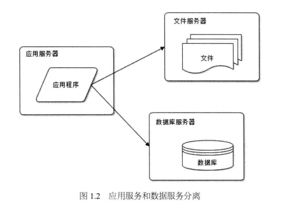
- 1.2.3 使用缓存改善网站性能  
  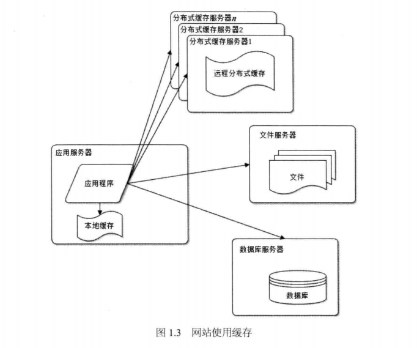
- 1.2.4 使用应用服务器集群改善网站的并发处理能力  
  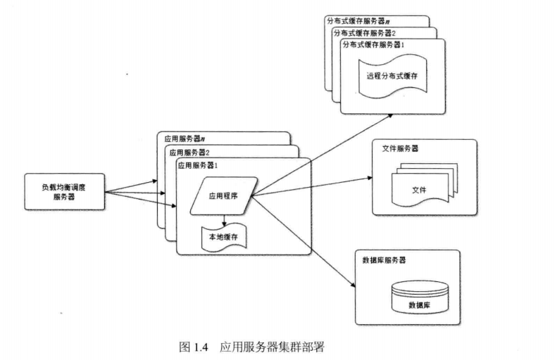
- 1.2.5 数据库读写分离  
  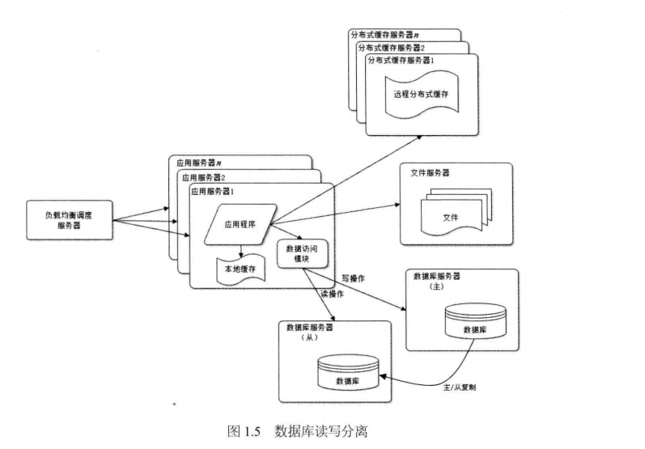
- 1.2.6 使用反向代理和 CDN 加速网站响应  
  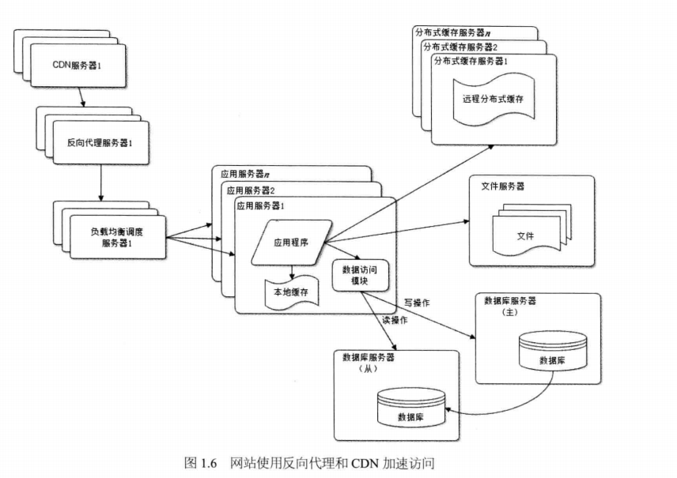
- 1.2.7 使用分布式文件系统和分布式数据库系统  
  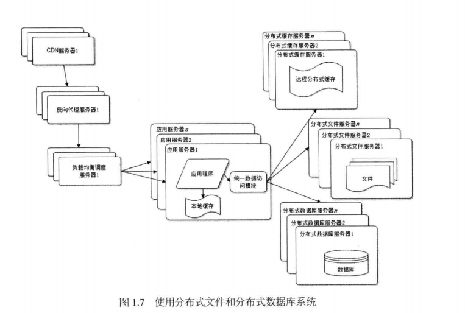
- 1.2.8 使用 NoSQL 和搜索引擎  
  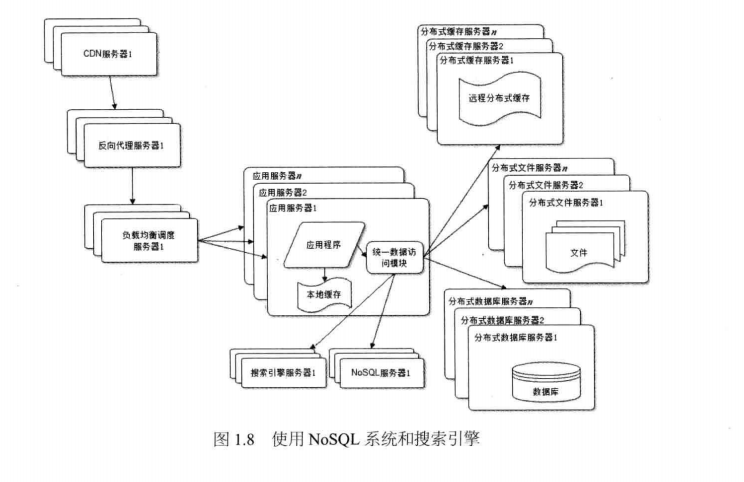
- 1.2.9 业务拆分  
  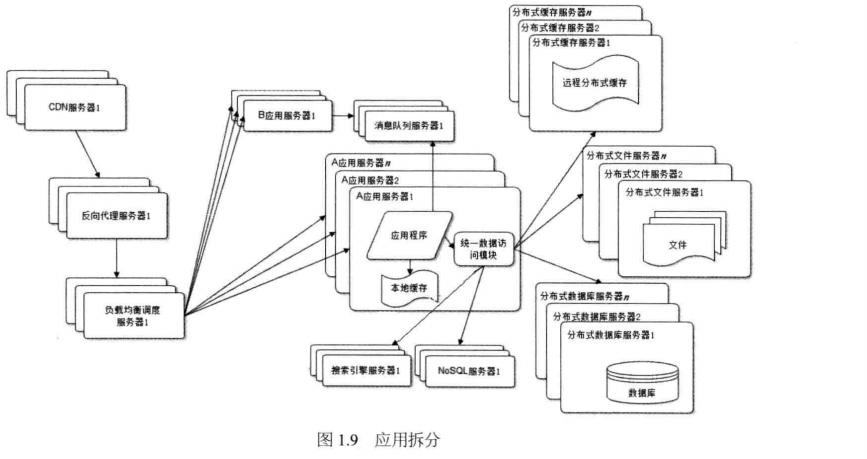
- 1.2.10 分布式服务  
  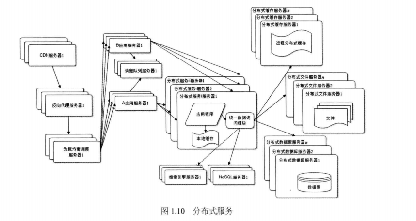

大型网站的架构演化到这里，基本上大多数的技术问题都得以解决，诸如跨数据中心的实时数据同步和具体网站业务相关的问题也都可通过组合改进现有技术架构来解决。

## 1.3 大型网站架构演化的价值观

这个世界没有哪个网站从诞生起就是大型网站，也没有哪个网站第一次发布就拥有庞大的用户，高并发的访问，海量的数据；大型网站都是从小网站发展而来的。网站的价值就在于它能为用户提供什么价值，在于网站能做什么，而不是在于它是怎么做的，所以在网站还很小的时候就去追求网站的架构是舍本逐末，得不尝失的。小型网站最需要做的就是为用户提供好的服务来创造价值，得到用户的认可，活下去，野蛮生长。

### 1.3.1 大型网站架构技术的核心价值是随网站所需灵活应对

大型网站架构技术的核心价值不是从无到有搭建一个大型网站，而是能够伴随小型网站的业务的逐步发展，慢慢地演化成一个大型网站。

### 1.3.2 驱动大型网站技术发展的主要力量是网站的业务发展

创新的业务发展模式对网站架构逐步提出更高要求，才使得创新的网站架构得以发展成熟。是业务成就了技术，是事业成就了人，而不是相反。所以网站架构师应该对成就自己技术成绩的网站事业心存感恩，并努力提高技术回馈业务，才能在快速发展的互联网领域保持持续进步。  
不过我们也看到有些传统企业投身互联网，在业务问题还没有理清楚的时候就从外面挖来许多技术高手，仿照成功的互联网公司打造技术平台，这无疑南辕北辙，缘木求鱼。而这些技术高手离开它们熟悉的环境和工作模式，也是张飞拿着绣花鞋使不上劲来。

## 1.4 网站架构设计误区

### 1.4.1 一味追随大公司的解决方案

由于大公司巨大成功的光环效应，再加上从大公司挖来的技术高手的影响，网站讨论架构决策时，最有说服力的一句话就成了“淘宝就是这么搞得”或者“FaceBook 就是这么搞得”  
大公司的经验和成功模式固然重要，值得学习借鉴，但如果因此变得盲从，就失去了坚持自我的勇气，在架构演化的道路上迟早会迷路。

### 1.4.2 为了技术而技术

网站技术是为了业务而存在的，除此毫无意义。在技术选型和架构设计中，脱离网站业务发展的实际，一味追求时髦的新技术，可能会将网站技术的发展引入崎岖小道，架构之路越走越难。

### 1.4.3 企图用技术解决所有问题

最典型的例子就是 2012 年年初的 12306 故障，软件开发技术界的反应。

各路专业和非专业人士众说纷纭地帮 12306 的技术出谋划策，甚至有人提议帮 12306 写一个开源的网站，解决其大规模并发访问的问题。

12306 真正的问题其实不在于它的技术架构，而在于它的业务机构；12306 根本就不应该在几亿中国人一票难求的情况下以窗口售票的模式在网上售票（零点开始出售若干天后的车票）。12306 需要重构的不仅是它的技术架构，更重要的是它的业务架构；调整业务需求，换一种方式卖票，而不是去搞促销秒杀这种噱头式的游戏。

后来证明 12306 确实是朝这个方向发展的：在售票方式上引入了排队机制，整点售票调整为分时段售票。其实如果能控制住并发访问的量，很多棘手的技术问题也就不是什么问题了。

技术是用来解决业务问题的，而业务的问题，也可以通过业务的手段去解决。

时至今日，大型网站的架构的演化方案已经非常成熟，各种技术方案也逐渐产品化。许多小型的网站已经慢慢不再需要经历大型网站经历过的架构演化之路就可以逐步发展壮大，因为现在越来越多的网站从建立之初就是搭建在大型网站提供的云计算服务基础之上，所需要的一切技术资源：计算、存储、网络都可以按需购买，线性伸缩，不需要自己一点一点的拼凑各种资源，综合使用各种技术方案逐步去完善自己的网站架构了。

正是因为网站技术架构演化过程难以重现，所以网站架构师更应该对这个过程深刻了解，理解已成熟的网站架构技术方案的来龙去脉和历史渊源，在技术选型和架构决策时才能有的放矢，直击要害。

# 2. 大型网站架构模式

关于什么是模式，这个来自建筑学的词汇是这样定义的：“**每一个模式描述了一个在我们周围不断重复发生的问题及该问题解决方案的核心。这样，你就能一次又一次地使用该方案而不必做重复工作**”。模式的关键在于模式的可重复性，问题与场景的可重复性带来解决方案的可重复使用。

## 2.1 网站架构模式

为了解决大型网站面临的高并发访问、海量数据处理、高可靠运行等一系列问题与挑战，大型互联网公司在实践中提出了许多解决方案，以实现网站高性能、高可用、易伸缩、可扩展、安全等各种技术架构目标。这些解决方案又被更多网站重复使用，从而逐渐形成大型网站架构模式。

### 2.1.1 分层

分层是企业应用系统中最常见的一种架构模式，将系统在横向维度上切分成几个部分，每个部分负责一部分相对比较单一的职责，然后通过上层对下层的依赖和调用组成一个完整的系统。

### 2.1.2 分割

如果说分层是将软件在横向方面进行切分，那么分割就是在纵向方面对软件进行切分。

网站越大，功能越复杂，服务和数据处理的种类也越多，将这些不同的功能和服务分割开来，包装成高内聚低耦合的模块单元，一方面有助于软件的开发和维护；另一方面，便于不同模块的分布式部署，提高网站的并发处理能力和功能扩展能力。

### 2.1.3 分布式

对于大型网站，分层和分割的一个主要目的是为了切分后的模块便于分布式部署，即将不同模块部署在不同的服务器上，通过远程调用协同工作。分布式意味着可以使用更多的计算机完成同样的功能，计算机越多，CPU、内存、存储资源也就越多，能够处理的并发访问和数据量越大，进而能够为更多的用户提供服务。

但分布式在解决网站高并发问题的同时，也带来了其它问题。首先，分布式意味着服务调用必须通过网络，这可能会对性能造成比较严重的影响；其次，服务器越多，服务器宕机的概率也就越大，一台服务器宕机造成的服务不可用可能会导致很多应用不可访问，使网站可用性降低；另外，数据在分部署的环境中保持数据一致性也非常困难，分布式事务也难以保证，这对网站业务正确性和业务流程有可能造成很大影响；分布式还导致网站依赖错综复杂，开发管理维护困难。因此分布式设计要根据具体情况量力而行，切莫为了分布式而分布式。

在网站应用中，常见的分布式方案有以下几种：  
**分布式应用和服务：**将分层和分割后的应用和服务模块分布式部署，除了可以改善网站性能和并发性、加快开发和发布速度、减少数据库链接资源消耗外；还可以使不同应用复用共同的服务，便于业务功能扩展。

**分布式静态资源：**网站的静态资源如 JS，CSS，LOGO 图片等资源独立分布式部署，并采用独立的域名，即人们常说的动静分离。静态资源分部署部署可以减轻应用服务器的负载压力；通过使用独立域名加快浏览器并发加载的速度；由负责用户体验的团队进行开发维护有利于网站分工合作，使不同技术工种术业有专攻。

**分布式数据和存储：**大型网站需要处理以 P 为单位的海量数据，单台计算机无法提供如此大的存储空间，这些数据需要分布式存储。除了对传统的关系数据库进行分布式存储外，为网站应用而生的 NoSql 产品几乎都是分布式的。

**分布式计算：**严格说来，应用、服务、实时数据处理都是计算，网站除了要处理这些在线业务，还有很大一部分用户没有直观感受的后台业务要处理，包括搜索引擎的索引构建、数据仓库的数据分析统计等。这些业务的计算规模非常庞大，目前网站普遍使用 Hadoop 及其 MapReduce 分布式计算框架进行此类批处理计算，其特点是移动计算而不是移动数据，将计算程序分发到数据所在的位置以加速计算和分布式计算。

### 2.1.4 集群

使用分布式虽然已经将分层和分割后的模块独立部署，但是对于用户访问集中的模块（比如网站的首页），还需要将独立部署的服务器集群化，即多台服务器部署相同应用构成一个集群，通过负载均衡设备共同对外提供服务。

因为服务器集群有更多服务器提供相同服务，因此可以提供更好的并发特性，当有更多用户访问的时候，只需要向集群中加入新的机器即可。同时因为一个应用由多台服务器提供，当某台服务器故障时，负载均衡设备或者系统的失效机制会将请求转发到集群中的其它服务器上，使服务器故障不影响用户使用。所以在网站应用中，即使使访问量很小的分布式应用和服务，也至少要部署两台服务器构成一个小的集群，目的就是提高系统的可用性。

### 2.1.5 缓存

缓存就是将数据存放在距离计算最近的位置以加快处理速度。缓存是改善软件性能的第一手段，现代 CPU 越来越快的一个重要因素就是使用了更多的缓存，在复杂的软件设计中，缓存几乎无处不在。大型网站架构设计在很多方面都使用了缓存设计。  
**CDN**

**反向代理**

**本地缓存**

**分布式缓存**

### 2.1.6 异步

异步架构是典型的生产者消费者模式，两者不存在直接调用，只要保持数据结构不变，彼此功能实现可以随意变化而不互相影响，这对网站扩展新功能非常便利。

- 提高系统可用性
- 加快网站响应速度
- 消除并发访问高峰

### 2.1.7 冗余

访问和负载很小的服务器也必须部署至少两台服务器构成一个集群，其目的就是通过冗余实现服务高可用。数据库除了定期备份，存档保存，实现冷备份外，为了保证在线业务高可用，还需要对数据库进行主从分离，实时同步实现热备份。

### 2.1.8 自动化

在无人值守的情况下网站可以正常运行，一切都可以自动化是网站的理想状态。目前大型网站的自动化构架设计主要集中在发布运维方便。  
发布过程自动化  
自动化代码管理  
自动化测试  
自动化安全检测  
自动化部署  
自动化监控  
自动化报警  
自动化失效转移  
自动化失效恢复  
自动化降级  
自动化分配资源

### 2.1.9 安全

互联网的开放特性使得其从诞生起就面对巨大的安全挑战，网站在安全架构方面也积累了许多模式：通过**密码和手机校验码**进行身份认证；登录、交易等操作需要对网络通信进行加密，网站服务器上存储的敏感数据如用户信息等也进行加密处理；为了防止机器人程序滥用网络资源攻击网站，使用**验证码**进行识别；对于常见的用于攻击网站 XSS 攻击、SQL 注入、进行编码转换等响应处理；对于垃圾信息、敏感信息进行过滤；对于交易转账等重要操作根据交易模式和交易信息进行**风险控制。**

# 3 大型网站核心架构要素

关于什么是架构，一种比较通俗的说法是“最高层次的规划，难以改变的决定”，这些规划和决定奠定了事物未来发展的方向和最终的蓝图。

具体到**软件架构**，维基百科是这样定义的：**“有关软件整体结构与组件的抽象描述，用于指导大型软件系统各个方面的设计”**。系统的各个重要组成部分及其关系构成了系统的架构，这些组成部分可以是具体的功能模块，也可以是肺功能的设计与决策，他们相互关系组成一个整体，共同构成了软件系统的架构。

## 3.1 性能

性能是网站的一个重要指标，处方没得选择（比如 12306），否则用户无法忍受一个响应缓慢的网站。

性能是网站架构设计的一个重要方面，任何软件架构设计方案都必须考虑可能会带来的性能问题。

也正是因为性能问题几乎无处不在，所以优化网站性能的手段也非常多，从用户浏览器到数据库，影响用户请求的所有环节都可以进行性能优化。

在浏览器端，可以通过浏览器缓存、使用页面压缩、合理布局页面、减少 Cookie 传输等手段改善性能。

还可以使用 CDN，将网站静态内容分发至离用户最近的网络服务商机房，使用户通过最短的访问路径获取数据。可以在网站机房部署反向代理服务器，缓存热点文件，加快请求响应速度，减轻应用服务器负载压力。

在应用服务端，可以使用服务器本地缓存和分布式缓存，通过缓存在内存中的热点数据处理用户请求，加快请求处理过程，减轻数据库负载压力。

也可以通过异步操作将用户请求发送至消息队列等待后续任务处理，而当前请求直接返回响应用户。

在网站有很多用户高并发请求的情况下，可以将多台应用服务器组成一个集群共同对外服务，提高整体处理能力，改善性能。

## 3.2 可用性

因为网站使用的服务器硬件同测是普通的商用服务器，这些服务器的设计目标本身并不保证高可用，也就说，很有可能会出现服务器硬件故障，也就俗称的服务器宕机。大型网站通常都会有上万台服务器，每天都必定会有一些服务器宕机，因此网站高可用架构设计的前提是必然会出现服务器宕机，而高可用设计的目标就是当服务器宕机的时候，服务或者应用依然可用。

网站高可用的主要手段是冗余，应用部署在多台服务器上同时提供访问，数据存储在多台服务器上互相备份，任何一台服务器宕机都不会影响应用的整体可用，也不会导致数据丢失。

除了运行环境，网站的高可用还需要软件开发过程的质量保证。 通过预发布验证、自动化测试、自动化发布、灰度发布等手段，减少将故障引入线上环境的可能，避免故障范围扩大。

衡量一个系统架构设计是否满足高可用的目标，就是假设系统中任何一台或者多台服务器宕机时，以及出现各种不可预期的问题时，系统整体是否依然可用。

## 3.3 伸缩性

所谓的伸缩性是指通过不断向集群中加入服务器的手段来缓解不断上升的用户并发访问压力和不断增长的数据存储需求。

衡量架构伸缩性的主要标准就是是否可以用多台服务器构建集群，是否容易向集群中添加新的服务器。加入新的服务器后是否可以提供和原来的服务器无差别的服务。集群中可容纳的总的服务器数量是否有限制。

## 3.4 扩展性

不同于其它架构要素主要关注非功能性需求，网站的扩展性架构直接关注网站的功能性需求。网站快速发展，功能不断扩展，如何设计网站的架构使其能够快速响应需求变化，是网站可扩展架构的主要目的。

衡量网站架构扩展性好坏的主要标准就是在网站增加新的业务产品时，是否可以实现对现有产品透明无影响，不需要任何改动或者很少改动既有业务功能就可以上线新产品。不同产品之间是否很少耦合，一个产品改动是否对其它产品无影响，其它产品和功能不需要手牵连进行改动。

网站可伸缩架构的主要手段是事件驱动架构和分布式服务。

事件驱动架构在网站通常利用消息队列实现，将用户请求和其它业务事件构成消息发布到消息队列，消息的处理者作为消费者从消息队列中获取消息进行处理。通过这种方式将消息产生和消息处理分离开来，可以透明的增加新的消息生产者任务或者新的消息消费者任务。

## 3.5 安全性

互联网是开放的，任何人在任何地方都可以访问网站。网站的安全架构就是保护网站不受恶意访问和攻击，保护网站的重要数据不被窃取。

衡量网站安全架构的标准就是针对现存和潜在的各种攻击和窃密手段，是否有可靠的应对策略。

# 架构

# 4. 瞬时响应：网站的高性能架构

## 4.1 网站性能测试

性能测试是性能优化的前提和基础，也是性能优化结果的检查和度量标准。不同视角下的网站性能有不同标准，也有不同的优化手段。

### 4.1.1 不同视角下的网站性能

1. 用户视角的网站性能

2. 开发人员视角的网站性能

3. 运维人员视角的网站性能

### 4.1.2 性能测试指标

不同视角下有不同的性能标准，不同的标准有不同的性能测试指标，从开发和测试人员的视角，网站性能测试的主要指标有响应时间、并发数、吞吐量、性能计数器等。

1. 响应时间  
   指应用执行一个操作需要的时间，包括从发出请求开始到请求收到最后响应数据所需要的时间。响应时间是系统最重要的性能指标，直观反映了系统的快慢。下表列出了常用的操作系统需要的响应时间：  
   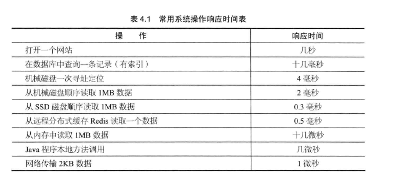

测试程序通过模拟应用程序，记录收到响应和发出请求之间的时间差来计算系统响应时间。但是记录及获取系统时间这个操作也需要花费一定的时间，如果测试目标操作本身需要花费的时间极少，比如微妙，那么测试程序就无法测试得到系统的响应时间。

实践中通常采用的办法就是重复请求，比如一个请求操作重复执行一万次，测试一万次执行需要的总响应时间之和，然后除以一万，得到单词请求的响应时间。

2. 并发数

指系统能够同时处理请求的数目，这个数字也反映了系统的负载特性。对于网站而言，并发数即网站并发用户数，指同时提交请求的用户数目。

与网站并发用户数相对应的还有网站在线用户数（当前登陆网站的用户总数）和网站系统用户数（可能访问系统的总用户数，对多数网站而言就是注册用户数）。其数量比较关系为：  
网站系统用户数》网站在线用户数》网站并发用户数

在网站产品设计初期，产品经理和运营人员就需要规划不同发展阶段的网站系统用户数，并以此为基础，根据产品特性和运营手段，推算在线用户数和并发用户数。这些指标将成为系统非功能设计的重要依据。

3. 吞吐量

指单位时间内系统处理的请求数量，体现系统的整体处理能力。对于网站，可以用“请求数/秒”来衡量，也可以用“访问人数/天”或是“处理的业务数/小时”等来衡量。TPS（每秒事务数）是吞吐量的一个常用量化指标，此外还有 HPS（每秒 HTTP 请求数）、QPS（每秒查询数）等。

在系统并发数由小逐渐增大的过程中（这个过程也伴随着服务器系统资源消耗逐渐增大），系统吞吐量先是逐渐增加，达到一个极限后，随着并发数的增加反而下降，达到系统崩溃点后，系统资源耗尽，吞吐量为零。

4. 性能计数器

它是描述服务器或操作系统性能的一些数据指标。包括 System Load、对象和线程数、内存使用、CPU 使用、磁盘与网络 I/O 等指标。这些指标也是系统监控的重要参数，对这些指标设置报警阈值，当监控系统发现性能计数器超过阈值时，就向运维和开发人员报警，及时发现处理系统异常。

System Load 即系统负载，指当前正在被 CPU 执行和等待被 CPU 执行的进程总数目总和，是反映系统忙闲程度的重要指标。多核 CPU 的情况下，完美情况是所有 CPU 都在使用，没有进程在等待处理，所以 Load 的理想值是 CPU 的数目。当 Load 值低于 CPU 数目的时候，表示 CPU 有空闲，资源存在浪费；当 Load 值高于 CPU 数目的时候，表示进程在排队等待 CPU 调度，表示系统资源不足，影响应用程序的执行性能。

### 4.1.3 性能测试方法

性能测试是一个总称，具体可细分为性能测试、负载测试、压力测试、稳定性测试。

**性能测试**  
以系统设计初期规划的性能指标为预期目标，对系统不断施加压力，验证系统在资源可接受范围内，是否能达到性能预期。

**负载测试**  
对系统不断地增加并发请求以增加系统压力，直到系统的某项或多项性能指标达到安全临界值，如某种资源已经呈现饱和状态，这时继续对系统施加压力，系统的处理能力不但不能提高，反而会下降。

**压力测试**
超过安全负载的情况下，对系统继续施加压力，直到系统崩溃或不能再处理任何请求，以此获得系统最大压力承受能力。

**稳定性测试**  
被测试系统在特定硬件、软件、网络环境条件下，给系统加载一定业务压力，使系统运行一段较长时间，以此检测系统是否稳定。在不同生产环境、不同时间点的请求压力是不均匀的，呈波浪特性，因此为了更好地模拟生产环境，稳定性测试也应不均匀地对系统施加压力。

### 4.1.4 性能测试报告

测试结果报告应能够反映上述性能测试曲线的规律，阅读者可以得到系统性能是否满足设计目标和业务要求、系统最大负载能力、系统最大压力承受能力等重要信息，下表是个简单示例：  
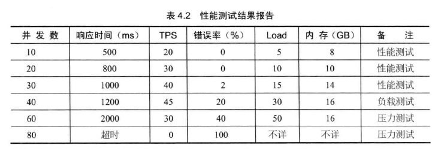

### 4.1.5 性能优化策略

如果性能测试结果不能满足设计或业务需求，那么就需要寻找系统瓶颈，分而治之，逐步优化。

**1.性能分析**  
大型网站结构复杂，用户从浏览器发出请求直到数据库完成操作事务，中间需要经过很多环节，如果测试或者用户报告网站响应缓慢，存在性能问题，必须对请求经历的各个环节进行分析，排查可能出现性能瓶颈的地方，定位问题。

排查一个网站的性能瓶颈和排查一个程序的性能瓶颈的手法基本相同：检查请求处理的各个环节的日志，分析哪个环节响应时间不合理、超过预期；然后检查监控数据，分析影响性能的主要因素是内存、磁盘、网络、还是 CPU，是代码问题还是架构设计不合理，或者系统资源确实不足。

**2.性能优化**  
定位产生性能问题的具体原因后，就需要进行性能优化，根据网站分层架构，可分为 Web 前端性能优化、应用服务器性能优化、存储服务器性能优化 3 大类。

## 4.2 前端性能优化

### 4.2.1 浏览器访问优化

1. 减少 http 请求

2. 使用浏览器缓存

3. 启用压缩

4. CSS 放在页面的最上面、JavaScript 放在页面最下面

5. 减少 Cookie 传输

### 4.2.2 CDN 加速

CDN(Content Distribute Network, 内容分发网络)

CDN 能够缓存的一般是静态资源，如图片、文件、CSS、Script 脚本、静态网页等，但是这些文件访问频度很高，将其缓存在 CDN 可极大改善网页的打开速度。

### 4.2.3 反向代理

传统的代理服务器位于浏览器一侧，代理浏览器将 HTTP 请求发送到互联网上，而反向代理服务器位于网站机房一侧，代理网站 Web 服务器接收 HTTP 请求。如图：  

和传统代理服务器可以保护浏览器安全一样，反向代理服务器也具有保护网站安全的作用，来自互联网得访问请求必须经过代理服务器，相当于在 Web 服务器和可能得网络攻击之间建立了一个屏障。

除了安全功能，代理服务器也可以通过配置缓存功能加速 Web 请求。当用户第一次访问静态内容得时候，静态内容就被缓存在反向代理服务器上，这样当其他用户访问该静态内容的时候，静态内容就被缓存在反向代理服务器上，这样当其它用户访问该静态内容的时候，就可以直接从反向代理服务器返回，加速 Web 请求响应速度，减轻 Web 服务器负载压力。事实上，有些网站会把动态内容也缓存在代理服务器上，比如维基百科及某些论坛网站，把热门词条、帖子、博客缓存在反向代理服务器上，加速用户访问速度，当这些动态内容有变化时，通过内部通知机制通知反向代理缓存失效，反向代理会重新加载最新的动态内容再次缓存起来。

此外，反向代理也可以实现负载均衡的功能，而通过负载均衡构建的应用集群可以提高系统总体处理能力，进而改善网站高并发情况下的性能。

## 4.3 应用服务器性能优化

应用服务器就是处理网站业务的服务器，网站的业务代码都部署在这里，是网站开发最复杂，变化最多的地方，优化手段主要有缓存、集群、异步等。

### 4.3.1 分布式缓存

> 网站性能优化第一定律：优先考虑使用缓存优化性能。

1. 缓存的基本原理

缓存指将数据存储在相对较高访问速度的存储介质中，以供系统处理。一方面缓存访问速度快，可以减少数据访问的时间，另一方面如果缓存的数据是经过计算处理得到的，那么被缓存的数据无需重复计算即可直接使用，因此缓存还起到了减少计算时间的作用。

缓存的本质是一个内存 Hash 表，网站应用中，数据缓存以一对 Key、Value 的形式存储在内存 Hash 表中。Hash 表数据读写的时间复杂度为 O(1)

网站数据访问通常遵循二八定律，即 80%的访问落在 20%的数据上，因此利用 Hash 表和内存的高速访问特性，将这 20%的数据缓存起来，可很好地改善系统性能，提高数据读取速度，降低存储访问压力。

2. 合理使用缓存  
   使用缓存对提高系统性能有很多好处，但是不合理使用缓存非但不能提高系统的性能，还会成为系统的累赘，甚至风险。实践中，缓存滥用的情景屡见不鲜。

- 频繁修改的数据

- 没有热点的访问

- 数据不一致与脏读

- 缓存可用性

通过分布式缓存服务器集群，将缓存数据分布到集群多台服务器上可在一定程度上改善缓存的可用性。当一台缓存服务器宕机的时候，只有部分缓存数据丢失，重新从数据库加载这部分数据不会对数据库产生很大影响。

- 缓存预热

缓存中存放的是热点数据，热点数据又是缓存系统利用 LRU（最近最久未用算法）对不断访问的数据筛选淘汰出来的，这个过程需要花费较长的时间。新启动的缓存系统如果没有任何数据，在重建缓存数据的过程中，系统的性能和数据库负载都不太好，那么最好在缓存系统启动时就把热点数据加载好，这个缓存预加载手段叫做缓存预热。对于一些元数据如城市地名列表、类目信息，可以在启动时加载数据库中全部数据到缓存进行预热。

- 缓存穿透

如果因为不切当的业务或者恶意攻击持续高并发地请求某个不存在的数据，由于缓存没有保存该数据，所有的请求都会落到数据库上，会对数据库造成很大压力，甚至崩溃。一个简单的对策是将不存在的数据也缓存起来（其 Value 为 null）.

3. 分布式缓存架构

分布式缓存指缓存部署在多个服务器组成的集群中，以集群的方式提供缓存服务。其架构方式有两种，一种是以 JBoss Cache 为代表的需要更新同步的分布式缓存，一种是以 Memcached 为代表的不互相通信的分布式缓存。

JBoss Cache 的分布式缓存在集群中所有服务器中保存相同的缓存数据，当某台服务器有缓存数据更新的时候，会通知集群中其它机器更新缓存数据或清除缓存数据。 JBoss Cache 通常将应用程序和缓存部署在同一台服务器上，应用程序可从本地快速获取缓存数据，但是这种方式带来的问题是缓存数据的数量受限于单一服务器的内存空间，而且当集群规模较大的时候，缓存更新信息需要同步到集群所有及其，其代价惊人。因而这种方案更多见于企业应用系统中，而很少在大型网站使用。

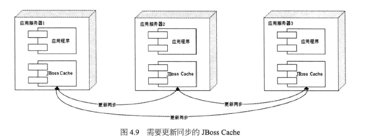

大型网站需要缓存的数据量一般都很庞大，可能会需要数 TB 的内存做缓存，这时候就需要另一种分布式缓存。

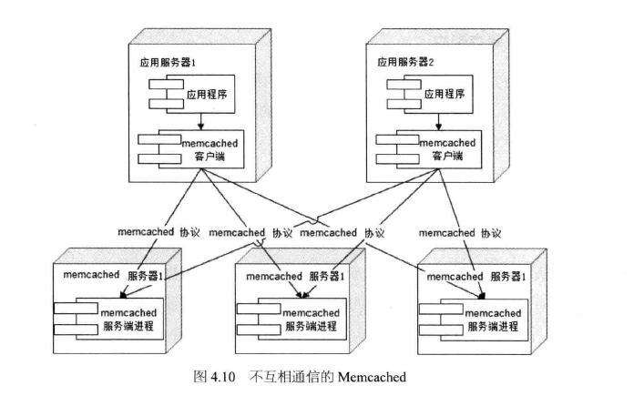

Memcached 采用一种集中式的缓存集群管理，也被称作互不通信的分布式架构方式。缓存和应用分离部署，缓存系统部署在一组专门的服务器上，应用程序通过一致性 Hash 等路由算法选择缓存服务器远程访问缓存数据，缓存服务器之间不通信，缓存集群的规模可以很容易地实现扩容，具有良好的可伸缩性。

4. Memcached

Memcached 曾一度是网站分布式缓存的代名词，被大量网站使用。其简单的设计、优异的性能、互不通信的服务器集群、海量数据可伸缩的架构令网站架构师趋之若鹜。

**简单的通信协议**

远程通信设计需要考虑两方面的要素，一是通信协议，即选择 TCP 协议还是 UDP 协议，抑或 HTTP 协议；一是通信序列化协议，数据传输的两端，必须使用彼此可识别的数据序列化方式才能使通信得以完成，如 XML、JSON 等文本序列化协议，或者 Google Probuffer 等二进制序列化协议。Memcached 使用 TCP 协议（UDP 也支持）通信，其序列化协议则是一套基于文本的自定义协议，非常简单，以一个命令关键字开头，后面使一组命令操作数。例如读取一个数据的命令协议是 get <key>。Memcached 以后，许多 Nosql 产品都借鉴或直接支持这套协议。

**丰富的客户端程序**

Memecached 通信协议非常简单，只要支持该协议的客户端都可以和 Memcached 服务器通信，因此 Memcached 发展出非常丰富的客户端程序，几乎支持所有主流的网站编程语言，Java、C/C++、Perl、Python、PHP、Ruby 等，因此在混合使用多种编程语言的网站，Memcached 更是如鱼得水。

**高性能的网络通信**  
Memcached 服务端通信模块基于 Libevent，一个支持事件触发的网络通信程序库。

**高效的内存管理**
内存管理中一个令人头痛的问题就是内存碎片管理。操作系统、虚拟机垃圾回收在这方面想了许多办法：压缩、复制等。Memcached 使用了一个非常简单的办法——固定空间分配。Memcached 将内存空间分为一组 slab，每个 slab 里又包含一组 chunk，同一个 slab 里的每个 chunk 的大小是固定的，拥有相同 chunk 的 slab 被组织在一起，叫做 slab_class，存储数据时根据数据的 size 大小，寻找一个大于 size 的最小 chunk 将数据写入。这种内存管理方式避免了内存碎片管理的问题，内存的分配和释放都是以 chunk 为单位的。和其它缓存一样，Memcached 采用 LRU 算法释放最近最久未被访问的数据占用的空间，释放的 chunk 被标记为未用，等待下一个合适大小的数据的写入。

当然 这种方式也会带来内存浪费的问题。数据只能存入一个比它大的 chunk 里，而一个 chunk 只能存一个数据，其它空间被浪费了。如果启动参数配置不合理，浪费会更加惊人，发现没有缓存多少数据，内存就用尽了。

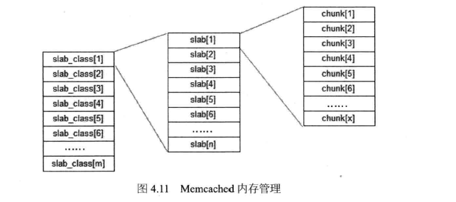

**互不通信的服务器集群架构**

### 4.3.2 异步操作

使用消息队列将调用异步化，可改善网站的扩展性。

### 4.3.3 使用集群

### 4.3.4 代码优化

1. 多线程
