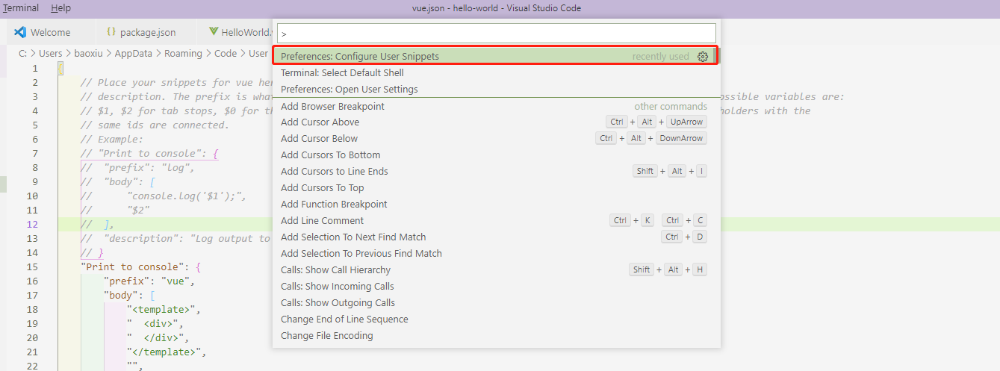
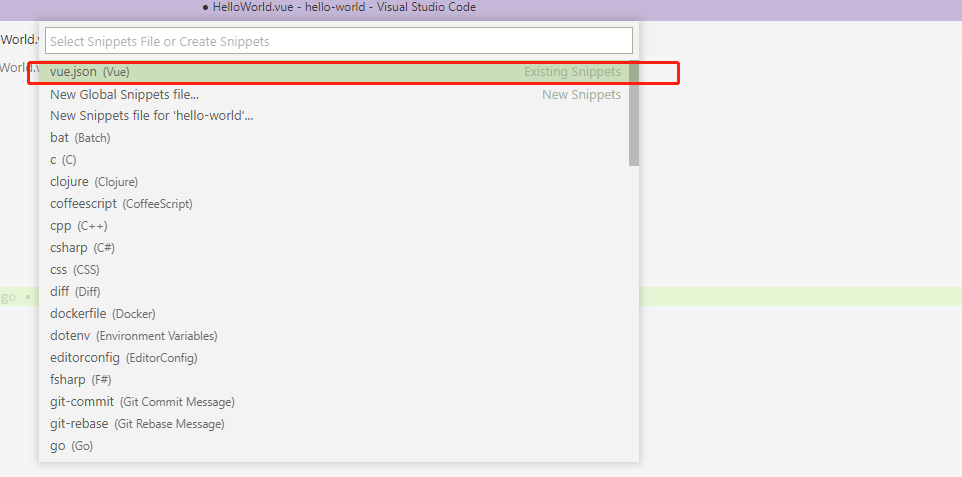
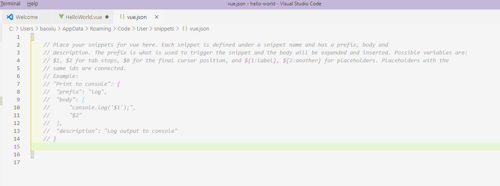
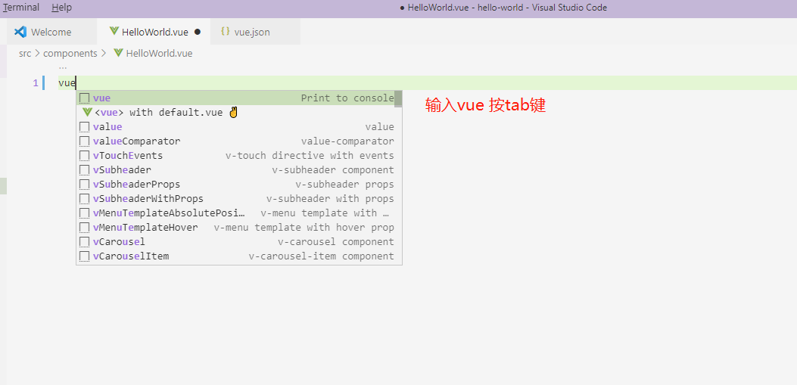
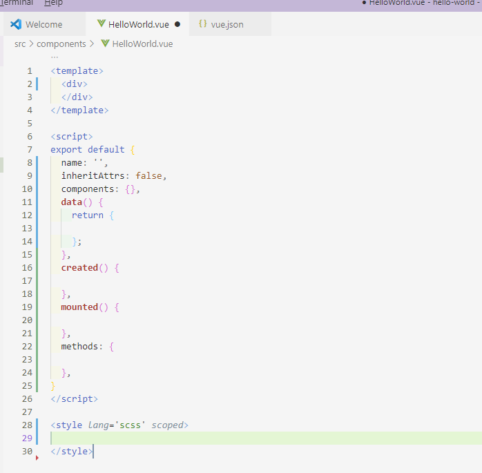

### vsCode 增加vue代码片段：

#### 第一步：进入vs code主界面–>使用快捷键“ctrl + shift + p”:

选择Configure User Snippets，假如不会出现在第一行，这时候你可以在搜索栏输入：Configure User Snippets，然后就可以找到这个选项。




#### 第二步 选择或创建vue.json





### 第三步：配置代码

```json
"Print to console": {
		"prefix": "vue",
		"body": [
			"<template>",
			"  <div>",
			"  </div>",
			"</template>",
			"",
			"<script>",
			"export default {",
			"  name: '',",
			"  inheritAttrs: false,",
			"  components: {},",
			"  data() {",
			"    return {",
			"",
			"    };",
			"  },",
			"  created() {",
			"",
			"  },",
			"  mounted() {",
			"",
			"  },",
			"  methods: {",
			"",
			"  },",
			"}",
			"</script>",
			"",
			"<style lang='scss' scoped>",
			"$4",
			"</style>"
		],
		"description": "Log output to console"
	}
```



最终生成代码如下：


