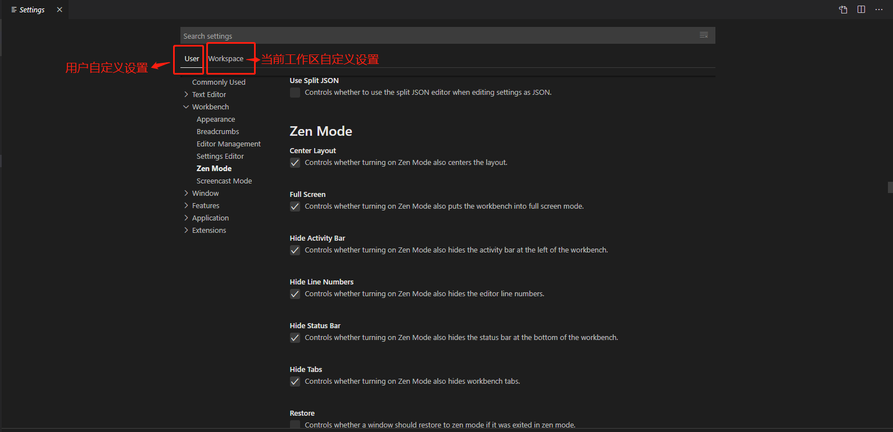
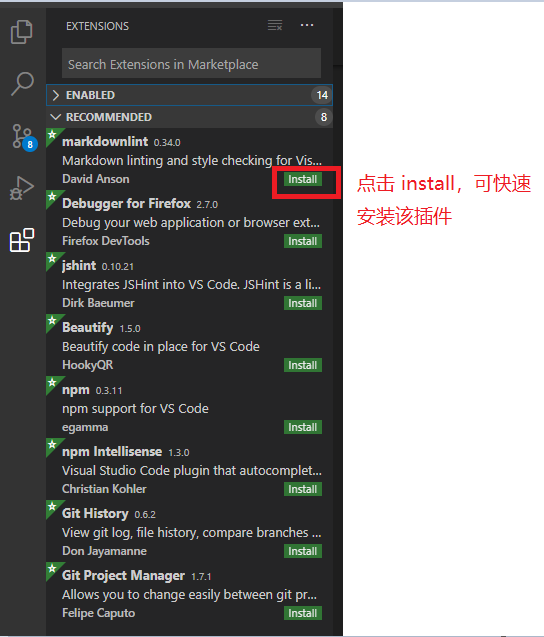
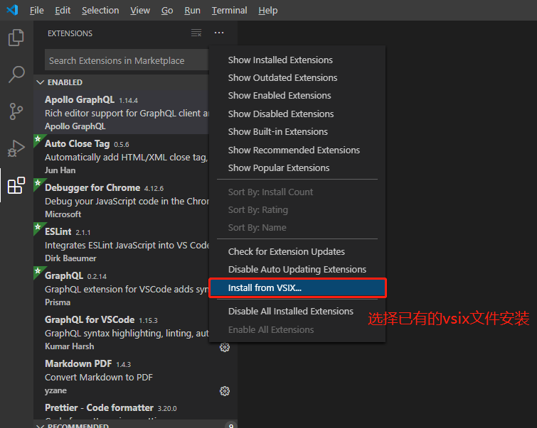
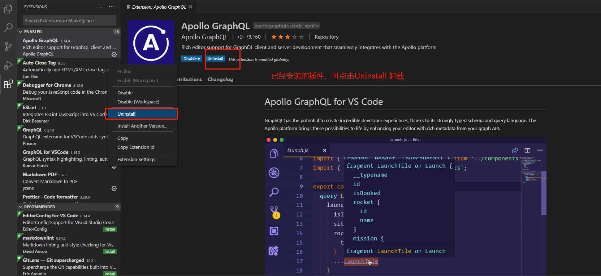
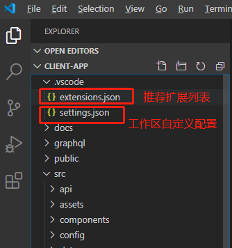
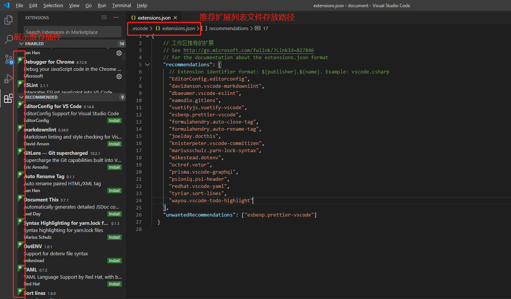

## vscode 设置与推荐插件配置说明
VSCode 提供以下扩展能力：代码自动补全、自定义命令/菜单/快捷键、悬浮提示、自定义跳转、主题定制、自定义 WebView 等等。你可以根据自己的需要随意组合使用。

### 设置
通过各种设置可以轻松配置Visual Studio Code。VS Code编辑器，用户界面和功能行为的几乎每个部分都有可以修改的选项。    

打开设置界面的方式有2种       
1. 按下面界面操作：     
- Windows/Linux  : File > Preferences > Settings
- MacOS : Code > Preferences > Settings

2. 命令的方式：   
打开命令面板（`Ctrl+Shift+P`）， 输入：`Preferences: Open Settings`       
或者通过快捷键（`Ctrl+,`）    


VS Code提供了两种不同的设置范围：   
- User Settings： 全局设置适用于您打开的任何VS Code实例。
- Workspace Settings ：存储在工作空间中的设置仅在打开工作空间时适用。

设置文件的存放路径：  
1. 用户自定义配置settings.json文件路径
    - Windows: %APPDATA%\Code\User\settings.json
    - macOS: $HOME/Library/Application Support/Code/User/settings.json
    - Linux: $HOME/.config/Code/User/settings.json
2. 工作区自定义配置settings.json文件路径
    当前项目根路径下: .vscode/settings.json

工作区自定义配置案例参考：[demo](./demo/settings.json)       
vscode 默认配置，可查看[官网](https://code.visualstudio.com/docs/getstarted/settings#_default-settings)    

### 扩展插件
> 通过扩展增加Visual Studio Code的功能

打开扩展面板命令（`Ctrl+Shift+P`）， 输入：`View: Extensions`：或者使用快捷键：`Ctrl+Shift+X`

#### 扩展插件安装
1. 通过扩展插件列表选择进行安装


2. 本地已有的vsix文件安装


或者通过 `--install-extension`命令安装已有的vsix文件
```
code --install-extension myextension.vsix
```

#### 扩展插件卸载
如果需求卸载插件，则可通过详情界面Uninstall卸载该扩展   


#### 2.工作区扩展插件配置
> 一组很好的扩展可以使用特定工作区或编程语言的工作效率更高，并且您经常希望与团队或同事共享此列表

您可以在扩展面板命令（`Ctrl+Shift+P`），使用`Extensions: Configure Recommended Extensions (Workspace)`命令为工作区创建推荐的扩展名列表。

在单个文件夹工作空间中，该命令在工作空间.vscode文件夹中创建一个extensions.json文件，您可以在其中添加扩展标识符列表（{publisherName}.{extensionName}）


第一次打开工作区时，VS Code会提示用户安装建议的扩展。用户还可以使用`Extensions: Show Recommended Extensions`命令查看列表。



详细查看[官网](https://code.visualstudio.com/docs/editor/extension-gallery#_workspace-recommended-extensions)

#### 前端开发常用插件    
- PostCSS Sorting
- stylelint
- stylefmt
- ESLint
- javascript standard format
- beautify
- Babel ES6/ES7
- Debugger for Chrome
- Add jsdoc comments
- javascript(ES6) code snippets
- vue
- weex
- Reactjs code snippets
- React Native Tools
- Npm Intellisense
- Instant Markdown
- Markdown Shortcuts
- TextTransform