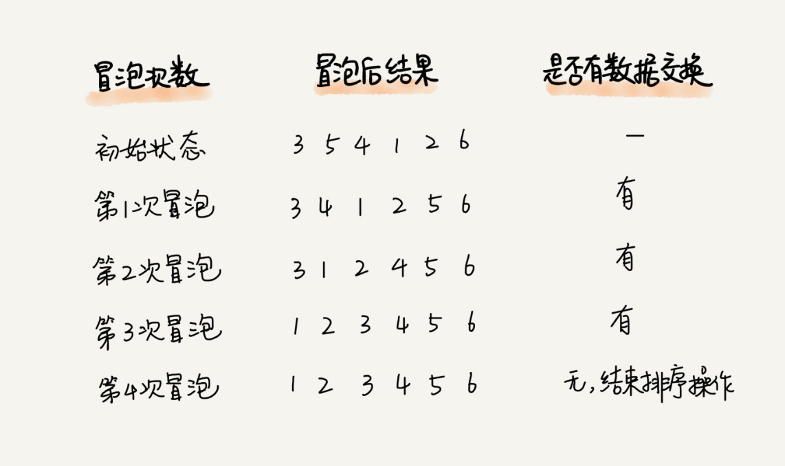
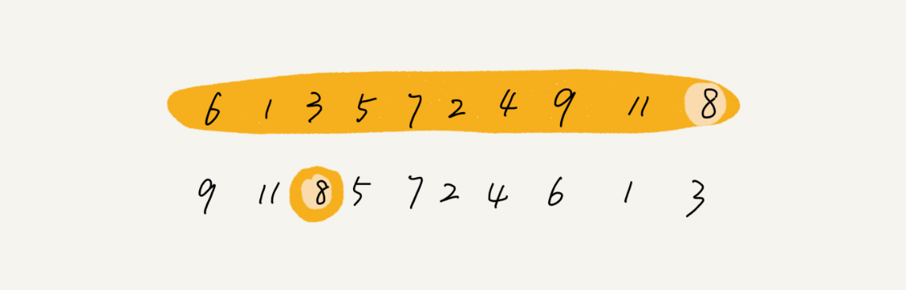

## 排序（上）：为什么插入排序比冒泡排序更受欢迎

排序对于任何一个程序员来说，可能都不会陌生。你学的第一个算法，可能就是排序。大部分编程语言中，也都提供了排序函数。在平常的项目中，我们也经常会用到排序。排序非常重要，所以我会花多一点时间来详细讲一讲经典的排序算法。

排序算法太多了，有很多可能你连名字都没听说过，比如猴子排序、睡眠排序、面条排序等。我只讲众多排序算法中的一小撮，也是最经典的、最常用的：冒泡排序、插入排序、选择排序、归并排序、快速排序、计数排序、基数排序、桶排序。我按照时间复杂度把它们分成了三类，分三节课来讲解。


带着问题去学习，是最有效的学习方法。所以按照惯例，我还是先给你出一个思考题：<font color=orange>插入排序和冒泡排序的时间复杂度相同，都是 O(n2)，在实际的软件开发里，为什么我们更倾向于使用插入排序算法而不是冒泡排序算法呢？</font>

你可以先思考一两分钟，带着这个问题，我们开始今天的内容！

### 如何分析一个“排序算法”？

学习排序算法，我们除了学习它的算法原理、代码实现之外，更重要的是要学会如何评价、分析一个排序算法。那分析一个排序算法，要从哪几个方面入手呢？

#### 排序算法的执行效率

对于排序算法执行效率的分析，我们一般会从这几个方面来衡量：

#### 1. 最好情况、最坏情况、平均情况时间复杂度

我们在分析排序算法的时间复杂度时，要分别给出最好情况、最坏情况、平均情况下的时间复杂度。除此之外，你还要说出最好、最坏时间复杂度对应的要排序的原始数据是什么样的。

为什么要区分这三种时间复杂度呢？第一，有些排序算法会区分，为了好对比，所以我们最好都做一下区分。第二，对于要排序的数据，有的接近有序，有的完全无序。有序度不同的数据，对于排序的执行时间肯定是有影响的，我们要知道排序算法在不同数据下的性能表现。

#### 2. 时间复杂度的系数、常数 、低阶

我们知道，时间复杂度反应的是数据规模 n 很大的时候的一个增长趋势，所以它表示的时候会忽略系数、常数、低阶。但是实际的软件开发中，我们排序的可能是 10 个、100 个、1000 个这样规模很小的数据，所以，在对同一阶时间复杂度的排序算法性能对比的时候，我们就要把系数、常数、低阶也考虑进来。

#### 3. 比较次数和交换（或移动）次数

这一节和下一节讲的都是基于比较的排序算法。基于比较的排序算法的执行过程，会涉及两种操作，一种是元素比较大小，另一种是元素交换或移动。所以，如果我们在分析排序算法的执行效率的时候，应该把比较次数和交换（或移动）次数也考虑进去

### 排序算法的内存消耗

我们前面讲过，算法的内存消耗可以通过空间复杂度来衡量，排序算法也不例外。不过，针对排序算法的空间复杂度，我们还引入了一个新的概念，原地排序（Sorted in place）。原地排序算法，就是特指空间复杂度是 O(1) 的排序算法。我们今天讲的三种排序算法，都是原地排序算法。

### 排序算法的稳定性

仅仅用执行效率和内存消耗来衡量排序算法的好坏是不够的。针对排序算法，我们还有一个重要的度量指标，稳定性。这个概念是说，如果待排序的序列中存在值相等的元素，经过排序之后，相等元素之间原有的先后顺序不变。

我通过一个例子来解释一下。比如我们有一组数据 2，9，3，4，8，3，按照大小排序之后就是 2，3，3，4，8，9。

这组数据里有两个 3。经过某种排序算法排序之后，如果两个 3 的前后顺序没有改变，那我们就把这种排序算法叫作**稳定的排序算法**；如果前后顺序发生变化，那对应的排序算法就叫作**不稳定的排序算法**。

你可能要问了，两个 3 哪个在前，哪个在后有什么关系啊，稳不稳定又有什么关系呢？为什么要考察排序算法的稳定性呢？

很多数据结构和算法课程，在讲排序的时候，都是用整数来举例，但在真正软件开发中，我们要排序的往往不是单纯的整数，而是一组对象，我们需要按照对象的某个 key 来排序。

比如说，我们现在要给电商交易系统中的“订单”排序。订单有两个属性，一个是下单时间，另一个是订单金额。如果我们现在有 10 万条订单数据，我们希望按照金额从小到大对订单数据排序。对于金额相同的订单，我们希望按照下单时间从早到晚有序。对于这样一个排序需求，我们怎么来做呢？

最先想到的方法是：我们先按照金额对订单数据进行排序，然后，再遍历排序之后的订单数据，对于每个金额相同的小区间再按照下单时间排序。这种排序思路理解起来不难，但是实现起来会很复杂。

借助稳定排序算法，这个问题可以非常简洁地解决。解决思路是这样的：我们先按照下单时间给订单排序，注意是按照下单时间，不是金额。排序完成之后，我们用稳定排序算法，按照订单金额重新排序。两遍排序之后，我们得到的订单数据就是按照金额从小到大排序，金额相同的订单按照下单时间从早到晚排序的。为什么呢？

**稳定排序算法可以保持金额相同的两个对象，在排序之后的前后顺序不变**。第一次排序之后，所有的订单按照下单时间从早到晚有序了。在第二次排序中，我们用的是稳定的排序算法，所以经过第二次排序之后，相同金额的订单仍然保持下单时间从早到晚有序。


### 冒泡排序（Bubble Sort）

冒泡排序只会操作相邻的两个数据。每次冒泡操作都会对相邻的两个元素进行比较，看是否满足大小关系要求。如果不满足就让它俩互换。一次冒泡会让至少一个元素移动到它应该在的位置，重复 n 次，就完成了 n 个数据的排序工作。

我用一个例子，带你看下冒泡排序的整个过程。我们要对一组数据 4，5，6，3，2，1，从小到大进行排序。第一次冒泡操作的详细过程就是这样：

可以看出，经过一次冒泡操作之后，6 这个元素已经存储在正确的位置上。要想完成所有数据的排序，我们只要进行 6 次这样的冒泡操作就行了。

实际上，刚讲的冒泡过程还可以优化。当某次冒泡操作已经没有数据交换时，说明已经达到完全有序，不用再继续执行后续的冒泡操作。我这里还有另外一个例子，这里面给 6 个元素排序，只需要 4 次冒泡操作就可以了。

冒泡排序算法的原理比较容易理解，具体的代码我贴到下面，你可以结合着代码来看我前面讲的原理。

```java

// 冒泡排序，a表示数组，n表示数组大小
public void bubbleSort(int[] a, int n) {
  if (n <= 1) return;

 for (int i = 0; i < n; ++i) {
    // 提前退出冒泡循环的标志位
    boolean flag = false;
    for (int j = 0; j < n - i - 1; ++j) {
      if (a[j] > a[j+1]) { // 交换
        int tmp = a[j];
        a[j] = a[j+1];
        a[j+1] = tmp;
        flag = true;  // 表示有数据交换
      }
    }
    if (!flag) break;  // 没有数据交换，提前退出
  }
}
```

现在，结合刚才我分析排序算法的三个方面，我有三个问题要问你。

#### 第一，冒泡排序是原地排序算法吗？

冒泡的过程只涉及相邻数据的交换操作，只需要常量级的临时空间，所以它的空间复杂度为 O(1)，是一个原地排序算法。

#### 第二，冒泡排序是稳定的排序算法吗？

在冒泡排序中，只有交换才可以改变两个元素的前后顺序。为了保证冒泡排序算法的稳定性，当有相邻的两个元素大小相等的时候，我们不做交换，相同大小的数据在排序前后不会改变顺序，所以冒泡排序是稳定的排序算法。

#### 第三，冒泡排序的时间复杂度是多少？

最好情况下，要排序的数据已经是有序的了，我们只需要进行一次冒泡操作，就可以结束了，所以最好情况时间复杂度是 O(n)。而最坏的情况是，要排序的数据刚好是倒序排列的，我们需要进行 n 次冒泡操作，所以最坏情况时间复杂度为 O(n2)。


最好、最坏情况下的时间复杂度很容易分析，那平均情况下的时间复杂是多少呢？我们前面讲过，平均时间复杂度就是加权平均期望时间复杂度，分析的时候要结合概率论的知识。

对于包含 n 个数据的数组，这 n 个数据就有 n! 种排列方式。不同的排列方式，冒泡排序执行的时间肯定是不同的。比如我们前面举的那两个例子，其中一个要进行 6 次冒泡，而另一个只需要 4 次。如果用概率论方法定量分析平均时间复杂度，涉及的数学推理和计算就会很复杂。我这里还有一种思路，通过“有序度”和“逆序度”这两个概念来进行分析。

有序度是数组中具有有序关系的元素对的个数。有序元素对用数学表达式表示就是这样：

```
有序元素对：a[i] <= a[j], 如果i < j。
```


同理，对于一个倒序排列的数组，比如 6，5，4，3，2，1，有序度是 0；对于一个完全有序的数组，比如 1，2，3，4，5，6，有序度就是 n\*(n-1)/2，也就是 15。我们把这种完全有序的数组的有序度叫作满有序度。

逆序度的定义正好跟有序度相反（默认从小到大为有序），我想你应该已经想到了。关于逆序度，我就不举例子讲了。你可以对照我讲的有序度的例子自己看下。

```
逆序元素对：a[i] > a[j], 如果i < j。
```

关于这三个概念，我们还可以得到一个公式：逆序度 = 满有序度 - 有序度。我们排序的过程就是一种增加有序度，减少逆序度的过程，最后达到满有序度，就说明排序完成了。

我还是拿前面举的那个冒泡排序的例子来说明。要排序的数组的初始状态是 4，5，6，3，2，1 ，其中，有序元素对有 (4，5) (4，6)(5，6)，所以有序度是 3。n=6，所以排序完成之后终态的满有序度为 n\*(n-1)/2=15。


冒泡排序包含两个操作原子，比较和交换。每交换一次，有序度就加 1。不管算法怎么改进，交换次数总是确定的，即为逆序度，也就是 n\*(n-1)/2–初始有序度。此例中就是 15–3=12，要进行 12 次交换操作。

对于包含 n 个数据的数组进行冒泡排序，平均交换次数是多少呢？最坏情况下，初始状态的有序度是 0，所以要进行 n*(n-1)/2 次交换。最好情况下，初始状态的有序度是 n*(n-1)/2，就不需要进行交换。我们可以取个中间值 n\*(n-1)/4，来表示初始有序度既不是很高也不是很低的平均情况。

换句话说，平均情况下，需要 n\*(n-1)/4 次交换操作，比较操作肯定要比交换操作多，而复杂度的上限是 O(n2)，所以平均情况下的时间复杂度就是 O(n2)。

这个平均时间复杂度推导过程其实并不严格，但是很多时候很实用，毕竟概率论的定量分析太复杂，不太好用。等我们讲到快排的时候，我还会再次用这种“不严格”的方法来分析平均时间复杂度。

### 插入排序（Insertion Sort）

我们先来看一个问题。一个有序的数组，我们往里面添加一个新的数据后，如何继续保持数据有序呢？很简单，我们只要遍历数组，找到数据应该插入的位置将其插入即可。


这是一个动态排序的过程，即动态地往有序集合中添加数据，我们可以通过这种方法保持集合中的数据一直有序。而对于一组静态数据，我们也可以借鉴上面讲的插入方法，来进行排序，于是就有了插入排序算法

那插入排序具体是如何借助上面的思想来实现排序的呢？

首先，我们将数组中的数据分为两个区间，已排序区间和未排序区间。初始已排序区间只有一个元素，就是数组的第一个元素。插入算法的核心思想是取未排序区间中的元素，在已排序区间中找到合适的插入位置将其插入，并保证已排序区间数据一直有序。重复这个过程，直到未排序区间中元素为空，算法结束。

如图所示，要排序的数据是 4，5，6，1，3，2，其中左侧为已排序区间，右侧是未排序区间。


插入排序也包含两种操作，一种是元素的比较，一种是元素的移动。当我们需要将一个数据 a 插入到已排序区间时，需要拿 a 与已排序区间的元素依次比较大小，找到合适的插入位置。找到插入点之后，我们还需要将插入点之后的元素顺序往后移动一位，这样才能腾出位置给元素 a 插入。

对于不同的查找插入点方法（从头到尾、从尾到头），元素的比较次数是有区别的。但对于一个给定的初始序列，移动操作的次数总是固定的，就等于逆序度。

为什么说移动次数就等于逆序度呢？我拿刚才的例子画了一个图表，你一看就明白了。满有序度是 n\*(n-1)/2=15，初始序列的有序度是 5，所以逆序度是 10。插入排序中，数据移动的个数总和也等于 10=3+3+4。


插入排序的原理也很简单吧？我也将代码实现贴在这里，你可以结合着代码再看下。

```java
// 插入排序，a表示数组，n表示数组大小
public void insertionSort(int[] a, int n) {
  if (n <= 1) return;

  for (int i = 1; i < n; ++i) {
    int value = a[i];
    int j = i - 1;
    // 查找插入的位置
    for (; j >= 0; --j) {
      if (a[j] > value) {
        a[j+1] = a[j];  // 数据移动
      } else {
        break;
      }
    }
    a[j+1] = value; // 插入数据
  }
}
```

现在，我们来看点稍微复杂的东西。我这里还是有三个问题要问你。

#### 第一，插入排序是原地排序算法吗？

从实现过程可以很明显地看出，插入排序算法的运行并不需要额外的存储空间，所以空间复杂度是 O(1)，也就是说，这是一个原地排序算法。

#### 第二，插入排序是稳定的排序算法吗？

在插入排序中，对于值相同的元素，我们可以选择将后面出现的元素，插入到前面出现元素的后面，这样就可以保持原有的前后顺序不变，所以插入排序是稳定的排序算法。

#### 第三，插入排序的时间复杂度是多少？

如果要排序的数据已经是有序的，我们并不需要搬移任何数据。如果我们从尾到头在有序数据组里面查找插入位置，每次只需要比较一个数据就能确定插入的位置。所以这种情况下，最好是时间复杂度为 O(n)。注意，这里是从尾到头遍历已经有序的数据。

如果数组是倒序的，每次插入都相当于在数组的第一个位置插入新的数据，所以需要移动大量的数据，所以最坏情况时间复杂度为 O(n2)。

还记得我们在数组中插入一个数据的平均时间复杂度是多少吗？没错，是 O(n)。所以，对于插入排序来说，每次插入操作都相当于在数组中插入一个数据，循环执行 n 次插入操作，所以平均时间复杂度为 O(n2)。

### 选择排序（Selection Sort）

选择排序算法的实现思路有点类似插入排序，也分已排序区间和未排序区间。但是选择排序每次会从未排序区间中找到最小的元素，将其放到已排序区间的末尾。


照例，也有三个问题需要你思考，不过前面两种排序算法我已经分析得很详细了，这里就直接公布答案了。

首先，选择排序空间复杂度为 O(1)，是一种原地排序算法。选择排序的最好情况时间复杂度、最坏情况和平均情况时间复杂度都为 O(n2)。你可以自己来分析看看。

那选择排序是稳定的排序算法吗？这个问题我着重来说一下。

答案是否定的，选择排序是一种不稳定的排序算法。从我前面画的那张图中，你可以看出来，选择排序每次都要找剩余未排序元素中的最小值，并和前面的元素交换位置，这样破坏了稳定性。

比如 5，8，5，2，9 这样一组数据，使用选择排序算法来排序的话，第一次找到最小元素 2，与第一个 5 交换位置，那第一个 5 和中间的 5 顺序就变了，所以就不稳定了。正是因此，相对于冒泡排序和插入排序，选择排序就稍微逊色了。

### 解答开篇

基本的知识都讲完了，我们来看开篇的问题：冒泡排序和插入排序的时间复杂度都是 O(n2)，都是原地排序算法，为什么插入排序要比冒泡排序更受欢迎呢？

我们前面分析冒泡排序和插入排序的时候讲到，冒泡排序不管怎么优化，元素交换的次数是一个固定值，是原始数据的逆序度。插入排序是同样的，不管怎么优化，元素移动的次数也等于原始数据的逆序度。

但是，从代码实现上来看，冒泡排序的数据交换要比插入排序的数据移动要复杂，冒泡排序需要 3 个赋值操作，而插入排序只需要 1 个。我们来看这段操作：

```java
// 冒泡排序中数据的交换操作：
if (a[j] > a[j+1]) { // 交换
   int tmp = a[j];
   a[j] = a[j+1];
   a[j+1] = tmp;
   flag = true;
}

// 插入排序中数据的移动操作：
if (a[j] > value) {
  a[j+1] = a[j];  // 数据移动
} else {
  break;
}
```

我们把执行一个赋值语句的时间粗略地计为单位时间（unit_time），然后分别用冒泡排序和插入排序对同一个逆序度是 K 的数组进行排序。用冒泡排序，需要 K 次交换操作，每次需要 3 个赋值语句，所以交换操作总耗时就是 3\*K 单位时间。而插入排序中数据移动操作只需要 K 个单位时间。

这个只是我们非常理论的分析，为了实验，针对上面的冒泡排序和插入排序的 Java 代码，我写了一个性能对比测试程序，随机生成 10000 个数组，每个数组中包含 200 个数据，然后在我的机器上分别用冒泡和插入排序算法来排序，冒泡排序算法大约 700ms 才能执行完成，而插入排序只需要 100ms 左右就能搞定！

所以，虽然冒泡排序和插入排序在时间复杂度上是一样的，都是 O(n2)，但是如果我们希望把性能优化做到极致，那肯定首选插入排序。插入排序的算法思路也有很大的优化空间，我们只是讲了最基础的一种。如果你对插入排序的优化感兴趣，可以自行学习一下希尔排序。


## 如何用快排思想在 O(n)内查找第 K 大元素？

上一节讲了冒泡排序、插入排序、选择排序这三种排序算法，它们的时间复杂度都是 O(n2)，比较高，适合小规模数据的排序。今天，讲两种时间复杂度为 O(nlogn) 的排序算法，**归并排序**和**快速排序**。这两种排序算法适合大规模的数据排序，比上一节讲的那三种排序算法要更常用。

归并排序和快速排序都用到了分治思想，非常巧妙。我们可以借鉴这个思想，来解决非排序的问题，比如：**如何在 O(n) 的时间复杂度内查找一个无序数组中的第 K 大元素**？ 这就要用到我们今天要讲的内容

### 归并排序的原理

归并排序的核心思想还是蛮简单的。如果要排序一个数组，我们先把数组从中间分成前后两部分，然后对前后两部分分别排序，再将排好序的两部分合并在一起，这样整个数组就都有序了。


归并排序使用的就是分治思想。分治，顾名思义，就是分而治之，将一个大问题分解成小的子问题来解决。小的子问题解决了，大问题也就解决了。

从我刚才的描述，你有没有感觉到，分治思想跟我们前面讲的递归思想很像。是的，分治算法一般都是用递归来实现的。分治是一种解决问题的处理思想，递归是一种编程技巧，这两者并不冲突。分治算法的思想我后面会有专门的一节来讲，现在不展开讨论，我们今天的重点还是排序算法。

前面我通过举例让你对归并有了一个感性的认识，又告诉你，归并排序用的是分治思想，可以用递归来实现。我们现在就来看看如何用递归代码来实现归并排序

我在第 10 节讲的递归代码的编写技巧你还记得吗？写递归代码的技巧就是，分析得出递推公式，然后找到终止条件，最后将递推公式翻译成递归代码。所以，要想写出归并排序的代码，我们先写出归并排序的递推公式。

```
递推公式：
merge_sort(p…r) = merge(merge_sort(p…q), merge_sort(q+1…r))

终止条件：
p >= r 不用再继续分解
```

我来解释一下这个递推公式

merge_sort(p…r) 表示，给下标从 p 到 r 之间的数组排序。我们将这个排序问题转化为了两个子问题，merge_sort(p…q) 和 merge_sort(q+1…r)，其中下标 q 等于 p 和 r 的中间位置，也就是 (p+r)/2。当下标从 p 到 q 和从 q+1 到 r 这两个子数组都排好序之后，我们再将两个有序的子数组合并在一起，这样下标从 p 到 r 之间的数据就也排好序了。

有了递推公式，转化成代码就简单多了。为了阅读方便，我这里只给出伪代码，你可以翻译成你熟悉的编程语言。

```java
 // 归并排序算法, a是数组，n表示数组大小
  public static void mergeSort(int[] a, int n) {
    mergeSortInternally(a, 0, n-1);
  }

  // 递归调用函数
  private static void mergeSortInternally(int[] a, int p, int r) {
    // 递归终止条件
    if (p >= r) return;

    // 取p到r之间的中间位置q,防止（p+r）的和超过int类型最大值
    int q = p + (r - p)/2;
    // 分治递归
    mergeSortInternally(a, p, q);
    mergeSortInternally(a, q+1, r);

    // 将A[p...q]和A[q+1...r]合并为A[p...r]
    merge(a, p, q, r);
  }
```

你可能已经发现了，merge(A[p…r], A[p…q], A[q+1…r]) 这个函数的作用就是，将已经有序的 A[p…q]和 A[q+1…r]合并成一个有序的数组，并且放入 A[p…r]。那这个过程具体该如何做呢？

如图所示，我们申请一个临时数组 tmp，大小与 A[p…r]相同。我们用两个游标 i 和 j，分别指向 A[p…q]和 A[q+1…r]的第一个元素。比较这两个元素 A[i]和 A[j]，如果 A[i]<=A[j]，我们就把 A[i]放入到临时数组 tmp，并且 i 后移一位，否则将 A[j]放入到数组 tmp，j 后移一位

继续上述比较过程，直到其中一个子数组中的所有数据都放入临时数组中，再把另一个数组中的数据依次加入到临时数组的末尾，这个时候，临时数组中存储的就是两个子数组合并之后的结果了。最后再把临时数组 tmp 中的数据拷贝到原数组 A[p…r]中。


我们把 merge() 函数写成伪代码，就是下面这样：

```java
private static void merge(int[] a, int p, int q, int r) {
    int i = p;
    int j = q+1;
    int k = 0; // 初始化变量i, j, k
    int[] tmp = new int[r-p+1]; // 申请一个大小跟a[p...r]一样的临时数组
    while (i<=q && j<=r) {
      if (a[i] <= a[j]) {
        tmp[k++] = a[i++]; // i++等于i:=i+1
      } else {
        tmp[k++] = a[j++];
      }
    }

    // 判断哪个子数组中有剩余的数据
    int start = i;
    int end = q;
    if (j <= r) {
      start = j;
      end = r;
    }

    // 将剩余的数据拷贝到临时数组tmp
    while (start <= end) {
      tmp[k++] = a[start++];
    }

    // 将tmp中的数组拷贝回a[p...r]
    for (i = 0; i <= r-p; ++i) {
      a[p+i] = tmp[i];
    }
  }
```

### 归并排序的性能分析

这样跟着我一步一步分析，归并排序是不是没那么难啦？还记得上节课我们分析排序算法的三个问题吗？接下来，我们来看归并排序的三个问题。

#### 第一，归并排序是稳定的排序算法吗？

结合我前面画的那张图和归并排序的伪代码，你应该能发现，归并排序稳不稳定关键要看 merge() 函数，也就是两个有序子数组合并成一个有序数组的那部分代码。

在合并的过程中，如果 A[p…q]和 A[q+1…r]之间有值相同的元素，那我们可以像伪代码中那样，先把 A[p…q]中的元素放入 tmp 数组。这样就保证了值相同的元素，在合并前后的先后顺序不变。所以，归并排序是一个稳定的排序算法。

#### 第二，归并排序的时间复杂度是多少？

归并排序涉及递归，时间复杂度的分析稍微有点复杂。我们正好借此机会来学习一下，如何分析递归代码的时间复杂度。

在递归那一节我们讲过，递归的适用场景是，一个问题 a 可以分解为多个子问题 b、c，那求解问题 a 就可以分解为求解问题 b、c。问题 b、c 解决之后，我们再把 b、c 的结果合并成 a 的结果。

如果我们定义求解问题 a 的时间是 T(a)，求解问题 b、c 的时间分别是 T(b) 和 T( c)，那我们就可以得到这样的递推关系式：

```
T(a) = T(b) + T(c) + K
```

其中 K 等于将两个子问题 b、c 的结果合并成问题 a 的结果所消耗的时间

从刚刚的分析，我们可以得到一个重要的结论：**不仅递归求解的问题可以写成递推公式，递归代码的时间复杂度也可以写成递推公式**。

套用这个公式，我们来分析一下归并排序的时间复杂度。

我们假设对 n 个元素进行归并排序需要的时间是 T(n)，那分解成两个子数组排序的时间都是 T(n/2)。我们知道，merge() 函数合并两个有序子数组的时间复杂度是 O(n)。所以，套用前面的公式，归并排序的时间复杂度的计算公式就是：

```
T(1) = C；   n=1时，只需要常量级的执行时间，所以表示为C。
T(n) = 2*T(n/2) + n； n>1
```

通过这个公式，如何来求解 T(n) 呢？还不够直观？那我们再进一步分解一下计算过程。

```
T(n) = 2*T(n/2) + n
     = 2*(2*T(n/4) + n/2) + n = 4*T(n/4) + 2*n
     = 4*(2*T(n/8) + n/4) + 2*n = 8*T(n/8) + 3*n
     = 8*(2*T(n/16) + n/8) + 3*n = 16*T(n/16) + 4*n
     ......
     = 2^k * T(n/2^k) + k * n
     ......
```

通过这样一步一步分解推导，我们可以得到 T(n) = 2^kT(n/2^k)+kn。当 T(n/2^k)=T(1) 时，也就是 n/2^k=1，我们得到 k=log2n 。我们将 k 值代入上面的公式，得到 T(n)=Cn+nlog2n 。如果我们用大 O 标记法来表示的话，T(n) 就等于 O(nlogn)。所以归并排序的时间复杂度是 O(nlogn)。

从我们的原理分析和伪代码可以看出，归并排序的执行效率与要排序的原始数组的有序程度无关，所以其时间复杂度是非常稳定的，不管是最好情况、最坏情况，还是平均情况，时间复杂度都是 O(nlogn)。

#### 第三，归并排序的空间复杂度是多少？

归并排序的时间复杂度任何情况下都是 O(nlogn)，看起来非常优秀。（待会儿你会发现，即便是快速排序，最坏情况下，时间复杂度也是 O(n2)。）但是，归并排序并没有像快排那样，应用广泛，这是为什么呢？因为它有一个致命的“弱点”，那就是归并排序不是原地排序算法。

这是因为归并排序的合并函数，在合并两个有序数组为一个有序数组时，需要借助额外的存储空间。这一点你应该很容易理解。那我现在问你，归并排序的空间复杂度到底是多少呢？是 O(n)，还是 O(nlogn)，应该如何分析呢？

如果我们继续按照分析递归时间复杂度的方法，通过递推公式来求解，那整个归并过程需要的空间复杂度就是 O(nlogn)。不过，类似分析时间复杂度那样来分析空间复杂度，这个思路对吗？

实际上，递归代码的空间复杂度并不能像时间复杂度那样累加。刚刚我们忘记了最重要的一点，那就是，尽管每次合并操作都需要申请额外的内存空间，但在合并完成之后，临时开辟的内存空间就被释放掉了。在任意时刻，CPU 只会有一个函数在执行，也就只会有一个临时的内存空间在使用。临时内存空间最大也不会超过 n 个数据的大小，所以空间复杂度是 O(n)。

### 快速排序的原理

我们再来看快速排序算法（Quicksort），我们习惯性把它简称为“快排”。快排利用的也是分治思想。乍看起来，它有点像归并排序，但是思路其实完全不一样。我们待会会讲两者的区别。现在，我们先来看下快排的核心思想。

快排的思想是这样的：如果要排序数组中下标从 p 到 r 之间的一组数据，我们选择 p 到 r 之间的任意一个数据作为 pivot（分区点）。

我们遍历 p 到 r 之间的数据，将小于 pivot 的放到左边，将大于 pivot 的放到右边，将 pivot 放到中间。经过这一步骤之后，数组 p 到 r 之间的数据就被分成了三个部分，前面 p 到 q-1 之间都是小于 pivot 的，中间是 pivot，后面的 q+1 到 r 之间是大于 pivot 的。


根据分治、递归的处理思想，我们可以用递归排序下标从 p 到 q-1 之间的数据和下标从 q+1 到 r 之间的数据，直到区间缩小为 1，就说明所有的数据都有序了。

如果我们用递推公式来将上面的过程写出来的话，就是这样：

```
递推公式：
quick_sort(p…r) = quick_sort(p…q-1) + quick_sort(q+1… r)

终止条件：
p >= r
```

我将递推公式转化成递归代码。跟归并排序一样，我还是用伪代码来实现，你可以翻译成你熟悉的任何语言。

```
// 快速排序，A是数组，n表示数组的大小
quick_sort(A, n) {
  quick_sort_c(A, 0, n-1)
}
// 快速排序递归函数，p,r为下标
quick_sort_c(A, p, r) {
  if p >= r then return

  q = partition(A, p, r) // 获取分区点
  quick_sort_c(A, p, q-1)
  quick_sort_c(A, q+1, r)
}
```

归并排序中有一个 merge() 合并函数，我们这里有一个 partition() 分区函数。partition() 分区函数实际上我们前面已经讲过了，就是随机选择一个元素作为 pivot（一般情况下，可以选择 p 到 r 区间的最后一个元素），然后对 A[p…r]分区，函数返回 pivot 的下标。

如果我们不考虑空间消耗的话，partition() 分区函数可以写得非常简单。我们申请两个临时数组 X 和 Y，遍历 A[p…r]，将小于 pivot 的元素都拷贝到临时数组 X，将大于 pivot 的元素都拷贝到临时数组 Y，最后再将数组 X 和数组 Y 中数据顺序拷贝到 A[p…r]。

但是，如果按照这种思路实现的话，partition() 函数就需要很多额外的内存空间，所以快排就不是原地排序算法了。如果我们希望快排是原地排序算法，那它的空间复杂度得是 O(1)，那 partition() 分区函数就不能占用太多额外的内存空间，我们就需要在 A[p…r]的原地完成分区操作。

原地分区函数的实现思路非常巧妙，我写成了伪代码，我们一起来看一下。

```java
partition(A, p, r) {
  pivot := A[r]
  i := p
  for j := p to r-1 do {
    if A[j] < pivot {
      swap A[i] with A[j]
      i := i+1
    }
  }
  swap A[i] with A[r]
  return i
```

这里的处理有点类似选择排序。我们通过游标 i 把 A[p…r-1]分成两部分。A[p…i-1]的元素都是小于 pivot 的，我们暂且叫它“已处理区间”，A[i…r-1]是“未处理区间”。我们每次都从未处理的区间 A[i…r-1]中取一个元素 A[j]，与 pivot 对比，如果小于 pivot，则将其加入到已处理区间的尾部，也就是 A[i]的位置。

数组的插入操作还记得吗？在数组某个位置插入元素，需要搬移数据，非常耗时。当时我们也讲了一种处理技巧，就是交换，在 O(1) 的时间复杂度内完成插入操作。这里我们也借助这个思想，只需要将 A[i]与 A[j]交换，就可以在 O(1) 时间复杂度内将 A[j]放到下标为 i 的位置。

文字不如图直观，所以我画了一张图来展示分区的整个过程。


因为分区的过程涉及交换操作，如果数组中有两个相同的元素，比如序列 6，8，7，6，3，5，9，4，在经过第一次分区操作之后，两个 6 的相对先后顺序就会改变。所以，快速排序并不是一个稳定的排序算法。

到此，快速排序的原理你应该也掌握了。现在，我再来看另外一个问题：快排和归并用的都是分治思想，递推公式和递归代码也非常相似，那它们的区别在哪里呢？


可以发现，归并排序的处理过程是由下到上的，先处理子问题，然后再合并。而快排正好相反，它的处理过程是由上到下的，先分区，然后再处理子问题。归并排序虽然是稳定的、时间复杂度为 O(nlogn) 的排序算法，但是它是非原地排序算法。我们前面讲过，归并之所以是非原地排序算法，主要原因是合并函数无法在原地执行。快速排序通过设计巧妙的原地分区函数，可以实现原地排序，解决了归并排序占用太多内存的问题。

### 快速排序的性能分析

现在，我们来分析一下快速排序的性能。我在讲解快排的实现原理的时候，已经分析了稳定性和空间复杂度。快排是一种原地、不稳定的排序算法。现在，我们集中精力来看快排的时间复杂度。

快排也是用递归来实现的。对于递归代码的时间复杂度，我前面总结的公式，这里也还是适用的。如果每次分区操作，都能正好把数组分成大小接近相等的两个小区间，那快排的时间复杂度递推求解公式跟归并是相同的。所以，快排的时间复杂度也是 O(nlogn)。

```
T(1) = C；   n=1时，只需要常量级的执行时间，所以表示为C。
T(n) = 2*T(n/2) + n； n>1
```

但是，公式成立的前提是每次分区操作，我们选择的 pivot 都很合适，正好能将大区间对等地一分为二。但实际上这种情况是很难实现的。

我举一个比较极端的例子。如果数组中的数据原来已经是有序的了，比如 1，3，5，6，8。如果我们每次选择最后一个元素作为 pivot，那每次分区得到的两个区间都是不均等的。我们需要进行大约 n 次分区操作，才能完成快排的整个过程。每次分区我们平均要扫描大约 n/2 个元素，这种情况下，快排的时间复杂度就从 O(nlogn) 退化成了 O(n2)。

我们刚刚讲了两个极端情况下的时间复杂度，一个是分区极其均衡，一个是分区极其不均衡。它们分别对应快排的最好情况时间复杂度和最坏情况时间复杂度。那快排的平均情况时间复杂度是多少呢？

我们假设每次分区操作都将区间分成大小为 9:1 的两个小区间。我们继续套用递归时间复杂度的递推公式，就会变成这样：

```
T(1) = C；   n=1时，只需要常量级的执行时间，所以表示为C。

T(n) = T(n/10) + T(9*n/10) + n； n>1
```

这个公式的递推求解的过程非常复杂，虽然可以求解，但我不推荐用这种方法。实际上，递归的时间复杂度的求解方法除了递推公式之外，还有递归树，在树那一节我再讲，这里暂时不说。我这里直接给你结论：T(n) 在大部分情况下的时间复杂度都可以做到 O(nlogn)，只有在极端情况下，才会退化到 O(n2)。而且，我们也有很多方法将这个概率降到很低，如何来做？我们后面章节再讲。

### 解答开篇

快排核心思想就是分治和分区，我们可以利用分区的思想，来解答开篇的问题：O(n) 时间复杂度内求无序数组中的第 K 大元素。比如，4， 2， 5， 12， 3 这样一组数据，第 3 大元素就是 4。

我们选择数组区间 A[0…n-1]的最后一个元素 A[n-1]作为 pivot，对数组 A[0…n-1]原地分区，这样数组就分成了三部分，A[0…p-1]、A[p]、A[p+1…n-1]。

如果 p+1=K，那 A[p]就是要求解的元素；如果 K>p+1, 说明第 K 大元素出现在 A[p+1…n-1]区间，我们再按照上面的思路递归地在 A[p+1…n-1]这个区间内查找。同理，如果 K<p+1,那我们就在 A[0…p-1]区间查找。


我们再来看，为什么上述解决思路的时间复杂度是 O(n)？

第一次分区查找，我们需要对大小为 n 的数组执行分区操作，需要遍历 n 个元素。第二次分区查找，我们只需要对大小为 n/2 的数组执行分区操作，需要遍历 n/2 个元素。依次类推，分区遍历元素的个数分别为、n/2、n/4、n/8、n/16.……直到区间缩小为 1

如果我们把每次分区遍历的元素个数加起来，就是：n+n/2+n/4+n/8+…+1。这是一个等比数列求和，最后的和等于 2n-1。所以，上述解决思路的时间复杂度就为 O(n)。

你可能会说，我有个很笨的办法，每次取数组中的最小值，将其移动到数组的最前面，然后在剩下的数组中继续找最小值，以此类推，执行 K 次，找到的数据不就是第 K 大元素了吗？

不过，时间复杂度就并不是 O(n) 了，而是 O(K _ n)。你可能会说，时间复杂度前面的系数不是可以忽略吗？O(K _ n) 不就等于 O(n) 吗？

这个可不能这么简单地划等号。当 K 是比较小的常量时，比如 1、2，那最好时间复杂度确实是 O(n)；但当 K 等于 n/2 或者 n 时，这种最坏情况下的时间复杂度就是 O(n2) 了。

### 内容小结

归并排序和快速排序是两种稍微复杂的排序算法，它们用的都是分治的思想，代码都通过递归来实现，过程非常相似。理解归并排序的重点是理解递推公式和 merge() 合并函数。同理，理解快排的重点也是理解递推公式，还有 partition() 分区函数。

归并排序算法是一种在任何情况下时间复杂度都比较稳定的排序算法，这也使它存在致命的缺点，即归并排序不是原地排序算法，空间复杂度比较高，是 O(n)。正因为此，它也没有快排应用广泛。

快速排序算法虽然最坏情况下的时间复杂度是 O(n2)，但是平均情况下时间复杂度都是 O(nlogn)。不仅如此，快速排序算法时间复杂度退化到 O(n2) 的概率非常小，我们可以通过合理地选择 pivot 来避免这种情况。

### 课后思考

现在你有 10 个接口访问日志文件，每个日志文件大小约 300MB，每个文件里的日志都是按照时间戳从小到大排序的。你希望将这 10 个较小的日志文件，合并为 1 个日志文件，合并之后的日志仍然按照时间戳从小到大排列。如果处理上述排序任务的机器内存只有 1GB，你有什么好的解决思路，能“快速”地将这 10 个日志文件合并吗？

```
回复中的参考答案：   

先构建十条io流，分别指向十个文件，每条io流读取对应文件的第一条数据，然后比较时间戳，选择出时间戳最小的那条数据，将其写入一个新的文件，然后指向该时间戳的io流读取下一行数据，然后继续刚才的操作，比较选出最小的时间戳数据，写入新文件，io流读取下一行数据，以此类推，完成文件的合并， 这种处理方式，日志文件有n个数据就要比较n次，每次比较选出一条数据来写入，时间复杂度是O（n），空间复杂度是O（1）,几乎不占用内存
```

快速排序实现：  
```java
package sorts;

/**
 * Created by wangzheng on 2018/10/16.
 */
public class QuickSort {

  // 快速排序，a是数组，n表示数组的大小
  public static void quickSort(int[] a, int n) {
    quickSortInternally(a, 0, n-1);
  }

  // 快速排序递归函数，p,r为下标
  private static void quickSortInternally(int[] a, int p, int r) {
    if (p >= r) return;

    int q = partition(a, p, r); // 获取分区点
    quickSortInternally(a, p, q-1);
    quickSortInternally(a, q+1, r);
  }

  private static int partition(int[] a, int p, int r) {
    int pivot = a[r];
    int i = p;
    for(int j = p; j < r; ++j) {
      if (a[j] < pivot) {
        if (i == j) {
          ++i;
        } else {
          int tmp = a[i];
          a[i++] = a[j];
          a[j] = tmp;
        }
      }
    }

    int tmp = a[i];
    a[i] = a[r];
    a[r] = tmp;

    System.out.println("i=" + i);
    return i;
  }
}
```

## 线性排序

上两节中，我带你着重分析了几种常用排序算法的原理、时间复杂度、空间复杂度、稳定性等。今天，我会讲三种时间复杂度是 O(n) 的排序算法：桶排序、计数排序、基数排序。因为这些排序算法的时间复杂度是线性的，所以我们把这类排序算法叫作线性排序（Linear sort）。之所以能做到线性的时间复杂度，主要原因是，这三个算法是非基于比较的排序算法，都不涉及元素之间的比较操作。

这几种排序算法理解起来都不难，时间、空间复杂度分析起来也很简单，但是对要排序的数据要求很苛刻，所以我们今天学习重点的是掌握这些排序算法的适用场景。

按照惯例，我先给你出一道思考题：如何根据年龄给 100 万用户排序？ 你可能会说，我用上一节课讲的归并、快排就可以搞定啊！是的，它们也可以完成功能，但是时间复杂度最低也是 O(nlogn)。有没有更快的排序方法呢？让我们一起进入今天的内容！

### 桶排序（Bucket sort）

首先，我们来看桶排序。桶排序，顾名思义，会用到“桶”，核心思想是将要排序的数据分到几个有序的桶里，每个桶里的数据再单独进行排序。桶内排完序之后，再把每个桶里的数据按照顺序依次取出，组成的序列就是有序的了。


桶排序的时间复杂度为什么是 O(n) 呢？我们一块儿来分析一下。

如果要排序的数据有 n 个，我们把它们均匀地划分到 m 个桶内，每个桶里就有 k=n/m 个元素。每个桶内部使用快速排序，时间复杂度为 O(k _ logk)。m 个桶排序的时间复杂度就是 O(m _ k * logk)，因为 k=n/m，所以整个桶排序的时间复杂度就是 O(n*log(n/m))。当桶的个数 m 接近数据个数 n 时，log(n/m) 就是一个非常小的常量，这个时候桶排序的时间复杂度接近 O(n)。

#### 桶排序看起来很优秀，那它是不是可以替代我们之前讲的排序算法呢？

答案当然是否定的。为了让你轻松理解桶排序的核心思想，我刚才做了很多假设。实际上，桶排序对要排序数据的要求是非常苛刻的。

首先，要排序的数据需要很容易就能划分成 m 个桶，并且，桶与桶之间有着天然的大小顺序。这样每个桶内的数据都排序完之后，桶与桶之间的数据不需要再进行排序。

其次，数据在各个桶之间的分布是比较均匀的。如果数据经过桶的划分之后，有些桶里的数据非常多，有些非常少，很不平均，那桶内数据排序的时间复杂度就不是常量级了。在极端情况下，如果数据都被划分到一个桶里，那就退化为 O(nlogn) 的排序算法了。

桶排序比较适合用在外部排序中。所谓的外部排序就是数据存储在外部磁盘中，数据量比较大，内存有限，无法将数据全部加载到内存中。

比如说我们有 10GB 的订单数据，我们希望按订单金额（假设金额都是正整数）进行排序，但是我们的内存有限，只有几百 MB，没办法一次性把 10GB 的数据都加载到内存中。这个时候该怎么办呢？

现在我来讲一下，如何借助桶排序的处理思想来解决这个问题。

我们可以先扫描一遍文件，看订单金额所处的数据范围。假设经过扫描之后我们得到，订单金额最小是 1 元，最大是 10 万元。我们将所有订单根据金额划分到 100 个桶里，第一个桶我们存储金额在 1 元到 1000 元之内的订单，第二桶存储金额在 1001 元到 2000 元之内的订单，以此类推。每一个桶对应一个文件，并且按照金额范围的大小顺序编号命名（00，01，02…99）。

理想的情况下，如果订单金额在 1 到 10 万之间均匀分布，那订单会被均匀划分到 100 个文件中，每个小文件中存储大约 100MB 的订单数据，我们就可以将这 100 个小文件依次放到内存中，用快排来排序。等所有文件都排好序之后，我们只需要按照文件编号，从小到大依次读取每个小文件中的订单数据，并将其写入到一个文件中，那这个文件中存储的就是按照金额从小到大排序的订单数据了。

不过，你可能也发现了，订单按照金额在 1 元到 10 万元之间并不一定是均匀分布的 ，所以 10GB 订单数据是无法均匀地被划分到 100 个文件中的。有可能某个金额区间的数据特别多，划分之后对应的文件就会很大，没法一次性读入内存。这又该怎么办呢？

针对这些划分之后还是比较大的文件，我们可以继续划分，比如，订单金额在 1 元到 1000 元之间的比较多，我们就将这个区间继续划分为 10 个小区间，1 元到 100 元，101 元到 200 元，201 元到 300 元…901 元到 1000 元。如果划分之后，101 元到 200 元之间的订单还是太多，无法一次性读入内存，那就继续再划分，直到所有的文件都能读入内存为止。

### 计数排序（Counting sort）

我个人觉得，计数排序其实是桶排序的一种特殊情况。当要排序的 n 个数据，所处的范围并不大的时候，比如最大值是 k，我们就可以把数据划分成 k 个桶。每个桶内的数据值都是相同的，省掉了桶内排序的时间。

我们都经历过高考，高考查分数系统你还记得吗？我们查分数的时候，系统会显示我们的成绩以及所在省的排名。如果你所在的省有 50 万考生，如何通过成绩快速排序得出名次呢？

考生的满分是 900 分，最小是 0 分，这个数据的范围很小，所以我们可以分成 901 个桶，对应分数从 0 分到 900 分。根据考生的成绩，我们将这 50 万考生划分到这 901 个桶里。桶内的数据都是分数相同的考生，所以并不需要再进行排序。我们只需要依次扫描每个桶，将桶内的考生依次输出到一个数组中，就实现了 50 万考生的排序。因为只涉及扫描遍历操作，所以时间复杂度是 O(n)。

计数排序的算法思想就是这么简单，跟桶排序非常类似，只是桶的大小粒度不一样。不过，为什么这个排序算法叫“计数”排序呢？“计数”的含义来自哪里呢？

想弄明白这个问题，我们就要来看计数排序算法的实现方法。我还拿考生那个例子来解释。为了方便说明，我对数据规模做了简化。假设只有 8 个考生，分数在 0 到 5 分之间。这 8 个考生的成绩我们放在一个数组 A[8]中，它们分别是：2，5，3，0，2，3，0，3。

考生的成绩从 0 到 5 分，我们使用大小为 6 的数组 C[6]表示桶，其中下标对应分数。不过，C[6]内存储的并不是考生，而是对应的考生个数。像我刚刚举的那个例子，我们只需要遍历一遍考生分数，就可以得到 C[6]的值。

从图中可以看出，分数为 3 分的考生有 3 个，小于 3 分的考生有 4 个，所以，成绩为 3 分的考生在排序之后的有序数组 R[8]中，会保存下标 4，5，6 的位置。


那我们如何快速计算出，每个分数的考生在有序数组中对应的存储位置呢？这个处理方法非常巧妙，很不容易想到。

思路是这样的：我们对 C[6]数组顺序求和，C[6]存储的数据就变成了下面这样子。C[k]里存储小于等于分数 k 的考生个数。


有了前面的数据准备之后，现在我就要讲计数排序中最复杂、最难理解的一部分了，请集中精力跟着我的思路！

我们从后到前依次扫描数组 A。比如，当扫描到 3 时，我们可以从数组 C 中取出下标为 3 的值 7，也就是说，到目前为止，包括自己在内，分数小于等于 3 的考生有 7 个，也就是说 3 是数组 R 中的第 7 个元素（也就是数组 R 中下标为 6 的位置）。当 3 放入到数组 R 中后，小于等于 3 的元素就只剩下了 6 个了，所以相应的 C[3]要减 1，变成 6。

以此类推，当我们扫描到第 2 个分数为 3 的考生的时候，就会把它放入数组 R 中的第 6 个元素的位置（也就是下标为 5 的位置）。当我们扫描完整个数组 A 后，数组 R 内的数据就是按照分数从小到大有序排列的了。


上面的过程有点复杂，我写成了代码，你可以对照着看下。

```java
// 计数排序，a是数组，n是数组大小。假设数组中存储的都是非负整数。
public void countingSort(int[] a, int n) {
  if (n <= 1) return;

  // 查找数组中数据的范围
  int max = a[0];
  for (int i = 1; i < n; ++i) {
    if (max < a[i]) {
      max = a[i];
    }
  }

  int[] c = new int[max + 1]; // 申请一个计数数组c，下标大小[0,max]
  for (int i = 0; i <= max; ++i) {
    c[i] = 0;
  }

  // 计算每个元素的个数，放入c中
  for (int i = 0; i < n; ++i) {
    c[a[i]]++;
  }

  // 依次累加
  for (int i = 1; i <= max; ++i) {
    c[i] = c[i-1] + c[i];
  }

  // 临时数组r，存储排序之后的结果
  int[] r = new int[n];
  // 计算排序的关键步骤，有点难理解
  for (int i = n - 1; i >= 0; --i) {
    int index = c[a[i]]-1;
    r[index] = a[i];
    c[a[i]]--;
  }

  // 将结果拷贝给a数组
  for (int i = 0; i < n; ++i) {
    a[i] = r[i];
  }
}
```

这种利用另外一个数组来计数的实现方式是不是很巧妙呢？这也是为什么这种排序算法叫计数排序的原因。不过，你千万不要死记硬背上面的排序过程，重要的是理解和会用。

我总结一下，计数排序只能用在数据范围不大的场景中，如果数据范围 k 比要排序的数据 n 大很多，就不适合用计数排序了。而且，计数排序只能给非负整数排序，如果要排序的数据是其他类型的，要将其在不改变相对大小的情况下，转化为非负整数。

比如，还是拿考生这个例子。如果考生成绩精确到小数后一位，我们就需要将所有的分数都先乘以 10，转化成整数，然后再放到 9010 个桶内。再比如，如果要排序的数据中有负数，数据的范围是[-1000, 1000]，那我们就需要先对每个数据都加 1000，转化成非负整数。

### 基数排序（Radix sort）

我们再来看这样一个排序问题。假设我们有 10 万个手机号码，希望将这 10 万个手机号码从小到大排序，你有什么比较快速的排序方法呢？

我们之前讲的快排，时间复杂度可以做到 O(nlogn)，还有更高效的排序算法吗？桶排序、计数排序能派上用场吗？手机号码有 11 位，范围太大，显然不适合用这两种排序算法。针对这个排序问题，有没有时间复杂度是 O(n) 的算法呢？现在我就来介绍一种新的排序算法，基数排序。

刚刚这个问题里有这样的规律：假设要比较两个手机号码 a，b 的大小，如果在前面几位中，a 手机号码已经比 b 手机号码大了，那后面的几位就不用看了。

借助稳定排序算法，这里有一个巧妙的实现思路。还记得我们第 11 节中，在阐述排序算法的稳定性的时候举的订单的例子吗？我们这里也可以借助相同的处理思路，先按照最后一位来排序手机号码，然后，再按照倒数第二位重新排序，以此类推，最后按照第一位重新排序。经过 11 次排序之后，手机号码就都有序了。

手机号码稍微有点长，画图比较不容易看清楚，我用字符串排序的例子，画了一张基数排序的过程分解图，你可以看下。


注意，这里按照每位来排序的排序算法要是稳定的，否则这个实现思路就是不正确的。因为如果是非稳定排序算法，那最后一次排序只会考虑最高位的大小顺序，完全不管其他位的大小关系，那么低位的排序就完全没有意义了。

根据每一位来排序，我们可以用刚讲过的桶排序或者计数排序，它们的时间复杂度可以做到 O(n)。如果要排序的数据有 k 位，那我们就需要 k 次桶排序或者计数排序，总的时间复杂度是 O(k\*n)。当 k 不大的时候，比如手机号码排序的例子，k 最大就是 11，所以基数排序的时间复杂度就近似于 O(n)。

实际上，有时候要排序的数据并不都是等长的，比如我们排序牛津字典中的 20 万个英文单词，最短的只有 1 个字母，最长的我特意去查了下，有 45 个字母，中文翻译是尘肺病。对于这种不等长的数据，基数排序还适用吗？

实际上，我们可以把所有的单词补齐到相同长度，位数不够的可以在后面补“0”，因为根据 ASCII 值，所有字母都大于“0”，所以补“0”不会影响到原有的大小顺序。这样就可以继续用基数排序了。

我来总结一下，基数排序对要排序的数据是有要求的，需要可以分割出独立的“位”来比较，而且位之间有递进的关系，如果 a 数据的高位比 b 数据大，那剩下的低位就不用比较了。除此之外，每一位的数据范围不能太大，要可以用线性排序算法来排序，否则，基数排序的时间复杂度就无法做到 O(n) 了。

### 解答开篇

今天的内容学完了。我们再回过头来看看开篇的思考题：如何根据年龄给 100 万用户排序？现在思考题是不是变得非常简单了呢？我来说一下我的解决思路。

实际上，根据年龄给 100 万用户排序，就类似按照成绩给 50 万考生排序。我们假设年龄的范围最小 1 岁，最大不超过 120 岁。我们可以遍历这 100 万用户，根据年龄将其划分到这 120 个桶里，然后依次顺序遍历这 120 个桶中的元素。这样就得到了按照年龄排序的 100 万用户数据。

### 内容小结

今天，我们学习了 3 种线性时间复杂度的排序算法，有桶排序、计数排序、基数排序。它们对要排序的数据都有比较苛刻的要求，应用不是非常广泛。但是如果数据特征比较符合这些排序算法的要求，应用这些算法，会非常高效，线性时间复杂度可以达到 O(n)。

桶排序和计数排序的排序思想是非常相似的，都是针对范围不大的数据，将数据划分成不同的桶来实现排序。基数排序要求数据可以划分成高低位，位之间有递进关系。比较两个数，我们只需要比较高位，高位相同的再比较低位。而且每一位的数据范围不能太大，因为基数排序算法需要借助桶排序或者计数排序来完成每一个位的排序工作。

## 排序优化: 如何实现一个通用的、高性能的排序函数？

几乎所有的编程语言都会提供排序函数，比如 C 语言中 qsort()，C++ STL 中的 sort()、stable_sort()，还有 Java 语言中的 Collections.sort()。在平时的开发中，我们也都是直接使用这些现成的函数来实现业务逻辑中的排序功能。那你知道这些排序函数是如何实现的吗？底层都利用了哪种排序算法呢？

基于这些问题，今天我们就来看排序这部分的最后一块内容：如何实现一个通用的、高性能的排序函数？

### 如何选择合适的排序算法？

如果要实现一个通用的、高效率的排序函数，我们应该选择哪种排序算法？我们先回顾一下前面讲过的几种排序算法。


我们前面讲过，线性排序算法的时间复杂度比较低，适用场景比较特殊。所以如果要写一个通用的排序函数，不能选择线性排序算法。

如果对小规模数据进行排序，可以选择时间复杂度是 O(n2) 的算法；如果对大规模数据进行排序，时间复杂度是 O(nlogn) 的算法更加高效。所以，为了兼顾任意规模数据的排序，一般都会首选时间复杂度是 O(nlogn) 的排序算法来实现排序函数。

时间复杂度是 O(nlogn) 的排序算法不止一个，我们已经讲过的有归并排序、快速排序，后面讲堆的时候我们还会讲到堆排序。堆排序和快速排序都有比较多的应用，比如 Java 语言采用堆排序实现排序函数，C 语言使用快速排序实现排序函数。

不知道你有没有发现，使用归并排序的情况其实并不多。我们知道，快排在最坏情况下的时间复杂度是 O(n2)，而归并排序可以做到平均情况、最坏情况下的时间复杂度都是 O(nlogn)，从这点上看起来很诱人，那为什么它还是没能得到“宠信”呢？

还记得我们上一节讲的归并排序的空间复杂度吗？归并排序并不是原地排序算法，空间复杂度是 O(n)。所以，粗略点、夸张点讲，如果要排序 100MB 的数据，除了数据本身占用的内存之外，排序算法还要额外再占用 100MB 的内存空间，空间耗费就翻倍了。

前面我们讲到，快速排序比较适合来实现排序函数，但是，我们也知道，快速排序在最坏情况下的时间复杂度是 O(n2)，如何来解决这个“复杂度恶化”的问题呢？

### 如何优化快速排序？

我们先来看下，为什么最坏情况下快速排序的时间复杂度是 O(n2) 呢？我们前面讲过，如果数据原来就是有序的或者接近有序的，每次分区点都选择最后一个数据，那快速排序算法就会变得非常糟糕，时间复杂度就会退化为 O(n2)。实际上，这种 O(n2) 时间复杂度出现的主要原因还是因为我们分区点选的不够合理。

那什么样的分区点是好的分区点呢？或者说如何来选择分区点呢？

最理想的分区点是：被分区点分开的两个分区中，数据的数量差不多。

如果很粗暴地直接选择第一个或者最后一个数据作为分区点，不考虑数据的特点，肯定会出现之前讲的那样，在某些情况下，排序的最坏情况时间复杂度是 O(n2)。为了提高排序算法的性能，我们也要尽可能地让每次分区都比较平均。

我这里介绍两个比较常用、比较简单的分区算法，你可以直观地感受一下。

#### 1. 三数取中法

我们从区间的首、尾、中间，分别取出一个数，然后对比大小，取这 3 个数的中间值作为分区点。这样每间隔某个固定的长度，取数据出来比较，将中间值作为分区点的分区算法，肯定要比单纯取某一个数据更好。但是，如果要排序的数组比较大，那“三数取中”可能就不够了，可能要“五数取中”或者“十数取中”。

#### 2. 随机法

随机法就是每次从要排序的区间中，随机选择一个元素作为分区点。这种方法并不能保证每次分区点都选的比较好，但是从概率的角度来看，也不大可能会出现每次分区点都选的很差的情况，所以平均情况下，这样选的分区点是比较好的。时间复杂度退化为最糟糕的 O(n2) 的情况，出现的可能性不大。

好了，我这里也只是抛砖引玉，如果想了解更多寻找分区点的方法，你可以自己课下深入去学习一下。

我们知道，快速排序是用递归来实现的。我们在递归那一节讲过，递归要警惕堆栈溢出。为了避免快速排序里，递归过深而堆栈过小，导致堆栈溢出，我们有两种解决办法：第一种是限制递归深度。一旦递归过深，超过了我们事先设定的阈值，就停止递归。第二种是通过在堆上模拟实现一个函数调用栈，手动模拟递归压栈、出栈的过程，这样就没有了系统栈大小的限制。

### 举例分析排序函数

为了让你对如何实现一个排序函数有一个更直观的感受，我拿 Glibc 中的 qsort() 函数举例说明一下。虽说 qsort() 从名字上看，很像是基于快速排序算法实现的，实际上它并不仅仅用了快排这一种算法。

如果你去看源码，你就会发现，qsort() 会优先使用归并排序来排序输入数据，因为归并排序的空间复杂度是 O(n)，所以对于小数据量的排序，比如 1KB、2KB 等，归并排序额外需要 1KB、2KB 的内存空间，这个问题不大。现在计算机的内存都挺大的，我们很多时候追求的是速度。还记得我们前面讲过的用空间换时间的技巧吗？这就是一个典型的应用。

但如果数据量太大，就跟我们前面提到的，排序 100MB 的数据，这个时候我们再用归并排序就不合适了。所以，要排序的数据量比较大的时候，qsort() 会改为用快速排序算法来排序。

那 qsort() 是如何选择快速排序算法的分区点的呢？如果去看源码，你就会发现，qsort() 选择分区点的方法就是“三数取中法”。是不是也并不复杂？

还有我们前面提到的递归太深会导致堆栈溢出的问题，qsort() 是通过自己实现一个堆上的栈，手动模拟递归来解决的。我们之前在讲递归那一节也讲过，不知道你还有没有印象？

实际上，qsort() 并不仅仅用到了归并排序和快速排序，它还用到了插入排序。在快速排序的过程中，当要排序的区间中，元素的个数小于等于 4 时，qsort() 就退化为插入排序，不再继续用递归来做快速排序，因为我们前面也讲过，在小规模数据面前，O(n2) 时间复杂度的算法并不一定比 O(nlogn) 的算法执行时间长。我们现在就来分析下这个说法。

我们在讲复杂度分析的时候讲过，算法的性能可以通过时间复杂度来分析，但是，这种复杂度分析是比较偏理论的，如果我们深究的话，实际上时间复杂度并不等于代码实际的运行时间。

时间复杂度代表的是一个增长趋势，如果画成增长曲线图，你会发现 O(n2) 比 O(nlogn) 要陡峭，也就是说增长趋势要更猛一些。但是，我们前面讲过，在大 O 复杂度表示法中，我们会省略低阶、系数和常数，也就是说，O(nlogn) 在没有省略低阶、系数、常数之前可能是 O(knlogn + c)，而且 k 和 c 有可能还是一个比较大的数。

假设 k=1000，c=200，当我们对小规模数据（比如 n=100）排序时，n2 的值实际上比 knlogn+c 还要小。

```
knlogn+c = 1000 * 100 * log100 + 200 远大于10000

n^2 = 100*100 = 10000
```

所以，对于小规模数据的排序，O(n2) 的排序算法并不一定比 O(nlogn) 排序算法执行的时间长。对于小数据量的排序，我们选择比较简单、不需要递归的插入排序算法。

还记得我们之前讲到的哨兵来简化代码，提高执行效率吗？在 qsort() 插入排序的算法实现中，也利用了这种编程技巧。虽然哨兵可能只是少做一次判断，但是毕竟排序函数是非常常用、非常基础的函数，性能的优化要做到极致。

好了，C 语言的 qsort() 我已经分析完了，你有没有觉得其实也不是很难？基本上都是用了我们前面讲到的知识点，有了前面的知识积累，看一些底层的类库的时候是不是也更容易了呢？

### 内容小结

今天我带你分析了一下如何来实现一个工业级的通用的、高效的排序函数，内容比较偏实战，而且贯穿了一些前面几节的内容，你要多看几遍。我们大部分排序函数都是采用 O(nlogn) 排序算法来实现，但是为了尽可能地提高性能，会做很多优化。

我还着重讲了快速排序的一些优化策略，比如合理选择分区点、避免递归太深等等。最后，我还带你分析了一个 C 语言中 qsort() 的底层实现原理，希望你对此能有一个更加直观的感受。

[二分查找](./12二分查找.md)
