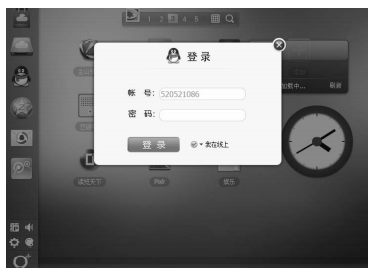

# 单例模式

单例模式的定义是：保证一个类仅有一个实例，并提供一个访问它的全局访问点

单例模式是一种常用的模式，有一些对象我们往往只需要一个，比如线程池、全局缓存、浏览器中的 window 对象等。在 JavaScript 开发中，单例模式的用途同样非常广泛。试想一下，当我们单击登录按钮的时候，页面中会出现一个登录浮窗，而这个登录浮窗是唯一的，无论单击多少次登录按钮，这个浮窗都只会被创建一次，那么这个登录浮窗就适合用单例模式来创建。

## 4.1 实现单例模式

要实现一个标准的单例模式并不复杂，无非是用一个变量来标志当前是否已经为某个类创建过对象，如果是，则在下一次获取该类的实例时，直接返回之前创建的对象。代码如下：

```js
var Singleton = function(name){
    this.name = name;
    this.instance = null;
};
Singleton.prototype.getName = function(){
    alert (this.name);
};
Singleton.getInstance = function(name){
    if (!this.instance){
    this.instance = new Singleton(name);
    }
    return this.instance;
};
var a = Singleton.getInstance('sven1');
var b = Singleton.getInstance('sven2');
console.log(a.name,b.name);// sven1    sven1
alert (a === b);// true 
```
我们通过 Singleton.getInstance 来获取 Singleton 类的唯一对象，这种方式相对简单，但有一个问题，就是增加了这个类的“不透明性”，Singleton 类的使用者必须知道这是一个单例类，跟以往通过 new XXX 的方式来获取对象不同，这里偏要使用 Singleton.getInstance 来获取对象

## 4.3 用代理实现单例模式

## 4.4 JavaScript 中的单例模式

作为普通的开发者，我们有必要尽量减少全局变量的使用，即使需要，也要把它的污染降到最低。以下几种方式可以相对降低全局变量带来的命名污染。

1. 使用命名空间

适当地使用命名空间，并不会杜绝全局变量，但可以减少全局变量的数量

2. 使用闭包封装私有变量

这种方法把一些变量封装在闭包的内部，只暴露一些接口跟外界通信：

```js
var user = (function(){
    var __name = 'sven',
    __age = 29;
    return {
        getUserInfo: function(){
            return __name + '-' + __age;
        }
    }
})();
```
我们用下划线来约定私有变量__name 和__age，它们被封装在闭包产生的作用域中，外部是访问不到这两个变量的，这就避免了对全局的命令污染。

## 4.5 惰性单例

惰性单例指的是在需要的时候才创建对象实例。惰性单例是单例模式的重点，这种技术在实际开发中非常有用，有用的程度可能超出了我们的想象，实际上在本章开头就使用过这种技术，instance 实例对象总是在我们调用 Singleton.getInstance 的时候才被创建，而不是在页面加载好的时候就创建，代码如下：

```js
Singleton.getInstance = (function(){
    var instance = null;
    return function(name){
        if (!instance){
            instance = new Singleton(name);
        }
        return instance;
    }
})();
```
不过这是基于“类”的单例模式，前面说过，基于“类”的单例模式在 JavaScript 中并不适用，下面我们将以 WebQQ 的登录浮窗为例，介绍与全局变量结合实现惰性的单例

假设我们是 WebQQ 的开发人员（网址是web.qq.com），当点击左边导航里 QQ 头像时，会弹出一个登录浮窗（如图 4-1 所示），很明显这个浮窗在页面里总是唯一的，不可能出现同时存在两个登录窗口的情况。



第一种解决方案是在页面加载完成的时候便创建好这个 div 浮窗，这个浮窗一开始肯定是隐藏状态的，当用户点击登录按钮的时候，它才开始显示

这种方式有一个问题，也许我们进入 WebQQ 只是玩玩游戏或者看看天气，根本不需要进行登录操作，因为登录浮窗总是一开始就被创建好，那么很有可能将白白浪费一些 DOM 节点。

我们可以用一个变量来判断是否已经创建过登录浮窗，这也是本节第一段代码中的做法：
```js
var createLoginLayer = (function(){
    var div;
    return function(){
        if (!div){
            div = document.createElement('div');
            div.innerHTML = '我是登录浮窗';
            div.style.display = 'none';
            document.body.appendChild(div);
        }
        return div;
    }
})();

document.getElementById('loginBtn').onclick = function(){
    var loginLayer = createLoginLayer();
    loginLayer.style.display = 'block';
};
```

## 4.6 通用的惰性单例

上一节我们完成了一个可用的惰性单例，但是我们发现它还有如下一些问题。

- 这段代码仍然是违反单一职责原则的，创建对象和管理单例的逻辑都放在 createLoginLayer对象内部。    
- 如果我们下次需要创建页面中唯一的 iframe，或者 script 标签，用来跨域请求数据，就必须得如法炮制，把 createLoginLayer 函数几乎照抄一遍：   
```js
var createIframe= (function(){
    var iframe;
    return function(){
        if (!iframe){
            iframe= document.createElement('iframe');
            iframe.style.display = 'none';
            document.body.appendChild(iframe);
        }
        return iframe;
    }
})();
```

现在我们就把如何管理单例的逻辑从原来的代码中抽离出来，这些逻辑被封装在 getSingle函数内部，创建对象的方法 fn 被当成参数动态传入 getSingle 函数：
```js
var getSingle = function(fn){
    var result;
    return function(){
        return result || (result = fn .apply(this,arguments));
    }
};
```
接下来将用于创建登录浮窗的方法用参数 fn 的形式传入 getSingle，我们不仅可以传入createLoginLayer，还能传入 createScript、createIframe、createXhr 等。之后再让 getSingle 返回一个新的函数，并且用一个变量 result 来保存 fn 的计算结果。result 变量因为身在闭包中，它永远不会被销毁。在将来的请求中，如果 result 已经被赋值，那么它将返回这个值。代码如下：
```js
var createLoginLayer = function(){
    var div = document.createElement('div');
    div.innerHTML = '我是登录浮窗';
    div.style.display = 'none';
    document.body.appendChild(div);
    return div;
};
var createSingleLoginLayer = getSingle(createLoginLayer);
document.getElementById('loginBtn').onclick = function(){
    var loginLayer = createSingleLoginLayer();
    loginLayer.style.display = 'block';
};
```
下面我们再试试创建唯一的 iframe 用于动态加载第三方页面：

```js
var createSingleIframe = getSingle(function(){
    var iframe = document.createElement ('iframe');
    document.body.appendChild(iframe);
    return iframe;
});
document.getElementById('loginBtn').onclick = function(){
    var loginLayer = createSingleIframe();
    loginLayer.src = 'http://baidu.com';
};
```
在这个例子中，我们把创建实例对象的职责和管理单例的职责分别放置在两个方法里，这两个方法可以独立变化而互不影响，当它们连接在一起的时候，就完成了创建唯一实例对象的功能，看起来是一件挺奇妙的事情。

