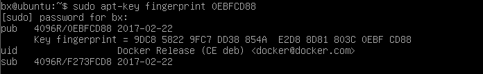
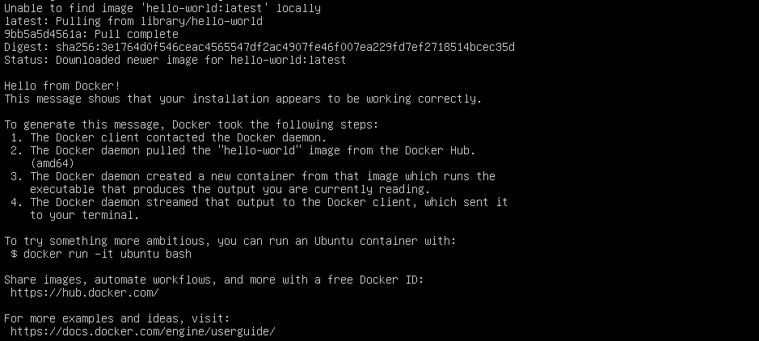

## Docker 学习笔记：Ubuntu16.04 上 Docker 的安装及基本用法

### Docker 安装

- 卸载可能存在旧版本的 docker：

```
sudo apt-get remove docker docker-engine docker-ce docker.io
```

- 更新 apt 包索引：

```
sudo apt-get update
```

为了使 apt 可以通过 https 使用 Repository，先安装以下包：

```
sudo apt-get install -y apt-transport-https ca-certificates curl software-properties-common
```

添加 Docker 官方 GPG 密钥：

```
curl -fsSL https://download.docker.com/linux/ubuntu/gpg | sudo apt-key add -
```

检查 GPG Key 信息是否正确：

```
sudo apt-key fingerprint 0EBFCD88
```

GPG Key 信息如下：


添加源信息：

```
sudo add-apt-repository "deb [arch=amd64] https://download.docker.com/linux/ubuntu $(lsb_release -cs) stable"
```

再更新下 apt 包索引：

```
sudo apt-get update
```

确认 Docker 的源信息是否正确, 新的源是否添加成功：

```
sudo apt-cache madison docker-ce
```


安装最新版本的 Docker CE：

```
sudo apt-get install -y docker-ce
```

如果需要安装某个指定版本的 Docker CE，而不是最新版本，可用下面命令列出可用的版本列表信息：

```
sudo apt-cache madison docker-ce
```


第一列是包名，第二列是版本字符串，第三列是存储库名称，它标识出包来自哪个存储库，以及扩展它的稳定性级别。通一下命令安装指定版本的包：

```
sudo apt-get install docker-ce=[版本字符串]
```

### Docker 安装验证

```
sudo docker -v
```


- 查看 Docker 安装版本详细信息：

```
sudo docker version
```


### 启动 Docker

查看 docker 服务是否启动：

```
sudo systemctl status docker
```

如果 Docker 未启动，则启动 Docker：

```
sudo systemctl start docke
```

运行 Hello World，校验 Docker 是否安装成功：

```
sudo docker run hello-world
```

运行这个命令会下载一个 hello-world 的镜像, 并且运行在一个容器中。该容器运行时会有如下输出， 则表示启动成功：


Docker 安装完成！

## Docker 基本用法（常用命令）

### Docker 镜像常用命令

- 搜索镜像

可以使用 docker search 命令搜索存放在 Docker Hub 中的镜像，例如：

```
sudo docker search java
```

执行该命令后，Docker 就会在 Docker Hub 中搜索含有 java 这个关键词的镜像仓库。执行该命令后可以看到类似于如下的表格：


该表格包含五列，含义如下：

- NAME：镜像仓库名称
- DESCRIPTION：镜像仓库描述
- STARS：镜像收藏数，表示该镜像仓库的受欢迎程度，类似于 GitHub 的 Stars
- OFFICAL：表示是否为官方仓库，该列标记为[OK]的镜像均由个软件的官方项目组创建和维护。由结果可知，java 这个镜像仓库是官方仓库，而其他仓库都不是官方镜像仓库。
- AUTOMATED：表示是否为自动构建镜像仓库。

- 下载镜像
  使用 docker pull 命令即可从 Docker Registry 上下载镜像，例如：

```
sudo docker pull java
```

执行该命令后，Docker 会从 Docker Hub 中的 java 仓库下载最新版本的 java 镜像。若镜像下载缓慢，可配置镜像加速器。

该命令还可指定想要下载的镜像标签以及 Docker Registry 地址，例如：

```
sudo docker pull reg.itmuch.com/java:7
```

这样就可以从指定的 Docker Registry 中下载标签为 7 的 Java 镜像。

- 列出本地镜像

```
docker images
```

使用 docker images 命令即可列出一下载的本地镜像列表。
执行该命令后，将会看到类似于如下表格：

该表格包含了 5 列，含义如下：

- REPOSITORY：镜像所属仓库名称
- TAG：镜像标签。默认是 latest，表示最新。
- IMAGE ID：镜像 ID,表示镜像唯一标标识
- CREATED：镜像创建时间
- SIZE：镜像大小

- 删除本地镜像
  使用 docker rmi 命令即可删除指定镜像

例 1：删除指定名称的镜像

```
sudo docker rmi hello-world
```

表示删除 hello-world 这个镜像

例 2：删除所有镜像

```
$ sudo docker rmi -f $(docker images)
```

-f 参数表示强制删除

### Docker 容器常用命令

1. 新建并启动容器  
   使用 docker run 命令即可新建并启动一个容器。

该命令是最常用命令，它有很多选项，下面将列举一些常用选项。
-d 选项：表示后台运行  
-P 选项：随机端口映射  
-p 选项：指定端口映射，有一下四种格式

2. 列出本地容器  
   使用 docker ps 命令即可列出运行中的本地容器，执行该命令后，可以看到类似与如下的表格：


