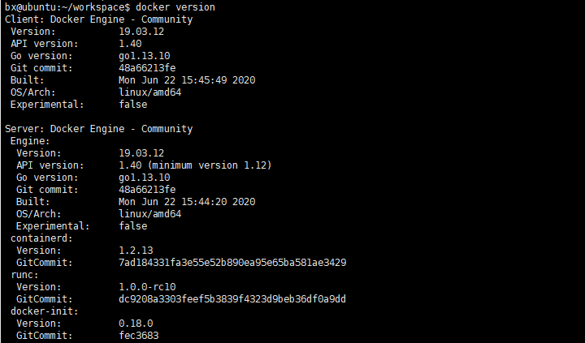
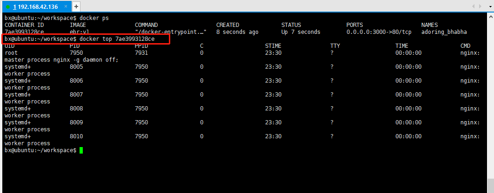

### 查看docker版本：
```
docker version
```


### 显示 Docker 系统信息，包括镜像和容器数
```
docker info
```


### Docker的帮助命令
```
docker help
```

### 重启nginx命令：
```
service nginx restart
```


### 列出本地主机上的镜像
```
docker images
```
**参数说明** _例：docker images -a_
* -a：列出本地所有的镜像（含中间镜像层）

* -q：只显示镜像ID

* --digests：显示镜像的摘要信息

* --no-trunc：显示完整的镜像信息


各个选项说明：
- REPOSITORY：表示镜像的仓库源
- TAG：镜像的标签
- IMAGE ID：镜像ID
- CREATED：镜像创建时间
- SIZE：镜像大小

> 同一仓库源可以有多个 TAG，代表这个仓库源的不同个版本，我们使用 REPOSITORY:TAG 来定义不同的镜像。 如果你不指定一个镜像的版本标签，例如你只使用 ubuntu，docker 将默认使用 ubuntu:latest 镜像

### 删除镜像
```
docker rmi -f
```

* _docker rmi -f 镜像ID_ 删除单个镜像
* _docker rmi -f 镜像名1:TAG 镜像名2:TAG_ 删除多个
* _docker rmi -f $(docker images -qa)_ 删除全部


### 从仓库中搜索指定的镜像
```
docker search 
```
**参数说明**_例：docker search -s 10 tomcat_

* --no-trunc：显示完整的镜像描述
* -s：列出收藏数不小于指定值的镜像
* --automated：只列出 automated build类型的镜像


### 下载镜像
```
docker pull
```
**参数说明：**_例：docker pull tomcat_


## 容器命令

### 列出当前所有正在运行的容器
```
docker ps
```
**参数说明：** _例：docker ps_

* -a：列出当前所有正在运行的容器+历史上运行过的

* -l：显示最近创建的容器

* -n：显示最近n个创建的容器

* -q：静默模式，只显示容器编号

* --no-trunc：不截断输出

### 退出容器，两种退出方式

exit 容器停止退出

ctrl + p + q 容器不停止退出


### 容器启停命令

* 启动容器：_docker start_ 容器ID或者容器名
* 重启容器：_docker restart_ 容器ID或者容器名
* 停止容器：_docker stop_ 容器ID或者容器名
* 强制停止容器：_docker kill_ 容器ID或者容器名

### 删除已停止的容器

* 删除单个容器：_docker rm 容器ID_
* 删除多个容器：_docker rm -f $(docker ps -a -q)_


### 容器构建
```
docker build -t dockerName:version
```


### 新建并启动容器
```
docker run [option] image [command]
```
**参数说明：**_例：docker run -it centos /bin/bash_

使用镜像 centos:latest以交互模式启动一个容器，在容器内执行/bin/bash命令。

* --name="容器新名字": 为容器指定一个名称；
* -d: 后台运行容器，并返回容器ID，也即启动守护式容器；
* -i：以交互模式运行容器，通常与 -t 同时使用；
* -t：为容器重新分配一个伪输入终端，通常与 -i 同时使用；
* -P: 随机端口映射；
* -p: 指定端口映射；


### 启动守护式容器

```
docker run -d 容器名
```
> 说明： Docker容器后台运行就必须有一个前台进程，容器运行的命令如果不是那些一直挂起的命令（比如运行top，tail），就是会自动退出的。

### 查看容器内运行的进程

```
docker top 容器ID
```



### 查看容器内部细节
```
docker inspect 容器ID
```

### 在容器中打开新的终端，并且可以启动新的进程
```
docker exec -it 容器ID bashShell
```

### 容器ID 直接进入容器终端的命令，不会启动新的进程
```
docker attach
```


### 从容器内拷贝文件到主机上
```
docker cp 容器ID:容器内路径 目标主机路径
```


### Docker命令一览

