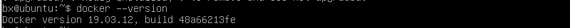
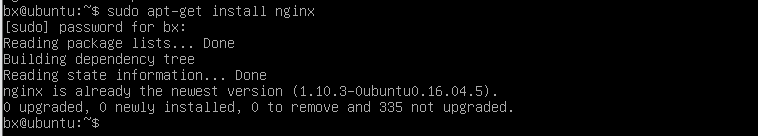
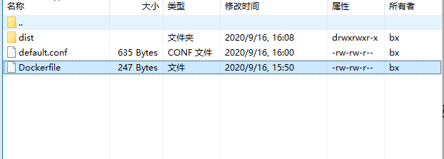

## vue 项目部署到 docker

> 本文讲述的是本地打包后的 dist 目录部署到 docker 上

### docker 安装

部署之前请确保 Linux 服务器上已安装好 Docker 和 Nginx，如果 docker 未安装请查看[docker 安装](./docker安装.md)

Docker 版本检查

```
docker --version
```



### nginx 安装：

1、执行以下命令

```
sudo apt-get install nginx
```

2、安装完成，查看版本来检测是否安装成功。

```
sudo apt-get install nginx
```



3、重启 nginx 服务器

```
service nginx restart
```

复制代码构建 vue 项目  
首先，选择一个创建好的 Vue 项目（本案例是采用一个前后端分离的单页 Vue 项目）  
接下来，运行 npm run build 命令，生成一个打包的 dist 文件（ps：具体打包命名根据项目配置而定。）你会发现，项目中多了一个 dist 文件夹

获取 Nginx 镜像  
本案例的 Vue 项目是一个前后端分离项目，前端界面在服务器上只需要能被外部访问到即可，所以直接使用 Nginx 的 Docker 来部署就行

```
docker pull nginx:alpine
```

推荐使用 alpine 版本，因为这个体积小，只需要 19.7MB，而 latest 版本需要 127MB

在项目根目录中新建一个文件，命名为 Dockerfile

```
# 选择更小体积的基础nginx镜像
FROM nginx:alpine #定制的镜像都是基于 FROM 的镜像，这里的 nginx 就是定制需要的基础镜像。后续的操作都是基于nginx
COPY ./dist /usr/share/nginx/html/
COPY ./default.conf /etc/nginx/conf.d/default.conf
```

default.conf 配置文件

```
server {
    listen       80;
    server_name   localhost;
    # server_name   49.235.160.132; # 修改为docker服务宿主机的ip

    location / {
        root   /usr/share/nginx/html;
        index  index.html index.htm;
        try_files $uri $uri/ /index.html =404;
    }

    error_page   500 502 503 504  /50x.html;
    location = /50x.html {
        root   /usr/share/nginx/html;
    }
}
```

打包镜像

```
docker build -t vuetest:v1 .
```

复制代码  
意思是当前目录的 Dockerfile 创建了一个镜像，创建镜像的仓库是 vuetest, 标签是 v1。

查看镜像

```
docker images
```

复制代码命令执行后，可以查看镜像信息。

运行容器

```
docker run -P -d vuetest:v1
```

复制代码查看端口信息

```
docker ps
```

复制代码

访问 localhost:32770

部署目录结构如下：



## 说明：

### 本地安装 Xshell/Xftp 用于将本地文件上传到虚拟机上

1、LINUX 查看 IP 地址命令：ifconfig  
2、ping xxx.xxx.xxx.xxx  
3、关闭防火墙

> 当我们在 VMWare 上安装好 Ubuntu 虚拟机后，有时候会需要使用多个 terminal 窗口，但是在虚拟机中多个窗口互相切换查看不方便，这时候用物理机的 xshell 工具连接到虚拟机中去就显得很方便。直接连一般都会失败，原因是：未开 22 端口

所以在连接之前需要安装 OpenSSH，命令如下：

sudo apt-get install openssh-server openssh-client

安装完成之后，执行 netstat -tnl 命令，查看 22 端口是否开通
