## vue 项目部署到 docker

> 本文讲述的是本地打包后的 dist 目录部署到 docker 上

本案例的 Vue 项目是一个前后端分离项目，前端界面在服务器上只需要能被外部访问到即可，所以直接使用 Nginx 的 Docker 来部署就行

### 1. 将 Vue 项目打包成静态文件

首先，选择一个创建好的 Vue 项目（本案例是采用一个前后端分离的单页 Vue 项目）  
接下来，运行 npm run build 命令，生成一个打包的 dist 文件（ps：具体打包命名根据项目配置而定。）你会发现，项目中多了一个 dist 文件夹

### 2. docker 安装

部署之前请确保 Linux 服务器上已安装好 Docker 和 Nginx，

如果 docker 未安装请查看[docker 安装](./docker安装.md)

Docker 版本检查

```
docker --version
```


### 3. nginx 安装：

1、执行以下命令

```
sudo apt-get install nginx
```

2、安装完成，查看版本来检测是否安装成功。

```
sudo apt-get install nginx
```


3、重启 nginx 服务器

```
service nginx restart
```

### 4. 获取 Nginx 镜像

使用的是 Nginx 的 Docker 来部署

```
docker pull nginx:alpine
```

推荐使用 alpine 版本，因为这个体积小，只需要 19.7MB，而 latest 版本需要 127MB

### 5. 部署

#### 5.1 先将刚才生成的静态 dist 文件复制到需要部署的 linux 主机上

本地安装 Xshell/Xftp 用于将本地文件上传到虚拟机上

1、LINUX 查看 IP 地址命令：ifconfig  


虚拟机的 ip 地址如图中所示：**192.168.42.136**

2、ping xxx.xxx.xxx.xxx  


3、关闭防火墙

> 当我们在 VMWare 上安装好 Ubuntu 虚拟机后，有时候会需要使用多个 terminal 窗口，但是在虚拟机中多个窗口互相切换查看不方便，这时候用物理机的 xshell 工具连接到虚拟机中去就显得很方便。直接连一般都会失败，原因是：未开 22 端口

所以在连接之前需要安装 OpenSSH，命令如下：

sudo apt-get install openssh-server openssh-client

安装完成之后，执行 netstat -tnl 命令，查看 22 端口是否开通

4、本机 Window 电脑安装 Xftp，安装完后，完成相应的配置


配置完成后连接，即可连接上虚拟机 将本地的 dist 目录传到虚拟机内


#### 5.2 在项目根目录中新建一个文件，命名为 Dockerfile，编辑 Dockerfile

```
# 选择更小体积的基础nginx镜像，定制的镜像都是基于 FROM 的镜像，这里的 nginx 就是定制需要的基础镜像。后续的操作都是基于nginx
FROM nginx:alpine
#复制代码。将dist文件，复制到 /usr/share/nginx/html/中。其中/usr/share/nginx/html/ 是Linux中 Nginx安装 的默认文件路径。
COPY ./dist /usr/share/nginx/html/
#在Nginx 中添加一些配置;将根目录下的default.conf复制到etc/nginx/conf.d/default.conf,用本地的default.conf配置来替换 nginx 镜像里的默认配置
COPY ./default.conf /etc/nginx/conf.d/default.conf
```

#### 5.2 修改 nginx 配置文件

default.conf 配置文件内容如下：

```
server {
    listen       80;
    server_name   localhost;

    # uding gzip
    gzip on;
    gzip_min_length 1k;
    gzip_buffers 16 64k;
    gzip_http_version 1.1;
    gzip_comp_level 9;
    gzip_types text/plain application/x-javascript application/javascript text/css application/xml text/javascript application/x-httpd-php image/jpeg image/gif image/png;
    gzip_vary on;

    location / {
        root   /usr/share/nginx/html;
        index  index.html index.htm;
        try_files $uri $uri/ /index.html =404;
    }

    error_page   500 502 503 504  /50x.html;
    location = /50x.html {
        root   /usr/share/nginx/html;
    }
}
```

> 解决 404 问题主要是 try_files $uri $uri/ /index.html =404;

这段代码的意思是，如果当前访问的地址不存在，就指向 index.html

另外，为了解决资源过大问题，这边采用了 gzip 压缩。减少体积。

#### 跨域

如果你的后端接口是在别的服务器上部署的，这时候我们的 default.conf 就要加一个反向代理，使用下面的 default.conf，然后重新构建 docker 镜像，启动

```
server {
    listen       80;
    server_name   localhost;
    # server_name   49.235.160.132; # 修改为docker服务宿主机的ip

    location / {
        root   /usr/share/nginx/html;
        index  index.html index.htm;
        try_files $uri $uri/ /index.html =404;
    }
    location /api{ # api是vue项目里.env.production里的地址
        proxy_pass 1.1.1.1;  # 这里写的是你后端接口的地址
    }

    error_page   500 502 503 504  /50x.html;
    location = /50x.html {
        root   /usr/share/nginx/html;
    }
}
```

LINUX 中部署目录结构如下：


#### 5.3 打包镜像&运行容器

打包镜像

```
docker build -t app:v1 .
```

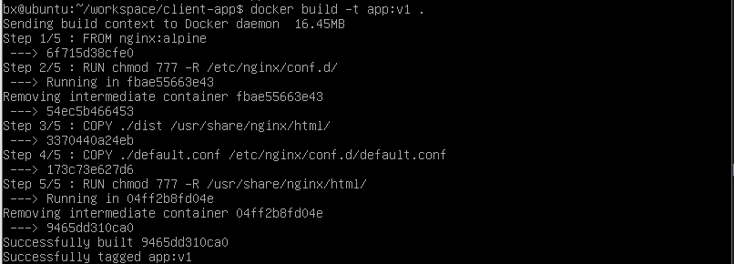

意思是当前目录的 Dockerfile 创建了一个镜像，创建镜像的仓库是 app, 标签是 v1。

查看镜像

```
docker images
```

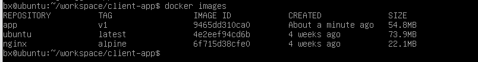

复制代码命令执行后，可以查看镜像信息。

运行容器

```
docker run -P -d app:v1
```

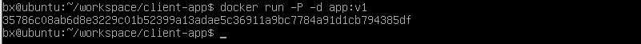

复制代码查看端口信息

```
docker ps
```


访问 localhost:32775，其中 32775 是通过上面查看端口命令中查到的

Linux 本机访问展示效果如下图：  
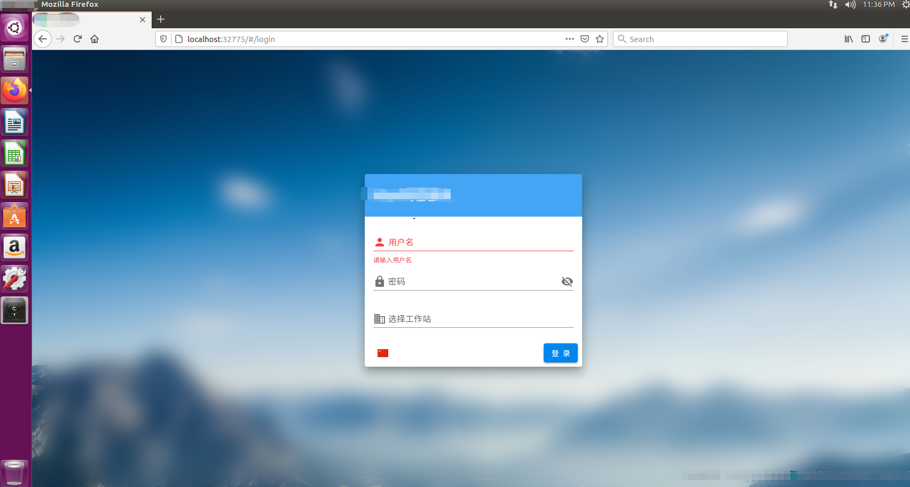

也可通过本地 ip 访问展示效果如下图：


部署完成！

## 同域名下多项目部署

要实现如下效果（其中er-model 和 admin 为 两个vue项目）： 

http://192.168.42.136:3000/er-model/

http://192.168.42.136:3000/admin/
### 问题1：vue（cli3以上）中的二级打包问题，主要修改三个地方，如下三张图：

publish/index.html文件中资源路径：

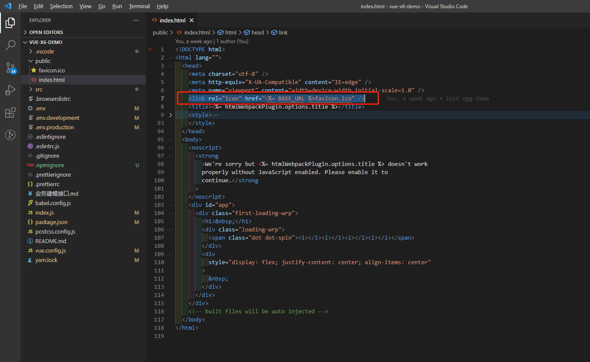

vue.config.js 静态文件路径：

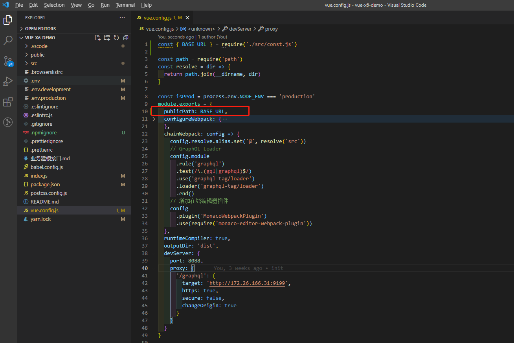

router.js文件
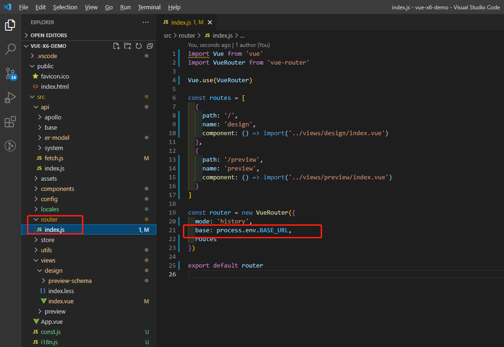

如下，我有2个项目client-admin和er-model，将打包后的dist文件 分别拷贝到Linux服务器上

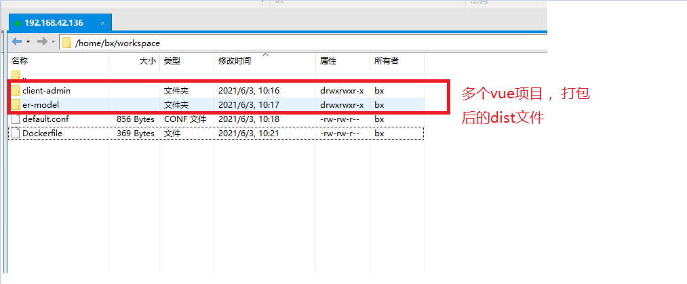

其中基本路径BASE_URL值配置如下：

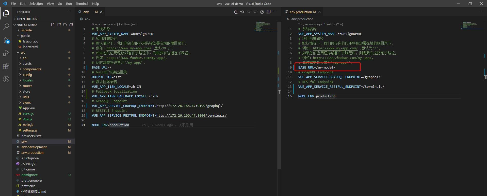

修改完成后打包放在docker挂载的nginx目录下的html下即可访问项目的二级目录的项目了。

### 问题2：404问题

> 图中的参数，如果有多个项目，值需要修改下面的内容即可

```
location /test {
        root   /usr/share/nginx/html; //这个是不动的，因为安装nginx就存在了
        index  index.html;  //访问的是html还是htm
        try_files $uri $uri/ /test/index.html;  //这里就是解决vue打包项目后出现404的原因（/vue项目名称/index.html）
    }  
```


nginx 配置文件内容为：
```
server {
    listen       80;
    server_name   localhost;
    # server_name   172.21.21.27; # 修改为docker服务宿主机的ip

    location / {
        root   /usr/share/nginx/html;
        index  index.html index.htm;
        try_files $uri $uri/ /index.html;
    }

    location /admin {
        root   /usr/share/nginx/html;
        index  index.html;
        try_files $uri $uri/ /admin/index.html;
    }

    location /er-model {
        root   /usr/share/nginx/html;
        index  index.html index.htm;
        try_files $uri $uri/ /er-model/index.html;
    }

    location /api{
    	proxy_pass http://172.26.15.106;
    }

    location /data{
    	proxy_pass http://172.26.15.106;  
    }

    error_page   500 502 503 504  /50x.html;
    location = /50x.html {
        root   /usr/share/nginx/html;
    }
}
```

### docker 配置文件内容：

```
# 选择registry.ebrserver更小体积的基础nginx镜像
FROM nginx:alpine
RUN chmod 777 -R /etc/nginx/conf.d/
RUN chmod 777 -R /usr/share/nginx/html

# nginx 配置文件
COPY ./default.conf /etc/nginx/conf.d/default.conf
# 多个vue项目的dist文件
COPY ./client-admin /usr/share/nginx/html/admin/
COPY ./er-model /usr/share/nginx/html/er-model/
```

指定3000 端口，构建运行：

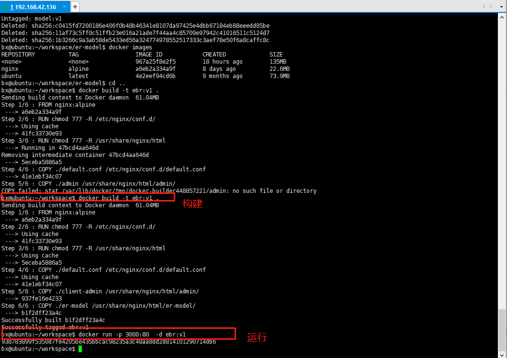

admin项目运行结果：

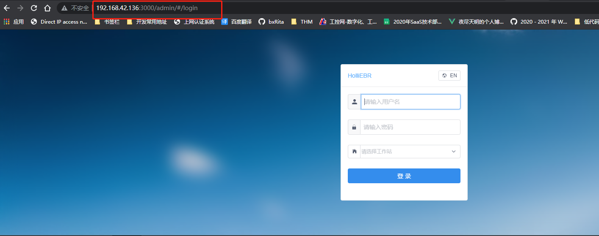

er-model 项目运行效果：

