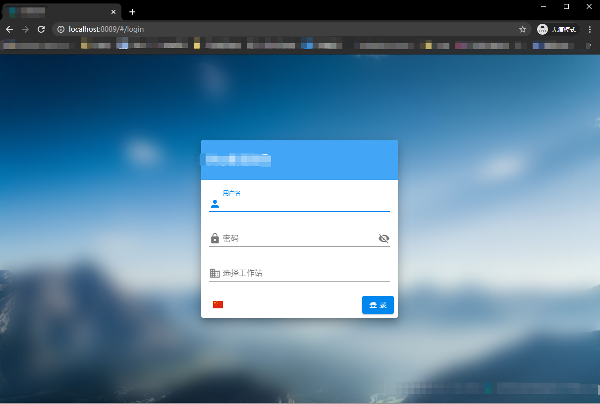

## Vue 项目部署--Nginx 配置

### 1. 打包项目

```
yarn build
```

根目录下会生成 dist 目录

将项目 dist 文件，拷贝到 nginx 目录**D:\nginx-1.16.1\html**中

### 2. nginx 配置

打开 Nginx 的配置文件 D:\nginx-1.16.1\conf\nginx.conf

配置内容如下：

```

#user  nobody;
worker_processes  1;

#error_log  logs/error.log;
#error_log  logs/error.log  notice;
#error_log  logs/error.log  info;

#pid        logs/nginx.pid;


events {
    worker_connections  1024;
}


http {
    include       mime.types;
    default_type  application/octet-stream;

    #log_format  main  '$remote_addr - $remote_user [$time_local] "$request" '
    #                  '$status $body_bytes_sent "$http_referer" '
    #                  '"$http_user_agent" "$http_x_forwarded_for"';

    #access_log  logs/access.log  main;

    sendfile        on;
    #tcp_nopush     on;

    #keepalive_timeout  0;
    keepalive_timeout  65;

    #gzip  on;

    server {
        listen       8089;
        server_name  localhost;

        #charset koi8-r;

        #access_log  logs/host.access.log  main;

        # 根请求会指向的页面
        location / {
        # 此处的 @router 实际上是引用下面的转发，否则在 Vue 路由刷新时可能会抛出 404
        try_files $uri $uri/ @router;
        # 请求指向的首页
        index index.html;
        }

        # 由于路由的资源不一定是真实的路径，无法找到具体文件
        # 所以需要将请求重写到 index.html 中，然后交给真正的 Vue 路由处理请求资源
        location @router {
        rewrite ^.*$ /index.html last;
        }

        #error_page  404              /404.html;

        # redirect server error pages to the static page /50x.html
        #
        error_page   500 502 503 504  /50x.html;
        location = /app/ {
            root   html;
        }

        # proxy the PHP scripts to Apache listening on 127.0.0.1:80
        #

        location  /api {
            proxy_pass   http://xxx.xxx.com; # 接口地址
        }

        location  /data {
            proxy_pass   http://xxx.xxx.com; # 接口地址
        }

        # pass the PHP scripts to FastCGI server listening on 127.0.0.1:9000
        #
        #location ~ \.php$ {
        #    root           html;
        #    fastcgi_pass   127.0.0.1:9000;
        #    fastcgi_index  index.php;
        #    fastcgi_param  SCRIPT_FILENAME  /scripts$fastcgi_script_name;
        #    include        fastcgi_params;
        #}

        # deny access to .htaccess files, if Apache's document root
        # concurs with nginx's one
        #
        #location ~ /\.ht {
        #    deny  all;
        #}
    }


    # another virtual host using mix of IP-, name-, and port-based configuration
    #
    #server {
    #    listen       8000;
    #    listen       somename:8080;
    #    server_name  somename  alias  another.alias;

    #    location / {
    #        root   html;
    #        index  index.html index.htm;
    #    }
    #}


    # HTTPS server
    #
    #server {
    #    listen       443 ssl;
    #    server_name  localhost;

    #    ssl_certificate      cert.pem;
    #    ssl_certificate_key  cert.key;

    #    ssl_session_cache    shared:SSL:1m;
    #    ssl_session_timeout  5m;

    #    ssl_ciphers  HIGH:!aNULL:!MD5;
    #    ssl_prefer_server_ciphers  on;

    #    location / {
    #        root   html;
    #        index  index.html index.htm;
    #    }
    #}

}

```

### 3. 启动运行

nginx 配置端口为**8089**

然后启动 Nginx，访问 http://localhost:8089，项目正常运行起来了。

展示效果如图：

